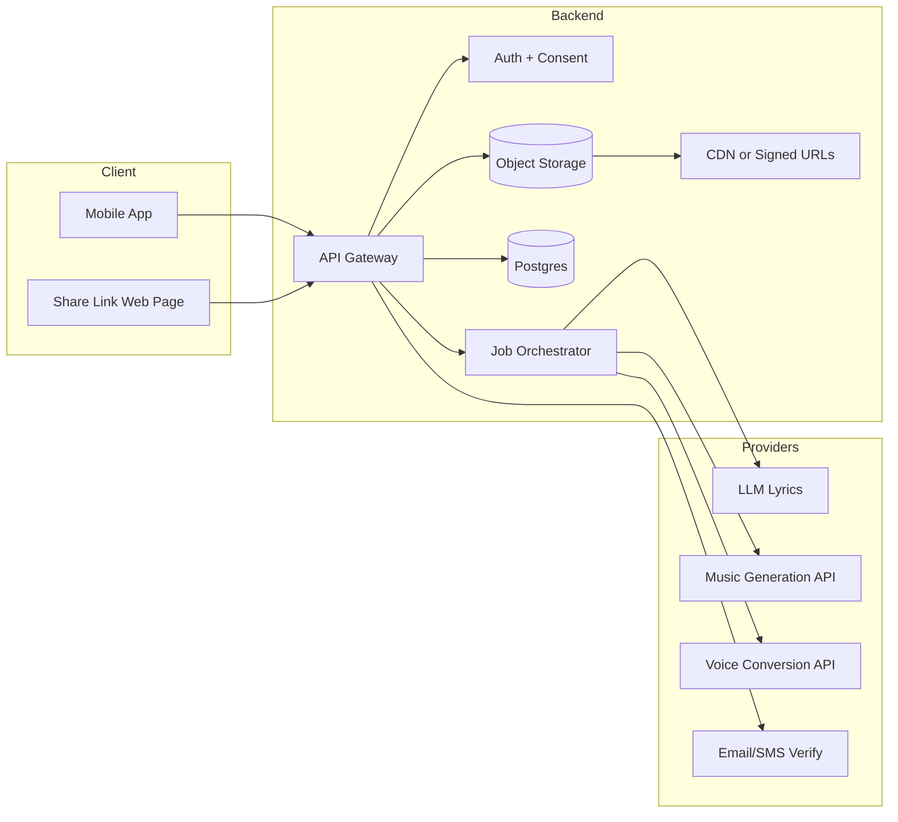
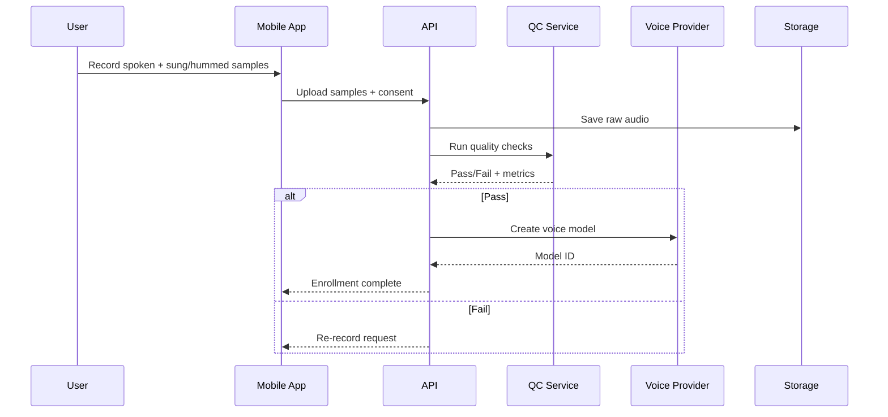
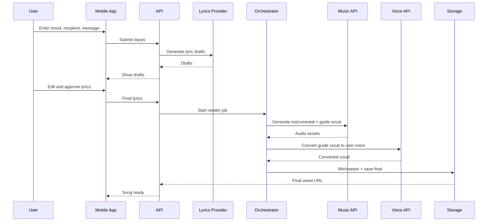
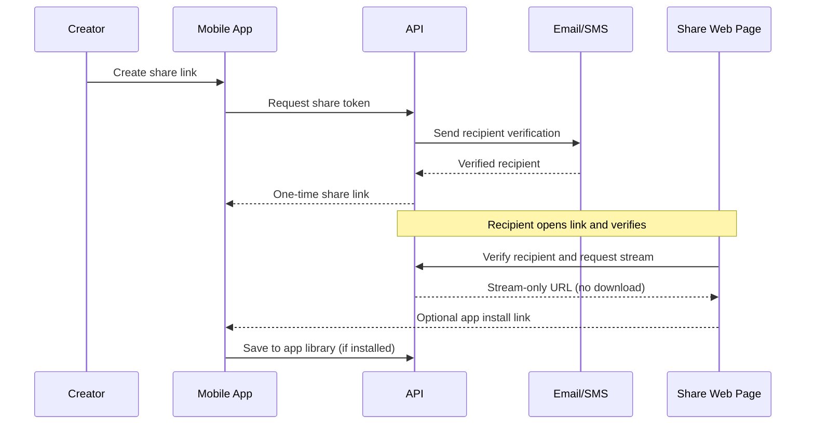

# Architecture and Flows (MVP)

## High-Level Architecture

## Flow 1: Voice Capture and Consent

## Flow 2: Feelings to Song Generation

## Flow 3: Share-Once and Recipient Playback

## Policy Notes (MVP)
- Recipient can stream via the share link but can only save inside the mobile app.
- Share token is one-time and bound to recipient identity; forwarding fails.
- Creator can revoke access; recipient has no share controls.
