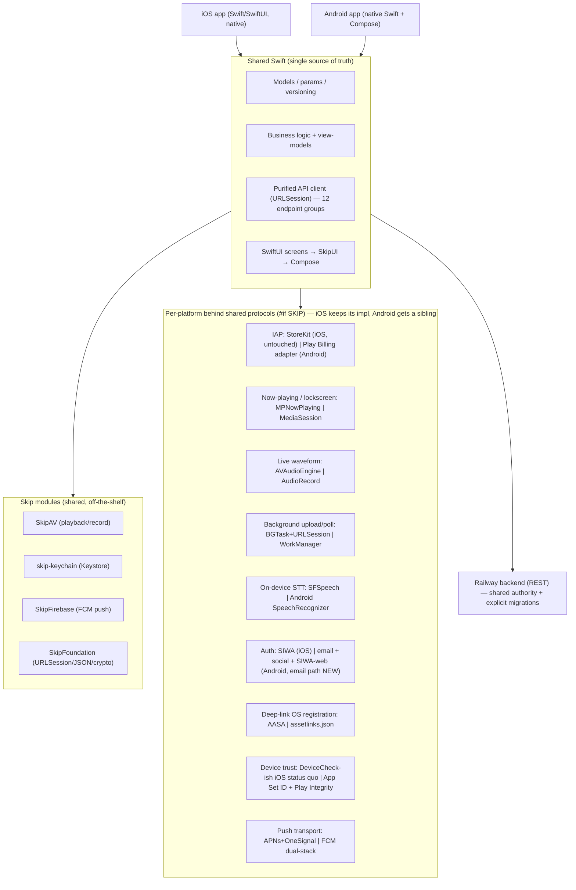

# feat: Bring Porizo to Android via Skip

## Summary

Porizo today is a single native SwiftUI iOS app (258 Swift files, ~70k LOC) talking to a shared Railway backend over a REST API. The goal is genuinely-native iOS **and** Android apps with the _least_ separately-built code. This plan keeps **Skip Fuse** (skip.tools) as the leading bet — Swift compiled natively for Android with SwiftUI rendered as Jetpack Compose — but no longer treats the iOS app or backend as drop-in portable. The backend is reused as the authority, with explicit production migrations for push, Android App Links, passwordless email auth, Android device trust, and Google consumable receipts.

The honest core of this plan: Skip's docs explicitly discourage "migrating an existing Xcode project." The real work is therefore **purifying and modularizing** the existing iOS app into Swift Package modules, then onboarding those modules to Skip one at a time, and writing a _small, enumerable_ set of Porizo's hardest platform features per-platform behind clean bridges. The shared API client is not portable as-is: it currently reaches into UIKit, Keychain, `Bundle.main`, background-task wrappers, and push-token plumbing. That has to be removed before `PorizoAPI` can be called shared code.

This is a Deep, phased plan with **two gates**. Gate A ports real interaction-heavy screens _through SkipUI_ with hard pass/fail thresholds before any Skip-shaped code is committed. Gate B re-checks a recipient vertical slice before the bulk module split. The first shippable Android release is **Recipient MVP**: an Android recipient can receive, claim, bind to the correct device, and play a gift. That milestone depends on a thin API/Core/UI/platform slice plus Android auth/device trust; it is not blocked on migrating existing iOS APNs users to FCM.

---

## Problem Frame

Porizo is iOS-only. Android is a large untapped market and a hard requirement for the viral gifting loop (a gift sent to an Android recipient currently dead-ends). The constraint from the product owner is explicit: **minimize separately-built components** — the less code that exists twice, the better — while keeping both apps _genuinely native_ (no webview/React-Native bridge feel).

Two structural facts make this tractable:

1. **The backend is already the authority, not a no-op dependency.** ~23k LOC across 18 route files (`src/routes/`) — auth, tracks, story/create, rendering jobs, gifts, sharing, billing, enrollment — remains server-authoritative. Android reuses the same contracts, but the plan must add server migrations for Android App Links, typed push tokens, passwordless email, Play consumables, and Android claim/device trust.
2. **The iOS UI is SwiftUI + `@Observable`.** Skip's whole value proposition is SwiftUI → native Compose. The closer the app stays to standard SwiftUI, the more transfers for free.

The risk is equally concrete: Porizo's _differentiated_ features are precisely the ones that drive platform-specific work: device-bound claiming, app-only playback, purchases, bespoke audio now-playing, live waveform, background transfer, push, and auth/deep-link OS policy. Some of that will be built twice no matter what. The plan's job is to make that "twice" set small, explicit, and validated before committing to Skip.

---

## Key Technical Decisions

- KTD1. **Use Skip Fuse, not Skip Lite.** Fuse compiles Swift natively for Android (full Swift language/stdlib/Foundation, thousands of native Swift packages usable) and is the 2026-recommended path for logic-heavy apps. Tradeoffs accepted: larger APKs, slower builds (Swift compiled twice), and no native-Swift breakpoints in Android Studio. Lite's Swift-subset and limited package support would choke on a 70k-LOC app. _(Skip docs: Native vs Transpiled Modes.)_

- KTD2. **Do not migrate the Xcode project in place; restructure into a Skip-style multi-module SwiftPM project.** Run `skip create` to generate a fresh dual-platform SwiftPM workspace, then pull existing code in as modules (UI module → SkipFuseUI, logic module → SkipFuse + SkipModel). This is invasive and front-loaded — it _is_ the project — but the modularization independently improves the iOS app's testability and build times. _(Skip docs explicitly: "we do not recommend trying to migrate an existing Xcode project.")_

- KTD3. **Reuse the backend as the authority; do not call it verbatim.** No second backend. The actual backend work is a set of production migrations around otherwise-shared contracts:
  - **Passwordless email is NOT yet supported server-side.** `src/routes/auth.js` has phone-OTP, password login, and social (`/auth/social`) — but no email magic-link/OTP path (grep confirms). So the Android primary login is **new, security-sensitive server work**, not shared-client work. It is specified as its own unit (U8a) following the existing phone-registration-token pattern (hash-at-rest, single-use, short TTL, enumeration-neutral, rate-limited), delivered over a **verified App Link** (never the `porizo://` custom scheme).
  - **Google Play validators partly exist.** `POST /billing/receipt/google` + `src/services/google-receipt-validator.js` already validate Google subscriptions, and the validator also has one-time product verification/acknowledgement helpers. The genuinely-new server work is the Google **consumable route and ledger flow**: product catalog mapping, replay/cross-account/concurrency protection, transaction identity, wallet credit in one transaction, and acknowledgement/consume semantics.
  - **Push/device registration is a migration, not an additive field.** `/device/register` currently issues anonymous device tokens and conditionally stores an untyped `push_token`. Android FCM needs provider/type/environment, longer token validation, ownership transfer, stale-token cleanup, and APNs+FCM dual-send support.
  - **Android App Links and device trust are new server/domain work.** The server serves Apple AASA today, not `assetlinks.json`; receiver/auth links need HTTPS App Links on every host used. Android claim binding also needs App Set ID + Play Integrity validation to preserve the share-once/app-only contract.

- KTD4. **Push is dual-stack first; iOS APNs migration is not on the recipient critical path.** Android gets FCM support without forcing existing iOS users off APNs. The first backend step is typed push-token storage and provider-aware send (`apns`, `fcm`, environment, platform, last seen, stale cleanup). Existing iOS APNs continues until a separate migration unit proves dual-send metrics, rollback, token re-registration, and OneSignal external-ID/tag reconciliation. This keeps the Android recipient fix from being blocked by a live-user iOS notification migration.

- KTD5. **iOS keeps StoreKit 2; Android purchase implementation is a gated adapter choice.** The current Skip ecosystem now includes marketplace/IAP options, so the old "no Skip module" statement is no longer safe. Gate A must verify current Skip Marketplace/StoreKit/Play Billing viability against Porizo's server-authoritative entitlement model. Regardless of client library, iOS keeps `StoreKitManager.swift` untouched; Android uses the chosen adapter only to obtain Google purchase tokens, then feeds Porizo's server validators and wallet/subscription ledgers. RevenueCat remains optional purchase-broker infrastructure, not an entitlement authority.

- KTD6. **Bridge irreducible platform features with protocols plus native Android implementations.** Skip escape hatches (`#if SKIP`, embedded Compose/Kotlin, or native Android source under `Sources/<Module>/Skip/`) are how now-playing, waveform, background upload, STT, push, device trust, and purchases get Android implementations. The shared protocols (`SecureStore`, `AppMetadataProviding`, `BackgroundExecutionProviding`, `PushTokenProviding`, `AudioPlaying`, `PurchaseProviding`, `DeviceTrustProviding`) are defined before extraction in a thin U3a/U4 slice. iOS keeps existing implementations injected behind those protocols; Android gets native siblings.

- KTD7. **Two gates with thresholds, not subjective checkpoints.** The old Gate A measured useful things but had no pass/fail standard. Corrected gates:
  - **Gate A (U1/U2):** throwaway spike only. It must include recipient claim/play UI, web/app handoff, one dense Warm Canvas creator screen, settings/auth/subscription sheet behavior, and one native escape-hatch feature. Hard thresholds are set before work starts: unsupported SwiftUI construct count, native escape-hatch count, bridge LOC per screen, clean/incremental build time, release APK size, physical-device crash-free run, visual/accessibility parity, toolchain reproducibility, and legal/license approval.
  - **Gate B:** before bulk module moves, implement a reversible recipient vertical slice through Skip on Android: purified API slice, minimal Core protocols, claim/play UI, auth return, device trust stub/real path, and playback shim. If this cannot pass on hardware, switch to the Compose fallback before the codebase is Skip-shaped.
  - If either gate fails, the fallback — **shared backend + separate native Compose UI** — is a co-equal candidate costed on the same axes (see Alternatives), not an undescribed contingency.

- KTD8. **Recipient-first means a scoped Android Recipient MVP, not "U8 depends only on U3."** The product reason is the Android gift dead-end. The first shippable milestone is therefore an Android Recipient MVP: receive link, preserve deferred handoff, authenticate or resume auth, bind to Android device identity, claim idempotently for the same bound device only, stream/play, and log/share analytics. It requires a thin API/Core/UI/platform slice plus passwordless/social auth and device trust. Full creator-side parity comes after.

- KTD9. **Baseline and branch freeze before module work.** This plan is being reviewed on the `refactor` branch after the 2026-06-30 refactor verification/TestFlight work. Before any U3a/U3 module move starts, pick and record the exact baseline commit and target branch (`refactor` vs `main`), freeze other architecture-shaping refactors, and assign a single owner for module boundaries. "iOS as oracle" is only reliable against that frozen baseline.

- KTD10. **Android share/device trust is non-negotiable.** Porizo's core constraints are user-voice output, share-once with device claim, app-only saving, and auditability. Android must implement App Set ID + Play Integrity token generation, server validation, freshness/replay checks, bound stream/key access, wrong-device denial, same-device retry, revoked/expired/already-claimed states, and `share_access_log`/analytics before Recipient MVP is considered shippable.

- KTD11. **Third-party SDKs are a launch ledger, not a footnote.** Firebase, Amplitude, AppsFlyer, Facebook, OneSignal, TikTok, PhoneNumberKit, ATT/AdServices equivalents, and any Skip modules must be classified before Gate A: native Android SDK, Swift bridge, web/server replacement, or deferred. Each entry needs event parity, initialization lifecycle, privacy/data-safety impact, secrets classification, and launch-blocking status.

- KTD12. **Two releases: Recipient MVP and Full Parity.** "Minimize duplicated components" remains the tiebreaker, but it cannot hide launch-critical scope. Recipient MVP has a P0 list around auth, claim/play, device trust, playback, analytics, crash logging, and support. Android Full Parity later adds creator create/render/enrollment, purchases, push polish, settings, and store readiness. U9 verifies the full parity release, not the recipient MVP.

---

## High-Level Technical Design

### Target architecture — one Swift codebase, two native apps



### Coverage matrix — what transfers vs. what is built twice

The plan's value is making the right column small and bounded. Grounded in the actual iOS files.

| iOS feature (file)                                                                                     | Skip coverage                     | Android approach                                                  | Cost     |
| ------------------------------------------------------------------------------------------------------ | --------------------------------- | ----------------------------------------------------------------- | -------- |
| API client (`APIClient+*.swift`, 12 groups)                                                            | ✅ After purification             | Inject Keychain/platform/background/push providers first          | Low–Med  |
| Models / params (`Models/`)                                                                            | ✅ After extraction cleanup        | Keep pure Codable/value types; move stores out                    | Low–Med  |
| Most SwiftUI screens (`Flows/`, `V2Story/`, `Components/`, `Tabs/`)                                    | ✅ SkipUI → Compose               | Shared (within SwiftUI coverage)                                  | Low–Med  |
| Keychain (`Services/Keychain/KeychainHelper.swift`)                                                    | ✅ skip-keychain → Keystore       | Shared                                                            | Low      |
| Audio playback (`AudioPlayerService.swift`, AVPlayer)                                                  | ✅ SkipAV → ExoPlayer/media3      | Shared (playback only)                                            | Low      |
| Audio recording (`AudioRecorder.swift`)                                                                | ✅ SkipAV → MediaRecorder (basic) | Shared (basic capture)                                            | Low–Med  |
| Push (`PushTokenManager.swift`, APNs + OneSignal)                                                      | ⚠️ SkipFirebase helps Android FCM | Dual-stack APNs+FCM first; iOS migration separate                 | **High** |
| **IAP (`StoreKitManager.swift`, StoreKit 2)**                                                          | ⚠️ Current Skip Marketplace must be verified | iOS keeps StoreKit; Android adapter feeds server validators | **High** |
| **Now-playing (`NowPlayingManager.swift`, MPNowPlaying)**                                              | ⚠️ None                           | MediaSession via Compose bridge                                   | **High** |
| **Live waveform (`LiveAudioAnalyzer.swift`)**                                                          | ⚠️ None                           | AudioRecord/Visualizer bridge                                     | **High** |
| **Background upload/poll (`BackgroundURLSessionManager.swift`, `RenderPollingService.swift`, BGTask)** | ⚠️ Weak                           | WorkManager/foreground service bridge                             | **High** |
| **On-device STT (`AppleSpeechProvider.swift`, `WhisperKitProvider.swift`)**                            | ⚠️ None                           | Android SpeechRecognizer / per-platform Whisper                   | **High** |
| Deep/universal links (`ReceiverDeepLinkService.swift`; `porizo://`, `applinks:*.porizo.co`, OneLink)   | ⚠️ Config only                    | App Links + AppsFlyer Android SDK + intent filters                | Med      |
| Device-bound claim / app-only saving (`ReceiverClaimView`, share stream/key contracts)                 | ❌ Platform trust                 | App Set ID + Play Integrity + server validation                   | **High** |
| Sign in with Apple (`AuthManager.swift`, `/auth/social`)                                               | ✅ Backend verifies id_token      | iOS native SIWA; Android web-credential → existing `/auth/social` | Low–Med  |
| Passwordless email login                                                                               | ❌ Not built server-side          | New email-auth path (U8a) + Android UI (new server + client)      | **High** |
| Analytics / attribution / social SDKs (`AnalyticsService.swift`, AppsFlyer/Facebook/TikTok/etc.)       | ⚠️ Per-SDK                        | Third-party parity ledger before Gate A                           | Med      |

The "High" rows are the bounded duplication/migration budget: Android device trust/share enforcement, Android-only platform work (now-playing, live waveform, on-device STT, Play-Billing adapter), push dual-stack and later iOS migration, background work, and the new email-auth path. iOS-side IAP stays on StoreKit and is _not_ rewritten (see KTD5). Deep-link is a Med bridge only if assetlinks and AppsFlyer ownership are resolved early. Everything else transfers only after the API/model purification work.

---

## Output Structure

The Skip multi-module workspace (greenfield SwiftPM project that the existing code is pulled into):

```text
PorizoSkip/                       # new SwiftPM workspace from `skip create`
├── Package.swift                 # module graph (UI → logic → model)
├── Sources/
│   ├── PorizoModel/              # KTD2 logic module: models, params, versioning
│   ├── PorizoAPI/                # shared URLSession API client (12 groups)
│   ├── PorizoCore/              # view-models, business logic, stores
│   ├── PorizoUI/                 # SwiftUI screens → SkipUI
│   │   └── Skip/                 # embedded .kt for Compose-bridged views
│   └── PorizoPlatform/           # #if SKIP bridge protocols + impls
│       ├── IAP/                  # StoreKit wrapper | Play Billing/marketplace adapter
│       ├── NowPlaying/           # MPNowPlaying | MediaSession
│       ├── Waveform/             # AVAudioEngine | AudioRecord
│       ├── Background/           # BGTask+URLSession | WorkManager
│       ├── STT/                  # SFSpeech | SpeechRecognizer
│       ├── DeviceTrust/          # iOS status quo | App Set ID + Play Integrity
│       ├── Push/                 # APNs/OneSignal | FCM
│       └── Auth/                 # SIWA (iOS) | passwordless/social adapter (U8)
├── Android/                      # generated Gradle project + assetlinks.json
└── Darwin/                       # generated Xcode project (iOS)
```

This is a scope declaration, not a constraint — the implementer adjusts boundaries as modularization reveals better seams. Per-unit `Files` lists remain authoritative.

---

## Implementation Units

Six phases. Phase 1 is **Gate A** (prove or reject Skip before committing generated/Skip-shaped code). Phase 2 creates a reversible shared-client foundation. Phase 3 ships the **Android Recipient MVP**. Phase 4 moves into full parity. U-IDs remain stable where possible, but the review added U0/U3a/U8b/U8c/U8d because the original U8 was doing too much too early.

### Phase 0 — Review hardening and baseline freeze

### U0. Lock baseline, launch ledger, and release scope

- Goal: Convert this strategy into an execution-ready baseline before any code moves.
- Requirements: KTD9, KTD11, KTD12
- Dependencies: none
- Files: update this plan; create `docs/plans/android-skip-gate-a-findings.md` and `docs/plans/android-third-party-ledger.md` during execution.
- Approach:
  - Record exact branch/commit for Android work and freeze concurrent architecture refactors.
  - Define two release targets:
    - **Android Recipient MVP P0:** App Link/deferred handoff, auth/session, Android device trust, claim/play, bound stream/key access, playback failure states, analytics/audit/crash logging, support path.
    - **Android Full Parity P0:** creator create/render, voice enrollment, purchases/entitlements, push polish, settings/account, accessibility basics, Play packaging.
    - **P1 / v1.1 candidates:** tablet/foldable layout, Android Auto/Wear OS, non-critical creator polish, optional on-device Whisper if SpeechRecognizer quality is acceptable.
  - Build the third-party SDK ledger: Firebase, Amplitude, AppsFlyer, Facebook, OneSignal, TikTok, PhoneNumberKit, ATT/AdServices equivalents, RevenueCat/Skip Marketplace if used.
  - Build the legal/toolchain ledger: Skip CLI, Skip Fuse/skipstone, Skip libraries, Swift Android SDK, Gradle plugins, Play Billing, optional RevenueCat. Separate MPL/AGPL/commercial obligations by component and define which generated artifacts may enter the repo.
- Verification: Ambrose can point to the exact baseline commit, release scope table, SDK ledger, and legal/toolchain decision before Gate A starts.

### Phase 1 — Gate A: validate Skip with thresholds

### U1. Skip Fuse spike — real interaction slice plus native escape hatches

- Goal: Drive the go/no-go off the actual bet: can SkipUI/Skip Fuse handle Porizo's real interaction-heavy UI and native bridge requirements at an acceptable cost?
- Requirements: KTD1, KTD5, KTD7, KTD10
- Dependencies: U0
- Files: new throwaway `spikes/skip-fuse-spike/` workspace (not merged into the app)
- Approach: `skip create` a fresh dual-platform project. Build a throwaway slice containing:
  - Recipient claim/play UI, including expired/already-claimed/wrong-device-looking states.
  - Web/app handoff surface for deferred install and App Link return.
  - One dense Warm Canvas creator screen with tokens/fonts.
  - Settings → auth/subscription sheet behavior.
  - One native escape-hatch feature: now-playing lockscreen or recording/STT shell.
  - One Android purchase token proof using the currently available Skip Marketplace/Play Billing/RevenueCat/direct Play path, whichever U2 chooses for the spike.
- Pass/fail thresholds set before implementation:
  - unsupported SwiftUI constructs: <= 2 blocking constructs per screen, each with a documented fix;
  - native escape hatches: <= 1 unplanned native bridge per screen;
  - bridge LOC: <= 150 LOC per screen average outside planned platform features;
  - build: clean Android debug build <= 10 minutes on the local machine, incremental UI edit <= 90 seconds, release APK/AAB successfully produced;
  - size: APK/AAB size projection acceptable for Play pre-launch and install conversion, with actual number recorded;
  - runtime: 30-minute physical-device run with no crash on the spike flows;
  - parity: fonts/tokens visually acceptable against iOS screenshots, Dynamic Type/accessibility basics not broken;
  - legal/toolchain: no unresolved license or reproducibility blocker.
- Test scenarios:
  - Recipient claim/play spike launches on Android hardware via App Link and shows the right state.
  - Warm Canvas screen renders with acceptable typography and spacing or logs exact remediations.
  - Native bridge proof runs on hardware and survives app background/foreground once.
  - Purchase token proof reaches the server sandbox path or records the exact missing piece.
- Verification: `docs/plans/android-skip-gate-a-findings.md` contains the numbers above and a clear "Skip", "Compose fallback", or "more spike required" recommendation. No Phase 2 work starts without a "Skip" decision.

### U2. Resolve platform research before Gate A verdict

- Goal: Answer the non-code questions that materially change the path.
- Requirements: KTD5, KTD7, KTD11
- Dependencies: U0; concurrent with U1
- Files: append to `docs/plans/android-skip-gate-a-findings.md` and `docs/plans/android-third-party-ledger.md`
- Approach: Confirm against current primary READMEs/docs:
  - SkipAV playback/recording/metering completeness and Android MediaSession fit.
  - SkipFoundation URLSession background support vs. WorkManager necessity.
  - Skip Marketplace/StoreKit/Play Billing viability and limitations.
  - AppsFlyer deferred deep-link ownership on Android and exact OneLink handoff fields.
  - Firebase/OneSignal split: push transport vs. marketing tags/external ID.
  - Whether enrollment quality requires Whisper-grade STT or Android SpeechRecognizer is acceptable for MVP.
- Verification: Each question has a doc link, conclusion, owner, and "blocks Gate A?" flag.

### Phase 2 — Reversible shared-client foundation

### U3a. Purify API/model dependencies before extraction

- Goal: Make the shared API/model layer actually portable before claiming it is shared.
- Requirements: KTD2, KTD3, KTD6
- Dependencies: Gate A "Skip" decision
- Files: `PorizoApp/PorizoApp/APIClient.swift`, `APIClient+*.swift`, selected `Models/*.swift`, new protocol files under the existing iOS target before extraction.
- Approach:
  - Introduce `SecureStore`, `PlatformIdentityStore`, `BackgroundExecutionProviding`, `PushTokenProviding`, `AppMetadataProviding`, `ClientPlatform`, and token-redaction helpers.
  - Remove UIKit/Keychain/`Bundle.main`/push/background direct imports from the API slice.
  - Split impure stores out of model files (for example `@Observable` stores in model directories) before moving pure Codable/value types.
  - Expand logging redaction to refresh tokens, APNs/FCM tokens, Google purchase tokens, magic-link tokens, receipts, email, and passwords.
- Test scenarios:
  - Existing iOS auth refresh, proactive refresh, and request retry behavior remain identical.
  - API logs redact every sensitive token class.
  - iOS simulator app builds/runs after protocol injection.
- Verification: `PorizoAPI` candidate files can compile in a temporary SwiftPM target with zero UIKit/PushTokenManager/BackgroundTaskManager imports; iOS `xcodebuild test` passes.

### U3. Extract `PorizoModel` and `PorizoAPI`

- Goal: Carve the purified model + API layer into SwiftPM modules the iOS app still consumes.
- Requirements: KTD2, KTD3, KTD9
- Dependencies: U3a
- Files: new `Sources/PorizoModel/`, `Sources/PorizoAPI/`; move purified files from `PorizoApp/PorizoApp/Models/`, `APIClient*.swift`, `APIClient+*.swift`; update iOS target/package dependencies.
- Approach: Pure refactor with iOS as oracle. Keep the 12-extension API shape; preserve auth retry/redaction behavior; keep platform adapters in the app target until U4.
- Test scenarios:
  - `swift build` and `swift test` for the new modules.
  - iOS simulator build/test green.
  - Create/render/library smoke still works against local or fixture backend.
- Verification: Standalone modules compile; iOS behavior unchanged; rollback is still a file-move revert, not a broad architecture rewrite.

### U4a/U5a. Thin recipient Core/UI/platform slice for Gate B

- Goal: Prove the recipient path through Skip before full `PorizoCore`/`PorizoUI` extraction.
- Requirements: KTD7, KTD8, KTD10
- Dependencies: U3
- Files: minimal `Sources/PorizoCore/` claim/play state; minimal `Sources/PorizoUI/` recipient screens; minimal `Sources/PorizoPlatform/` playback/device trust abstractions.
- Approach: Extract only what the Recipient MVP needs: receiver handoff resolution, auth-return resume state, claim state machine, playback URL/key access, and the smallest set of UI components needed for claim/play/error/support.
- Gate B verification:
  - Android hardware opens a verified App Link into the Skip-rendered claim screen.
  - Login return resumes the pending claim.
  - Same-device retry resumes; wrong-device replay is blocked or stubbed with the real server contract documented.
  - Playback starts on hardware.
  - iOS app still passes build/test.
- Decision: If Gate B fails, stop Skip modularization and switch to shared backend + native Compose UI before bulk U4/U5.

### Phase 3 — Android Recipient MVP

### U8a. Android login — passwordless email + social + SIWA-web

- Goal: Provide Android authentication that can complete a claim and persist across relaunch.
- Requirements: KTD3, KTD8
- Dependencies: U3, U4a/U5a
- Files: new backend email-auth token repository/service/routes in `src/routes/auth.js` or split auth module; Android auth adapter/screens; App Link return handling.
- Approach:
  - Email magic links are new server work. Define token table fields (`token_hash`, `email_normalized`, `user_id` nullable until consume, `purpose`, `expires_at`, `consumed_at`, `created_ip`, `user_agent`), hashing, expiry, consumption, and audit events.
  - Send endpoint returns enumeration-neutral responses and is rate-limited per email + IP.
  - Magic link uses HTTPS verified App Links only; never place auth tokens in `porizo://` or `/download?deep_link=porizo://...`.
  - On consume, reuse `createSessionAndTokens`; do not fork session issuance. Explicitly handle existing email/password accounts, phone-created accounts with verified email contact, relay email, duplicate-account prevention, and account-link confirmation.
  - Social: Google via existing `/auth/social`; SIWA on Android via web credential/id_token into existing `/auth/social`.
- Test scenarios:
  - Email login completes, persists, and resumes pending recipient claim.
  - Token replay, expired token, wrong email/account collision, and rate limit all return safe states.
  - Existing Apple-account user signs into Android via SIWA-web and reaches library/claim.
- Verification: Android-only email user and existing Apple user can both authenticate and resume a pending claim on hardware; backend auth tests and full `npm test` pass.

### U8b. Android App Links, device trust, and share/device contract

- Goal: Preserve Porizo's share-once, app-only, auditable claim model on Android.
- Requirements: KTD10
- Dependencies: U3, U8a
- Files: backend `/.well-known/assetlinks.json` route/static config; Android intent filters; server Play Integrity/App Set ID validation service; share/receiver claim tests; claim/play UI state matrix.
- Approach:
  - Serve `assetlinks.json` from every real host used for receiver/auth links, with debug/internal/release package names and SHA-256 cert fingerprints.
  - Add Android device identity fields and Play Integrity token validation with nonce/freshness/replay checks.
  - Reword and implement claim semantics as: **single-use handoff; consumed claim token may resume only for the same bound device**.
  - Define the `Recipient Android State Matrix`: installed, not installed/deferred link, browser fallback, App Link unverified, auth required, auth cancelled, magic link expired, claim expired, already claimed by same device, already claimed by other device, revoked share, stream/key denied, offline/playback failure, support escalation.
  - Instrument share funnel/audit events: link opened, install/deferred recovered, claim started/succeeded/failed reason, stream started, playback failed, wrong-device denied, support opened.
- Test scenarios:
  - Expired token, replay from wrong device, anonymous `SIGN_IN_REQUIRED`, same-device retry, revoked share, and stream/key denial all hit distinct UI states.
  - Forged/stale Play Integrity token is rejected server-side.
  - `share_access_log`/analytics can prove Android claim/play outcomes.
- Verification: Real iOS sender → Android recipient claim/play succeeds on hardware; wrong-device replay fails; audit/funnel query shows the complete path.

### U8c. Recipient claim/play vertical slice

- Goal: Ship the Android Recipient MVP without waiting for creator-side full parity.
- Requirements: KTD8, KTD10, KTD12
- Dependencies: U8a, U8b, U4a/U5a
- Files: recipient screens, playback shim, support path, minimal analytics/crash reporting, claim/play API usage.
- Approach: Implement only the recipient flow end to end: open gift link, preserve handoff through install/login, claim, bind, play, recover from errors, and show support. Do not include create/render/enrollment unless Gate B proves they are needed for recipient playback.
- Test scenarios:
  - iOS sender creates/sends gift; Android recipient installs if needed, claims, and plays.
  - Relaunch after claim still plays for the same bound device.
  - Wrong-device, expired, revoked, no-network, stream/key failure, and playback error states are visible and logged.
- Verification: Physical Android hardware passes the Recipient Android State Matrix; backend targeted tests + full `npm test`; iOS build/test unchanged.

### U8d. Additive Android FCM and push transport dual-stack

- Goal: Support Android notifications without forcing an iOS APNs migration.
- Requirements: KTD4, KTD11
- Dependencies: U3a; can run after U8c if not needed for Recipient MVP
- Files: device schema/repository/routes; `src/services/push-notification.js` split or provider-aware transport; Android FCM adapter; OneSignal reconciliation notes.
- Approach:
  - Split anonymous device-token issuance from authenticated push-token binding.
  - Add token provider/type/environment/platform, longer FCM token validation, ownership transfer, stale cleanup, and token refresh handling.
  - Add provider-aware send with APNs and FCM. Keep iOS APNs active; run any future iOS FCM migration as a separate cutover with dual-run metrics and rollback.
  - Reconcile OneSignal as marketing/external-ID/tag sync vs. product push transport.
- Test scenarios:
  - Android FCM render-complete notification routes to the finished song.
  - APNs render-complete still works for iOS.
  - Token reassignment to a new user/device does not leak notifications to old owner.
  - Stale/invalid tokens are cleaned safely.
- Verification: FCM test on hardware; APNs regression test; provider-aware backend tests; full `npm test`.

### Phase 4 — Full modularization and build-twice features

### U4. Extract full `PorizoCore`

- Goal: Move stores/controllers/view-models into a platform-agnostic logic module after Gate B passes.
- Requirements: KTD2, KTD6
- Dependencies: Gate B, U8c if Recipient MVP is intentionally shipped first
- Files: `Sources/PorizoCore/`; move from `Controllers/`, `Services/CreateFlowStore.swift`, view-model logic.
- Approach: Expand the thin protocols into full app coverage. Keep platform frameworks out of `PorizoCore`; inject iOS and Android implementations.
- Verification: `PorizoCore` builds with zero platform-framework imports; render polling, create-flow state, claim draft resolution, and token refresh tests pass; iOS app green.

### U5. Onboard full SwiftUI screen layer into `PorizoUI`

- Goal: Bring the full screen layer under Skip so Android renders native Compose where the Skip path remains viable.
- Requirements: KTD1, KTD2
- Dependencies: U4
- Files: `Sources/PorizoUI/` and `Sources/PorizoUI/Skip/`; move from `Flows/`, `V2Story/`, `Components/`, `Tabs/`, `Onboarding/`, `Settings/`, `WarmCanvas/`, design tokens.
- Approach: Onboard in dependency order. For unsupported SwiftUI, adjust to supported SwiftUI or use embedded Composables. Preserve information architecture and Warm Canvas tokens when pixel parity is impossible. Bundle/type-map Fraunces and the chosen SF Pro/Roboto fallback.
- Verification: My Songs, Create, Now Playing, Share, Settings, Voice Enrollment, subscription/paywall, and recipient screens pass visual/interaction parity on Android hardware and iOS simulator.

### U6. Android billing and Play catalog

- Goal: Add Android purchases without touching working iOS StoreKit behavior.
- Requirements: KTD5
- Dependencies: U4
- Files: `Sources/PorizoPlatform/IAP/`; backend Google consumable route; Play catalog migrations/config.
- Approach:
  - Choose client adapter after U1/U2: Skip Marketplace, direct Play Billing, or RevenueCat broker.
  - Verify Play Console product IDs match server mappings. Existing seed data uses bare Google IDs like `plus_monthly`; iOS uses `com.porizo.*`, so add a catalog verification/migration task.
  - Subscriptions use existing Google validation. Consumables use a new route modeled on Apple consumables but Google-specific: validate product against `gift_bundles`, reject forged/replayed/wrong-account/concurrent duplicate, define transaction identity (purchase token hash and/or Google order ID), credit wallet transactionally, then acknowledge/consume.
- Test scenarios:
  - Sandbox subscription grants correct tier.
  - Gift bundle funds correct wallet balance exactly once.
  - Forged token, reused token, wrong product, cross-account reuse, concurrent double-submit, rollback, and already-consumed purchases are rejected or reconciled safely.
  - iOS billing tests still pass.
- Verification: Android purchases reflect server entitlements; full backend billing tests + `npm test`; iOS StoreKit unchanged.

### U7. Native Android bridges — playback, now-playing, waveform, background, STT

- Goal: Implement Android platform features behind U4 protocols.
- Requirements: full feature parity
- Dependencies: U4, U5
- Files: `Sources/PorizoPlatform/NowPlaying/`, `Waveform/`, `Background/`, `STT/`, `Playback/`.
- Approach:
  - Playback/now-playing: ExoPlayer/Media3, `MediaSessionService`, notification channels, audio focus/noisy-route handling, seek/play/pause, artwork.
  - Waveform/recording: `AudioRecord`, WAV parity with iOS export, silence/no-input state.
  - Background: WorkManager plus foreground service type/notification for upload where needed; account for Doze/app standby.
  - STT: Android SpeechRecognizer availability, permission denied/permanent denied, no-match/no-network. Defer on-device Whisper unless U2 proves it is required.
  - API/device matrix: test across current supported Android API levels and at least one physical low/mid device.
- Verification: Each bridge works on physical Android hardware with permission/failure states; iOS unchanged.

### Phase 5 — Android Full Parity and Play readiness

### U9. Packaging, parity QA, and Play submission

- Goal: A submittable Android full-parity build, verified against iOS.
- Requirements: KTD12
- Dependencies: U5, U6, U7, U8c, U8d
- Files: `Android/` Gradle config, signing, Play Console metadata, Data Safety form, release docs.
- Approach: Configure release signing, Play Data Safety, Play Billing products, crash/analytics, and pre-launch report handling. Run a full parity QA matrix across every iOS flow. Client SDK keys are public config; Play service-account JSON and signing keys remain server/CI-only.
- Test scenarios:
  - Every P0 iOS flow has a passing Android counterpart.
  - Cross-device gift loop passes again on hardware.
  - A real end-to-end song generation completes on Android hardware.
  - Play pre-launch report has no blockers; no server secret is embedded.
- Verification: Internal-testing build installs; Recipient MVP and full create/render flows pass; parity matrix green.

---

## Scope Boundaries

In scope: native Android app via Skip Fuse **only if Gate A/B pass**; Android Recipient MVP before creator-side parity; backend kept as the shared authority with explicit migrations for typed push tokens, Android App Links, passwordless email auth, Android device trust, and Google consumable receipts; iOS app purification/modularization as a necessary shared-code step. iOS-side StoreKit stays untouched. Existing iOS APNs product push stays active until a separate, measured migration proves FCM is better.

**Goal tiebreaker:** the two halves of the stated goal — "minimize separately-built components" and "full feature parity" — can conflict. When they do, **minimize-duplication wins only outside P0 scope**. Recipient MVP P0 cannot drop auth/session, share/device trust, app-only playback, auditability, analytics/crash logging, support, or basic accessibility. Full parity remains the later launch target for creator-side Android.

### Specialist Review Findings Applied

- Android/Skip feasibility: U8 was not independent of U4/U5; the plan now uses a thin recipient Core/UI/platform slice and Gate B before bulk modularization.
- Backend/security: FCM is not additive with the current single `push_token`; the plan now requires typed token storage, dual APNs/FCM send, Android App Links, Play Integrity/App Set ID, and stronger Google consumable replay/consume semantics.
- Product/scope/design: recipient-first now means a concrete Recipient MVP with a state matrix, analytics/audit proof, and share/device invariant coverage, not just "a song opens."
- Adversarial review: API sharing is no longer described as verbatim; U3a purifies UIKit/Keychain/background/push dependencies first. Licensing/toolchain and third-party SDKs are Gate A inputs, not late risks.

### Deferred to Follow-Up Work

- On-device Whisper on Android (use `SpeechRecognizer` first; revisit only if enrollment quality requires it — gated by U2 findings).
- Creator-side polish features outside the Full Parity P0 table may slip to v1.1 if Gate A/B reveal the duplication budget is larger than estimated.
- Tablet/foldable-optimized layouts (ship phone parity first).
- Wear OS / Android Auto now-playing surfaces.
- Removing OneSignal entirely (if FCM subsumes it) — reconciled in U8d, full removal is follow-up cleanup.

### Outside this product's identity

- A second/Android-specific backend — explicitly rejected; the shared backend is the whole point.
- A non-native cross-platform rewrite (Flutter/React Native) — rejected; fails the "genuinely native" requirement.
- A from-scratch native Kotlin Android app duplicating all UI — rejected; fails "minimal separate components."

---

## Alternatives Considered

The Skip bet is load-bearing, so the two real alternatives are costed on the same axes rather than dismissed. The hard platform work is mostly constant across both credible paths — device trust, auth/deep links, purchases, push, playback, background, recording/STT — so the variable is how much "easy" code Skip saves versus the toolchain tax it adds.

- **Skip Fuse (leading bet, not adopted until Gate A/B).** Shares purified API/model/core code and most SwiftUI screens as one Swift codebase if the gates pass. Cost: young toolchain, Fuse double-compile build tax, limited Android-side Swift debugging, legal/toolchain review by component, and Swift+Kotlin literacy for escape hatches. Wins only if shared-code savings exceed that standing tax. Adopt only on Gate A and Gate B "go."
- **Shared backend + separate native Compose UI (co-equal fallback, not a contingency).** Rewrite the easy code (API client + models + glue) in Kotlin; build the Android UI natively in Compose. Sidesteps the entire Skip bet: no toolchain risk, no SwiftUI-coverage gap, no double-compile, mature Android tooling — and shares the same backend Skip would. Cost: the easy-code duplication Skip avoids (a bounded, well-understood rewrite). If Gate A or B fails, this is the path — and if Gate A shows the Skip tax is high relative to the easy-code delta, it may be the better path even on a marginal "go." The U1 verdict chooses between _these two costed paths_, not "Skip vs. an undescribed fallback."
- **Flutter / React Native — rejected.** Fails the "genuinely native" requirement (own rendering engine / JS bridge), and would still build the six hard features per-platform.
- **From-scratch native Kotlin app — rejected.** Maximal duplication; fails "minimize separately-built components."

---

## Risk Analysis & Mitigation

- Risk: **The spike validates pretty rendering but not product-critical interaction.** Mitigation: Gate A includes recipient claim/play, web/app handoff, settings/auth/subscription behavior, and a native escape hatch with thresholds.
- Risk: **Irreversible modularization happens before Skip proves itself.** Mitigation: Gate B uses a reversible recipient vertical slice before bulk U4/U5 extraction.
- Risk: **Recipient MVP violates share-once/app-only saving.** Mitigation: U8b makes App Set ID + Play Integrity, bound stream/key access, same-device retry, wrong-device denial, revoked/expired states, and audit logs mandatory.
- Risk: **API/model extraction drags iOS platform dependencies into shared modules.** Mitigation: U3a purifies UIKit/Keychain/`Bundle.main`/background/push dependencies before U3.
- Risk: **Push migration breaks live iOS users.** Mitigation: Android FCM is additive dual-stack first; existing iOS APNs remains active until a separate migration proves dual-run metrics and rollback.
- Risk: **Revenue path creates two entitlement authorities or credits consumables twice.** Mitigation: iOS StoreKit untouched; Android client only obtains Google purchase tokens; server validates product/catalog, rejects replay/cross-account/concurrent duplicates, credits wallet transactionally, and acknowledges/consumes.
- Risk: **Email-auth is a new account-takeover surface.** Mitigation: U8a defines token schema, hashing, expiry, rate limits, audit, existing-account collision handling, verified App Links, and shared session issuance.
- Risk: **Whole-app double-compile build cost.** Mitigation: U1 measures clean/incremental build and release artifact creation; unacceptable projection is a Gate-A no-go.
- Risk: **Skip license/toolchain obligations are misunderstood.** Mitigation: U0/U2 separate Skip CLI/skipstone, Skip libraries, Swift Android SDK, Gradle plugins, Play Billing, and optional RevenueCat before any generated code is committed.
- Risk: **Third-party SDK secrets or privacy obligations are missed.** Mitigation: U0/U9 classify public client config vs. server/CI-only secrets and update Play Data Safety before internal testing.

---

## Dependencies / Prerequisites

- Skip toolchain + Android Studio + Swift Android SDK, pinned in Gate A findings.
- Play Console account + signing keys; Firebase project (FCM); optional RevenueCat account (purchase broker only, not entitlement authority).
- AppsFlyer Android SDK key (OneLink already configured server-side).
- Physical Android device for U1/Gate B/U7/U8/U9 (emulator insufficient for audio/push/background/deep-link confidence).
- Backend migrations: typed push token storage and dual-send, `assetlinks.json`, passwordless email auth, Android device trust, Google consumable route/catalog mapping. Existing `/billing/receipt/google` and `/auth/social` are reused where valid.
- Frozen baseline commit/branch before Phase 2 (KTD9).

---

## Sources & Research

- Skip viability research brief (initial draft + 2026-06-30 review): Skip Fuse vs Lite, module coverage, escape hatches, existing-app migration guidance, current marketplace/IAP status, current license/toolchain status. Load-bearing for KTD1, KTD2, KTD5, KTD6, KTD7 and the coverage matrix.
- Key source docs: skip.dev/docs (modes/status/getting started/porting/platform customization/debugging), skiptools GitHub modules (skip-av, skip-keychain, skip-firebase, skip-foundation, current marketplace/IAP docs), Skip licensing/docs for component-specific legal review.
- Codebase grounding (verified during review): iOS surface (258 Swift files, ~70,296 LOC), `APIClient+*.swift`, UIKit/Keychain/background dependencies in API client, `StoreKitManager.swift`, `AudioPlayerService.swift`, `NowPlayingManager.swift`, `AudioRecorder.swift`, `LiveAudioAnalyzer.swift`, `ReceiverDeepLinkService.swift`, push/APNs/OneSignal paths, and backend auth/billing/sharing/device routes.
- Review provenance: updated after four specialist/adversarial passes on 2026-06-30:
  - Android/Skip feasibility reviewer;
  - backend/security reviewer;
  - product/scope/design reviewer;
  - adversarial "do not proceed as written" reviewer.
  Their findings are applied in KTD3-KTD12 and U0-U9.
