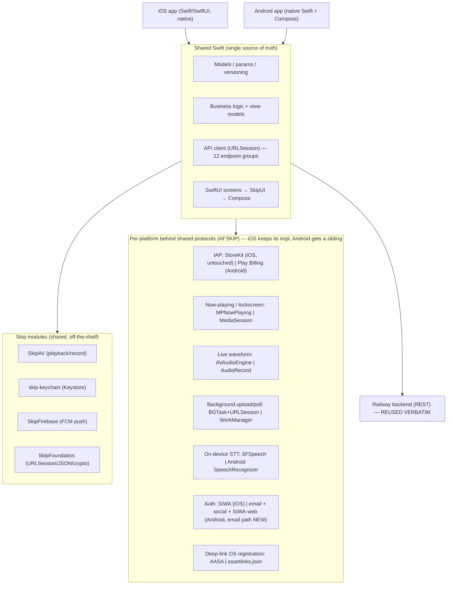

# feat: Bring Porizo to Android via Skip

## Summary

Porizo today is a single native SwiftUI iOS app (258 Swift files, ~70k LOC) talking to a shared Railway backend over a clean REST API. The goal is genuinely-native iOS **and** Android apps with the _least_ separately-built code. This plan adopts **Skip Fuse** (skip.tools) — which compiles Swift natively for Android and renders SwiftUI as real Jetpack Compose — so the iOS Swift codebase becomes the single source of truth for both platforms. The backend is reused verbatim; no second client backend, no rewrite.

The honest core of this plan: Skip's docs explicitly discourage "migrating an existing Xcode project." The real work is therefore **modularizing the existing iOS app into Swift Package modules** (which improves the iOS app regardless), then onboarding those modules to Skip one at a time, and writing a _small, enumerable_ set of Porizo's hardest platform features per-platform behind clean Compose bridges. Those bridge features are known up front: in-app purchases (StoreKit → Play Billing, no Skip module), custom now-playing/lockscreen, live waveform metering, background upload/scheduling, on-device speech-to-text, and deep-link OS registration.

This is a Deep, phased plan with **two gates**. Gate A (~1 week) ports real Warm Canvas screens _through SkipUI_ — driving go/no-go off the SwiftUI→Compose result, the actual bet — plus the hardest bridged features. Gate B re-checks at scale before the irreversible modularization lands. The **recipient (viral-loop) path ships first**, since fixing the dead-ended Android gift is the product reason for the project.

---

## Problem Frame

Porizo is iOS-only. Android is a large untapped market and a hard requirement for the viral gifting loop (a gift sent to an Android recipient currently dead-ends). The constraint from the product owner is explicit: **minimize separately-built components** — the less code that exists twice, the better — while keeping both apps _genuinely native_ (no webview/React-Native bridge feel).

Two structural facts make this tractable:

1. **The backend is already the shared layer.** ~23k LOC across 18 route files (`src/routes/`) — auth, tracks, story/create, rendering jobs, gifts, sharing, billing, enrollment — is server-authoritative. The iOS app is a thin-ish client over a 12-extension API client (`APIClient+*.swift`). Android reuses this 1:1.
2. **The iOS UI is SwiftUI + `@Observable`.** Skip's whole value proposition is SwiftUI → native Compose. The closer the app stays to standard SwiftUI, the more transfers for free.

The risk is equally concrete: Porizo's _differentiated_ features are precisely the ones Skip does **not** abstract (IAP, bespoke audio now-playing, live waveform, background transfer). Those will be built twice no matter what. The plan's job is to make that "twice" set as small and well-bounded as possible, and to prove the bridging cost before committing.

---

## Key Technical Decisions

- KTD1. **Use Skip Fuse, not Skip Lite.** Fuse compiles Swift natively for Android (full Swift language/stdlib/Foundation, thousands of native Swift packages usable) and is the 2026-recommended path for logic-heavy apps. Tradeoffs accepted: larger APKs, slower builds (Swift compiled twice), and no native-Swift breakpoints in Android Studio. Lite's Swift-subset and limited package support would choke on a 70k-LOC app. _(Skip docs: Native vs Transpiled Modes.)_

- KTD2. **Do not migrate the Xcode project in place; restructure into a Skip-style multi-module SwiftPM project.** Run `skip create` to generate a fresh dual-platform SwiftPM workspace, then pull existing code in as modules (UI module → SkipFuseUI, logic module → SkipFuse + SkipModel). This is invasive and front-loaded — it _is_ the project — but the modularization independently improves the iOS app's testability and build times. _(Skip docs explicitly: "we do not recommend trying to migrate an existing Xcode project.")_

- KTD3. **Reuse the backend verbatim; share the API client.** No second backend. Two corrections to the original framing, grounded in the code:
  - **Passwordless email is NOT yet supported server-side.** `src/routes/auth.js` has phone-OTP, password login, and social (`/auth/social`) — but no email magic-link/OTP path (grep confirms). So the Android primary login is **new, security-sensitive server work**, not shared-client work. It is specified as its own unit (U8a) following the existing phone-registration-token pattern (hash-at-rest, single-use, short TTL, enumeration-neutral, rate-limited), delivered over a **verified App Link** (never the `porizo://` custom scheme).
  - **Google Play receipt validation already exists.** `POST /billing/receipt/google` + `src/services/google-receipt-validator.js` (Android Publisher API v3, `requireUserId`, 10/min rate limit, cross-account guard) is live and wired into `billing.js` as `googleValidator`. The genuinely-new server work is only the Google **consumable** (gift-bundle) path — there is no `/billing/receipt/google/consumable` today. Android's net-new backend surface is therefore: the email-auth path (U8a), the Google consumable receipt path (U6), and binding FCM tokens on the existing `/device/register` (U8).

- KTD4. **Standardize push on FCM via SkipFirebase — and treat it as a migration, not an additive change.** One `SkipFirebase` Messaging integration covers both platforms, but the iOS backend send path today is **APNs-only** (`@parse/node-apn`; `devices.push_token` is documented as an APNs device token) and a separate **OneSignal** stack exists on client (`AuthManager`) and server (`src/services/onesignal.js`). Moving iOS to FCM means: (a) the backend send path is rewritten to FCM, (b) existing users' stored APNs tokens are re-registered as FCM tokens (a live-user migration with a cutover plan so in-flight render-complete pushes aren't lost), and (c) OneSignal's role (marketing pushes, tag-sync, external-ID linking) is explicitly reconciled — keep it, or fold it into FCM. This is real work, gated in U8; do not treat KTD4 as "additive." It does, as a side effect, resolve the unconfigured-APNs prod gap (D-A).

- KTD5. **iOS keeps native StoreKit 2; only Android adopts a Play-Billing path — both behind a shared `PurchaseProviding` protocol.** Skip has **no** StoreKit→Play Billing module (skiptools discussion #196). The shared protocol (defined in U4) is the single abstraction; it does **not** require routing iOS through a third party. iOS keeps its working, server-authoritative `StoreKitManager.swift` (StoreKit 2, `Transaction.updates`, C6/C11 dedup) untouched; the Android adapter uses **RevenueCat or Play Billing directly** for the Play purchase, then feeds the existing server validators (`googleValidator`). The existing entitlement model (`plan_products`, `ProductID` enum, atomic `WHERE balance>0`) stays the source of truth. This keeps the working iOS revenue path out of scope entirely — minimizing blast radius and duplication, per the project goal.

- KTD6. **Bridge the irreducible platform features with `#if SKIP` + embedded Compose/Kotlin; the bridge protocols are owned by U4.** Skip's escape hatches (`#if SKIP` Swift blocks that call Kotlin/Compose; raw `.kt` files in `Sources/<Module>/Skip/`) are how now-playing, waveform, background upload, and on-device STT get their Android implementations. The shared protocols (`AudioPlaying`, `PurchaseProviding`, `PushRegistering`) are **defined once in U4** (net-new — they don't exist in the codebase today) and **consumed** by U6 (IAP) and U7 (the native bridges). iOS keeps its existing implementation injected behind each protocol; Android gets a Compose/Kotlin sibling.

- KTD7. **Two gates, not one — and the gate that matters tests SwiftUI→Compose at real-screen scale.** The original single-spike gate measured only _bridged_ features (now-playing + IAP), which by definition bypass SkipUI — so it validated the build-twice cost the plan already concedes, not the actual bet (does SkipUI render Porizo's real Warm Canvas screens). Corrected to two gates:
  - **Gate A (U1, ~1 week):** spike now-playing + one IAP **and** port 3–5 real Warm Canvas screens (a V2Story create step, My Songs, a Settings screen) _through SkipUI to Compose_. Measure the unsupported-construct rate on actual app UI, font/token fidelity, full-clean Fuse build time extrapolated to 70k LOC, and bridging LOC. Go/no-go is driven by the **SwiftUI→Compose result**, since that is what U5 and parity depend on.
  - **Gate B (after a thin U5 slice, before the bulk of U3/U4 lands in the shippable app):** onboard a few more real screens end-to-end on an Android device. Only after Gate B passes is full modularization committed. This prevents the failure mode where U3/U4 sink an irreversible 70k-LOC refactor _before_ SwiftUI→Compose is proven at scale.
  - If either gate fails, the fallback — **shared backend + separate native Compose UI** — is a co-equal candidate costed on the same axes (see Alternatives), not an undescribed contingency.

- KTD8. **Sequence the recipient (viral-loop) path first; it is the product reason for the project.** The stated problem is that gifts to Android recipients dead-end — a defect on the _receive→claim→play_ path (U8), which depends only on U3. That path is therefore the **first shippable Android milestone** (after Gate A), ahead of creator-side surfaces (full create/story flow, waveform, STT). Full parity remains the launch target, but value lands at the recipient path, not at "a song generates end-to-end."

- KTD9. **Reconcile with the in-flight `refactor` branch before modularizing.** A separate architecture-debt refactor is live on the `refactor` branch (deployed to prod + TestFlight 2026-06-30) and is re-carving the same iOS target. Two concurrent invasive module splits will collide and make the "iOS-as-oracle" characterization unreliable. Phase 2 has a hard prerequisite: land/freeze that refactor (or merge it to `main`) and reconcile its module boundaries with U3/U4's **before** extraction begins.

---

## High-Level Technical Design

### Target architecture — one Swift codebase, two native apps



### Coverage matrix — what transfers vs. what is built twice

The plan's value is making the right column small and bounded. Grounded in the actual iOS files.

| iOS feature (file)                                                                                     | Skip coverage                     | Android approach                                                  | Cost     |
| ------------------------------------------------------------------------------------------------------ | --------------------------------- | ----------------------------------------------------------------- | -------- |
| API client (`APIClient+*.swift`, 12 groups)                                                            | ✅ SkipFoundation URLSession      | Shared verbatim                                                   | Low      |
| Models / params (`Models/`)                                                                            | ✅ Native Swift (Fuse)            | Shared verbatim                                                   | Low      |
| Most SwiftUI screens (`Flows/`, `V2Story/`, `Components/`, `Tabs/`)                                    | ✅ SkipUI → Compose               | Shared (within SwiftUI coverage)                                  | Low–Med  |
| Keychain (`Services/Keychain/KeychainHelper.swift`)                                                    | ✅ skip-keychain → Keystore       | Shared                                                            | Low      |
| Audio playback (`AudioPlayerService.swift`, AVPlayer)                                                  | ✅ SkipAV → ExoPlayer/media3      | Shared (playback only)                                            | Low      |
| Audio recording (`AudioRecorder.swift`)                                                                | ✅ SkipAV → MediaRecorder (basic) | Shared (basic capture)                                            | Low–Med  |
| Push (`PushTokenManager.swift`, APNs + OneSignal)                                                      | ✅ SkipFirebase FCM               | iOS migrates APNs→FCM + OneSignal reconcile                       | **High** |
| **IAP (`StoreKitManager.swift`, StoreKit 2)**                                                          | ❌ No module                      | iOS keeps StoreKit; Android Play Billing via protocol             | **High** |
| **Now-playing (`NowPlayingManager.swift`, MPNowPlaying)**                                              | ⚠️ None                           | MediaSession via Compose bridge                                   | **High** |
| **Live waveform (`LiveAudioAnalyzer.swift`)**                                                          | ⚠️ None                           | AudioRecord/Visualizer bridge                                     | **High** |
| **Background upload/poll (`BackgroundURLSessionManager.swift`, `RenderPollingService.swift`, BGTask)** | ⚠️ Weak                           | WorkManager/foreground service bridge                             | **High** |
| **On-device STT (`AppleSpeechProvider.swift`, `WhisperKitProvider.swift`)**                            | ⚠️ None                           | Android SpeechRecognizer / per-platform Whisper                   | **High** |
| Deep/universal links (`ReceiverDeepLinkService.swift`; `porizo://`, `applinks:*.porizo.co`, OneLink)   | ⚠️ Config only                    | App Links + AppsFlyer Android SDK + intent filters                | Med      |
| Sign in with Apple (`AuthManager.swift`, `/auth/social`)                                               | ✅ Backend verifies id_token      | iOS native SIWA; Android web-credential → existing `/auth/social` | Low–Med  |
| Passwordless email login                                                                               | ❌ Not built server-side          | New email-auth path (U8a) + Android UI (new server + client)      | **High** |
| Analytics / AppsFlyer (`AnalyticsService.swift`)                                                       | ⚠️ Per-SDK                        | AppsFlyer + PostHog Android SDKs bridged                          | Med      |

The "High" rows are the bounded duplication/migration budget: Android-only platform work (now-playing, live waveform, on-device STT, Play-Billing adapter), one cross-platform **migration** (push: iOS APNs→FCM + OneSignal reconcile), background work, and the new email-auth path. iOS-side IAP stays on StoreKit and is _not_ rewritten (see KTD5). Deep-link is a Med bridge (OS config + shared claim logic), sitting just below the budget line. Everything else transfers or is config. The plan's job is to keep this column bounded and known up front — which it is.

---

## Output Structure

The Skip multi-module workspace (greenfield SwiftPM project that the existing code is pulled into):

```text
PorizoSkip/                       # new SwiftPM workspace from `skip create`
├── Package.swift                 # module graph (UI → logic → model)
├── Sources/
│   ├── PorizoModel/              # KTD2 logic module: models, params, versioning
│   ├── PorizoAPI/                # shared URLSession API client (12 groups)
│   ├── PorizoCore/              # view-models, business logic, stores
│   ├── PorizoUI/                 # SwiftUI screens → SkipUI
│   │   └── Skip/                 # embedded .kt for Compose-bridged views
│   └── PorizoPlatform/           # #if SKIP bridge protocols + impls
│       ├── IAP/                  # RevenueCat wrapper (both stores)
│       ├── NowPlaying/           # MPNowPlaying | MediaSession
│       ├── Waveform/             # AVAudioEngine | AudioRecord
│       ├── Background/           # BGTask+URLSession | WorkManager
│       ├── STT/                  # SFSpeech | SpeechRecognizer
│       └── Auth/                 # SIWA (iOS) | passwordless/social adapter (U8)
├── Android/                      # generated Gradle project + assetlinks.json
└── Darwin/                       # generated Xcode project (iOS)
```

This is a scope declaration, not a constraint — the implementer adjusts boundaries as modularization reveals better seams. Per-unit `Files` lists remain authoritative.

---

## Implementation Units

Five phases. Phase 1 is **Gate A** (validate the SwiftUI→Compose bet). The recipient/viral-loop path (Phase 2) is the **first shippable Android milestone**. **Gate B** sits inside Phase 3, before the bulk of modularization. U-IDs are stable; phase order reflects value sequencing, not U-ID numbering (U8/U8a precede U4–U7).

### Phase 1 — Gate A: validate SwiftUI→Compose at real-screen scale

### U1. Skip Fuse spike — bridged features AND real screens

- Goal: Drive the go/no-go off the actual bet (does SkipUI render Porizo's real screens), not just bridging cost. Produce a verdict with measured evidence.
- Requirements: KTD7, KTD1, KTD6
- Dependencies: none
- Files: new throwaway `spikes/skip-fuse-spike/` workspace (not merged into the app)
- Approach: `skip create` a fresh dual-platform project, then build TWO things: (a) **3–5 real Warm Canvas screens** ported _through SkipUI to Compose_ — a V2Story create step, My Songs list, a Settings screen — to measure the unsupported-SwiftUI-construct rate and font/token fidelity on actual app UI; (b) the hardest _bridged_ features — now-playing/lockscreen (`NowPlayingManager.swift` reference) via `#if SKIP`/MediaSession, and one Play purchase via the Android billing path. Run on a physical Android device + an iOS device. Record: per-screen unsupported-construct count, Warm Canvas font/token fidelity, **full-clean Fuse build time extrapolated to 70k LOC**, APK size, bridging LOC, and Android-side debugging friction.
- Execution note: Measurement spike — optimize for learning, throw it away. The go/no-go is driven by the **SwiftUI→Compose screen result**, since that is what U5 and parity depend on; bridging cost is secondary (already conceded as build-twice).
- Patterns to follow: `WarmCanvas/`, `DesignTokens.swift`, `MySongsView.swift`, `NowPlayingManager.swift` as iOS references to mirror.
- Test scenarios:
  - Each ported Warm Canvas screen renders on Android with correct fonts (Fraunces + SF Pro fallback decided), colors, and spacing — or the gap is logged with its resolution.
  - Now-playing controls (play/pause/seek) function on the Android lockscreen/notification.
  - A Play sandbox purchase completes and the entitlement reflects server-side via the existing `googleValidator`.
  - Test expectation: spike — formal automated tests deferred; the deliverable is the measured verdict doc.
- Verification: A written go/no-go (`docs/plans/skip-spike-findings.md`) with the screen-rendering numbers front and centre and an explicit recommendation. Phases 2+ proceed only on "go."

### U2. Resolve the pre-commit open questions

- Goal: Verify the research caveats a spike alone won't surface.
- Requirements: KTD5, KTD1
- Dependencies: U1 (concurrent within Phase 1 — feeds the go/no-go verdict)
- Files: append to `docs/plans/skip-spike-findings.md`
- Approach: Confirm against current Skip module READMEs — not search snippets — (a) `SkipAV` recording/metering completeness, (b) `SkipFoundation` URLSession _background_ session support (decides how much of U7 Background is bridged), (c) the third-party-SDK gap: which of the iOS Package.swift deps (AppsFlyer, PostHog/Amplitude, Firebase, OneSignal, TikTok SDK) have Android-Swift equivalents vs. need bridging — this is bridge work the matrix does not yet enumerate. Also: does enrollment quality actually depend on Whisper-grade STT (gates the Android on-device-Whisper deferral)?
- Test scenarios: Test expectation: none — research/verification unit.
- Verification: Each question answered with a doc link and a one-line conclusion, before the Gate A verdict.

### Phase 2 — Recipient (viral-loop) path: the first shippable milestone

This phase delivers the product reason for the project — an Android recipient can receive→claim→play a gift — on the smallest module base, ahead of full modularization. Depends only on U3 (model/API) + the minimal screens it needs.

### U3. Extract the model + API layer into SwiftPM modules

- Goal: Carve `PorizoModel` and `PorizoAPI` out of the Xcode target as clean modules the iOS app still consumes.
- Requirements: KTD2, KTD3, KTD9
- Dependencies: U1 (go verdict); **KTD9 prerequisite — the in-flight `refactor` branch is landed/frozen and its module boundaries reconciled with this extraction before starting.**
- Files: new `Sources/PorizoModel/`, `Sources/PorizoAPI/`; move from `PorizoApp/PorizoApp/Models/`, `APIClient*.swift`, `APIClient+*.swift`; update iOS target to depend on the packages.
- Approach: Pure refactor — no behavior change. API client (Bearer/refresh + 12 extensions) and models move first (most reusable, least platform-coupled). The Android refresh path must inherit the iOS redaction (refresh tokens never logged).
- Execution note: Characterization-first — iOS app is the oracle. Snapshot behavior before, confirm identical after. (Reliable only once KTD9's prerequisite holds.)
- Patterns to follow: the 12-extension split is already module-shaped; preserve it.
- Test scenarios:
  - iOS app builds and launches after extraction (no regressions).
  - API client unit tests (refresh on 401, proactive refresh near expiry, refresh-token redaction in logs) pass unchanged against the moved module.
  - A create→render→library round trip works on simulator post-extraction.
- Verification: iOS app green; modules compile standalone (`swift build`).

### U8. Recipient path — deep-link claim, FCM push, and the screens it needs

- Goal: An Android recipient can receive a gift link, claim, and play — the viral loop, end to end.
- Requirements: KTD4, KTD8, full feature parity (viral loop)
- Dependencies: U3
- Files: `Sources/PorizoCore/` claim + push registration (shared `receiverHandoffId` logic from `ReceiverDeepLinkService.swift`); `Sources/PorizoPlatform/Background/` FCM via SkipFirebase; `Android/` intent filters + `assetlinks.json`; AppsFlyer Android SDK; minimal claim/play/auth screens onboarded via U5's mechanism; backend: bind FCM tokens on `/device/register` (additive).
- Approach:
  - Push: integrate `SkipFirebase` Messaging. **This is a migration, not additive** (KTD4): the iOS send path moves APNs→FCM with a live-user token re-registration + cutover plan, and OneSignal's role is reconciled. FCM token registration MUST require an authenticated user (Bearer) and bind the token to `request.userId`, replacing any prior owner.
  - Deep links: register `porizo://`, `porizo-oauth://`, and verified App Links for `porizo.co`/`*.porizo.co`/OneLink via intent filters + `assetlinks.json`; AppsFlyer Android SDK for the OneLink deferred handoff. The claim token stays server-bound + single-use (existing `sharing.js` `consumedAt` guard).
  - **Recipient first-run states (design):** enumerate all four entry states — (1) app installed → claim screen with token; (2) app not installed → Play Store via deferred deep link, token preserved through install→first-run; (3) App Link unverified / opened in browser → web landing that hands off to the app; (4) token expired / already-claimed → explicit "already claimed / link expired" landing. Specify which surface owns each.
- Execution note: Auth/identity path — bind FCM tokens to the authenticated user; do not weaken token-refresh race protections.
- Test scenarios:
  - Tapping a shared gift link on Android (cold start) routes to the claim screen with the correct `receiverHandoffId`.
  - App-not-installed: token survives Play-Store install → first run → claim.
  - Expired/already-claimed token shows the explicit landing, not a silent drop.
  - A render-complete FCM push arrives on Android and foregrounds the finished song; a render-complete push only routes to devices bound to the track owner.
  - Existing iOS push tests still pass after the FCM migration; in-flight pushes survive the cutover.
- Verification: A real cross-device gift (iOS sender → Android recipient) completes receive→claim→play on physical hardware. **This is the project's headline success criterion.**

### U8a. Android login — passwordless email (new server work) + social + SIWA

- Goal: A cross-platform login for Android, where Sign in with Apple can't be primary.
- Requirements: KTD3, full feature parity (account access)
- Dependencies: U3
- Files: NEW backend email-auth path in `src/routes/auth.js` (+ email-auth-token repository/service); `Sources/PorizoPlatform/Auth/` Android adapter; email-login screens via U5's mechanism.
- Approach:
  - **Email path is net-new server work** (no email magic-link/OTP exists today). Follow the existing phone-registration-token pattern: token hashed at rest, single-use, short TTL, enumeration-neutral send responses, rate-limited (reuse `consumeAuthRateLimit`), delivered over a **verified App Link** (never the `porizo://` custom scheme any app can claim).
  - Social: Google via the existing `/auth/social`. SIWA on Android: obtain an Apple `id_token` via the web-credential flow and POST to the **existing** `/auth/social` (nonce + id_token already verified server-side) — no new auth infra, no Auth0 dependency.
  - **Login states (design):** spec the email flow as a state machine — email-entry (with validation), submitting, sent/"check your inbox", send-error (invalid/rate-limited/network), magic-link return (valid → signed-in; expired/invalid → re-request CTA). Note which are full screens vs. sheets.
- Execution note: New revenue/identity surface — security-review the email-auth endpoints; reuse the shared `createSessionAndTokens` path, don't fork session issuance.
- Test scenarios:
  - Passwordless email login completes on Android and persists across relaunch.
  - Send endpoint returns enumeration-neutral responses and rate-limits; a magic link is single-use and rejects after TTL/replay.
  - An Apple-account user signs into Android via the web SIWA flow into existing `/auth/social`.
- Verification: An Android-only user (email) and an existing Apple-account user can both sign in and reach their library.

### Phase 3 — Gate B, then full modularization

### U4. Extract business logic + view-models into `PorizoCore` (owns the bridge protocols)

- Goal: Move stores/controllers/view-models into a platform-agnostic logic module, and **define the bridge protocols here**.
- Requirements: KTD2, KTD6
- Dependencies: U3; **Gate B passed** (a thin U5 slice of real screens proven on Android before this bulk extraction lands in the shippable app).
- Files: new `Sources/PorizoCore/`; move from `Controllers/`, `Services/CreateFlowStore.swift`, view-model logic.
- Approach: Invert platform dependencies behind protocols **defined in this unit** — `AudioPlaying`, `PurchaseProviding`, `PushRegistering` (net-new; they don't exist today). U6 and U7 _consume_ these; there is no forward reference to U7. iOS injects the existing implementations.
- Test scenarios:
  - Render-polling backoff (`RenderController` intervals) unit-tested with a mock clock.
  - Create-flow state machine transitions tested with no SwiftUI/AVFoundation dependency.
  - Gift-claim draft resolution tested against `ReceiverDeepLinkPayload`.
- Verification: `PorizoCore` builds with zero direct platform-framework imports; the three protocols compile and are consumed by U6/U7; iOS app green.

### U5. Onboard SwiftUI screens into `PorizoUI` under Skip

- Goal: Bring the full screen layer under Skip so it renders as Compose on Android. The **thin front slice of this unit is Gate B**.
- Requirements: KTD1, KTD2
- Dependencies: U4 (full unit); the Gate-B slice runs before U4's bulk.
- Files: new `Sources/PorizoUI/` (+ `Sources/PorizoUI/Skip/` embedded Compose); move from `Flows/`, `V2Story/`, `Components/`, `Tabs/`, `Onboarding/`, `Settings/`, `WarmCanvas/`, design tokens.
- Approach: Onboard in dependency order (leaf components → flows). For each screen SkipUI can't render, adjust to supported SwiftUI or drop an embedded `@Composable`. **Fonts:** bundle the Warm Canvas typefaces (Fraunces; SF Pro → Roboto-or-bundled fallback decided in U1) as Android font resources and map them into Compose typography — "fonts render correctly" is an explicit parity item, not folded into "tokens port." **Fallback-design rule:** when pixel-parity is impossible, the Composable must preserve the screen's information architecture and Warm Canvas tokens (color/spacing/type); the logged "resolution" records the intended visual, not just "replaced."
- Execution note: Incremental at the screen level — keep the iOS app shippable throughout; never a big-bang UI move.
- Test scenarios:
  - Core screens (My Songs, Create flow, Now Playing, Share, Settings, Voice Enrollment) render on Android without layout breakage.
  - Snapshot/visual parity on 5 key screens iOS vs Android, **including font fidelity**.
  - Navigation between tabs works on Android.
  - Each unsupported SwiftUI construct logged with its resolution (intended visual, not just "replaced").
- Verification: All in-scope screens render on Android; iOS visual parity preserved.

### Phase 4 — Build-twice platform features (the bounded budget)

### U6. Play-Billing IAP behind the shared `PurchaseProviding` protocol (Android only on iOS-untouched)

- Goal: Add the Android purchase path without touching the working iOS StoreKit flow.
- Requirements: KTD5, full feature parity (gifts/subscriptions)
- Dependencies: U4 (`PurchaseProviding`)
- Files: `Sources/PorizoPlatform/IAP/` Android adapter (Play Billing / RevenueCat); iOS adapter is a thin wrapper over the **unchanged** `StoreKitManager.swift`; backend: NEW Google **consumable** receipt path only (the subscription path `/billing/receipt/google` + `googleValidator` already exists).
- Approach: Android purchases flow through Play Billing, then feed the existing `googleValidator` (subscriptions) and the new consumable path (gift bundles). The entitlement model (`plan_products`, atomic `WHERE balance>0`) stays authoritative. iOS keeps StoreKit 2 verbatim behind the protocol — the working App Store path is genuinely untouched.
- Execution note: Revenue path — reuse `requireUserId` + rate-limit + replay-dedup + atomic gift-funding for the new consumable endpoint; security-review it. Do not introduce a second entitlement authority — RevenueCat (if used) is a purchase broker, not the source of truth.
- Test scenarios:
  - Sandbox subscription purchase grants the correct tier server-side on Android; iOS unchanged.
  - Gift-bundle (consumable) purchase funds the correct token count and respects `blocksRepeatPurchase`.
  - The new consumable receipt path rejects a forged/replayed receipt (server-side, against Google).
  - Restore-purchases reconciles entitlements on a fresh Android install.
  - Existing iOS billing tests still pass (StoreKit path untouched).
- Verification: Android purchases reflect identical server entitlements; one source of truth per purchase; iOS billing tests green.

### U7. Native bridges — now-playing, waveform, background, STT (with Android states)

- Goal: Implement the remaining Android-only platform features behind the U4 protocols, including the Android-divergent states.
- Requirements: full feature parity (playback polish, enrollment, render delivery)
- Dependencies: U4 (protocols), U1 (now-playing pattern proven)
- Files: `Sources/PorizoPlatform/NowPlaying/`, `Waveform/`, `Background/` (Background may already be partly built in U8 for FCM), `STT/`.
- Approach:
  - Now-playing: Android `MediaSession`/`MediaSessionService` notification via Compose bridge — spec action-button layout and ongoing-vs-dismissible behavior.
  - Waveform: Android `AudioRecord` + metering — spec the `RECORD_AUDIO` permission-denied path (in-flow rationale + settings deep-link) and the silence/no-input visual.
  - Background: Android `WorkManager` + foreground service for upload (with its visible foreground-service notification); FCM (U8) is the primary render-completion signal, polling is fallback. (How much is bridged depends on U2's `SkipFoundation` background-session finding.)
  - STT: Android `SpeechRecognizer` — spec the permission-denied and no-match/no-network error states. On-device Whisper deferred unless U2 shows enrollment needs it.
- Test scenarios:
  - Lockscreen transport controls function on Android; notification shows the right actions.
  - `RECORD_AUDIO` denied → rationale + settings path appears for both waveform and STT (test per path).
  - Live waveform animates during enrollment; silence shows the no-input state.
  - A render started then app-backgrounded surfaces a completion on Android via FCM; background upload survives suspension (WorkManager retry).
  - SpeechRecognizer no-match / no-network shows the error copy.
- Verification: Each feature works on a physical Android device, including the permission/failure states; iOS unchanged.

### Phase 5 — Store readiness

### U9. Android store packaging, parity QA, and Play submission

- Goal: A submittable Android build at feature parity, parity verified against iOS.
- Requirements: full feature parity
- Dependencies: U5, U6, U7, U8, U8a
- Files: `Android/` Gradle config, signing, Play Console metadata; `docs/appstore/` Android Data Safety form; secrets note (client SDK keys bundled as public config; Play service-account JSON + signing keys stay server/CI-only).
- Approach: Configure release signing, the Play Data Safety form (mirroring the iOS privacy manifest), and Play Billing products mirroring the `ProductID` catalog. Run a full parity QA pass across every iOS flow on Android. File parity gaps as fix units.
- Test scenarios:
  - Every iOS flow has a passing Android counterpart in the QA matrix.
  - The cross-device gift loop (iOS→Android) passes on hardware (re-asserts U8's headline criterion at release).
  - A real end-to-end song generation completes on a physical Android device.
  - Play pre-launch report shows no blocking issues; no server secret is embedded in the APK.
- Verification: Internal-testing build installs; the viral loop and a song generation both complete on Android hardware; parity matrix green.

---

## Scope Boundaries

In scope: native Android app at full iOS feature parity via Skip Fuse, **sequenced recipient-path-first** (the viral-loop fix ships before creator-side parity); backend reused verbatim except three additive/new surfaces (FCM token binding, the Google consumable-receipt path, and the **new** email-auth path); iOS app modularization (a beneficial side effect, gated on reconciling the in-flight `refactor` branch). iOS-side IAP, push-send rewrite aside, and the working StoreKit path stay untouched.

**Goal tiebreaker:** the two halves of the stated goal — "minimize separately-built components" and "full feature parity" — can conflict. When they do, **minimize-duplication wins**: prefer deferring a creator-side feature to a v1.1 over expanding the build-twice budget. Full parity is the launch _target_, not a constraint that overrides the duplication goal.

### Deferred to Follow-Up Work

- On-device Whisper on Android (use `SpeechRecognizer` first; revisit only if enrollment quality requires it — gated by U2 findings).
- Creator-side polish features that aren't viral-loop-critical may slip to v1.1 if Gate A/B reveal the duplication budget is larger than estimated (per the goal tiebreaker above).
- Tablet/foldable-optimized layouts (ship phone parity first).
- Wear OS / Android Auto now-playing surfaces.
- Removing OneSignal entirely (if FCM subsumes it) — reconciled in U8, full removal is follow-up cleanup.

### Outside this product's identity

- A second/Android-specific backend — explicitly rejected; the shared backend is the whole point.
- A non-native cross-platform rewrite (Flutter/React Native) — rejected; fails the "genuinely native" requirement.
- A from-scratch native Kotlin Android app duplicating all UI — rejected; fails "minimal separate components."

---

## Alternatives Considered

The Skip bet is load-bearing, so the two real alternatives are costed on the same axes rather than dismissed. The six "High" build-twice features are constant across all three paths — so the only variable is the _easy_ code (API client, models, UI glue) plus toolchain risk and tooling maturity.

- **Skip Fuse (chosen).** Shares the low-cost column (API client, models, keychain, playback) and most SwiftUI screens as one Swift codebase. Cost: a young toolchain (open-sourced Jan 2026), Fuse double-compile build tax, no native-Swift debugging on Android, AGPL-engine review, and whole-team Swift+Kotlin literacy for every escape hatch. Wins only if the shared-easy-code savings exceed that standing tax — which **Gate A is designed to measure** (the screen-render result + extrapolated 70k-LOC build time). Adopt only on a Gate-A "go."
- **Shared backend + separate native Compose UI (co-equal fallback, not a contingency).** Rewrite the easy code (API client + models + glue) in Kotlin; build the Android UI natively in Compose. Sidesteps the entire Skip bet: no toolchain risk, no SwiftUI-coverage gap, no double-compile, mature Android tooling — and shares the same backend Skip would. Cost: the easy-code duplication Skip avoids (a bounded, well-understood rewrite). If Gate A or B fails, this is the path — and if Gate A shows the Skip tax is high relative to the easy-code delta, it may be the better path even on a marginal "go." The U1 verdict chooses between _these two costed paths_, not "Skip vs. an undescribed fallback."
- **Flutter / React Native — rejected.** Fails the "genuinely native" requirement (own rendering engine / JS bridge), and would still build the six hard features per-platform.
- **From-scratch native Kotlin app — rejected.** Maximal duplication; fails "minimize separately-built components."

---

## Risk Analysis & Mitigation

- Risk: **The spike validates bridging but not the actual bet.** Mitigation: Gate A (U1) now ports 3–5 real Warm Canvas screens _through SkipUI_ and drives the verdict off the SwiftUI→Compose result, not the bridged features (KTD7).
- Risk: **Irreversible modularization sunk before SwiftUI→Compose is proven at scale.** Mitigation: Gate B (KTD7) — a thin U5 screen slice proves rendering on Android _before_ the bulk of U3/U4 lands in the shippable app.
- Risk: **The project ships at parity but the viral loop is still broken.** Mitigation: the recipient path (U8) is the first milestone and the headline success criterion is a real cross-device gift (iOS→Android), not "a song generates" (KTD8).
- Risk: **`refactor`-branch collision corrupts the modularization baseline.** Mitigation: KTD9 prerequisite — land/freeze that refactor and reconcile module boundaries before U3/U4.
- Risk: **Push migration breaks live users' notifications.** Mitigation: KTD4 treats FCM as a migration — APNs→FCM token re-registration with a cutover plan, OneSignal reconciled, FCM tokens bound to the authenticated user; existing iOS push tests must still pass.
- Risk: **Revenue path — two entitlement authorities or a touched iOS billing flow.** Mitigation: iOS keeps StoreKit verbatim (KTD5); Android feeds the _existing_ `googleValidator`; the new consumable endpoint reuses `requireUserId` + rate-limit + replay-dedup; one source of truth per purchase.
- Risk: **Email-auth is a new account-takeover surface.** Mitigation: U8a builds it on the existing phone-registration-token pattern (single-use, short-TTL, hashed-at-rest, enumeration-neutral, rate-limited) over a verified App Link, security-reviewed.
- Risk: **Whole-app double-compile build cost.** Mitigation: U1 measures a clean full-app-scale build extrapolation; modularization only mitigates _incremental_ dev builds, not the full release/CI double-compile — an unacceptable projection is a Gate-A no-go.
- Risk: **AGPL-3.0 on Skip's engine.** Mitigation: governs the transpiler/engine tooling, not typically app output — legal sanity-check **before** Phase 2 sunk cost (a wrong reading is expensive after the codebase is Skip-shaped).
- Risk: **Third-party SDK secrets shipped in the APK.** Mitigation: U9 secrets note — client SDK keys (RevenueCat public, AppsFlyer, `google-services.json`) bundle as public config; the Play service-account JSON + signing keys stay server/CI-only.

---

## Dependencies / Prerequisites

- Skip toolchain (free/OSS as of Jan 2026) + Android Studio + Swift Android SDK.
- Play Console account + signing keys; Firebase project (FCM); optional RevenueCat account (purchase broker only, not entitlement authority).
- AppsFlyer Android SDK key (OneLink already configured server-side).
- Physical Android device for U1/U7/U8/U9 (emulator insufficient for audio/push/background/deep-link).
- Backend: additive surfaces only (FCM token binding, Google consumable-receipt path, the new email-auth path) — no schema-destructive migrations; the existing `/billing/receipt/google` + `/auth/social` paths are reused.
- The in-flight `refactor` branch landed/frozen and reconciled before Phase 2 (KTD9).

---

## Sources & Research

- Skip viability research brief (this session): Skip Fuse vs Lite, module coverage, escape hatches, existing-app migration guidance, IAP gap, 2026 open-source/free status. Load-bearing for KTD1, KTD2, KTD5, KTD6, KTD7 and the coverage matrix.
- Key source docs: skip.dev/docs (modes, status, gettingstarted, porting, platformcustomization, debugging); skiptools GitHub modules (skip-av, skip-keychain, skip-firebase, skip-kit, skip-foundation); skiptools discussion #196 (no IAP module); InfoQ Jan 2026 (Skip open-sourced).
- Codebase grounding (verified during review): iOS surface (258 Swift files), `Services/` platform layer, `APIClient+*.swift` (12 groups), `StoreKitManager.swift` (StoreKit 2 + `ProductID`), `AudioPlayerService.swift` (AVPlayer + MediaPlayer), `ReceiverDeepLinkService.swift`, `Info.plist`/entitlements. Backend reality corrected by the 7-reviewer pass: `src/routes/auth.js` has phone-OTP + password + social (`/auth/social` verifies Apple `id_token`) but **no** email-passwordless path (it is new work); `src/services/google-receipt-validator.js` + `/billing/receipt/google` already validate Google **subscriptions** (only the consumable path is new); the push send path is **APNs-only** (`@parse/node-apn`) with a separate OneSignal stack (`src/services/onesignal.js`); `/device/register` issues an unbound device token when unauthenticated (FCM tokens must be user-bound).
- Review provenance: this plan was hardened by a 7-persona ce-doc-review (coherence, feasibility, security-lens, scope-guardian, adversarial, product-lens, design-lens); the corrections above (factual auth/billing/push reality, two-gate spike, recipient-first sequencing, `refactor`-branch reconciliation, protocol ownership, Android UI states) were applied from that pass.
