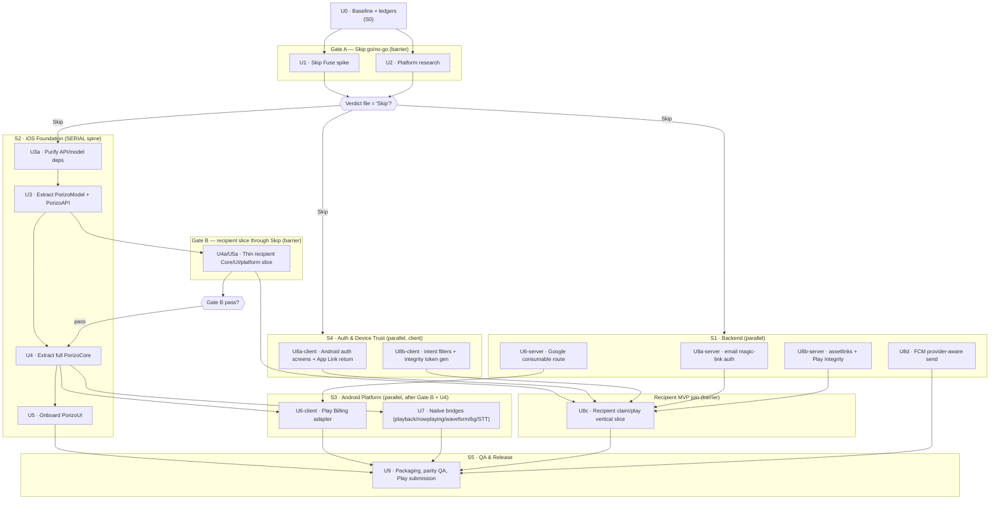

# feat: Android via Skip — Parallel-Agents Execution Plan

## Summary

This is the **execution shape** of the hardened Android-via-Skip plan. It does not re-decide anything: scope, sequencing, gates, and every Key Technical Decision come verbatim from the source plan (`docs/plans/2026-06-30-001-feat-android-via-skip-plan.md`). What this document adds is a way to **run the work as parallel agents**: the same units (U0–U9) are regrouped into five work streams with explicit agent contracts, a dependency DAG that shows what runs concurrently versus what blocks, two hard gate barriers, and a single flat checkable task list.

The organizing facts that make parallelism possible — and bound it:

1. **Two gates are global serialization barriers.** Nothing in Phase 2+ starts until **Gate A** returns a "Skip" verdict (source KTD7, U1/U2). The bulk module split waits on **Gate B** (source U4a/U5a). Agents fan out _within_ a phase, never across a closed gate.
2. **The iOS modularization tasks share two contended files** — `project.pbxproj` and `Package.swift`. Stream **S2 (iOS Foundation)** is therefore **internally serialized** (U3a → U3 → U4 → U5) even while S1/S3/S4 run beside it. Cross-stream concurrency is real; intra-S2 concurrency is not.
3. **The backend stream (S1) is almost fully independent** of the Swift work and can start the moment Gate A passes — its only coupling to the client is contract shape, which is already known.
4. **Recipient MVP is the first shippable milestone** (source KTD8/KTD12). Streams converge at the **Recipient MVP join** (U8c) before anyone touches full-parity work.

---

## Problem Frame

The source plan answers _what_ to build and _why_ (Android dead-ends the viral gift loop; minimize separately-built code; keep both apps native via Skip Fuse). It is already specific down to per-unit files and test scenarios. The gap it leaves is **operational**: a single implementer reading it top-to-bottom would serialize work that is genuinely independent (backend migrations vs. iOS purification vs. Android research), and would have no contract telling a fan-out agent what it owns, what it must not touch, and how its neighbor knows it is done.

This plan closes that gap. It is a routing layer over the source plan, not a replacement. When this document and the source disagree on a _decision_, the source wins; when they differ on _who runs what, when_, this document wins.

**Reading order:** open the source plan for the rationale behind any unit; open this plan to dispatch and track. Every task below cites its source U-ID so the two stay synchronized.

---

## Key Technical Decisions

All product/architecture KTDs are inherited unchanged from the source plan (KTD1–KTD12, see origin). The decisions _this_ plan adds are purely about execution structure:

- **EKTD1. Five work streams, cut along parallel seams — not along the source phases.** Streams: **S1 Backend**, **S2 iOS Foundation**, **S3 Android Platform**, **S4 Auth & Device Trust**, **S5 QA & Release**. A stream is an ownership boundary (a set of files one agent-lineage owns) plus a contract. The source's _phases_ still exist as **gate barriers and join points**; they are time-ordering, not ownership. A single source unit can be worked by exactly one stream (no unit is split across streams).

- **EKTD2. S2 is internally serial; all other streams parallelize.** The iOS Xcode project and `Package.swift` are single-writer surfaces. S2 runs U3a → U3 → U4 → U5 strictly in order, each as one atomic landing. S1, S3, S4 fan out freely. This is why the DAG has a long thin S2 spine with wide S1/S3/S4 ribs.

- **EKTD3. Agents that mutate files in parallel get git-worktree isolation; read-only/research agents do not.** Worktree isolation is reserved for tasks that would otherwise collide on shared files — flagged per task as `[worktree]`. Research/ledger tasks (U1 spike lives in a throwaway dir, U2 is doc research) need no isolation. This keeps worktree setup cost off the cheap tasks.

- **EKTD4. Gates are dispatch barriers with a named owner and a written verdict.** No agent in a gated-downstream stream is dispatched until the gate's verdict file exists and reads "Skip" (Gate A) / "pass" (Gate B). The verdict is a file (`docs/plans/android-skip-gate-a-findings.md`), not a verbal go-ahead, so a fresh agent can verify the gate state without conversation history.

- **EKTD5. Each stream carries a contract block.** Inputs (what must exist first), Owns (files this stream is the sole writer of), Must-not-touch (files another stream owns), Produces (the artifact/behavior that signals done), and Done-signal (the observable that lets a dependent stream start). Contracts are the parallel-agent equivalent of the source plan's per-unit `Dependencies`/`Verification`.

- **EKTD6. The Recipient MVP join (U8c) is a hard convergence point.** S2's thin slice (U4a/U5a), S4's auth + device trust (U8a/U8b), and the recipient UI must all be green before U8c integrates them. Full-parity stream work (U4 full, U5 full, U6, U7, U9) is dispatched _after_ the join, not before — even though some of it has no technical dependency on the recipient slice — because shipping the recipient fix first is a product decision (source KTD12), and pulling full-parity agents in early would re-contend S2's serial spine.

---

## High-Level Technical Design

### Stream-to-unit map

Each source unit is owned by exactly one stream. Gates and joins are barriers, not units.

| Stream                           | Owns (source units)                    | Parallelism               | Gated behind                    |
| -------------------------------- | -------------------------------------- | ------------------------- | ------------------------------- |
| **S0 Baseline** (pre-stream)     | U0                                     | single task               | none                            |
| **Gate A** (barrier)             | U1, U2                                 | U1 ∥ U2                   | U0                              |
| **S1 Backend**                   | U8a-server, U8b-server, U6-server, U8d | fully parallel internally | Gate A                          |
| **S2 iOS Foundation**            | U3a → U3 → U4 → U5                     | **serial spine**          | Gate A (U3a/U3); Gate B (U4/U5) |
| **Gate B** (barrier)             | U4a/U5a                                | single slice              | U3                              |
| **S3 Android Platform**          | U7, U6-client                          | parallel after U4         | Gate B + U4                     |
| **S4 Auth & Device Trust**       | U8a-client, U8b-client                 | parallel internally       | Gate A; integrates at join      |
| **Recipient MVP join** (barrier) | U8c                                    | single integration        | U4a/U5a + U8a + U8b             |
| **S5 QA & Release**              | U9                                     | single, late              | U5, U6, U7, U8c, U8d            |

### Dependency DAG



### What runs concurrently (the wins)

- **After Gate A passes:** S1 (4 backend tasks) ∥ S2-start (U3a) ∥ S4 (2 client-auth tasks) all dispatch at once. The backend migrations have zero dependency on the Swift refactor.
- **During the Gate-B wait:** S1 and S4 keep running; only S2's spine and the recipient-slice work pause on the Gate B verdict.
- **After the Recipient MVP ships:** S3 (U7 ∥ U6-client) and S2's full extraction (U4 → U5) run beside each other, sharing only the U4 dependency.

### What is forced serial (the constraints)

- **S2 spine** (U3a → U3 → U4 → U5): single-writer on `project.pbxproj` / `Package.swift`.
- **Both gates**: hard barriers; a closed gate stops every downstream stream.
- **The join** (U8c): needs all of {thin slice, server auth, server trust, client auth, client trust} green.

---

## Output Structure

This plan adds no new source directories beyond what the source plan already declares (`PorizoSkip/` workspace, `spikes/skip-fuse-spike/`, the two ledger docs). The only new artifacts are coordination docs created during execution:

```text
docs/plans/
├── 2026-06-30-001-feat-android-via-skip-plan.md      # decision source (unchanged)
├── 2026-06-30-002-feat-android-skip-parallel-agents-plan.md  # this file
├── android-skip-gate-a-findings.md                   # Gate A verdict (created in U1/U2)
├── android-skip-gate-a-blocker-tracker.md            # open blockers while Gate A is not passed
├── android-skip-gate-a-runtime-runbook.md            # physical-device runtime checklist
├── android-skip-legal-review-packet.md               # legal/toolchain signoff packet
└── android-third-party-ledger.md                     # SDK + legal/toolchain ledger (U0)
```

Per-stream file ownership is declared in each stream's contract below; the authoritative per-unit file lists remain in the source plan.

---

## Implementation Units

Units are grouped by stream. Each stream opens with its **agent contract**. Every unit cites its source U-ID; for full Goal/Approach/Test-scenario detail, read that unit in the source plan. Units here carry only what an execution agent needs that the source does not already give: stream ownership, concurrency flags, and the cross-stream done-signal.

### S0 — Baseline (pre-stream, single task)

**Contract** · Inputs: none · Owns: this plan, the two ledger docs · Must-not-touch: any Swift/backend code · Produces: frozen baseline commit + release-scope table + SDK/legal ledgers · Done-signal: ledger files exist and a baseline commit SHA is recorded.

### U0. Lock baseline, launch ledger, and release scope

- Source: U0 (KTD9, KTD11, KTD12).
- Dependencies: none.
- Files: this plan; `docs/plans/android-skip-gate-a-findings.md`, `docs/plans/android-third-party-ledger.md`.
- Execution note: This is the only task that may run before Gate A. It is a single agent, no isolation needed.
- Done-signal for downstream: baseline commit SHA + release-scope table + SDK/legal ledger all written. Gate A agents read the ledger to know which Skip/Play/RevenueCat components are license-cleared.
- Verification: per source U0.

---

### Gate A — Skip go/no-go (barrier)

**Two agents fan out** (U1 ∥ U2); both write into the same findings file; a human/owner reads the combined verdict. **No S1/S2/S4 agent is dispatched until the verdict reads "Skip"** (EKTD4).

### U1. Skip Fuse spike — real interaction slice plus native escape hatches

- Source: U1 (KTD1, KTD5, KTD7, KTD10).
- Dependencies: U0.
- Files: throwaway `spikes/skip-fuse-spike/` (not merged).
- Concurrency: runs ∥ U2. No worktree isolation — lives in its own throwaway dir.
- Done-signal: thresholds table (source U1) filled with real numbers on physical hardware.
- Verification: per source U1 — findings file contains the numbers and a "Skip" / "Compose fallback" / "more spike" recommendation.

### U2. Resolve platform research before Gate A verdict

- Source: U2 (KTD5, KTD7, KTD11).
- Dependencies: U0; concurrent with U1.
- Files: append to `android-skip-gate-a-findings.md`, `android-third-party-ledger.md`.
- Concurrency: runs ∥ U1. Read-only research agent — no isolation.
- Done-signal: each research question has a doc link, conclusion, owner, and "blocks Gate A?" flag.
- Verification: per source U2.

**Gate A verdict (barrier):** owner reads U1 + U2 findings; writes the explicit "Skip" decision into the findings file. Only then do S1/S2/S4 dispatch. If "Compose fallback", this plan's S2/S3 reshape to the source's fallback (shared backend + native Compose UI) — out of scope here, see source Alternatives.

---

### S1 — Backend (parallel stream)

**Contract** · Inputs: Gate A = "Skip" · Owns: `src/routes/auth.js` (email-auth additions), `src/routes/billing.js` (consumable route), `src/routes/sharing.js` (trust attestation), `src/services/` (auth-token, push-send, receipt wiring), `public/.well-known/assetlinks.json`, `migrations/pg/` · Must-not-touch: any `PorizoApp/` or `Sources/` Swift code · Produces: server contracts the Android client calls · Done-signal: each route returns the documented shape against backend tests + `npm test`.

All four S1 units are **mutually independent** and dispatch concurrently. They touch different route files; only U8a-server and U8b-server share `migrations/pg/` ordering — assign migration sequence numbers up front in U0's ledger to avoid collision. Mark S1 units `[worktree]` if two agents would otherwise both add a migration file in the same edit window.

### U8a-server. Passwordless email magic-link auth

- Source: U8a server portion (KTD3, KTD8). Verified net-new — only phone-OTP/password/social exist today.
- Dependencies: Gate A. Independent of S2/S4.
- Files: `src/routes/auth.js` or a split auth module; new email-auth token repository/service; `migrations/pg/`.
- Approach: per source U8a — follow the existing phone-registration-token pattern (hash-at-rest, single-use, short TTL, enumeration-neutral, rate-limited per email+IP); reuse `createSessionAndTokens`; magic link over verified App Link only. Rationale for email over existing phone-OTP is recorded in source KTD3.
- Done-signal for join (U8c): send + consume endpoints live; replay/expired/collision/rate-limit return safe states; backend auth tests pass.
- Test scenarios + Verification: per source U8a.

### U8b-server. Android App Links + device-trust attestation

- Source: U8b server portion (KTD10).
- Dependencies: Gate A. Independent of S2/S4.
- Files: `public/.well-known/assetlinks.json` route/static config; server Play Integrity / App Set ID validation service; `src/routes/sharing.js` (attest the already-client-asserted `device_id`); `migrations/pg/`.
- Approach: per source U8b. **The DB binding is already platform-neutral** (`share_tokens.bound_device_id` vs. client-asserted `device_id`, `sharing.js:1128`); the net-new work is **attestation** (Play Integrity + App Set ID with nonce/freshness/replay), not binding plumbing.
- Done-signal for join: `assetlinks.json` served on every receiver/auth host; forged/stale Integrity token rejected server-side; claim semantics = single-use handoff, same-bound-device resume only.
- Test scenarios + Verification: per source U8b.

### U6-server. Google consumable route + ledger

- Source: U6 server portion (KTD5).
- Dependencies: Gate A. Independent of S2/S4; feeds S3's U6-client.
- Files: `src/routes/billing.js` (new consumable route); Play catalog config; `migrations/` for catalog mapping.
- Approach: per source U6. **Wire the existing `verifyPurchase` one-time helper** (`google-receipt-validator.js:279`) into a new consumable route — subscriptions already validate via `handleGoogleSubscriptionValidation`; consumables are the gap. Validate against `gift_bundles`, reject forged/replayed/wrong-account/concurrent-duplicate, define transaction identity, credit wallet transactionally, then acknowledge/consume. Reconcile bare Google product IDs (`plus_monthly`) vs. iOS `com.porizo.*`.
- Done-signal for S3: consumable route credits wallet exactly once; double-submit/forged/cross-account rejected; backend billing tests pass.
- Test scenarios + Verification: per source U6.

### U8d. Additive Android FCM + push transport dual-stack

- Source: U8d (KTD4, KTD11).
- Dependencies: Gate A (technically `U3a` per source, but the server-send work is backend-only). Can land any time before S5; **not on the Recipient MVP critical path**.
- Files: `devices` schema additions (provider/environment only — `platform` column already exists, `device-repository.js:21,35`); `src/services/push-notification.js` provider-aware split; OneSignal reconciliation notes.
- Approach: per source U8d / corrected KTD4 — **provider-aware send routing, not a token-schema migration**. Split anonymous device-token issuance from authenticated push-token binding; add provider/environment fields, FCM token validation, ownership transfer, stale cleanup; keep iOS APNs active.
- Done-signal for S5: Android FCM render-complete routes to the song; APNs regression green; token reassignment doesn't leak to old owner.
- Test scenarios + Verification: per source U8d.

---

### S2 — iOS Foundation (SERIAL spine)

**Contract** · Inputs: Gate A = "Skip" (U3a/U3); Gate B = pass (U4/U5) · Owns: `PorizoApp/` Xcode project, `project.pbxproj`, `Package.swift`, all `Sources/Porizo*/` module moves · Must-not-touch: backend code, Android-native bridge impls (S3 owns those) · Produces: purified, modularized Swift the iOS app still consumes and Android can onboard · Done-signal: `swift build`/`swift test` green for moved modules + iOS `xcodebuild test` green after each landing.

**This stream is strictly serial** (EKTD2). Each unit is one atomic landing; the next does not start until the prior is merged. All four are `[worktree]` — they rewrite shared project files.

### U3a. Purify API/model dependencies before extraction

- Source: U3a (KTD2, KTD3, KTD6). `[worktree]`
- Dependencies: Gate A. First S2 task — can start the instant Gate A passes, in parallel with all of S1/S4.
- Files: `PorizoApp/PorizoApp/APIClient.swift`, `APIClient+*.swift`, selected `Models/*.swift`, new protocol files in the iOS target.
- Approach: per source U3a — introduce `SecureStore`/`PlatformIdentityStore`/`BackgroundExecutionProviding`/`PushTokenProviding`/`AppMetadataProviding`/`ClientPlatform`; strip UIKit/Keychain/`Bundle.main`/push/background imports from the API slice; expand token redaction.
- Execution note: pure refactor with iOS as oracle.
- Done-signal for U3: `PorizoAPI` candidate files compile in a temp SwiftPM target with zero UIKit/PushTokenManager/BackgroundTaskManager imports; iOS `xcodebuild test` passes.
- Test scenarios + Verification: per source U3a.

### U3. Extract `PorizoModel` and `PorizoAPI`

- Source: U3 (KTD2, KTD3, KTD9). `[worktree]`
- Dependencies: U3a (serial).
- Files: new `Sources/PorizoModel/`, `Sources/PorizoAPI/`; move purified files; update iOS target/package deps.
- Approach: per source U3 — keep the 12-extension API shape; preserve auth retry/redaction; platform adapters stay in the app target until U4.
- Done-signal for Gate B: standalone modules compile; iOS behavior unchanged; rollback is a file-move revert.
- Test scenarios + Verification: per source U3.

### U4. Extract full `PorizoCore`

- Source: U4 (KTD2, KTD6). `[worktree]`
- Dependencies: **Gate B pass**, and U8c if Recipient MVP ships first (it does — EKTD6).
- Files: `Sources/PorizoCore/`; move from `Controllers/`, `Services/CreateFlowStore.swift`, view-model logic.
- Approach: per source U4 — expand thin protocols to full coverage; no platform frameworks in `PorizoCore`.
- Done-signal for S3/U5: `PorizoCore` builds with zero platform-framework imports; render-polling/create-flow/claim-draft/token-refresh tests pass; iOS green.
- Verification: per source U4.

### U5. Onboard full SwiftUI screen layer into `PorizoUI`

- Source: U5 (KTD1, KTD2). `[worktree]`
- Dependencies: U4 (serial).
- Files: `Sources/PorizoUI/`, `Sources/PorizoUI/Skip/`; move from `Flows/`, `V2Story/`, `Components/`, `Tabs/`, `Onboarding/`, `Settings/`, `WarmCanvas/`, design tokens.
- Approach: per source U5 — onboard in dependency order; unsupported SwiftUI → supported SwiftUI or embedded Composables; preserve Warm Canvas tokens; map Fraunces + SF Pro/Roboto fallback.
- Done-signal for S5: My Songs/Create/Now Playing/Share/Settings/Voice Enrollment/paywall/recipient screens pass parity on Android hardware + iOS sim.
- Verification: per source U5.

---

### Gate B — recipient slice through Skip (barrier)

### U4a/U5a. Thin recipient Core/UI/platform slice

- Source: U4a/U5a (KTD7, KTD8, KTD10).
- Dependencies: U3.
- Files: minimal `Sources/PorizoCore/` claim/play state; minimal `Sources/PorizoUI/` recipient screens; minimal `Sources/PorizoPlatform/` playback/device-trust abstractions.
- Approach: per source — extract only the recipient path: handoff resolution, auth-return resume, claim state machine, playback URL/key access, smallest claim/play/error/support UI.
- **Gate B verdict (barrier):** App Link opens the Skip claim screen on hardware; login return resumes the pending claim; same-device retry resumes / wrong-device replay blocked or stubbed-with-contract; playback starts; iOS still green. **If Gate B fails:** stop Skip modularization, switch to the Compose fallback before U4/U5 (source decision). Until the verdict reads "pass", U4 and U5 do not dispatch.

---

### S4 — Auth & Device Trust (parallel, client)

**Contract** · Inputs: Gate A = "Skip"; server counterparts (U8a-server/U8b-server) for end-to-end, but client screens can be built against the documented contract before the server lands · Owns: Android auth screens/adapters, intent filters, Integrity token generation client · Must-not-touch: backend route impls (S1 owns), iOS modules (S2 owns) · Produces: Android client halves of auth + device trust · Done-signal: client can complete auth + generate an Integrity token against the server sandbox.

Both S4 units run concurrently with each other and with S1/S2. They integrate at the join (U8c).

### U8a-client. Android auth screens + App Link return

- Source: U8a client portion (KTD3, KTD8).
- Dependencies: Gate A; consumes U8a-server contract at integration.
- Files: Android auth adapter/screens; App Link return handling; SIWA-web / Google-via-`/auth/social` wiring.
- Approach: per source U8a — email magic-link primary, social via existing `/auth/social` (verified to exist), SIWA on Android via web-credential id_token into `/auth/social`.
- Done-signal for join: Android-only email user and existing Apple user can both authenticate and resume a pending claim on hardware.

### U8b-client. Intent filters + Play Integrity token generation

- Source: U8b client portion (KTD10).
- Dependencies: Gate A; consumes U8b-server contract at integration.
- Files: Android intent filters; App Set ID + Play Integrity token generation client; claim/play UI state matrix wiring.
- Approach: per source U8b — generate the Integrity token + App Set ID client-side; implement the Recipient Android State Matrix (installed / deferred / browser fallback / unverified link / auth states / claim states / wrong-device / revoked / stream-key denied / offline / support).
- Done-signal for join: client produces a server-acceptable Integrity token; every state-matrix branch reaches a distinct UI state.

---

### Recipient MVP join (barrier)

### U8c. Recipient claim/play vertical slice

- Source: U8c (KTD8, KTD10, KTD12).
- Dependencies: **U4a/U5a (Gate B pass) + U8a (server+client) + U8b (server+client)**. This is the convergence of S2-thin-slice, S1-auth, S1-trust, S4-auth, S4-trust.
- Files: recipient screens, playback shim, support path, minimal analytics/crash reporting, claim/play API usage.
- Approach: per source U8c — implement only the recipient flow end-to-end: open gift link → preserve handoff through install/login → claim → bind → play → recover from errors → support. No create/render/enrollment unless Gate B proved it's needed for playback.
- Done-signal for full-parity dispatch + S5: physical Android passes the Recipient Android State Matrix; backend targeted tests + `npm test`; iOS build/test unchanged. **This is the first shippable Android release.**
- Test scenarios + Verification: per source U8c.

---

### S3 — Android Platform (parallel, after the join + U4)

**Contract** · Inputs: U4 (full `PorizoCore` protocols), U6-server (for billing) · Owns: `Sources/PorizoPlatform/{NowPlaying,Waveform,Background,STT,Playback,IAP}/` Android impls · Must-not-touch: iOS impls behind the same protocols, backend · Produces: Android native siblings for every bridged feature · Done-signal: each bridge works on physical Android with permission/failure states; iOS unchanged.

U7 and U6-client run concurrently (different `PorizoPlatform/` subdirs).

### U7. Native Android bridges — playback, now-playing, waveform, background, STT

- Source: U7 (full feature parity).
- Dependencies: U4, U5.
- Files: `Sources/PorizoPlatform/{NowPlaying,Waveform,Background,STT,Playback}/`.
- Approach: per source U7 — ExoPlayer/Media3 + `MediaSessionService`; `AudioRecord` WAV parity; WorkManager + foreground service for upload (Doze-aware); Android SpeechRecognizer with permission/no-match/no-network states; defer on-device Whisper unless U2 required it.
- Verification: per source U7.

### U6-client. Play Billing adapter

- Source: U6 client portion (KTD5).
- Dependencies: U4; consumes U6-server consumable route.
- Files: `Sources/PorizoPlatform/IAP/`.
- Approach: per source U6 — client adapter chosen after U1/U2 (Skip Marketplace / direct Play Billing / RevenueCat broker) obtains Google purchase tokens, then feeds the server validators. iOS StoreKit untouched.
- Done-signal for S5: Android purchases reflect server entitlements; iOS StoreKit unchanged.
- Test scenarios + Verification: per source U6.

---

### S5 — QA & Release (single, late)

**Contract** · Inputs: U5, U6, U7, U8c, U8d all green · Owns: `Android/` Gradle config, signing, Play Console metadata, Data Safety form, release docs · Must-not-touch: feature code (lock for QA) · Produces: a submittable full-parity Android build · Done-signal: internal-testing build installs; parity matrix green; no embedded server secret.

### U9. Packaging, parity QA, and Play submission

- Source: U9 (KTD12).
- Dependencies: U5, U6, U7, U8c, U8d.
- Files: `Android/` Gradle config, signing, Play Console metadata, Data Safety form, release docs.
- Approach: per source U9 — release signing, Play Data Safety, Play Billing products, crash/analytics, pre-launch report handling; full parity QA matrix; client SDK keys public, service-account JSON + signing keys server/CI-only.
- Test scenarios + Verification: per source U9.

---

## Task List

Flat, checkable. Each task = one source unit (or unit-half), tagged with stream, gate state, and `[worktree]` where parallel file mutation requires isolation. Dispatch order follows the gates; tasks at the same indent level under a stream after a passed gate may run concurrently.

**Pre-stream**

- [x] **U0** (S0) — Lock baseline commit, release-scope table, SDK + legal/toolchain ledgers.

**Gate A barrier** (dispatch both after U0; ∥)

- [ ] **U1** (Gate A) — Skip Fuse spike in `spikes/skip-fuse-spike/`, fill thresholds on hardware. Local build/export completed; no Android device/AVD/emulator package is available; split-delivery size review and physical-device runbook are documented.
- [x] **U2** (Gate A) — Platform research; each question gets link/conclusion/owner/blocks-flag.
- [x] **Gate A verdict** — owner writes "Skip" / "Compose fallback" / "more spike required" into `android-skip-gate-a-findings.md`. Current verdict: `more spike required`; **blocks all of S1/S2/S4.**

**After Gate A = "Skip"** (S1 ∥ S2-start ∥ S4 all dispatch)

- [ ] **U8a-server** (S1) — Email magic-link auth (new). `[worktree]` if colliding migration window.
- [ ] **U8b-server** (S1) — `assetlinks.json` + Play Integrity/App Set ID attestation. `[worktree]` if colliding migration window.
- [ ] **U6-server** (S1) — Google consumable route wiring existing `verifyPurchase`.
- [ ] **U8d** (S1) — FCM provider-aware send (no token-schema migration). _Off recipient critical path._
- [ ] **U3a** (S2) — Purify API/model deps. `[worktree]` · **serial: first S2 task.**
- [ ] **U8a-client** (S4) — Android auth screens + App Link return.
- [ ] **U8b-client** (S4) — Intent filters + Integrity token gen + state matrix.

**S2 serial spine** (each after the prior lands)

- [ ] **U3** (S2) — Extract `PorizoModel` + `PorizoAPI`. `[worktree]` · after U3a.

**Gate B barrier**

- [ ] **U4a/U5a** (Gate B) — Thin recipient Core/UI/platform slice; run the Gate B checks on hardware.
- [ ] **Gate B verdict** — "pass" or switch to Compose fallback. **Blocks U4/U5.**

**Recipient MVP join** (after thin slice + U8a both halves + U8b both halves)

- [ ] **U8c** (join) — Recipient claim/play vertical slice. **First shippable Android release.**

**After the join** (full-parity; S2 spine resumes ∥ S3)

- [ ] **U4** (S2) — Extract full `PorizoCore`. `[worktree]` · after Gate B + U8c.
- [ ] **U5** (S2) — Onboard full `PorizoUI`. `[worktree]` · after U4.
- [ ] **U7** (S3) — Native Android bridges. After U4 (∥ U6-client).
- [ ] **U6-client** (S3) — Play Billing adapter. After U4 + U6-server (∥ U7).

**Release**

- [ ] **U9** (S5) — Packaging, parity QA, Play submission. After U5, U6, U7, U8c, U8d.

---

## Scope Boundaries

In scope: re-expressing the source plan as parallel work streams, a dependency DAG, agent contracts, and a checkable task list — **without altering any source decision**. Gate barriers, the Recipient-MVP-first ordering, and all KTDs are preserved.

This plan does **not**:

- Re-decide Skip Fuse vs. Compose, gate thresholds, or any unit's approach — those live in the source plan and win on conflict.
- Change unit boundaries or U-IDs from the source (it only splits server/client _halves_ of U6/U8a/U8b for stream ownership; the source unit remains the decision unit).
- Specify agent-runtime mechanics (which model, how many retries, exact dispatch tooling) — that is execution-tool choice, not plan content.

### Deferred to Follow-Up Work

- **Compose-fallback stream map.** If Gate A returns "Compose fallback", S2/S3 reshape to the source's native-Compose alternative. A parallel-stream map for that path is deferred until/unless the gate forces it.
- **Per-stream staffing/parallelism limits.** How many concurrent agents each stream runs (S1 could be 1–4) is an execution-time tuning decision, not planned here.

### Outside this product's identity

Inherited from the source plan: tablet/foldable layout, Android Auto / Wear OS, and any "sound like [artist]" voice features remain out of the product's identity (source Scope Boundaries / KTD list).

---

## Risk Analysis & Mitigation

- **Risk: a parallel agent edits a file another stream owns** (the classic fan-out hazard). Mitigation: every stream contract names its **Owns** and **Must-not-touch** sets; the S2 spine is single-writer by construction; `[worktree]` isolation on every shared-file mutation.
- **Risk: an agent starts gated-downstream work before the gate actually passed** (no conversation memory). Mitigation: EKTD4 — gate state is a **file with a written verdict**, not a verbal go-ahead; a fresh agent verifies the gate by reading the findings file.
- **Risk: migration-number collisions** between U8a-server and U8b-server landing concurrently. Mitigation: assign `migrations/pg/` sequence numbers in U0's ledger before S1 fans out; `[worktree]` if windows overlap.
- **Risk: the join (U8c) stalls** waiting on a slow stream. Mitigation: U8a/U8b client halves are built against the documented server contract _before_ the server lands, so the join waits only on integration, not on first-build.
- **Risk: full-parity agents pulled in early re-contend the S2 spine.** Mitigation: EKTD6 forbids dispatching U4/U5/U6/U7 until after the Recipient MVP join, even where no technical dependency exists.
- Source-plan risks (spike validates rendering but not interaction; irreversible modularization before Skip proves itself; Recipient MVP violating share-once) all still apply — see source Risk Analysis.

---

## Dependencies / Prerequisites

- The source plan's prerequisites carry over verbatim: Skip toolchain + Android Studio + Swift Android SDK (pinned in Gate A findings); a physical Android device for U1 / Gate B / U7 / U8 / U9.
- **This plan additionally requires:** the Gate A and Gate B verdict files exist and are readable by any dispatched agent (the gate-as-file contract), and U0's ledger has pre-assigned migration sequence numbers before S1 fans out.

---

## Sources & Research

- **Decision source (authoritative on all conflicts):** `docs/plans/2026-06-30-001-feat-android-via-skip-plan.md` — KTD1–12, Gate A/B thresholds, U0–U9, coverage matrix, and the backend-reality corrections applied 2026-06-30.
- **Backend-reality verification** (scout pass, 2026-06-30): passwordless email auth absent (phone-OTP/password/social only); `devices.platform` column already exists (`device-repository.js:21,35`); `/auth/social` + SIWA present (`auth.js:544`); `verifyPurchase` one-time helper present but unwired for consumables (`google-receipt-validator.js:279`); `share_tokens.bound_device_id` binding is client-asserted with zero attestation (`sharing.js:1128`). These corrections are already in the source plan and are reflected in S1's unit notes above.
