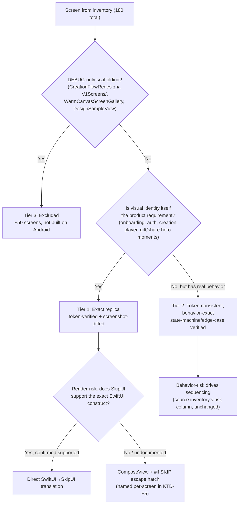

# feat: Android Design/UI Replica-Fidelity Implementation Plan

## Summary

This plan turns the completed iOS screen inventory into an executable design-fidelity blueprint for the Android port. The user's mandate is explicit: **"the android needs to be a replica of the ios"** — pixel and behavior fidelity, not reinterpretation. It does not re-decide anything the existing Android Skip plan already owns (Skip Fuse vs. Compose fallback, Gate A/B thresholds, unit sequencing, backend migrations) — those stay authoritative in `docs/plans/2026-06-30-001-feat-android-via-skip-plan.md`. This plan answers a narrower question that document leaves open: **once Skip is confirmed (or the Compose fallback is chosen), exactly which screens get built in what order, against which token values, verified how.**

**This plan does not start today.** Gate A has not passed — `docs/plans/android-skip-gate-a-findings.md` records `more spike required` (no physical-device run, unresolved SkipStone AGPL-3.0/Skip Fuse LGPL legal signoff, per the existing plan's KTD7/U1). Every implementation unit below is gated behind that verdict. The plan exists now so that the moment Gate A returns "Skip," a design-fidelity backlog is ready to execute — not to jump the gate.

The source material is unusually strong: a 180-screen, 15-group audit (`docs/plans/2026-07-01-ios-e2e-screen-inventory.md`) with per-screen risk ratings, a canonical design-token extraction (fonts, colors, radii, spacing, shadows), and a non-obvious-behaviors checklist. This plan's job is to sequence against that inventory's own risk ratings, define the token-replication mechanics Skip Fuse actually supports (confirmed via direct research against skip.dev/skip-ui docs), and define how "replica" is verified — not just claimed.

---

## Problem Frame

A design system and a screen inventory are not the same thing as an execution order. Without this plan, an implementer reading the 180-screen inventory has no answer to "which 12 screens first," no concrete recipe for loading a variable serif font (Fraunces) into a Kotlin/Compose runtime, and no way to prove a screen is "done" beyond eyeballing it once.

Three structural facts shape this plan:

1. **The Gate A spike currently has zero design-token or Fraunces usage.** Verified directly: `grep -c "DesignTokens\."` across every file in `PorizoAndroid/Sources/PorizoSkipSpike/` returns 0, and no `.ttf`/`.otf` files exist anywhere under `PorizoAndroid/`. This is a clean slate, not a migration — there is no prior Android design-token work to reconcile or undo.
2. **Skip Fuse's actual SwiftUI-API coverage is better than the inventory's risk ratings assumed for rendering.** Direct research against the `skip-ui` README confirms `UnevenRoundedRectangle`, custom `Shape`/`Path`, `DragGesture(minimumDistance: 0)` (the exact primitive the hidden-textfield OTP pattern needs), `TabView(.page)`, and both gradient types are supported today. Most of the inventory's "High risk" screens are high-risk for **state-machine and behavioral** complexity (resume matrices, vocal-onset detection, purchase-gating), not rendering complexity — this plan separates those two risk dimensions instead of conflating them.
3. **One token mechanism has a confirmed open question, not a confirmed answer.** Custom font bundling (`Font.custom` → `Android/app/src/main/res/font/<filename>.ttf`) is documented and will work for a **static** font file. Fraunces is a **variable font**; Skip's docs describe only static-file embedding, with no documented statement on variable-axis (weight) support. This plan treats that as an open question to resolve in U1, not an assumption to build six units on top of.

---

## Key Technical Decisions

- **KTD-F1. Screens are triaged into three fidelity tiers, not one flat backlog.** **Tier 1 (Exact replica required):** screens where the inventory's "Design tokens/fonts" column names specific Fraunces/DesignTokens values and where visual identity is the point (onboarding, auth, creation flow, player, gift/share). **Tier 2 (Token-consistent, behavior-exact):** screens whose visual bar is "looks like the rest of the app" but whose *behavior* is the real replica requirement (state machines, resume logic, validation asymmetries) — most of Player and Create/Story Flow's "High risk" rows. **Tier 3 (Excluded from replica scope):** the ~50 DEBUG-only screens the inventory itself flags as "do not port" (`CreationFlowRedesign/`, `V1ScreenCatalogView`, `WarmCanvasScreenGallery`, `DesignSampleView`). Building all three tiers identically would waste effort replicating internal tooling nobody will ever see on Android.

- **KTD-F2. Token replication is unit-tested against literal values, not eyeballed.** The inventory's Design System Extraction section (fonts, colors, corner radii, spacing, shadow triad) becomes a single Kotlin/Swift-shared token source (mirroring the existing `DesignTokens.swift` structure) verified by a snapshot test that asserts exact hex/point values — not a person looking at two screenshots side by side and deciding they're "close enough."

- **KTD-F3. Fraunces ships as static-weight files, pending on-device verification of the variable axis.** Per research, bundle `Fraunces-Regular.ttf`, `Fraunces-Medium.ttf`, `Fraunces-SemiBold.ttf`, `Fraunces-Bold.ttf` as separate static files in `Android/app/src/main/res/font/` (Google Fonts publishes static instances of Fraunces alongside the variable file) rather than betting the whole font system on undocumented variable-axis behavior. If on-device testing later confirms the variable file renders correctly with weight selection, this can be simplified — but the plan does not assume that upfront.

- **KTD-F4. Rendering-risk and behavior-risk are scored separately per screen.** The source inventory's single "Android replica risk" column conflates two different risks. This plan re-tags each Tier 1/2 screen with two independent flags: **Render-risk** (will SkipUI draw this correctly) — now mostly Low given confirmed API support — and **Behavior-risk** (will the state machine/edge case survive the port) — unchanged from the inventory, since Skip Fuse support doesn't touch business logic. Sequencing follows behavior-risk; token work follows render-risk.

- **KTD-F5. Native escape hatches are named per-screen before implementation, not discovered during it.** For the small number of Tier 1 screens research flagged as needing more than direct translation — anything requiring pixel-accurate custom drawing beyond `Shape`/`Path` — this plan names the `ComposeView`/`#if SKIP` escape hatch explicitly per screen (source KTD6 already establishes the pattern; this plan applies it to *design* fidelity, not just platform bridges).

- **KTD-F6. Parity verification is a side-by-side screenshot diff against the iOS simulator, not a subjective pass/fail.** Every Tier 1 unit's Verification includes: iOS Simulator screenshot (fixture-driven, per the existing `docs/dev/simulator-testing.md` `--fixture-*` flags) + Android emulator/device screenshot of the same fixture state, compared at matching viewport scale, with named acceptable-difference categories (font-rendering AA differences, platform-native control chrome) versus unacceptable differences (wrong color, wrong spacing, missing element).

- **KTD-F7. This plan's units slot into the existing plan's Phase 4/5 (U4, U5), not before Gate A/B.** Per the source plan's own sequencing (KTD8/KTD12), full-parity screen work — which is what token/screen-replica units are — happens after the Recipient MVP ships. This plan's units are additive detail *inside* U5 ("Onboard full SwiftUI screen layer into PorizoUI"), not a parallel or competing track. **Done-definition precedence:** for Tier 1 screens, this plan's pixel/behavior-diff bar supersedes source plan U5's "preserve tokens when pixel parity is impossible" relaxation. When a construct is genuinely un-parity-able on the target runtime, resolve it via the KTD-F5 escape hatch or record an explicit per-screen token-only exception — do not silently fall back to the looser U5 standard.

- **KTD-F8. Accessibility parity is a standing acceptance dimension on every Tier 1 unit, verified separately from the pixel diff.** A "replica" must match iOS accessibility behavior, and KTD-F6's screenshot diff structurally cannot verify non-pixel behavior (VoiceOver→TalkBack labels/hints, Dynamic Type at large sizes, Reduce Motion skip-vs-slow). Each Tier 1 unit (UF3–UF8) therefore asserts, per screen: (a) TalkBack labels/hints match the iOS accessibility tree, (b) Dynamic Type / Android font-scale renders correctly at the largest step, (c) Reduce Motion behavior matches where the inventory documents it — referencing the inventory's per-screen a11y flags (e.g., `MiniPlayerBar` nested container+control structure, `RevealBloomView` hidden a11y label, `PoemRevealView` tap-anywhere gap, `ReviewPrePromptSheet` hint contract) rather than re-deriving them.

---

## High-Level Technical Design

### Fidelity-tier decision flow



### Token pipeline (Tier 1 dependency)

```mermaid
flowchart LR
  Tokens["docs/plans/2026-07-01-ios-e2e-screen-inventory.md<br/>Design System Extraction<br/>(fonts, colors, radii, spacing, shadows)"] --> Source["Sources/PorizoUI/DesignTokens.swift<br/>(shared Swift, per source plan KTD2 module layout)"]
  Source -->|iOS: existing pipeline| iOSApp["iOS app renders via UIFontMetrics/UIColor"]
  Source -->|Android: SkipUI translation| AndroidRes["Android/app/src/main/res/font/<br/>fraunces_regular.ttf, fraunces_medium.ttf,<br/>fraunces_semibold.ttf, fraunces_bold.ttf"]
  AndroidRes --> AndroidApp["Android app renders via Font.custom(\"Fraunces\", relativeTo:)"]
  Source --> SnapshotTest["Token snapshot test<br/>(asserts literal hex/pt values match extraction doc)"]
```

---

## Implementation Units

Units are grouped by fidelity tier. All units are gated behind Gate A passing (source plan KTD7); U-IDs continue from the source plan's numbering space using an `F` (fidelity) prefix to avoid collision with existing U0–U9.

### Phase F0 — Token foundation (blocks all Tier 1/Tier 2 units)

### UF1. Establish the shared design-token source and Android font bundle

- Goal: Make every literal value in the inventory's Design System Extraction section (fonts, colors, radii, spacing, shadow triad) available to both platforms from one source, with Fraunces rendering correctly on Android.
- Requirements: KTD-F2, KTD-F3 (this plan); source plan KTD2 (module layout), KTD6 (bridge protocols).
- Dependencies: **Canonical start-gate — source plan U5 ("Onboard full SwiftUI screen layer into PorizoUI"), which depends on U4 (bulk modularization, Phase 4, after Gate B).** Because every Tier 1 unit writes into `Sources/PorizoUI/…` — the module U5 creates — the earliest real start is Phase 4, not the U4a/U5a thin slice. (Purified `PorizoModel`/`PorizoAPI` from U3a/U3 are a prerequisite of U4/U5, not a sufficient gate on their own.) The one exception is UF7's recipient-visual work, which may ride the earlier U4a/U5a/U8c thin recipient slice if intentionally pulled forward. Also gated on the Gate A "Skip" verdict.
- Files: `Sources/PorizoUI/DesignTokens.swift` (new shared module, ported from `PorizoApp/PorizoApp/DesignTokens.swift`); `Android/app/src/main/res/font/fraunces_regular.ttf`, `fraunces_medium.ttf`, `fraunces_semibold.ttf`, `fraunces_bold.ttf` (static instances from Google Fonts, not the variable file — see KTD-F3); iOS side keeps existing `UIAppFonts`/Copy Bundle Resources config.
- Approach:
  - Port the literal token values from `DesignTokens.swift` (colors: `background`, `surface`, `surfaceMuted`, `surfaceElevated`, `cardBackground`, `gold` `#E07850`, `goldGradientEnd`, `goldDark`, `roseGold`, `sage`, `textPrimary/Secondary/Tertiary`, `border`, `borderSubtle`, `focusRing`, `error`, `warning`, `success`/`statusSuccess`/`successDark`, `statusInfo`/`statusInfoBg`; radii: `radiusXSmall(8)`, `radiusMedium(12)`, `radiusCTA(14)`, `radiusLarge(16)`, `radiusOverlay(20)`, `radiusPremium(24)`, `radiusChip(22)`, `radiusPill(25)`; spacing: `spacing2/4/6/8/12/16/20/24/32`) into the shared module.
  - Download Fraunces static weight instances (Regular/Medium/SemiBold/Bold — matching the weights actually observed in the inventory's font usage column) from Google Fonts; name files per Skip's filename-matching convention (lowercase + underscores).
  - Wire `Font.custom("Fraunces", size:relativeTo:)` per Skip's confirmed API signature (supports Dynamic-Type-relative scaling, per research finding Q4) for the Android target; confirm the same call resolves correctly on iOS (it already does — no change to existing iOS font code required).
  - Normalize the three parallel shadow systems found in the audit (`.elevation(.level1-3)`, `.cardShadow()`/`.subtleShadow()`, `.goldGlow()`) into one set of named shadow tokens before porting — do not port the fragmentation.
- Test scenarios:
  - Snapshot test asserts every named color token resolves to its documented hex value on both platforms.
  - Snapshot test asserts every named radius/spacing token resolves to its documented point value on both platforms.
  - `Font.custom("Fraunces", size: 22, relativeTo: .title)` renders on an Android emulator without falling back to system font (visual confirmation + programmatic font-family assertion via Compose's `FontFamily` inspection).
  - Each of the 4 bundled Fraunces weights renders visually distinct from its neighbors (Regular vs Medium vs SemiBold vs Bold) — catches a bad/duplicate font file.
- Verification: Android emulator screenshot of a token-showcase screen (all colors, both font families at 3+ sizes, radius scale, spacing scale) visually matches the iOS simulator's `DesignSampleView`-style output for the same tokens (Tier 3 exclusion does not apply here — this is a new verification-only screen, not a port of the DEBUG scaffold). Token snapshot tests pass on both platforms.

### UF2. Resolve the Fraunces variable-axis open question and Dynamic Type parity

- Goal: Close the two questions research left explicitly open — whether Fraunces' variable weight axis works at all via Skip, and whether `UIFontMetrics`-equivalent Dynamic Type scaling behaves consistently cross-platform.
- Requirements: KTD-F3.
- Dependencies: UF1.
- Files: none (spike/research unit — findings feed back into UF1 if the static-file approach needs revision).
- Approach: On physical Android hardware (per source plan's Gate A hardware requirement), test the Fraunces variable `.ttf` directly via `Font.custom` to see if Skip's Android runtime respects weight-axis variation at all — if yes, UF1's four-static-file approach can be simplified to one variable file in a follow-up. Separately, test `Font.custom(_:size:relativeTo:)` against Android's system font-scale accessibility setting (Settings → Display → Font size) and compare against iOS Dynamic Type behavior at the same accessibility text-size steps.
- Test scenarios:
  - Variable Fraunces file loaded via `Font.custom` on Android hardware at 3 different weight requests — record whether output visually differs or silently falls back to the file's default weight.
  - Android accessibility font-scale set to largest setting; compare rendered text size ratio against iOS Dynamic Type set to its largest accessibility size for the same `relativeTo:` text style.
- Verification: A written finding (pass/fail per sub-question) appended to this plan or a linked findings doc — this unit's job is to convert two "unverified" research flags into "confirmed" facts, not to ship code.

### Phase F1 — Tier 1 screens (exact replica, sequenced by behavior-risk)

Sequencing pulls directly from the inventory's own risk ratings (Section 1, "Highest-risk screens to replicate faithfully"). Each unit below covers one inventory group; behavior-risk (not render-risk) determines order, per KTD-F4.

### UF3. Onboarding screen set — token/animation replica

- Goal: Replicate the 9-screen onboarding flow (`LivingSplashView` → `MirrorView` → `PainPointsView` → `GoalQuestionView` → `RecipientPickerView` → `RecipientNameView` → `AdaptiveQuestionView` → `OnboardingV2View` processing → `OnboardingPayoffView`) with exact Warm Canvas tokens and the specific animation timings the inventory documents.
- Requirements: source inventory Onboarding table rows; KTD-F1 (Tier 1), KTD-F6 (screenshot verification).
- Dependencies: UF1.
- Files: `Sources/PorizoUI/Onboarding/` (new, mirroring `PorizoApp/PorizoApp/Onboarding/`).
- Approach: Per-screen, port the exact staggered-reveal timings the inventory names (`MirrorView`'s 0.3s/1.0s/1.7s/2.8s staggered lines), the 300ms auto-advance pattern (`GoalQuestionView`, `RecipientPickerView`, `AdaptiveQuestionView`'s non-free-text path), and the `.boldChipStyle(isSelected:)` component pattern (gold-fill-selected / surface-fill-unselected capsule, listed in the inventory's Component Patterns table) as one shared Compose-equivalent component, not 4 separate reimplementations.
- Test scenarios:
  - `MirrorView`'s 4 staggered reveals fire at their documented offsets (0.3s/1.0s/1.7s/2.8s) — timing-asserted, not just "eventually all show."
  - `GoalQuestionView` auto-advances exactly 300ms after a chip tap with no visible Continue button (matches iOS; Android must not add one).
  - `GoalQuestionView`'s adaptive supporting text branches correctly across all 5 prior-answer categories (enumerate the categories from source; assert each renders its documented copy), and its silent occasion pre-fill side effect fires — the inventory flags both as load-bearing, so a flat single-string port is a replica failure.
  - `AdaptiveQuestionView`'s `allowFreeText=true` path commits immediately per chip; `allowFreeText=false` path auto-advances at 300ms AND sends empty string (not nil) on skip — both branches tested explicitly, since the inventory flags this nil-vs-empty-string distinction as load-bearing.
  - Reduce Motion / equivalent Android accessibility setting: `LivingSplashView`'s waveform pulse is skipped entirely (not just slowed), matching the inventory's documented iOS behavior.
- Verification: Screenshot diff (KTD-F6) against iOS simulator fixtures for each of the 9 screens at matching states; timing assertions pass in automated tests, not manual observation.

### UF4. Auth screen set — token replica + OTP hidden-textfield pattern

- Goal: Replicate `AuthView`, the `PhoneAuthFlowView` 5-state router, and the three separate hidden-textfield-under-boxes OTP implementations (`PhoneVerificationView`, `AccountManagementView`, `ProfileCompletionView`) with exact visual and auto-submit behavior.
- Requirements: source inventory Auth table rows (all flagged Med/High); KTD-F1, KTD-F4, KTD-F5.
- Dependencies: UF1; source plan's Android auth work (U8a) for the underlying passwordless-email/social auth backend — this unit covers **visual/UX replica** of the auth screens, not the auth mechanism itself (that is source plan U8a's scope, unchanged).
- Files: `Sources/PorizoUI/Auth/` (new, mirroring root-level `AuthView.swift`, `PhoneAuthView.swift`, `AccountExistsView.swift`, `ProfileCompletionView.swift`).
- Approach: Per research finding Q2, `DragGesture(minimumDistance: 0)` is confirmed supported and is the exact primitive the hidden-TextField-under-styled-boxes OTP pattern needs (a near-invisible real `TextField` at 0.01 opacity captures input while 6 separate `Text` glyphs render the visible digit boxes) — implement this pattern **once** as a shared component, not three separate times as iOS currently does (inventory flags this triplication explicitly). Replicate the country auto-detection logic (`+`, `00`, `011` prefix triggers) and the +1-vs-other-country asymmetric validation rule verbatim — these are documented in the inventory's Non-Obvious Behaviors section as exact rules, not approximations.
- Test scenarios:
  - OTP auto-submits at exactly 6 digits entered, guarded against double-submit race (manual tap + system autofill arriving near-simultaneously) — per the inventory's documented `!isVerifying` guard.
  - +1 phone number requires exactly 10 digits (or 11 with leading 1 stripped); a non-+1 country requires 6–15 digits after stripping one leading zero — both branches tested with boundary values.
  - Typing `011` (not just `+` or `00`) triggers international-prefix country auto-detection.
  - `ASAuthorizationError`-equivalent cancellation (user backs out of the platform sign-in sheet) is silently swallowed with no error banner, matching iOS.
  - `ProfileCompletionView`'s skip button stays hidden until account age exceeds 5 minutes, and fails closed (stays hidden) if the timestamp is unparseable.
- Verification: Screenshot diff against iOS fixtures for each auth screen state; the shared OTP component passes auto-submit/race-guard tests; phone validation asymmetry has explicit passing test cases for both branches.

### UF5. Creation flow — WarmCanvasFlowView and conversation stack

- Goal: Replicate the single highest behavior-risk screen in the app (`WarmCanvasFlowView`) and its embedded conversation stack (`AdaptiveConversationView`, `ChatMessageBubble`, `InlineStoryCard`, `SuggestionChipsView`) with the resume-matrix, algorithmic card placement, and typewriter timing intact.
- Requirements: source inventory Create/Story Flow table (top-priority risk screen per inventory Section 1); KTD-F1, KTD-F4.
- Dependencies: UF1, UF3 (shares onboarding's chip-component patterns), source plan's thin recipient slice (U4a/U5a) for the underlying Core state machine.
- Files: `Sources/PorizoUI/Create/` (new, mirroring `PorizoApp/PorizoApp/Flows/WarmCanvasFlowView.swift`, `PorizoApp/PorizoApp/V2Story/Views/*.swift`).
- Approach: Port the ~6-branch version-state resume matrix (full URL present / full job in-flight / preview URL present / preview job in-flight / failed-retriable / failed-no-job) as an explicit state machine, not nested conditionals — the inventory flags this as the single largest port risk in the app. Port the inline-card algorithmic placement rule (every 3rd AI message + before `.confirm`) and the typewriter-reveal character limit (<350 chars, latest AI bubble only) as named constants, not magic numbers. Port `ChatMessageBubble`'s custom asymmetric-corner bubble shape using `UnevenRoundedRectangle` (confirmed supported per research Q2) rather than falling back to a generic rounded rectangle.
- Test scenarios:
  - Each of the 6 resume-matrix branches recovers to its correct UI moment when the app is relaunched mid-flow in that exact state (fixture-driven, one test per branch).
  - The 6-minute My-Voice-readiness poller (36 attempts × 10s, ≥180s floor) does not time out early even when a server hint suggests a shorter estimate — regression test for the documented past under-estimate bug.
  - Inline story cards appear on exactly the 3rd, 6th, 9th... AI message and immediately before any `.confirm` action — placement-count-asserted, not eyeballed.
  - Typewriter reveal only animates on the latest AI bubble and only when under 350 characters; longer messages render instantly.
  - `canOfferUserFinish` heuristic combines its 4 documented signals correctly (test each signal's on/off combination, not just the all-true/all-false extremes).
  - Gift-context handoff (`completeGiftSongIfNeeded`) fires exactly once even under simulated callback-race conditions (the `didHandOffGiftContent` guard is tested directly, not assumed).
- Verification: Screenshot diff for each of the 4 phases (Tell/Wait/Reveal/Share) at representative states; resume-matrix and gift-handoff-once tests pass; bubble shape renders with correct asymmetric corners on Android hardware (not just emulator, since this is a Tier 1 hero-visual screen).

### UF6. Player screens — NowPlayingView, MiniPlayerBar, TrackPlayerFullView

- Goal: Replicate the player surfaces' visual design and the two genuinely distinct player architectures (`PlayerState`-driven `NowPlayingView` vs. self-contained `TrackPlayerFullView`) without conflating them, per the inventory's explicit warning that they must not be merged.
- Requirements: source inventory Player table (multiple High-risk rows); KTD-F1, KTD-F4, KTD-F5.
- Dependencies: UF1; source plan U7 (native Android playback bridges) for the underlying ExoPlayer/ MediaSession integration — this unit is the **visual/UX layer** on top of that bridge.
- Files: `Sources/PorizoUI/Player/` (new, mirroring `NowPlayingView.swift`, `MiniPlayerBar.swift`, `TrackPlayerFullView.swift`).
- Approach: The inventory flags `PlayerState`'s vocal-onset lyric-sync (dB-power baseline + threshold + consecutive-frame detection) as having no direct Android/ExoPlayer equivalent — per KTD-F5, this is a named candidate for a `ComposeView`/`#if SKIP` native escape hatch if a direct Swift-Kotlin port of the detection algorithm proves inaccurate on Android's audio pipeline, rather than silently degrading to the simpler linear-index fallback `TrackPlayerFullView` already uses (which the inventory explicitly says is NOT the same system and must not be substituted). Port the per-lyrics-style acceleration curves (Spotlight 0.45, Verse Stage 0.30, Karaoke Sweep 0.25) as named per-style constants.
- Test scenarios:
  - `NowPlayingView`'s vocal-onset detection correctly identifies onset within the documented tolerance (baseline+8dB sustained for 9 consecutive ~33ms frames) against a fixture audio track with a known onset timestamp.
  - The 20s safety timeout forces onset if detection never fires, regardless of actual audio content.
  - `TrackPlayerFullView`'s simpler linear-index lyric sync remains a genuinely separate code path from `NowPlayingView` — a code-level check (not just visual) that no shared vocal-onset logic leaked into the simpler player.
  - Drag-to-dismiss on `NowPlayingView` only responds to downward translation past 100pt with 0.5× damping; upward drags are ignored.
  - `MySongsView`-style task-cancellation guard: starting playback on song B while song A's audio is still loading cancels A's load and does not clobber B with a stale download.
- Verification: Screenshot diff for both player UIs at matching states; vocal-onset detection test passes against the fixture audio; the two player architectures are confirmed structurally separate (no shared internal state) via code review, not just visual similarity.

### UF7. Gift/Share/Recipient screens — claim flows and share fan-out

- Goal: Replicate the recipient-facing claim screens (`ShareClaimView`, `ReceiverClaimView`, `PoemClaimView`) and the sharing fan-out (`SharePostcardView`, `DirectSendModel`, `PoemShareView`) with the documented per-tile and per-platform quirks intact.
- Requirements: source inventory Gift/Share/Recipient table (multiple High-risk rows); KTD-F1, KTD-F4.
- Dependencies: UF1; source plan U8b/U8c (Android device trust + Recipient MVP claim/play) for the underlying claim mechanism — this unit is the **visual/UX replica**, the claim logic itself is source plan scope.
- Files: `Sources/PorizoUI/Recipient/` (new, mirroring `ShareClaimView.swift`, `ReceiverClaimView.swift`, `PoemClaimView.swift`, `Flows/SharePostcardView.swift`, `Flows/DirectSendModel.swift`, `PoemShareView.swift`).
- Approach: Port each screen's exact state enum (`ShareClaimView`'s 7 states, `PoemClaimView`'s loading/reveal/PIN/claimed/error) as explicit sealed states, not boolean flags. Port `SharePostcardView`'s per-tile self-contained share logic exactly as documented — `onSend` fires only as a fallback with no existing share URL, every successful tile tap bypasses it — since wiring all tiles through one handler is explicitly flagged as a double-present bug risk. Note `DirectSendModel`'s WhatsApp-sent heuristic (background→foreground NotificationCenter round-trip) has no Android OS-level equivalent — **but building the Android send-completion signal (app-lifecycle resume detection) is mechanism work owned by source plan U8c (the send slice), NOT this visual-replica unit.** UF7 replicates only the visual/UX behavior of the send tiles and documents the parity gap; it consumes U8c's send-completion signal rather than implementing one.
- Test scenarios:
  - **Pre-implementation sub-task:** enumerate `ShareClaimView`'s full state set directly from `ShareClaimView.swift` — the inventory names only 5 (`previewClaimable`, `previewReadOnly`, `requiresPin`, `playing`, `blocked`) but the enum has 7; the two unnamed states must be resolved from source before the test below can be written, not guessed.
  - Each of `ShareClaimView`'s 7 states (all enumerated by name in the sub-task above) renders its correct distinct UI.
  - `SharePostcardView`: tapping a share tile that already has a valid share URL does NOT also invoke `onSend` — regression test for the double-present risk the inventory flags.
  - `PoemClaimView`'s `reClaimPoem()` re-calls the claim endpoint with an empty PIN even when no PIN was ever required (idempotent-backend behavior ported exactly, not "optimized away").
  - Device-bound authenticated stream requests include the required `x-device-id`/`x-platform` headers (missing headers should be caught by a contract test against the actual API client, not just visually).
- Verification: Screenshot diff for each claim-view state and the share tile grid; `SharePostcardView`'s onSend-bypass behavior passes an explicit non-double-present test; device-bound stream headers are asserted present in the request layer.

### UF8. Settings/Billing screens — subscription and gift-wallet replica

- Goal: Replicate `SubscriptionViewV2`, `PayPerSongHeroView`, and `GiftBagView` with the anti-double-charge purchase-state gating intact.
- Requirements: source inventory Settings/Billing table; KTD-F1, KTD-F4.
- Dependencies: UF1; source plan U6 (Android billing/Play catalog) for the underlying purchase mechanism — this unit is the **visual/UX replica** of the paywall, purchase mechanics stay source plan scope.
- Files: `Sources/PorizoUI/Billing/` (new, mirroring `SubscriptionViewV2.swift`, `PayPerSongHeroView.swift`, `Views/GiftBagView.swift`).
- Approach: Port `blocksRepeatPurchase`'s inclusion of the `.success` state (not just loading/purchasing) verbatim — the inventory flags this as a deliberate real bug fix preventing a double-charge during the post-purchase dismiss delay, not incidental behavior to drop. Extract `PayPerSongHeroView` as a single shared component (per the inventory's note that it is "single source of truth... meant to be reused elsewhere") rather than duplicating its price/copy logic per screen. Port `GiftBagView`'s dual-refresh trigger (`.task` AND scene-phase-return-to-active) since StoreKit-equivalent Play Billing purchases can also complete outside the app process.
- Test scenarios:
  - Buy button stays disabled through the `.success` state's full dismiss-delay window, not just during `.loading`/`.purchasing` — regression test for the documented double-charge fix.
  - Free tier is hidden once credits reach 0 (`visiblePlans` filter), not shown as a dead 0-credit card.
  - `GiftBagView` refreshes wallet balance both on initial screen load and when the app returns to foreground after a purchase completed while backgrounded.
- Verification: Screenshot diff for the paywall and wallet screens; the `.success`-state purchase-block test passes; `visiblePlans` filter test passes at 0-credit boundary.

### Phase F2 — Verification infrastructure

### UF9. Screenshot-diff parity harness

- Goal: Turn KTD-F6's "screenshot diff, not eyeballing" requirement into a repeatable check any implementer can run per-unit, rather than a one-off manual comparison this plan merely describes.
- Requirements: KTD-F6.
- Dependencies: UF1 (needs the token showcase screen as its first test subject). **Bootstrap ordering (breaks the otherwise-circular dependency between this harness and the Tier 1 units that verify against it):** the FIRST Tier 1 unit (UF3) verifies via manual side-by-side comparison rather than the automated harness; UF9 is then built using that completed unit as its bootstrap comparison target; UF4–UF8 use the automated harness for their KTD-F6 verification. UF9 does NOT depend on all of UF3–UF8 being complete first.
- Files: new harness under `Android/` or a shared tooling location (exact path is an execution-time decision — the harness's build-tool integration depends on the Gradle/Xcode project shape that only exists once Gate A passes).
- Approach: For each fixture state already defined by the existing `docs/dev/simulator-testing.md` `--fixture-*` launch flags, capture an iOS simulator screenshot and an Android emulator/device screenshot at matching logical viewport scale, then diff pixel regions against named tolerance categories (font antialiasing, platform-native chrome like status bars) versus named failure categories (wrong hex color, wrong spacing, missing element, wrong font family entirely).
- Test scenarios:
  - A deliberately-broken screen (wrong color token swapped in) fails the diff with a clear category (wrong-color), proving the harness catches real regressions, not just passing everything.
  - A visually-identical screen with only font-antialiasing differences (expected cross-platform rendering variance) passes, proving the harness doesn't produce false failures on acceptable platform variance.
- Verification: Harness runs against at least 3 completed Tier 1 screens (UF3-UF8) and produces a pass/fail report distinguishing acceptable vs. unacceptable differences, per KTD-F6's categories.

---

## Scope Boundaries

In scope: design-token replication mechanics (fonts, colors, radii, spacing, shadows), a fidelity-tiered sequencing of the 130 real production screens from the inventory, per-screen render-risk vs. behavior-risk separation, named native-escape-hatch candidates, and a concrete screenshot-diff verification method.

This plan does **not**:
- Re-decide Skip Fuse vs. the native-Compose fallback, Gate A/B thresholds, or the source plan's unit sequencing (U0–U9) — all remain authoritative in `docs/plans/2026-06-30-001-feat-android-via-skip-plan.md`.

**If Gate A returns "Compose fallback" instead of "Skip":** only the runtime-agnostic parts of this plan survive — the three-tier fidelity triage (KTD-F1), the literal design-token values (KTD-F2), the render-vs-behavior-risk separation (KTD-F4), the accessibility-parity dimension (KTD-F8), and the screenshot-diff verification method (KTD-F6). Everything Skip-specific is void and must be re-expressed in native Kotlin/Compose: `Font.custom` bundling (UF1), `#if SKIP`/`ComposeView` escape hatches (KTD-F5, UF6), and every unit's "Approach" written as SwiftUI→SkipUI translation (UF3–UF8). This plan's "ready the moment Gate A returns Skip" framing is scoped to the Skip verdict; a Compose verdict requires re-writing the six screen units' Approach sections against Compose primitives before they are actionable.
- Cover backend/auth/billing/device-trust *mechanism* work — those are source plan U8a/U8b/U6 scope; this plan only covers the *visual/UX layer* sitting on top of them.
- Assume Gate A has passed. Every unit above is gated behind the "Skip" verdict landing in `docs/plans/android-skip-gate-a-findings.md`.

### Deferred to Follow-Up Work

- **Tier 2 screens** (Main Tabs, remaining Create/Story Flow screens like `EnrollmentFlowView`/`RevealBloomView`/`GiftSendFlowView` sub-screens, Misc) are named in the inventory but not broken into implementation units here — they follow the same UF1 token foundation and KTD-F4 risk-tagging pattern once Tier 1 proves the approach works, deferred so this plan stays focused on the highest-risk, highest-visibility screens first.
- **Tier 3 DEBUG scaffolding** (`CreationFlowRedesign/`, `V1ScreenCatalogView`, `WarmCanvasScreenGallery`, `DesignSampleView`) is explicitly out of scope for Android replication, per the source inventory's own recommendation — these exist for iOS-side internal design review only.
- **Fraunces variable-font simplification** (UF2's finding, if positive) — collapsing 4 static files back to 1 variable file is a nice-to-have cleanup, not committed here.

### Outside this product's identity

Inherited from the source plan: tablet/foldable layout, Android Auto/Wear OS remain out of scope (source plan Scope Boundaries).

---

## Risk Analysis & Mitigation

- **Risk: building against an inventory whose DEBUG-scaffolding boundary is misjudged.** Mitigation: KTD-F1's Tier 3 exclusion list is copied verbatim from the source inventory's own "do not port" flags, not re-derived — reduces risk of accidentally porting `DesignSampleView`'s 19 variant structs or similar.
- **Risk: Fraunces variable-axis assumption breaks font rendering late.** Mitigation: KTD-F3/UF2 explicitly defers to static-file bundling and treats variable-axis support as an open question resolved by on-device testing before UF3 depends on it, not an assumption baked into six units.
- **Risk: vocal-onset lyric-sync (UF6) has no Android audio-pipeline equivalent and a naive port produces wrong timing.** Mitigation: KTD-F5 names the `ComposeView`/`#if SKIP` escape hatch as a fallback path if a direct algorithmic port proves inaccurate, rather than silently degrading to the simpler (and explicitly-flagged-as-different) `TrackPlayerFullView` sync method.
- **Risk: screenshot-diff verification becomes a rubber stamp if tolerance categories are too loose.** Mitigation: UF9's test scenarios require the harness to demonstrably catch a deliberately-broken screen before it's trusted for real verification.
- Source-plan risks (Gate A spike validating rendering but not interaction; irreversible modularization before Skip proves itself) remain unchanged and still apply — see source plan Risk Analysis.

---

## Dependencies / Prerequisites

- Gate A "Skip" verdict recorded in `docs/plans/android-skip-gate-a-findings.md` (currently `more spike required`).
- Source plan's U3a/U3 (purified shared modules) and U4a/U5a (thin recipient slice, Gate B) completed, since this plan's units build inside `Sources/PorizoUI/`.
- Physical Android hardware for UF2's font/Dynamic-Type verification and UF5/UF6's hero-visual hardware verification (per source plan's existing hardware requirement for Gate A/B and U7-U9).
- Fraunces static-weight `.ttf` files sourced from Google Fonts (freely licensed, no new legal/toolchain ledger entry needed beyond what source plan U0 already tracks).

---

## Sources & Research

- **Decision source (authoritative on architecture/sequencing/gates):** `docs/plans/2026-06-30-001-feat-android-via-skip-plan.md`.
- **Screen inventory (authoritative on screen list, tokens, risk ratings):** `docs/plans/2026-07-01-ios-e2e-screen-inventory.md` — 180 screens/components across 15 groups, produced via a parallel multi-agent research pass with a completeness cross-check.
- **Gate A state (verified 2026-07-01):** `docs/plans/android-skip-gate-a-findings.md` — verdict `more spike required`.
- **Local grounding (verified 2026-07-01):** `PorizoAndroid/Sources/PorizoSkipSpike/` contains zero `DesignTokens.*` references and no bundled `.ttf`/`.otf` files — confirms clean-slate status for all token/font work in this plan.
- **External research (implementation-guidance, verified 2026-07-01):** Skip Fuse/SkipUI documentation (`skip.dev/docs/modules/skip-ui/`, `github.com/skiptools/skip-ui` README) confirms: (1) `Font.custom` bundling via `Android/app/src/main/res/font/<filename>.ttf`, filename-matched from the font's Postscript name; (2) `UnevenRoundedRectangle`, custom `Shape`/`Path`, `DragGesture(minimumDistance: 0)`, `TabView(.page)`, `RadialGradient`/`LinearGradient` all confirmed supported; (3) `ComposeView` + `#if SKIP` confirmed as the native-escape-hatch mechanism for pixel-accurate custom rendering; (4) Dynamic Type/`UIFontMetrics`→Android `sp` mapping and Fraunces variable-axis support are **not** documented — carried forward as UF2's explicit open questions, not assumed to work.

---

## Deferred / Open Questions

### From 2026-07-02 ce-doc-review

Three judgment-level findings surfaced during review, deferred here for a decision before execution (they change plan shape/methodology, not correctness):

1. **Fold UF2 into UF1, or keep it as a standalone gate?** (scope-guardian) — UF2 ships no code (`Files: none`) and its only downside outcome (4 static font files vs 1 variable) is already UF1's committed default and an explicit nice-to-have deferral. As a standalone Phase-F0 unit gating all six screen units it adds a gate without a deliverable; its two probes could run inside UF1's font task. Counter-argument for keeping it separate: a code-free unit still has value as an explicit on-hardware checkpoint that its findings are recorded before screen work proceeds. **Decide:** fold UF2's two probes into UF1 as acceptance criteria, or keep UF2 as an explicit gate.

2. **Is a pixel-diff a valid cross-platform "definition of done", or should KTD-F6 downgrade to assistive-signal + human sign-off?** (adversarial) — iOS/Android render fonts, AA, and native chrome differently by design; font-hinting shifts glyph edges → text-block width → downstream spacing, which is exactly the "wrong spacing" signal the harness must catch, and the Gate A emulator already showed SF Symbols rendering as warning triangles (a legitimate substitution the diff would hard-fail). UF9's acceptance is only two hand-picked cases, which does not show the tolerance function generalizes. **Decide:** require UF9 to prove its tolerance classifier on a representative corpus of all observed variance classes (AA, hinting reflow, chrome, Symbol→drawable) before it is the definition of done, or downgrade KTD-F6 to "assistive signal + named human sign-off."

3. **Is KTD-F5's "escape hatches named before implementation" actually satisfiable up front, or should it be softened?** (adversarial) — only one concrete escape-hatch candidate is named across all six Tier 1 units (UF6 vocal-onset); UF3/UF4/UF7/UF8 name none, asserting direct translation works on research-confirmed primitives. If research's "confirmed" is incomplete on hardware, the hatch is discovered during implementation — the exact failure KTD-F5 claims to design out. **Decide:** soften KTD-F5 to "named where research flags a construct gap; research-confirmed screens carry a defined on-hardware-failure fallback trigger," or add an explicit per-screen escape-hatch line (even "none anticipated") to UF3/UF4/UF7/UF8.
