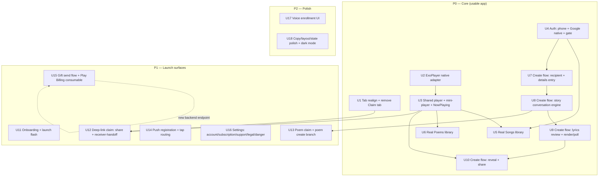

> **⚠️ SUPERSEDED (2026-07-05).** The Skip Fuse approach in this plan is retired. Android
> parity now ships as **pure-native Kotlin/Compose** — see
> `docs/plans/2026-07-05-001-feat-android-native-ios-parity-plan.md`. This document is kept
> only for its unit-level parity detail and the gap-ID → unit mapping; **do not execute it.**

# feat: Android → iOS Parity (Skip Fuse spike → full app)

**Target repo:** this repo. Android app lives in the worktree
`.worktrees/refactor-android/PorizoAndroid/`; iOS reference is `PorizoApp/`; shared
backend is `src/` (deployed at `api.porizo.co`). All Android paths below are
relative to `.worktrees/refactor-android/PorizoAndroid/`.

---

## Summary

The Porizo Android app is a **Skip Fuse spike** (12 Swift files, ~25 stub structs in one
`ContentView.swift`) that re-implements ~5–10% of the iOS app (287 files, ~80 screens) as
hand-written scaffolding to exercise native adapters. Reaching "exact iOS parity" is a
phased re-implementation, not a patch. This plan sequences that work **P0 core path →
P1 launch surfaces → P2 polish**, grounded in the verified gap register
(`docs/parity-2026-07/android-ios-parity-gaps.md`) and the iOS backend contracts.

Two facts de-risk the effort materially: the spike's `AndroidAPIClient` already wires much
of the API surface (auth, tracks, jobs, share, receiver-handoff, billing, enrollment), and
the backend **already supports Google Sign-In** via `/auth/social` — so most work is
**screens + client state + native adapters**, not backend or networking-from-scratch. The
one true blocker net-new dependency is an **audio playback engine** (ExoPlayer), which does
not exist anywhere in the spike and is required by Create-reveal, Songs, Poems, and Claim.

---

## Problem Frame

- **Actual state:** Android is a developer adapter test-bed. Explore/Songs/Poems are load-stubs, Claim is a hardcoded `"sarah-birthday"` demo tab, Settings is an adapter launcher. iOS is the full product.
- **Goal:** Android renders and behaves like iOS — same 4 tabs, same guided create flow, real library + playback, real auth, deep-link claim, gift/billing, and settings.
- **Non-negotiables:** shared backend unchanged where possible; Apple Sign-In is iOS-only so Android auth leads with **phone + Google**; the mock Claim tab must be removed and claim must become deep-link-only as on iOS.
- **Done definition (per phase):** P0 = a usable/sellable Android app (create a song end-to-end, play it, sign in, real library, 4 correct tabs). P1 = launch-ready (onboarding, claim loop, push, gift, real settings). P2 = visual/behavioral polish parity.

---

## Requirements Traceability

Every unit cites the gap-register IDs it closes (`X#`/`E#`/`C#`/`S#`/`P#`/`T#`/`R#` from
`docs/parity-2026-07/android-ios-parity-gaps.md`) and the backend contract it depends on.
The gap register is the source of truth for scope; this plan is the source of truth for
sequencing and approach.

---

## Key Technical Decisions

- **KTD1 — Android auth = phone-OTP primary + Google as co-primary; no Apple.** Backend `/auth/social` already accepts `provider:"google"` with an ID token or auth code (`src/routes/auth.js:1048-1100`, `GOOGLE_CLIENT_ID` configured). Phone endpoints exist (`/auth/phone/send-code|verify|register|link`). **No backend work for auth.** Google Sign-In is a new native bridge (Credential Manager / Google Identity) → get ID token → POST `/auth/social`. Rationale: Apple Sign-In can't ship on Android; both leading methods are already server-supported.
- **KTD2 — Single streaming player via a new ExoPlayer native adapter.** No audio engine exists in the spike. iOS runs two players (`AudioPlayerService` streaming + `PlayerState` metering); Android ships **one** ExoPlayer-backed adapter that accepts per-request HTTP headers (Bearer for owned content; pre-signed `stream_url` for shared). Skip the iOS vocal-onset metering hack. This adapter is a foundational P0 dependency.
- **KTD3 — Reuse the spike's native-adapter pattern verbatim** for every new native capability (Google Sign-In, ExoPlayer, contacts, share-sheet): `.kt` object under `Sources/PorizoSkipSpike/Skip/` (plain-string/bool signatures, pipe-delimited returns) + `#if SKIP` Swift free functions + `Sendable` struct with `#if os(Android)`/`#else` stub. Activity-scoped bridges wire into `MainActivity.onCreate/onResume/onDestroy` (`Android/app/src/main/kotlin/Main.kt:61-63,102-106,118-122`). (Pattern per `AndroidNativeAdapters.swift:3-315`.)
- **KTD4 — Keep the spike's state convention** (per-screen `@State`/`@AppStorage`, inline `AndroidAPIClient`, catch-into-status-string) for consistency, **except** introduce shared observable state for the two places iOS relies on cross-screen state: the **audio player** (mini-player persists across tabs) and the **create-flow state machine**. These two get `@Observable` models; everything else stays per-screen.
- **KTD5 — Story-driven create flow is primary** (matches iOS `WarmCanvasFlowView`), using `/story/*` endpoints, not the legacy `POST /tracks` path. Replicate the exact render-poll backoff (1/2/5/10/30s, 5-min preview / 6-min full cap), resume-before-start idempotency, and the error-taxonomy → message table (`Controllers/RenderController.swift`).
- **KTD6 — Fraunces serif uses the existing `ComposeView`/`ContentComposer` escape hatch** (`FrauncesTitle.swift`); do not fight SkipUI's font pipeline. Any other "SkipUI renders it wrong" case follows the same escape hatch. Accept Skip/Material rendering divergence where it occurs — pixel-match is the goal, not a gate (per user call-out).
- **KTD7 — Voice enrollment ("My Voice") is P2 stub-to-parity.** Voice-cloning tech is not shipped (per project memory); the recorder adapter exists but the enrollment UI is deferred. Create-flow voice selection ships AI voices (Female/Male) in P0; "My Voice" is a disabled/"coming soon" chip until P2.
- **KTD8 — Wire format discipline:** explicit snake_case `CodingKeys` per model (no blanket converter), empty POST bodies as literal `"{}"`, treat HTTP **422 on `/story/confirm` as "needs input"** not error, per-endpoint timeouts (story 120–180s, lyrics 60s), and single-flight token refresh with definitive-vs-transient error classification. (All per the spike's existing `AndroidAPIClient` conventions + iOS contract report.)

---

## High-Level Technical Design

### Phase dependency graph



### Native-adapter pattern (applied to every new capability — KTD3)

```text
Sources/PorizoSkipSpike/Skip/PorizoNative<Cap>Bridge.kt   # Kotlin object, package porizo.skip.spike
        (plain String/Bool signatures, pipe-delimited returns; setActivity() if foreground-scoped)
Android/app/src/main/kotlin/Main.kt                        # wire setActivity into onCreate/onResume/onDestroy (if scoped)
Sources/PorizoSkipSpike/Android<Cap>.swift  #if SKIP       # free funcs calling the Kotlin object by name
        + Sendable struct  #if os(Android) real / #else stub
skip.yml                                                   # one implementation(...) line for the Gradle dep
```

This is directional guidance mirroring `AndroidNativeAdapters.swift`, not a spec.

---

## Implementation Units

Grouped by phase. U-IDs are stable; dependencies cite U-IDs. Android paths are relative to
`.worktrees/refactor-android/PorizoAndroid/`. All test file paths are Android XCTest/Skip
test targets unless noted; where behavior is UI-state-machine logic, prefer testing the
pure state/reducer functions extracted from the view.

> **Execution note (whole plan):** the spike has no test target yet. **U1 must also stand up the Swift test target** (`Tests/PorizoSkipSpikeTests/`) wired into `Package.swift`, so subsequent units have somewhere to land tests. Until then, units marked test-first assume that target exists.

---

### U1. Tab realignment: 4 tabs, remove mock Claim tab, add test target

**Goal:** Match iOS's 4-tab structure (Home/Songs/Poems/Settings), delete the `"sarah-birthday"` Claim tab, and rename "Explore"→"Home". Stand up the test target.
**Closes:** X1, X2, E6 (labels). **Depends:** none.
**Files:**

- `Sources/PorizoSkipSpike/ContentView.swift` (edit `ContentTab` enum `:24-48`, `AndroidBottomTabBar` `:121-155`, `currentTabView` switch `:78-101`; delete `RecipientClaimView` `:513-774` and `RecipientHeroCard` `:776-812` from tab routing — retain claim code only if reused by U12, otherwise remove)
- `Sources/PorizoSkipSpike/ViewModel.swift` (remove `.recipient` from tab model; keep `ClaimState`/`LinkRoute` only if U12 needs them)
- `Package.swift` (add test target)
- `Tests/PorizoSkipSpikeTests/TabModelTests.swift` (new)
  **Approach:** `ContentTab` becomes `home/songs/poems/settings`. First tab label "Home", house icon. Claim is no longer a tab — its deep-link routing (`consumePendingDeepLink`) is preserved but re-pointed at a sheet in U12, not a tab. Deleted `RecipientClaimView` fixture removes the hardcoded `"sarah-birthday"` demo.
  **Patterns to follow:** existing `ContentTab`/`AndroidBottomTabBar` structure; iOS `MainTabView.swift:79-102` for the canonical 4-tab shape.
  **Test scenarios:**
- Tab model exposes exactly 4 cases in order home, songs, poems, settings. Covers X2.
- No tab case maps to a "Claim"/recipient screen. Covers X1.
- First tab title is "Home" with house symbol.
  **Verification:** app builds and runs on emulator; bottom bar shows 4 tabs; no Claim tab; Explore reads "Home".

---

### U2. ExoPlayer native audio adapter

**Goal:** A single streaming audio engine with per-request HTTP headers — the foundational playback dependency.
**Closes:** X5 (engine half). **Depends:** none (parallel with U1).
**Files:**

- `Sources/PorizoSkipSpike/Skip/PorizoNativeAudioBridge.kt` (new — ExoPlayer wrapper: `prepare(url, headersJson)`, `play/pause/seek(ms)`, `currentPositionMs()/durationMs()/isPlaying()`, `release()`; emits state via polled getters, pipe-delimited)
- `Sources/PorizoSkipSpike/AndroidAudioPlayer.swift` (new — `#if SKIP` free funcs + `AndroidAudioPlayerProvider` Sendable struct with `#else` stub)
- `Android/app/src/main/kotlin/Main.kt` (wire `PorizoNativeAudioBridge.setActivity`/context into `onCreate/onResume/onDestroy` if it needs an Activity/Context; ExoPlayer needs `Context`)
- `Sources/PorizoSkipSpike/Skip/skip.yml` (add `androidx.media3:media3-exoplayer` + `media3-common` deps)
- `Tests/PorizoSkipSpikeTests/AudioHeaderTests.swift` (new — header JSON encode + URL transform)
  **Approach:** Kotlin object holds one `ExoPlayer` instance; `prepare` builds a `MediaItem` with a `DefaultHttpDataSource.Factory` carrying the passed headers (Bearer for owned, none for pre-signed). Swift side owns URL transform (relative→absolute against `apiBaseURL`, mirror iOS `transformAudioUrl`). Position/duration polled by the shared player model (U3).
  **Patterns to follow:** `PorizoNativeRecorderBridge.kt` (Activity/Context wiring + pipe-delimited returns), KTD3 three-file shape.
  **Test scenarios:**
- Owned-content header map contains `Authorization: Bearer <token>` and nothing else.
- Shared-content prepare passes an empty header map (pre-signed URL).
- Relative stream path transforms to absolute against `apiBaseURL`; absolute URL passes through unchanged.
- `Test expectation:` ExoPlayer playback itself is device-validated manually (no unit harness for native media).
  **Verification:** a known audio URL streams and reports advancing position on the emulator.

---

### U3. Shared player model + persistent mini-player + NowPlaying screen

**Goal:** Cross-tab playback state, a mini-player bar on every tab, and a full NowPlaying screen — matching iOS.
**Closes:** X5 (UI half). **Depends:** U2.
**Files:**

- `Sources/PorizoSkipSpike/AndroidPlayerModel.swift` (new — `@Observable` `AndroidPlayerModel`: currentTrack, isPlaying, position/duration, play(track)/toggle/seek, drives U2 adapter, timer-polls position)
- `Sources/PorizoSkipSpike/ContentView.swift` (inject player model at root; render `MiniPlayerBar` above `AndroidBottomTabBar` when a track is loaded; present `NowPlayingView` sheet)
- `Sources/PorizoSkipSpike/Views/MiniPlayerBar.swift` (new)
- `Sources/PorizoSkipSpike/Views/NowPlayingView.swift` (new — artwork, title/"For {recipient}", scrubber, transport, lyrics list)
- `Tests/PorizoSkipSpikeTests/PlayerModelTests.swift` (new)
  **Approach:** One `@Observable` model owned at root (KTD4 exception). Mini-player tap opens NowPlaying. Lyrics list is static display in P0 (synced highlight deferred to P2). Reuse `PorizoSectionCard`/tokens.
  **Patterns to follow:** iOS `MiniPlayerBar.swift`, `NowPlayingView.swift`, `PlayerState.swift`; spike design components.
  **Test scenarios:**
- Loading a track sets currentTrack and shows the mini-player; clearing hides it.
- toggle() flips isPlaying and calls the adapter.
- seek(fraction) maps to correct millisecond position against duration.
- position poll updates observable progress without exceeding duration.
  **Verification:** play a track from Songs → mini-player appears on all tabs → tap → NowPlaying opens and scrubs.

---

### U4. Auth: phone OTP + native Google Sign-In + app auth gate

**Goal:** Real sign-in (phone + Google) with token/session lifecycle, gating library/create.
**Closes:** X7, T1 (sign-in half). **Depends:** none for phone (client wired); Google needs U-local native bridge.
**Files:**

- `Sources/PorizoSkipSpike/Skip/PorizoNativeGoogleSignInBridge.kt` (new — Credential Manager / Google Identity → returns ID token string or `ERR|<reason>`)
- `Sources/PorizoSkipSpike/AndroidGoogleSignIn.swift` (new — `#if SKIP` funcs + `AndroidGoogleSignInProvider` Sendable struct)
- `Sources/PorizoSkipSpike/Skip/skip.yml` (add `androidx.credentials:credentials` + `googleid` deps)
- `Android/app/src/main/kotlin/Main.kt` (Activity wiring for the sign-in bridge)
- `Sources/PorizoSkipSpike/AndroidAPIClient.swift` (add `/auth/social`, `/auth/refresh`, `/auth/me`, `/auth/logout`, `/auth/phone/link` if missing; single-flight refresh + definitive-vs-transient error classification per KTD8)
- `Sources/PorizoSkipSpike/AndroidAPIModels.swift` (add `AuthResponse`, `RefreshResponse`, `AuthUser`, `VerifyPhoneCodeResponse`, `AccountExistsResponse`, `LinkConfirmationResponse`)
- `Sources/PorizoSkipSpike/AndroidAuthModel.swift` (new — `@Observable` auth state: idle→phoneEntry→verify→profile|accountExists|authenticated; token refresh scheduler)
- `Sources/PorizoSkipSpike/Views/AuthView.swift` (new — Google button + "Continue with phone"; phone entry/verify/profile screens)
- `Tests/PorizoSkipSpikeTests/AuthStateMachineTests.swift`, `TokenRefreshTests.swift` (new)
  **Approach:** Google → native ID token → `POST /auth/social {provider:"google", id_token}` → tokens. Phone → existing `/auth/phone/*`. Handle `LinkConfirmationResponse` (re-POST `confirm_link:true`) and `AccountExistsResponse`. Single-flight refresh with a lock; classify `TOKEN_REUSE_DETECTED`/`REVOKED`/`EXPIRED` as hard logout, `TOKEN_ALREADY_ROTATED` as re-check.
  **Execution note:** implement the refresh classifier and phone state machine test-first — token-rotation edge cases are the risk.
  **Patterns to follow:** iOS `AuthManager.swift`, `APIClient+Auth.swift`; spike's existing phone endpoints + `AndroidSessionStore`.
  **Test scenarios:**
- Existing-user phone verify returns tokens → state = authenticated. Covers X7.
- New-user phone verify returns only `registration_token` → state = profileEntry → register → authenticated.
- `AccountExistsResponse` on register → state = accountExists (prompt to use existing method).
- Google ID token → `/auth/social` success → authenticated; `LinkConfirmationResponse` → re-POST with `confirm_link` → authenticated.
- Refresh: `TOKEN_REUSE_DETECTED` → hard logout; `TOKEN_ALREADY_ROTATED` → re-check cached token, no logout; concurrent refresh calls collapse to one network call (single-flight).
- Every authenticated request carries `Authorization: Bearer`.
  **Verification:** sign in with phone and with Google on the emulator; token persists across relaunch; expired token silently refreshes.

---

### U5. Real Songs library

**Goal:** Replace the "Load songs" stub with a real library list, states, and playback.
**Closes:** S1–S5, E4 (recent songs share the card). **Depends:** U3 (play), U4 (auth).
**Files:**

- `Sources/PorizoSkipSpike/ContentView.swift` (rewrite `SongsView` `:369-437`)
- `Sources/PorizoSkipSpike/AndroidAPIClient.swift` (`GET /tracks/:id` if missing; ensure `GET /tracks` list)
- `Sources/PorizoSkipSpike/AndroidAPIModels.swift` (extend `PorizoTrackSummary`/add `PorizoTrackVersion` fields: status, preview_url/full_url, library_origin, can_* flags, cover urls)
- `Sources/PorizoSkipSpike/Views/SongCardView.swift` (reuse/extend `SongSummaryCard`)
- `Tests/PorizoSkipSpikeTests/SongLibraryTests.swift` (new)
  **Approach:** My/Received filter; loading/empty/error states; per-card status badge (map `status`; only `"failed"` is explicitly branched, others = in-progress until a URL appears); play via U3; menu for Resume/Share/Delete (Resume routes into U7–U10 create flow; Share/claim deep to U12/U15). Render polling for in-flight tracks reuses the spike's `AndroidRenderPollStore`.
  **Patterns to follow:** iOS `MySongsView.swift`; spike `SongSummaryCard`, `PorizoEmptyStateCard`.
  **Test scenarios:**
- `GET /tracks` list renders N `SongCard`s; empty list → "Create your first song" empty state. Covers S1, S4.
- Filter toggles My (own) vs Received (`library_origin=="received"`). Covers S2.
- `status=="failed"` → Failed badge; ready (has `preview_url`/`full_url`) → play enabled. Covers S1.
- Tapping a ready card's play routes to U3 player with correct stream URL + Bearer.
- Delete calls `DELETE /tracks/:id` after confirm and removes the row.
  **Verification:** sign in → Songs loads real library from `api.porizo.co` → play a ready track.

---

### U6. Real Poems library

**Goal:** Replace the "Load poems" stub with a real poem library + detail + TTS listen.
**Closes:** P1–P3, P6. **Depends:** U3 (TTS playback), U4 (auth).
**Files:**

- `Sources/PorizoSkipSpike/ContentView.swift` (rewrite `PoemsView` `:438-512`)
- `Sources/PorizoSkipSpike/AndroidAPIClient.swift` (add `GET /poems/:id`, `POST /poems/:id/audio`, `GET /poems/:id/audio` URL builder, `DELETE /poems/:id`)
- `Sources/PorizoSkipSpike/AndroidAPIModels.swift` (add `Poem` full model, `GetPoemResponse`, `PoemAudioResponse`)
- `Sources/PorizoSkipSpike/Views/PoemDetailView.swift` (new — verses, Listen, Share, action menu)
- `Tests/PorizoSkipSpikeTests/PoemLibraryTests.swift` (new)
  **Approach:** List `PoemSummaryCard`s → tap → detail (verses italic, ornament) → Listen generates TTS (`POST /poems/:id/audio`, idempotent) then streams via U3; Share routes to U13 poem-share; action menu (Listen/Share/Copy/Remove/Variation). My/Received filter + empty/loading/error.
  **Patterns to follow:** iOS `PoemFullView.swift`, `PoemActionMenu.swift`; spike `PoemSummaryCard`.
  **Test scenarios:**
- `GET /poems` renders cards; empty → "Create your first poem". Covers P1.
- Detail shows verses + recipient + occasion. Covers P2.
- Listen calls `POST /poems/:id/audio` then plays `GET /poems/:id/audio` via U3. Covers P2.
- Copy Text puts verses on clipboard; Remove calls `DELETE /poems/:id`. Covers P3.
  **Verification:** Poems loads real library → open a poem → Listen plays TTS.

---

### U7. Create flow: recipient + details entry (wizard entry)

**Goal:** The recipient-first entry — "Who's this song for?" (contacts or typed name) → occasion + Song/Poem toggle — replacing the static Explore.
**Closes:** E1 (entry), C1, C2. **Depends:** U4 (auth to create).
**Files:**

- `Sources/PorizoSkipSpike/AndroidCreateFlowModel.swift` (new — `@Observable` create state machine: `.entry(nameStep|detailsStep) → .conversing → .lyrics → .wait → .reveal → .share`; KTD4 exception)
- `Sources/PorizoSkipSpike/Views/CreateFlow/CreateEntryView.swift` (new — name/contacts + occasion chips + type toggle)
- `Sources/PorizoSkipSpike/Skip/PorizoNativeContactsBridge.kt` + `AndroidContacts.swift` (new — contact picker returning name+phone; graceful "type instead" fallback)
- `Sources/PorizoSkipSpike/ContentView.swift` (Home "Create for someone special" + occasion chips launch this flow as a full-screen cover)
- `Tests/PorizoSkipSpikeTests/CreateFlowEntryTests.swift` (new)
  **Approach:** Home CTA and occasion chips both open the create cover, seeding preselected occasion/type. Contacts capture name+phone (enables one-tap send later, C13); "Just type a name" is the deterministic fallback. State machine transitions to `.conversing` on details "Next".
  **Patterns to follow:** iOS `InlineNamePromptView.swift`, `ExploreTabView.swift:151,199-243`.
  **Test scenarios:**
- Home CTA opens create cover at name step. Covers E1, C1.
- Occasion chip opens cover with that occasion preselected → details step. Covers E2, C2.
- Typed name + Continue advances to details; details + Next transitions state to `.conversing`.
- Contact-picked name+phone populates recipient and is retained for send.
  **Verification:** tap "Create for someone special" → name → occasion/type → conversation starts.

---

### U8. Create flow: story conversation engine

**Goal:** The AI conversation ("tell your story") — the heart of the product.
**Closes:** C3, C4. **Depends:** U7.
**Files:**

- `Sources/PorizoSkipSpike/AndroidAPIClient.swift` (add `/story/start`, `/story/:id/continue` (with `expected_session_version`), `/story/:id/review`, `/story/:id/summary`, `/story/:id/confirm` [**422 = needs-input**], `/story/:id/lyrics`, `/story/:id/to-track`)
- `Sources/PorizoSkipSpike/AndroidAPIModels.swift` (add `StartStoryV2Response`, `ContinueStoryV2Response`, `StorySummaryV2Response`, `StoryGuidanceResponse`, `ConfirmStoryV2Response`, `StoryLyricsResponse`, `StoryToTrackResponse`)
- `Sources/PorizoSkipSpike/Views/CreateFlow/StoryConversationView.swift` (new — chat bubbles, text input, speech input button; inline occasion/style pickers)
- `Sources/PorizoSkipSpike/Skip/PorizoNativeSpeechBridge.kt` + `AndroidSpeech.swift` (new — mic → transcript, optional in P0; text input is the floor)
- `Sources/PorizoSkipSpike/AndroidCreateFlowModel.swift` (extend with conversation state)
- `Tests/PorizoSkipSpikeTests/StoryEngineTests.swift` (new)
  **Approach:** `POST /story/start` seeds the session; each user turn → `POST /story/:id/continue` with the session version guard; on `canOfferUserFinish`, show style picker (song) or "Create poem"; confirm via `/story/:id/confirm` treating **422 as `.needsInput`** (decode `StoryGuidanceResponse`), 200 as `.confirmed`. Speech is additive; if the bridge is deferred, text input alone satisfies the floor.
  **Execution note:** implement the confirm-response branching (200 vs 422 vs error) test-first — the 422-is-not-an-error contract is the top correctness risk (KTD8).
  **Patterns to follow:** iOS `WarmCanvasFlowView.swift` tell-phase + `V2StoryEngine`, `APIClient+Story.swift`.
  **Test scenarios:**
- start → continue loop appends bubbles; `expected_session_version` sent and incremented. Covers C3.
- confirm returns **422** → state `.needsInput` with guidance decoded (not an error surface). Covers KTD8.
- confirm returns 200 → state advances toward lyrics.
- style picker appears only when `canOfferUserFinish` and type==song. Covers C4.
- empty POST bodies serialize as `"{}"`.
  **Verification:** hold a real conversation against `api.porizo.co`, reach the confirm/finish state.

---

### U9. Create flow: lyrics review + render + poll

**Goal:** Lyrics review (per-section, regenerate, approve) then preview/full render with the exact iOS polling contract.
**Closes:** C6, C7, C11, C12, C5 (AI-voice chips only; My Voice deferred per KTD7). **Depends:** U8.
**Files:**

- `Sources/PorizoSkipSpike/AndroidAPIClient.swift` (add `/tracks/:id/versions/:n/lyrics/approve`, `/render_preview`, `/render_full`, `/retry`, `PATCH /voice_mode`; job polling reuse)
- `Sources/PorizoSkipSpike/AndroidRenderController.swift` (new — port iOS backoff 1/2/5/10/30s, 5-min preview / 6-min full caps, resume-before-start via `GET /tracks/:id`, transient-failure fallback after 3 misses, error-taxonomy→message map)
- `Sources/PorizoSkipSpike/Views/CreateFlow/LyricsReviewView.swift` + `WaitView.swift` (new)
- `Sources/PorizoSkipSpike/Views/CreateFlow/VoiceSelectionView.swift` (new — Female/Male chips; "My Voice" disabled "coming soon" per KTD7)
- `Tests/PorizoSkipSpikeTests/RenderControllerTests.swift` (new)
  **Approach:** `/story/:id/lyrics` → review card → approve → `render_preview` → poll `/jobs/:id` on the exact backoff → on `completed`, re-fetch `GET /tracks/:id` for the URL → `.reveal`. Persist `PorizoPendingRender` each non-terminal poll (spike store) for resume idempotency. Port the error-code→friendly-message table.
  **Execution note:** port the render-poll state machine test-first — the backoff schedule, terminal-status set (`completed|failed|dead_letter|blocked`), and resume-before-start are exact-contract items.
  **Patterns to follow:** iOS `Controllers/RenderController.swift`; spike `AndroidRenderPollStore`, `pollRenderWithRetry`.
  **Test scenarios:**
- Poll backoff yields 1,2,5,10,30,30… by elapsed bucket.
- `completed` job → triggers `GET /tracks/:id` fetch (URL not trusted from job payload). Covers C7.
- `dead_letter`/`blocked` treated as terminal failure like `failed`, surfacing `error_message`.
- 3 consecutive poll network errors → fallback `GET /tracks/:id` before erroring.
- Resume: existing `preview_url` → immediate complete; existing `job_id` no URL → resume that poll, no new render call. Covers C12.
- `error_code=INSUFFICIENT_CREDITS` maps to paywall CTA; a policy error shows "Edit Lyrics" CTA. Covers C11.
- Approve lyrics posts to the approve endpoint with `"{}"` body.
  **Verification:** approve lyrics → preview renders → progress updates → reveal opens with a playable URL.

---

### U10. Create flow: reveal + share

**Goal:** The reveal (artwork, play, "Send to {name}", listen-with-lyrics) and the share postcard (link+PIN, per-app grid).
**Closes:** C8, C9, C10, C13, E1 (completes). **Depends:** U9, U3 (playback), U12/share endpoints for link creation.
**Files:**

- `Sources/PorizoSkipSpike/Views/CreateFlow/RevealView.swift` + `SharePostcardView.swift` (new)
- `Sources/PorizoSkipSpike/AndroidAPIClient.swift` (`POST /tracks/:id/share` for link+PIN; share-info reused from U12)
- `Sources/PorizoSkipSpike/Skip/PorizoNativeShareBridge.kt` + `AndroidShare.swift` (new — Android system share sheet + per-app intents: SMS/WhatsApp/IG/etc. with graceful fallback)
- `Sources/PorizoSkipSpike/AndroidDirectSend.swift` (new — one-tap send when phone captured in U7)
- `Tests/PorizoSkipSpikeTests/ShareFlowTests.swift` (new)
  **Approach:** Reveal plays via U3, offers "Send to {name}" (direct SMS if phone on file, else share sheet) and "Listen with lyrics" (NowPlaying). Share creates a link via `POST /tracks/:id/share` (lifetime — no urgency copy per project memory) and renders link+PIN + per-app targets via the native share bridge.
  **Patterns to follow:** iOS `RevealBloomView.swift`, `SharePostcardView.swift`, `DirectSendModel.swift`.
  **Test scenarios:**
- Reveal Play routes to U3 with the rendered URL. Covers C8, C10.
- "Send to {name}" uses direct SMS intent when phone captured; else opens share sheet. Covers C13.
- `POST /tracks/:id/share` returns share_url + claim_pin; UI shows both without expiry-urgency copy. Covers C9.
- Copy-link target puts the share URL on the clipboard.
  **Verification:** full run — Home → conversation → lyrics → render → reveal → play → share link created, end-to-end on `api.porizo.co`.

---

### U11. Onboarding + launch flash

**Goal:** Port the question-graph onboarding + launch flash shown before the tabs.
**Closes:** X3. **Depends:** U4 (onboarding may seed a first-create recipient → auth).
**Files:**

- `Sources/PorizoSkipSpike/Views/Onboarding/OnboardingView.swift` (new — question graph; recipient-name capture)
- `Sources/PorizoSkipSpike/AndroidOnboardingModel.swift` (new — graph engine + completion gate via `@AppStorage`)
- `Sources/PorizoSkipSpike/ContentView.swift` (root routes splash→onboarding→tabs; skip when already completed)
- `Tests/PorizoSkipSpikeTests/OnboardingGraphTests.swift` (new)
  **Approach:** Port the graph shape from iOS `OnboardingV2View`/`QuestionGraphEngine` (simplify branches as needed). Completion persists; recipients captured here seed the pending-suggestion card (E5) and a pre-filled create.
  **Patterns to follow:** iOS `Onboarding/OnboardingV2View.swift`, `QuestionGraphEngine.swift`.
  **Test scenarios:**
- Fresh install shows onboarding; completion flag routes straight to tabs next launch. Covers X3.
- Answering the graph reaches a terminal completion node and records completion.
- Captured recipient name persists into the create-flow seed.
  **Verification:** fresh install → onboarding → tabs; relaunch skips onboarding.

---

### U12. Deep-link claim: share + receiver-handoff (replaces mock Claim tab)

**Goal:** Real deep-link-triggered claim (track share + opaque receiver-handoff), presented as a sheet — not a tab.
**Closes:** X1 (completes the replacement), X4, R1, R2. **Depends:** U1 (routing hook), U3 (playback), U4 (sign-in-to-claim).
**Files:**

- `Sources/PorizoSkipSpike/AndroidDeepLink.swift` (route `.share`/`.receiverHandoff` to a claim sheet instead of a tab)
- `Sources/PorizoSkipSpike/Views/Claim/ShareClaimView.swift` + `ReceiverClaimView.swift` (new — server-driven state, replacing the deleted fixture)
- `Sources/PorizoSkipSpike/AndroidAPIClient.swift` (ensure `GET /share/:id`, `POST /share/:id/claim`, `GET /share/:id/stream`, `GET /receiver-handoff/:id`, `POST /receiver-claim/:token`, `GET /receiver-claim/:token/stream`; device-token lifecycle + single-retry-on-401)
- `Sources/PorizoSkipSpike/AndroidReceiverDraftStore.swift` (new — persist opaque `receiverHandoffId` across install→login→claim)
- `Tests/PorizoSkipSpikeTests/ClaimFlowTests.swift` (new)
  **Approach:** Deep link → resolve → claim sheet. Track share uses `x-device-id`+`x-device-token`; receiver-handoff uses `x-device-token` + `device_id` in body; sign-in-to-claim uses Google (Android). Preview-before-claim streams the web/pre-signed URL via U3; claim binds the device. Honest lifetime copy ("keep it forever").
  **Execution note:** device-token single-retry-on-401 (`INVALID_DEVICE_TOKEN`/`SIGN_IN_REQUIRED`) is a contract item — test-first.
  **Patterns to follow:** iOS `ShareClaimView.swift`, `ReceiverClaimView.swift`, `APIClient+Share.swift`; spike's already-wired share methods.
  **Test scenarios:**
- `porizo://receiver-handoff/<id>` resolves via `GET /receiver-handoff/:id` then presents claim sheet (no Claim tab). Covers X1, X4, R2.
- Track-share link → `GET /share/:id` drives state (unbound→claimable→claimed); claim sends `x-device-token`. Covers R1.
- 401 `INVALID_DEVICE_TOKEN` on claim → re-register device → retry once.
- Signed-out claim shows Google sign-in in-sheet, then claims.
- Opaque `receiverHandoffId` persists across a simulated install→login→claim gap.
  **Verification:** open a real share link on the emulator → preview → sign in → claim → track appears in library.

---

### U13. Poem claim + poem create branch

**Goal:** Poem-share claim and the poem branch of the create flow.
**Closes:** R3, P4, P5. **Depends:** U8 (create engine), U12 (claim scaffolding).
**Files:**

- `Sources/PorizoSkipSpike/Views/Claim/PoemClaimView.swift` (new)
- `Sources/PorizoSkipSpike/Views/CreateFlow/PoemCreatingView.swift` + `PoemPreviewView.swift` + `PoemShareView.swift` (new)
- `Sources/PorizoSkipSpike/AndroidAPIClient.swift` (`POST /poems/:id/share`, `GET /poem-share/:id`, `POST /poem-share/:id/claim`; poem create via `/story/:id/to-poem` or `POST /poems`)
- `Tests/PorizoSkipSpikeTests/PoemClaimTests.swift` (new)
  **Approach:** Poem create reuses the U8 conversation, branching to poem generation (gap-question handling) → preview → share. Poem claim mirrors U12 with poem endpoints (Bearer + optional device-token).
  **Patterns to follow:** iOS `PoemClaimView.swift`, `PoemCreatingView.swift`, `PoemShareView.swift`.
  **Test scenarios:**
- Poem-share link → `GET /poem-share/:id` → reveal → PIN → claimed. Covers R3.
- Poem create path produces verses and reaches preview. Covers P4.
- Poem share creates a link + renders share options. Covers P5.
  **Verification:** create a poem end-to-end and claim a shared poem on the emulator.

---

### U14. Push registration + tap routing

**Goal:** Register for push (OneSignal already wired) and route notification taps to the right screen.
**Closes:** X6. **Depends:** U4 (user identity), U5/U10 (track reveal target).
**Files:**

- `Sources/PorizoSkipSpike/AndroidNativeAdapters.swift` / `Skip/PorizoNativePushBridge.kt` (ensure token registration posts to backend; add tap-payload callback)
- `Sources/PorizoSkipSpike/AndroidPushRouting.swift` (new — parse render-complete/recipient-played payloads → route to track reveal)
- `Android/app/src/main/kotlin/Main.kt` (forward notification-open intents)
- `Tests/PorizoSkipSpikeTests/PushRoutingTests.swift` (new)
  **Approach:** OneSignal token → backend register; tap payload (render-complete) opens the track's reveal/NowPlaying. Delivery config (FCM/OneSignal dashboard) is external (see Risks).
  **Patterns to follow:** iOS `PushPayloadParser.swift`, `MainTabView.swift:273-290` tap routing; spike `AndroidPushProvider`.
  **Test scenarios:**
- Render-complete payload parses to a trackId and routes to that track's reveal. Covers X6.
- Recipient-played payload parses without crashing (informational).
- `Test expectation:` actual delivery is device+dashboard validated (external).
  **Verification:** a test push tap opens the correct track (once OneSignal delivery is configured).

---

### U15. Gift send flow + Play Billing consumable

**Goal:** The gift send flow (create → address → send) and token purchase via Play Billing.
**Closes:** E3, T2/T3 (billing). **Depends:** U7–U10 (gift content reuses create), U4 (auth). **New backend dependency.**
**Files:**

- `Sources/PorizoSkipSpike/Views/Gift/GiftSendFlowView.swift` + `GiftBagView.swift` (new)
- `Sources/PorizoSkipSpike/AndroidNativeAdapters.swift` / `Skip/PorizoNativeBillingBridge.kt` (consumable purchase + receipt)
- `Sources/PorizoSkipSpike/AndroidAPIClient.swift` (subscription receipt `/billing/receipt/google` exists; **add the new consumable-receipt endpoint call once backend ships it**)
- `src/routes/` (**backend: new Google consumable-receipt validation endpoint** — no iOS/Play equivalent exists yet)
- `Tests/PorizoSkipSpikeTests/GiftFlowTests.swift` (new)
  **Approach:** Gift content reuses the create flow (`isGiftContext`), then composer (recipient/sender/message/timing) → send. Token purchase uses Play Billing consumables; **this needs a new backend endpoint** to validate Google consumable receipts (only subscription validation exists today).
  **Patterns to follow:** iOS `Flows/GiftSendFlowView.swift`, `Views/GiftBagView.swift`; spike `AndroidPlayBillingProvider`.
  **Test scenarios:**
- Gift composer collects recipient/sender/message/timing and submits. Covers E3.
- Consumable purchase → receipt → backend validation → credit balance increments. Covers T3.
- `Test expectation:` real Play purchase is internal-testing-track validated (external).
  **Verification:** buy tokens via Play internal testing → balance updates → send a gift.

---

### U16. Settings: account / subscription / support / legal / danger

**Goal:** Turn the adapter-launcher Settings into a real user settings screen.
**Closes:** T1, T2, T4–T9. **Depends:** U4 (account/auth), U15 (subscription/gift).
**Files:**

- `Sources/PorizoSkipSpike/ContentView.swift` (rewrite `SettingsView`; gate dev "Backend target" behind `#if DEBUG`)
- `Sources/PorizoSkipSpike/Views/Settings/AccountManagementView.swift` + `SubscriptionView.swift` (new)
- `Sources/PorizoSkipSpike/AndroidAPIClient.swift` (`/auth/me`, `/auth/delete-account`, `/billing/plans`, `/billing/subscription-status`)
- `Tests/PorizoSkipSpikeTests/SettingsTests.swift` (new)
  **Approach:** Account (sign-in state, profile, delete two-step), Subscription (plans + Play Billing), Gift Bag (U15), Preferences (Appearance kept; Lyrics Style/Language/Launch Flash), Support (Help/Support/Invite), Legal (Terms/Privacy/Restore), Danger (Logout/Delete). Dev backend-target field hidden in release.
  **Patterns to follow:** iOS `SettingsTabView.swift`, `AccountManagementView.swift`.
  **Test scenarios:**
- Signed-in Account row shows profile; signed-out shows Sign In → U4. Covers T1.
- Delete Account requires two confirmations then `DELETE /auth/delete-account`. Covers T7.
- Backend-target field absent in a release build config. Covers T9.
- Logout clears session and returns to signed-out state.
  **Verification:** Settings shows real account/subscription/support/legal; delete + logout work.

---

### U17. Voice enrollment UI (P2, stub-to-parity)

**Goal:** The enrollment flow UI (consent → record → upload/QC → complete) over the existing recorder adapter.
**Closes:** T8, C5 (My Voice enabled). **Depends:** U9 (voice selection entry). **Gated by KTD7.**
**Files:**

- `Sources/PorizoSkipSpike/Views/Enrollment/EnrollmentFlowView.swift` (new)
- `Sources/PorizoSkipSpike/AndroidAPIClient.swift` (enrollment endpoints already wired: start/chunk/complete/profile)
- `Tests/PorizoSkipSpikeTests/EnrollmentTests.swift` (new)
  **Approach:** Consent → phrase-by-phrase record (existing `AndroidRecorderProvider`) → chunk upload → QC poll → complete → enable "My Voice" in U9. Ship only when voice-cloning is product-ready (KTD7); until then the U9 chip stays "coming soon".
  **Patterns to follow:** iOS `Flows/EnrollmentFlowView.swift`; spike `AndroidRecorderProvider`.
  **Test scenarios:**
- Record→upload→complete transitions drive the state machine to completed. Covers T8.
- Completion enables the "My Voice" option in create. Covers C5.
  **Verification:** record enrollment on the emulator → profile created → My Voice selectable.

---

### U18. Polish: copy/layout parity, states, dark mode

**Goal:** Close the visual/behavioral drift and wire dark mode.
**Closes:** E5, E6, P6 remainder, and cross-app polish. **Depends:** all prior UI units.
**Files:**

- `Sources/PorizoSkipSpike/DesignTokens.swift` (wire dark hex values; `.preferredColorScheme`)
- `Sources/PorizoSkipSpike/ContentView.swift` + views (copy/layout alignment, pending-suggestion card E5, skeleton loaders)
- `Tests/PorizoSkipSpikeTests/` (state/snapshot-ish assertions where feasible)
  **Approach:** Align copy/layout to iOS (Explore card set, "Your first song is free"), add skeleton loaders and the pending-suggestion nudge, feed real dark tokens (system-bar sync already exists). Accept residual Skip/Material divergence (KTD6).
  **Test scenarios:**
- `Test expectation: none — styling/copy.` Where a pending-suggestion state gates a card, assert the gating logic.
  **Verification:** side-by-side screenshots vs iOS show aligned copy/layout in light and dark.

---

## Scope Boundaries

**In scope:** all P0/P1/P2 units above — full functional parity across the 4 tabs, create flow, playback, auth, claim, gift, settings.

### Deferred to Follow-Up Work

- Lyric-synced highlight (vocal-onset metering) — iOS-specific heuristic; static lyrics ship in P0, sync is a later enhancement.
- Lock-screen/media-session rich metadata parity — nice-to-have after P0 playback.
- Full dark-mode token audit beyond the primary palette (per-component dark values).
- Font-weight variation on Android (single static Fraunces `.ttf` only; multi-weight `<font-family>` crashes on API 36 per `DesignTokens.swift:96-97`).

### Outside this plan

- Backend feature changes beyond the one new **Google consumable-receipt endpoint** (U15).
- iOS app changes (this is Android-only parity work).

---

## Risks & Dependencies

- **R-1 (blocker, U15):** Android gift **consumable** purchases need a **new backend endpoint** — only Google _subscription_ receipt validation (`/billing/receipt/google`) exists. Sequence the backend endpoint before U15 client work, or ship subscriptions-only first and defer consumables.
- **R-2 (external, U14/U15):** Push delivery (OneSignal/FCM dashboard) and Play Billing products (Play Console) require external configuration + real signing (`keystore.properties`, `assetlinks.json` for App Links `autoVerify`). Unit tests cover parsing/routing; delivery/purchase are device+console validated.
- **R-3 (Skip fidelity, KTD6):** SkipUI renders some SwiftUI wrong (fonts confirmed). Mitigation: the `ComposeView`/`ContentComposer` escape hatch. Accept residual Material divergence; pixel-match is a goal not a gate.
- **R-4 (contract exactness):** the render-poll state machine, 422-is-not-error, device-token retry, and token-refresh classification are exact-contract items — all carry test-first execution notes.
- **R-5 (Skip version pinning):** plan assumes the resolved Skip stack (`skip 1.9.4`, `skip-fuse-ui 1.17.2`, etc. from `Package.resolved`). A Skip upgrade mid-project could shift rendering/interop behavior; pin versions during the build-out.
- **Dependency — build/run:** Gradle build via Android Studio JBR + `ANDROID_HOME` + `GRADLE_USER_HOME=/private/tmp/porizo-gradle-cache`; debug APK at `.build/Android/app/outputs/apk/debug/app-debug.apk` (README.md:59-118).

---

## Phased Delivery

- **P0 (usable app):** U1, U2, U3, U4, U5, U6, U7, U8, U9, U10. Exit: create a song end-to-end, play it, real library, sign in, 4 correct tabs.
- **P1 (launch-ready):** U11, U12, U13, U14, U15, U16. Exit: onboarding, deep-link claim loop, push, gift/billing, real settings. (U15 gated on R-1 backend endpoint.)
- **P2 (polish):** U17, U18. Exit: voice enrollment (if product-ready), copy/layout/dark-mode parity.

---

## Sources & Research

- **Origin gap register:** `docs/parity-2026-07/android-ios-parity-gaps.md` (+ screenshots in `docs/parity-2026-07/screenshots/`), grounded in both apps running live.
- **iOS contracts:** endpoints/models/state machines from `PorizoApp/PorizoApp/APIClient+*.swift`, `AuthManager.swift`, `Controllers/RenderController.swift`, `Services/AudioPlayerService.swift`, and backend `src/routes/auth.js` (verified: Google + phone auth already server-supported).
- **Android spike architecture:** native-adapter three-file pattern, build/entry points, per-screen `@State` convention, and already-wired API surface from `.worktrees/refactor-android/PorizoAndroid/Sources/PorizoSkipSpike/*` and `Android/app/src/main/kotlin/Main.kt`.
- External research skipped: the spike's own source is the authoritative Skip-pattern reference and local grounding is strong; Skip versions pinned as assumptions (R-5).
