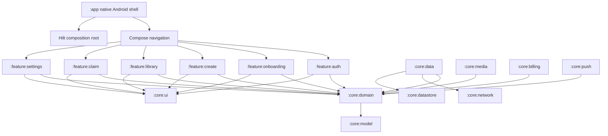
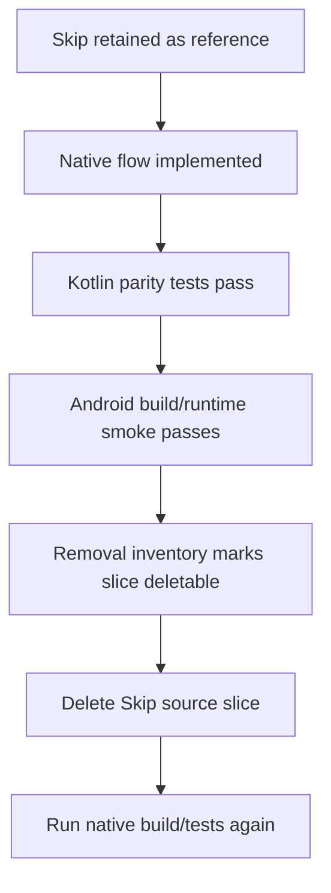

# Native Android Rewrite - Plan

## Goal Capsule

| Field | Value |
|---|---|
| Objective | Replace the Skip-based Android app with a native Kotlin/Jetpack Compose Android app that owns its architecture, build, DI, screens, flows, release config, and deletion path. |
| Authority | This plan supersedes Skip-hardening plans for the Android code path. iOS remains the visual and behavioral reference, but Android implementation becomes native Kotlin. |
| Execution profile | Sequential, dependency-ordered migration. Do not delete Skip production files until native equivalents pass their parity gates. |
| Stop conditions | Stop if a required backend contract is missing, if native Android cannot build without Skip after U1, or if porting reveals product behavior that contradicts iOS/source-of-truth flows. |
| Cleanup rule | Maintain a Skip removal inventory from the first unit. Move files from "retained reference" to "deleted" only after the corresponding native unit is verified. |

### Execution Status

| Unit | Status | Verification |
|---|---|---|
| U1 native Gradle shell and Skip inventory | Complete, committed as `be8c4fb7` | `:app:assembleDebug`; APK install/launch smoke on `emulator-5554`; no Skip Gradle/runtime references in active Android source. |
| U2 core model and domain contracts | Complete locally | `:core:domain:testDebugUnitTest`; `:app:assembleDebug`. |

---

## Product Contract

### Summary

This plan converts Android from a Skip-generated Swift/Android hybrid into a native Kotlin app. The migration preserves Porizo's current product flows while replacing the build system, dependency graph, UI state model, native integrations, and test surface with Android-first architecture.

### Problem Frame

The current Android app is not a conventional Android app. `PorizoAndroid/Android/settings.gradle.kts` prebuilds Skip plugins, `PorizoAndroid/Android/app/build.gradle.kts` applies `skip-build-plugin`, and most product logic lives under `PorizoAndroid/Sources/PorizoSkipSpike` as Swift/Skip source. That makes Hilt, modularization, Gradle testing, Compose architecture, and Android Studio workflows second-class because the canonical source is not Kotlin.

A pure Android rewrite is justified only if Android is a first-class product. The user has made that decision. The implementation must therefore stop optimizing the Skip bridge and instead create a native source of truth that can survive long-term Android maintenance, Play Store release work, billing, push, media playback, deep links, and accessibility.

### Requirements

**Native ownership**

- R1. Android production code must be Kotlin-first and must not depend on Skip-generated runtime, Swift package targets, or `PorizoSkipSpike` source for app launch.
- R2. The app must use a clean Android architecture: Compose UI, lifecycle-aware ViewModels, Kotlin coroutines/Flow, Hilt injection, repositories, and pure domain models.
- R3. The native Android build must be Android Studio friendly and should assemble without invoking `skip plugin`, `swift build`, or Skip-generated Gradle projects.

**Product parity**

- R4. Native screens must preserve the iOS-equivalent flows already ported or planned: auth, onboarding, create, render, library/player, claim/share, billing, push, storage, and settings.
- R5. Native Android must keep existing deep-link and app-link behavior for share, play, poem, poem-share, and receiver handoff links.
- R6. Native Android must keep app-only saving, share-once/device claim, user-voice constraints where supported, and backend auditability assumptions.

**Migration safety**

- R7. Skip files must be tracked in a removal inventory before deletion, with each retained/deleted state tied to a native parity gate.
- R8. Existing assets, package identity, signing behavior, release checklist knowledge, backend contracts, and useful Kotlin native bridge code should be reused where technically sound.
- R9. Swift/Skip tests should be treated as behavioral specifications and ported to Kotlin tests before their corresponding Skip source is deleted.

### Scope Boundaries

Native Android is in scope. iOS refactoring is out of scope except as source-reference reading for parity. Backend API changes are out of scope unless a native port exposes a blocking contract mismatch; those must be surfaced as blockers rather than silently worked around.

#### Deferred to Follow-Up Work

- Tablet-specific Android layouts beyond responsive Compose basics.
- New product features not already present in the iOS/Skip Android behavior.
- Full design-system reinvention. Native Android should match Porizo visual language first, then improve ergonomics after parity.

---

## Planning Contract

### Key Technical Decisions

- KTD1. Native Android is the source of truth. Keep the current Skip app as a temporary reference and fallback only until native parity gates pass.
- KTD2. Use official Android layered architecture. UI state flows from ViewModels to Compose, events flow back to ViewModels, data access goes through repositories, and domain models stay Android-free.
- KTD3. Use multi-module Gradle from the start. A monolithic Kotlin rewrite would recreate the current maintainability problem in a different language.
- KTD4. Use Hilt for app, ViewModel, repository, data-source, platform-service, and test replacement injection. Hilt belongs in native Android once Kotlin owns the graph.
- KTD5. Use vertical-flow parity gates. Port by complete user flow so each deleted Skip slice has a native replacement users can exercise.
- KTD6. Treat generated Skip output and Swift source as reference, not dependency. The native app may read/copy behavior and tests, but must not launch through Skip or call Swift/Skip runtime.

### High-Level Technical Design





### Output Structure

Expected native Android layout:

```text
PorizoAndroid/Android/
  settings.gradle.kts
  build.gradle.kts
  gradle/libs.versions.toml
  app/
  core/model/
  core/domain/
  core/data/
  core/network/
  core/datastore/
  core/ui/
  core/media/
  core/billing/
  core/push/
  feature/auth/
  feature/onboarding/
  feature/create/
  feature/library/
  feature/claim/
  feature/settings/
docs/android/
  skip-removal-inventory.md
```

### Assumptions

- The native app should keep the existing Android package identity unless a release/signing blocker is discovered.
- The current backend API is the contract; native Android should adapt to it rather than inventing Android-only endpoints.
- Existing Gradle/Skip files can be changed aggressively on the `refactor` branch because this branch is now the native rewrite path.

### Sources and Research

- Android app architecture guidance: https://developer.android.com/topic/architecture
- Android modularization guidance: https://developer.android.com/topic/modularization
- Hilt dependency injection guidance: https://developer.android.com/training/dependency-injection/hilt-android
- Android data-layer guidance: https://developer.android.com/topic/architecture/data-layer
- Android UI-layer guidance: https://developer.android.com/topic/architecture/ui-layer
- Current Skip-boundary map: `docs/architecture/android-skip-clean-architecture.md`
- Existing Skip Android plan references: `docs/plans/2026-06-30-001-feat-android-via-skip-plan.md`, `docs/plans/2026-06-30-002-feat-android-skip-parallel-agents-plan.md`, `docs/plans/2026-07-01-001-feat-android-design-replica-fidelity-plan.md`

---

## Implementation Units

### U1. Native Gradle Shell and Skip Inventory

- **Goal:** Replace the Skip-owned Gradle entry point with a native Android shell that can build independently, and create the tracked inventory of Skip files to retain or remove.
- **Requirements:** R1, R3, R7, R8
- **Dependencies:** None
- **Files:**
  - `PorizoAndroid/Android/settings.gradle.kts`
  - `PorizoAndroid/Android/build.gradle.kts`
  - `PorizoAndroid/Android/gradle/libs.versions.toml`
  - `PorizoAndroid/Android/app/build.gradle.kts`
  - `PorizoAndroid/Android/app/src/main/AndroidManifest.xml`
  - `PorizoAndroid/Android/app/src/main/kotlin/com/porizo/app/PorizoApplication.kt`
  - `PorizoAndroid/Android/app/src/main/kotlin/com/porizo/app/MainActivity.kt`
  - `PorizoAndroid/Android/app/src/main/kotlin/com/porizo/app/AppRoot.kt`
  - `docs/android/skip-removal-inventory.md`
- **Approach:** Remove the Skip plugin prebuild from Gradle settings, add standard Android/Kotlin/Hilt/Compose plugin management, keep the existing manifest permissions and deep-link filters, and make the app render a native placeholder shell. The inventory must classify Skip Swift source, Skip bridge Kotlin source, Skip package files, Darwin/Xcode files, generated build artifacts, and reusable assets.
- **Execution note:** This is mostly scaffolding and replacement of a generated build system; prefer compile/runtime smoke verification over unit tests.
- **Patterns to follow:** Preserve current manifest intent filters from `PorizoAndroid/Android/app/src/main/AndroidManifest.xml` and signing fallback behavior from `PorizoAndroid/Android/app/build.gradle.kts`.
- **Test scenarios:** Test expectation: no feature behavior yet. Verify the native app builds without invoking Skip and launches to a native Compose shell.
- **Verification:** `:app:assembleDebug` succeeds, no build output invokes `skip plugin` or `swift build`, app package installs/launches on emulator or physical device, and inventory exists.

### U2. Core Model and Domain Contracts

- **Goal:** Create native Kotlin domain models and repository/use-case interfaces for auth, create, render, library, claim, billing, push, storage, and player state.
- **Requirements:** R2, R4, R6, R9
- **Dependencies:** U1
- **Files:**
  - `PorizoAndroid/Android/core/model/src/main/kotlin/com/porizo/core/model/**`
  - `PorizoAndroid/Android/core/domain/src/main/kotlin/com/porizo/core/domain/**`
  - `PorizoAndroid/Android/core/domain/src/test/kotlin/com/porizo/core/domain/**`
  - `PorizoAndroid/Tests/PorizoSkipSpikeTests/*Tests.swift` as behavioral reference only
- **Approach:** Port value types and deterministic logic from the Swift tests into pure Kotlin modules first. Domain interfaces must not import Android framework APIs.
- **Execution note:** Port tests before deleting any equivalent Swift logic.
- **Patterns to follow:** `AndroidAPIModels.swift`, `AuthLogic.swift`, `ClaimLogic.swift`, `ShareLogic.swift`, `SongLibrary.swift`, `PoemLibrary.swift`, `StoryEngine.swift`, and `AndroidRenderController.swift`.
- **Test scenarios:** Auth token refresh classification, claim status mapping, share message construction, song/poem library filtering, render backoff and status mapping, onboarding graph decisions.
- **Verification:** Kotlin unit tests cover the deterministic behavior currently protected by Swift tests.

### U3. Data Layer, Network, and Session Storage

- **Goal:** Implement Retrofit/OkHttp or equivalent HTTP data sources, repositories, secure/session storage, and API error mapping behind the domain contracts.
- **Requirements:** R2, R4, R6, R8
- **Dependencies:** U2
- **Files:**
  - `PorizoAndroid/Android/core/network/src/main/kotlin/com/porizo/core/network/**`
  - `PorizoAndroid/Android/core/data/src/main/kotlin/com/porizo/core/data/**`
  - `PorizoAndroid/Android/core/datastore/src/main/kotlin/com/porizo/core/datastore/**`
  - `PorizoAndroid/Android/core/data/src/test/kotlin/com/porizo/core/data/**`
  - `PorizoAndroid/Android/core/network/src/test/kotlin/com/porizo/core/network/**`
- **Approach:** Map existing `AndroidAPIClient.swift` behavior into network data sources and repositories. Keep repositories main-safe and expose suspend functions or Flow where appropriate.
- **Patterns to follow:** `PorizoAndroid/Sources/PorizoSkipSpike/AndroidAPIClient.swift`, `AndroidSecureStore.swift`, `AndroidLocalStores.swift`.
- **Test scenarios:** Authenticated request header injection, refresh/retry behavior, JSON decoding for track/poem/share/render responses, API error envelope mapping, secure token persistence and clearing.
- **Verification:** Repository tests pass with fake HTTP responses and storage fakes.

### U4. Native UI System and Navigation Shell

- **Goal:** Build native Compose theme, typography, reusable controls, app navigation, bottom tabs, and app-level state holders.
- **Requirements:** R2, R4
- **Dependencies:** U1, U2
- **Files:**
  - `PorizoAndroid/Android/core/ui/src/main/kotlin/com/porizo/core/ui/**`
  - `PorizoAndroid/Android/app/src/main/kotlin/com/porizo/app/navigation/**`
  - `PorizoAndroid/Android/app/src/androidTest/kotlin/com/porizo/app/**`
- **Approach:** Recreate Porizo visual primitives natively using Material 3/Compose while preserving Fraunces fonts and current tab structure. State ownership should flow through ViewModels and navigation state, not global mutable singletons.
- **Patterns to follow:** `DesignTokens.swift`, `FrauncesTitle.swift`, `ContentView.swift`, `Views/CreateFlowView.swift`, iOS screens as parity reference.
- **Test scenarios:** App starts at correct initial route, bottom tabs use canonical order, theme renders light/dark basics, deep-link routes can be parsed into navigation destinations.
- **Verification:** Compose shell runs on emulator with accessible navigation and no Skip runtime.

### U5. Auth and Onboarding Native Flow

- **Goal:** Implement sign-in/session restoration and onboarding in native Compose/ViewModel architecture.
- **Requirements:** R2, R4, R6, R9
- **Dependencies:** U2, U3, U4
- **Files:**
  - `PorizoAndroid/Android/feature/auth/src/main/kotlin/com/porizo/feature/auth/**`
  - `PorizoAndroid/Android/feature/onboarding/src/main/kotlin/com/porizo/feature/onboarding/**`
  - `PorizoAndroid/Android/feature/auth/src/test/kotlin/com/porizo/feature/auth/**`
  - `PorizoAndroid/Android/feature/onboarding/src/test/kotlin/com/porizo/feature/onboarding/**`
- **Approach:** Port the auth model and onboarding graph into native ViewModels with `StateFlow`. Keep Google sign-in behind a platform interface and Hilt binding.
- **Patterns to follow:** `AndroidAuthModel.swift`, `AndroidOnboardingModel.swift`, `Views/AuthView.swift`, `Views/Onboarding/OnboardingView.swift`.
- **Test scenarios:** Existing session restores, expired session refreshes or logs out, onboarding answer transitions match graph, empty/long text states render, sign-in failures surface recoverable UI.
- **Verification:** Unit tests pass and emulator smoke can complete sign-in/onboarding fixture states.

### U6. Library, Player, and Media

- **Goal:** Implement songs, poems, playback, mini-player, now-playing, and owned/shared media access natively.
- **Requirements:** R4, R6, R9
- **Dependencies:** U2, U3, U4
- **Files:**
  - `PorizoAndroid/Android/core/media/src/main/kotlin/com/porizo/core/media/**`
  - `PorizoAndroid/Android/feature/library/src/main/kotlin/com/porizo/feature/library/**`
  - `PorizoAndroid/Android/feature/library/src/test/kotlin/com/porizo/feature/library/**`
  - `PorizoAndroid/Android/core/media/src/test/kotlin/com/porizo/core/media/**`
- **Approach:** Use Media3 for playback and repository-backed library ViewModels. Preserve bearer-header behavior for owned content and no-header behavior for shared content.
- **Patterns to follow:** `AndroidAudioPlayer.swift`, `AndroidPlayerModel.swift`, `MiniPlayerBar.swift`, `NowPlayingView.swift`, `SongLibrary.swift`, `PoemLibrary.swift`.
- **Test scenarios:** Player loads owned/shared track sources with correct headers, mini-player appears after load, seek/toggle behavior works, library filters mine/received correctly, poem preview fallback matches current behavior.
- **Verification:** Unit tests pass and emulator smoke plays a fixture or mocked media source without Skip.

### U7. Claim, Share, and Deep Links

- **Goal:** Implement native share/claim handling, app links, custom scheme links, receiver handoff, poem shares, clipboard/share sheet/SMS intents, and claim persistence.
- **Requirements:** R4, R5, R6, R9
- **Dependencies:** U2, U3, U4
- **Files:**
  - `PorizoAndroid/Android/feature/claim/src/main/kotlin/com/porizo/feature/claim/**`
  - `PorizoAndroid/Android/core/data/src/main/kotlin/com/porizo/core/data/claim/**`
  - `PorizoAndroid/Android/feature/claim/src/test/kotlin/com/porizo/feature/claim/**`
  - `PorizoAndroid/Android/app/src/main/AndroidManifest.xml`
- **Approach:** Port deep-link parsing and claim state machines first, then connect UI and Android intents. Keep claim retry/token refresh behavior explicit.
- **Patterns to follow:** `AndroidDeepLink.swift`, `AndroidClaimModel.swift`, `ShareClaimView.swift`, `AndroidShare.swift`, `ClaimLogic.swift`, `PoemClaimLogic.swift`.
- **Test scenarios:** Each current link shape parses to the correct route, unbound/claimed/revoked statuses map correctly, missing PIN prompts, device token retry fires only for intended auth errors, share sheet/SMS fallback uses correct message body.
- **Verification:** Unit tests pass and `adb am start` deep-link smoke opens the native claim route.

### U8. Create Flow and Render Lifecycle

- **Goal:** Implement native create flow, story conversation, lyrics review, poem branch, render polling, retry, wait, reveal, and share handoff.
- **Requirements:** R4, R6, R9
- **Dependencies:** U2, U3, U4, U7
- **Files:**
  - `PorizoAndroid/Android/feature/create/src/main/kotlin/com/porizo/feature/create/**`
  - `PorizoAndroid/Android/feature/create/src/test/kotlin/com/porizo/feature/create/**`
- **Approach:** Port the state machine from `AndroidCreateFlowModel.swift` into ViewModels and pure reducers where possible. Render polling should reuse domain backoff logic and persist resumable pending jobs.
- **Patterns to follow:** `AndroidCreateFlowModel.swift`, `AndroidRenderModel.swift`, `AndroidRenderController.swift`, `Views/CreateFlowView.swift`, current iOS create screens.
- **Test scenarios:** Name/details gates, contact adoption, story start/continue/finish, confirm-needs-input path, poem synchronous reveal, lyrics approval starts render, render resumes existing URL/job, retry fallback, share link creation.
- **Verification:** Unit tests pass and emulator smoke can traverse happy-path song and poem fixture flows.

### U9. Billing, Push, Recorder, and Platform Services

- **Goal:** Implement native Android platform services behind domain/data interfaces using Hilt-managed classes.
- **Requirements:** R2, R4, R6, R8
- **Dependencies:** U2, U3, U4
- **Files:**
  - `PorizoAndroid/Android/core/billing/src/main/kotlin/com/porizo/core/billing/**`
  - `PorizoAndroid/Android/core/push/src/main/kotlin/com/porizo/core/push/**`
  - `PorizoAndroid/Android/core/media/src/main/kotlin/com/porizo/core/media/recording/**`
  - `PorizoAndroid/Android/core/billing/src/test/kotlin/com/porizo/core/billing/**`
  - `PorizoAndroid/Android/core/push/src/test/kotlin/com/porizo/core/push/**`
- **Approach:** Reuse current Kotlin bridge implementation ideas, but remove Skip-facing APIs. Hilt should provide Android `Context`, Play Billing client wrappers, push registration, recorder, and notification routing.
- **Patterns to follow:** `PorizoNativeBillingBridge.kt`, `PorizoNativePushBridge.kt`, `PorizoNativeRecorderBridge.kt`, `AndroidNativeAdapters.swift`.
- **Test scenarios:** Billing purchase state maps to entitlement state, restore handles no-purchase and active-purchase cases, push payload routes to correct domain intent, recorder permission denial surfaces recoverable failure.
- **Verification:** Unit tests pass with fake platform services; manual smoke covers billing test product path when credentials are available.

### U10. Release, Signing, Play Store, and App Quality Gates

- **Goal:** Ensure the native Android app can produce debug/release builds, preserve signing config, meet Play Store requirements, and pass accessibility/performance smoke checks.
- **Requirements:** R3, R4, R8
- **Dependencies:** U1, U4, U5, U6, U7, U8, U9
- **Files:**
  - `PorizoAndroid/Android/app/build.gradle.kts`
  - `PorizoAndroid/Android/app/proguard-rules.pro`
  - `PorizoAndroid/Android/PLAY_STORE_CHECKLIST.md`
  - `docs/android/native-release-runbook.md`
- **Approach:** Keep release signing fallback while replacing Skip packaging assumptions. Add native runbook notes for Android Studio build, CLI build, physical-device install, release bundle, and Play Console checks.
- **Patterns to follow:** Existing `PLAY_STORE_CHECKLIST.md`, current release signing block in app Gradle.
- **Test scenarios:** Debug APK builds, release APK/AAB builds, minified release keeps required platform services, app icon/resources resolve, manifest permissions are intentional.
- **Verification:** Debug and release build gates pass or blocked items are documented with exact missing credentials.

### U11. Skip Deletion and Parity Closeout

- **Goal:** Remove Skip source, package files, Darwin/Xcode leftovers, generated build artifacts, and obsolete docs only after native parity gates pass.
- **Requirements:** R1, R3, R7, R9
- **Dependencies:** U1 through U10
- **Files:**
  - `PorizoAndroid/Package.swift`
  - `PorizoAndroid/Package.resolved`
  - `PorizoAndroid/Skip.env`
  - `PorizoAndroid/Sources/PorizoSkipSpike/**`
  - `PorizoAndroid/Tests/PorizoSkipSpikeTests/**`
  - `PorizoAndroid/Darwin/**`
  - `PorizoAndroid/Project.xcworkspace/**`
  - `docs/android/skip-removal-inventory.md`
- **Approach:** Delete only entries marked deletable in the inventory. Keep or migrate reusable assets and docs. Remove Skip references from README/local dev docs and ensure fresh clone builds native Android without Skip installed.
- **Execution note:** This unit is cleanup after behavior has been replaced; do not start it early.
- **Patterns to follow:** Inventory created in U1 and parity gates from U2-U10.
- **Test scenarios:** Test expectation: no new feature behavior. Verify no source/build references to Skip remain and native checks still pass.
- **Verification:** `rg "Skip|skipstone|PorizoSkipSpike|skip-build-plugin"` returns only intentionally retained historical docs, native Android builds from clean state, and deleted files are reflected in inventory.

---

## Verification Contract

| Gate | Applies To | Done Signal |
|---|---|---|
| Gradle debug build | U1 onward | Native `:app:assembleDebug` succeeds without Skip plugin or Swift build output. |
| Kotlin unit tests | U2 onward | Domain, data, and feature test suites pass for all migrated behavior. |
| Android instrumented smoke | U4 onward | Native app launches and core navigation is usable on emulator or physical device. |
| Deep-link smoke | U7 onward | Current app-link/custom-scheme URLs open native destinations. |
| Release build | U10 onward | Release APK/AAB builds with signing behavior documented. |
| Skip removal audit | U1 and U11 | Inventory starts complete and ends with no undeclared Skip remnants. |

---

## Definition of Done

- Native Android debug build runs without Skip.
- Product-critical flows are implemented natively: auth, onboarding, create, render, library/player, claim/share, billing, push, storage, settings.
- Kotlin tests cover deterministic behavior previously covered by Swift/Skip tests before the corresponding Skip code is deleted.
- Skip removal inventory is complete and reconciled with the final deletion diff.
- Release checklist and native Android runbook describe Android Studio, CLI, physical-device, and Play Store paths.
- No abandoned prototype code, duplicate build systems, or dead Skip runtime hooks remain in the active Android app.
