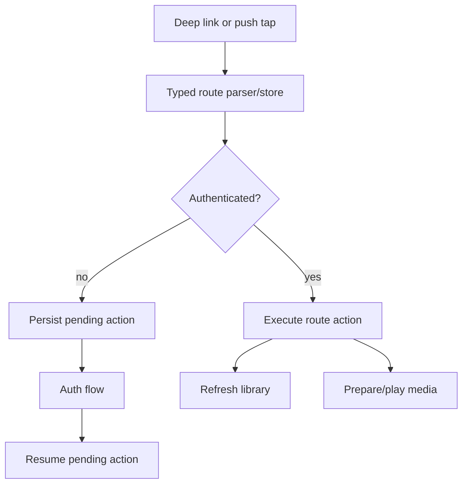
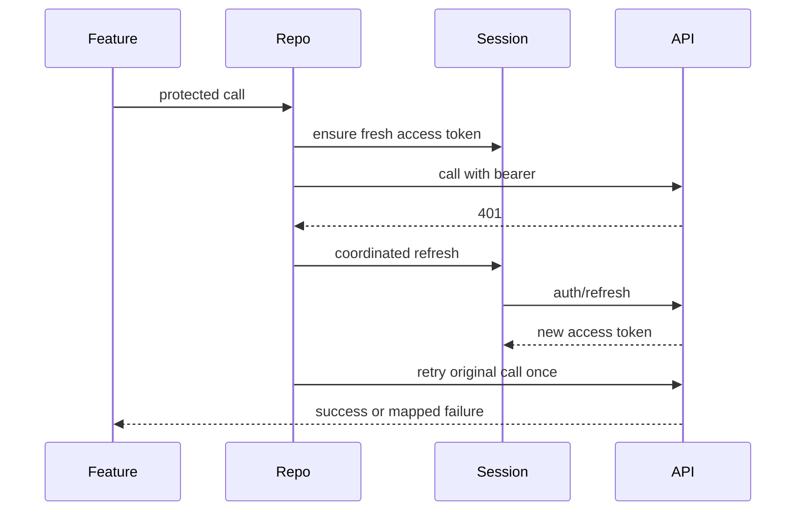

# Goal Capsule

Close the remaining native Android parity gaps that keep the U1-U10 migration in
`BUILT` rather than `DONE` status. The bar is not "Compose screen exists"; the bar is
iOS-equivalent behavior, recoverability, production constraints, and side-by-side QA
readiness for the core creation, auth, claim, library, playback, billing, push, and
device-trust surfaces.

This plan extends `docs/plans/2026-07-05-001-feat-android-native-ios-parity-plan.md`.
It does not resurrect the Skip plan. Android remains a pure Kotlin/Hilt/Compose app.
Closeout implementation units use `C#` identifiers so they do not collide with the canonical
migration `U#` identifiers in the native parity plan and gap register.

# Product Contract

## Requirements

- R1. Android onboarding must match the iOS V2 arc: splash, mirror, adaptive questionnaire,
  processing, payoff, suggestion fallback/server upgrade, and post-onboarding create/auth
  routing.
- R2. Android authenticated API calls must match iOS 401 behavior: coordinate refresh, retry
  once with the new token, avoid refresh stampedes, and clear/redirect only after refresh
  failure.
- R3. Share, poem share, and receiver handoff links must survive sign-in and resume the pending
  claim or create action after authentication.
- R4. A successful claim must refresh the relevant library, open the claimed item, and start or
  prepare playback where the iOS flow does.
- R5. Lyrics review must be editable before approval, preserve unsaved state, surface approve
  failures, and let the user recover by editing/retrying.
- R6. Songs and poems library/player must expose the iOS action set that is supported by current
  backend contracts: play, share, delete, refresh, open detail, retry-ready feedback, and owned
  playback with auth headers.
- R7. Android playback must include app foreground controls plus system media/session controls
  with track metadata and seek/play/pause parity where Android APIs allow it.
- R8. Subscription purchases must be production-safe: capture purchase updates, persist unsynced
  receipt state, submit receipts idempotently, acknowledge purchases only after backend acceptance,
  and recover on app restart.
- R9. Android push must be verifiable from server payload to app route: OneSignal click payloads
  parse to typed routes, route actions refresh/open the right surface, and unsupported payloads are
  informational rather than silent failures.
- R10. Android device trust must stop relying only on a random local token. Add an App Set ID backed
  stable app identity where available and a Play Integrity request seam that can be wired to the
  backend without blocking local/debug builds.
- R11. External provisioning remains explicit: Google Web Client ID, release keystore,
  `assetlinks.json` publication, Play Console products, OneSignal/FCM dashboard, production API
  URLs, and backend Android push/receipt endpoints must be documented as gates if they cannot be
  completed locally.
- R12. U11 parity QA must produce a side-by-side checklist for every Android tab and flow in light
  and dark mode against the iOS references before U1-U10 can be marked `DONE`.

## Non-Goals

- NG1. Do not bring back Skip or shared Swift UI.
- NG2. Do not implement Android gift consumables until the backend has the consumable receipt
  endpoint called out as R-1 in the native parity plan.
- NG3. Do not fake external provisioning keys or Play Console state.
- NG4. Do not expand the backend protocol beyond seams required to verify Android client behavior.

# Planning Contract

## Known Technical Decisions

- KTD1. Keep the existing native modular structure: `app`, `core:model`, `core:domain`,
  `core:data`, `core:network`, `core:datastore`, `core:platform`, `core:media`, `core:ui`,
  and `feature:*`.
- KTD2. Shared behavior belongs in `core:domain` or `core:data`; screen-only state belongs in
  feature ViewModels.
- KTD3. `PorizoDataGraph` remains the composition root for data/network repositories; Hilt remains
  the app dependency boundary.
- KTD4. Use Android platform services behind domain contracts before wiring concrete Play Billing,
  OneSignal, App Set ID, Play Integrity, or Media3 implementation details into features.
- KTD5. Existing iOS files are parity references, not code sources to copy:
  `PorizoApp/PorizoApp/Onboarding/OnboardingV2View.swift`,
  `PorizoApp/PorizoApp/Services/Auth/RefreshCoordinator.swift`,
  `PorizoApp/PorizoApp/ReceiverClaimView.swift`,
  `PorizoApp/PorizoApp/Controllers/LyricsReviewController.swift`,
  `PorizoApp/PorizoApp/StoreKitManager.swift`, and
  `PorizoApp/PorizoApp/Services/NowPlayingManager.swift`.

## Architectural Invariants

- A1. Protected API calls attach bearer auth only to the configured API host; presigned storage
  URLs must never receive bearer tokens.
- A2. Refresh/retry happens below feature ViewModels so claim, library, billing, and create flows
  do not each implement their own patchwork retry logic.
- A3. Pending deep-link/handoff actions are durable enough to survive auth presentation and process
  recreation.
- A4. Purchase tokens are not considered fulfilled until backend receipt sync succeeds.
- A5. The app must degrade cleanly in debug/local builds when Play services, OneSignal, Google
  OAuth, or Play Integrity are not configured.

# High-Level Technical Design

# Closeout Mapping

| Closeout unit | Canonical native parity unit(s) | Gap-register row(s) closed |
| --- | --- | --- |
| C1 | U3 data/network/session | U3 auth refresh parity |
| C2 | U5 auth + onboarding | U1/U2 onboarding parity |
| C3 | U7 share/claim/deep links | U5 receiver handoff |
| C4 | U6 library/playback, U7 share/claim/deep links | U7 claim completion |
| C5 | U8 create/render/reveal | U6/U8 lyric review |
| C6 | U6 library/playback, U7 share/claim | U8 library/player action parity |
| C7 | U6 library/playback | U8 media/session controls |
| C8 | U9 native platform services | U9 billing lifecycle |
| C9 | U9 native platform services | U9 push routing, device trust |
| C10 | U10 release/provisioning, U11 parity audit | U10 provisioning, U11 verification gate |

# Implementation Units

## C1. Refresh-Aware Session And Repository Calls

**Scope:** `core:model`, `core:datastore`, `core:data`, `core:network`.

Implement a session coordinator that stores token issue/expiry time, refreshes proactively near
expiry, coordinates concurrent refreshes, retries one mapped 401, and clears the session only when
refresh fails. Update repositories to call through this wrapper for protected API calls. Token
rotation must be stored atomically: a successful refresh replaces access token, refresh token,
issued-at timestamp, and expiry together, with clock-skew tolerance.

**Acceptance:**

- A restored session with an expired access token refreshes before the protected request.
- A protected request that receives 401 refreshes once and retries the original call.
- Concurrent protected calls share one refresh operation.
- Refresh failure maps to a signed-out/auth-required state instead of infinite retries.
- Refresh-token rotation, reuse/revocation failure, secure persistence, and concurrent
  success/failure races have tests.

## C2. Full iOS V2 Onboarding Parity

**Scope:** `feature:onboarding`, `core:domain/create`, `core:model`, `app`.

Replace the minimal local onboarding graph shell with Android-native V2 screens and state:
living splash, mirror, adaptive questionnaire, processing, payoff, fallback suggestion, server
suggestion upgrade, skip/complete payloads, and post-onboarding create/auth routing.

**Acceptance:**

- The Android onboarding state machine can traverse the same major iOS states.
- The onboarding state matrix covers splash, mirror, adaptive questions, back/skip, processing,
  fallback suggestion, server upgrade, offline/error, payoff, completion, post-onboarding
  create/auth routing, and relaunch preservation.
- Completion returns recipient, relationship, emotional seed, occasion, goal, pain points, and
  suggestion payload.
- Skipping from payoff preserves partial suggestion data where available.
- Completion can seed the create flow instead of dropping the onboarding answers.

## C3. Durable Pending Auth Action Resume

**Scope:** `app`, `feature:auth`, `feature:claim`, `core:datastore`, `core:domain/deeplink`.

Introduce a pending-action store and app-level coordinator. When a deep link requires auth,
persist the action, open auth, and resume after auth success. Receiver handoff must resume its
claim token and PIN state after sign-in.

**Acceptance:**

- Track share, poem share, and receiver handoff links opened while signed out survive auth.
- Canceling auth leaves the pending action available until dismissed or replaced.
- Successful auth resumes the exact pending action once and clears it.

## C4. Claim Success Library And Playback Handoff

**Scope:** `feature:claim`, `feature:library`, `app/navigation`, `core:domain/claim`.

Emit typed claim completion events. The app coordinator selects the relevant tab, refreshes the
library, opens the claimed item if it is returned or discoverable, and prepares/starts playback for
song claims where stream access is available.

**Acceptance:**

- Receiver song claim shows saved state, refreshes Songs, and prepares or plays the stream.
- Poem claim refreshes Poems and opens the poem detail.
- Claim errors keep the sheet open with a retryable state and PIN preserved when useful.

## C5. Editable Lyrics Review And Approval Recovery

**Scope:** `feature:create`, `core:model`, `core:data`, `core:network`.

Add editable lyrics text/title state, `GET /tracks/{trackId}/versions/{versionNum}/lyrics`,
`PUT /tracks/{trackId}/versions/{versionNum}/lyrics`, approve failure handling, provider policy
term extraction, and "edit then retry approval" flow. This mirrors the existing iOS API client
contract.

**Acceptance:**

- Generated lyrics can be edited before approval.
- Lyrics edits are persisted through the existing track-version lyrics endpoint before approval.
- Approval failure surfaces the error and keeps the user on the review screen.
- Editing after a failed approval can retry without restarting the whole create flow.
- Provider policy terms are highlighted or otherwise surfaced as actionable copy.

## C6. Library Action Parity

**Scope:** `feature:library`, `core:domain/library`, `core:data`, `core:share`.

Add supported iOS-equivalent actions to songs and poems: refresh, play/listen, share link/sheet,
delete with confirmation, open detail, and clearer empty/loading/error states. Keep unsupported
variation/regeneration actions visibly absent until their backend contract exists.

**Acceptance:**

- Songs and poems can be deleted and the visible list refreshes.
- Songs and poems can generate/share links using existing repository methods.
- Detail views expose the same supported actions as row menus.
- Error states distinguish loading failure, not-ready content, and protected playback failure.

## C7. Android Media Session Parity

**Scope:** `core:media`, `core:domain/player`, `app`, `feature:library`.

Wrap Media3 playback in a MediaSession/notification-capable controller with title/artist/artwork
metadata, play/pause/seek remote commands, and owned-content auth headers.

**Acceptance:**

- Mini player and now-playing sheet remain in sync with ExoPlayer state.
- Android system media controls can play, pause, and seek the current item.
- Owned playback still includes bearer auth headers and share previews do not.

## C8. Billing Lifecycle Hardening

**Scope:** `core:platform`, `core:datastore`, `feature:settings`, `core:domain/platform`.

Persist purchase updates, submit unsynced receipts automatically when possible, acknowledge
purchases after backend acceptance, de-dupe already-synced purchase tokens, and expose restore/retry
status in Settings. Keep one-time gift products disabled until R-1 backend support exists. Model
Play Billing terminal states explicitly: `PENDING`, `PURCHASED`, and canceled/failed paths must not
grant entitlement before backend acceptance.

**Acceptance:**

- A successful Play purchase is captured even if Settings leaves foreground.
- App restart can restore an unsynced purchase token and retry receipt sync.
- Purchase is acknowledged only after backend receipt acceptance.
- Duplicate tokens are not repeatedly submitted.
- Pending, canceled, refunded/revoked, expired, renewal-failed, backend-rejected, and already
  subscribed states have visible Settings status and documented recovery.
- Backend entitlement reconciliation on app start/restore and the RTDN/server-webhook dependency
  are explicit gates for production completeness.

## C9. Push Routing And Device Trust

**Scope:** `core:platform`, `core:domain/platform`, `core:data`, `core:datastore`, `app`.

Harden OneSignal click payload parsing, add typed route diagnostics, register push tokens with the
backend using the best available device identity, add an App Set ID provider, and add a Play
Integrity request provider seam. Debug builds must continue without Play services.
Route execution must re-fetch server state under auth and ignore privileged data from client-side
push payloads.

**Acceptance:**

- Track reveal push payloads open Songs and refresh the ready track.
- Unknown payloads become informational notices.
- Push payloads are allowlisted by route type, stale/replayed payloads are handled safely, and
  privileged claim/library state is validated by server re-fetch.
- Device registration includes generated device ID plus App Set ID when available.
- Play Integrity has a debug-only no-op fallback and a concrete production provider seam.
- Production Play Integrity uses a backend-issued nonce, package/signature binding, timestamp
  freshness, backend verification before trust elevation, and release-build fail-closed behavior
  where integrity is required.

## C10. External Provisioning And U11 QA Packet

**Scope:** `docs`, `PorizoAndroid/Android/PLAY_STORE_CHECKLIST.md`, `docs/parity-2026-07`.

Update the provisioning checklist and parity QA packet so every external gate is explicit and every
canonical U1-U10 flow has a side-by-side iOS/Android verification row for light and dark mode.

**Acceptance:**

- The checklist names all required external assets, dashboards, production URLs, Android receipt
  endpoint, Android push route endpoint, Play Integrity endpoint, owners, proof artifacts, and
  blocked/done status.
- A release-gate checklist or Gradle task blocks production release when production URL, signing
  config, Play products, `assetlinks.json`, push app IDs, receipt endpoint, and integrity endpoint
  are missing or pointed at debug/local values.
- The QA packet lists every tab and deep-link flow, with Android path, iOS reference file,
  fixture/account setup, screenshot vs recording artifact type, device/resolution, expected
  visual/behavioral assertions, evidence path, and pass/fail owner.
- The gap register can be reconciled from open to closed only after observed screenshots/recordings.

# Verification Contract

# Implementation Status - 2026-07-04 Pass

The following C1-C10 code/doc changes were implemented in this pass and remain
pending local build verification plus U11 side-by-side evidence:

| Unit | Status | Implemented artifact | Remaining gate |
| --- | --- | --- | --- |
| C1 | Implemented, pending tests | `AuthSessionCoordinator`, issued-at persistence, protected repository wrappers, one-refresh retry path | Add focused refresh race tests and confirm all protected calls are covered |
| C2 | Implemented, pending QA | Native onboarding stages, payoff suggestion payload, typed completion, create-flow seeding without draft-clear race | Side-by-side iOS V2 visual and state-matrix QA; server suggestion upgrade remains a backend contract gate |
| C3 | Implemented, pending QA | Durable pending deep-link store and post-auth resume coordinator | Manual signed-out share/poem/receiver-handoff replay evidence |
| C4 | Partially implemented | Claim completion events refresh Songs/Poems and route to the relevant tab | Receiver claim auto-play needs a backend Android receiver-claim stream/open contract or returned track payload |
| C5 | Implemented, pending tests | Editable lyrics state, lyrics GET/PUT endpoints, save-before-approve, approval failure recovery | Provider policy term highlighting still needs UI-specific treatment |
| C6 | Implemented, pending QA | Songs/Poems share and delete actions wired through repositories and share dispatcher | Delete confirmation and richer not-ready/protected-error copy remain polish gaps |
| C7 | Implemented, pending device QA | Media3 playback metadata and `MediaSession` ownership in `core:media` | Lock-screen/notification control proof on emulator/phone |
| C8 | Partially implemented | Purchase-token persistence, restore, backend-accepted acknowledgement, visible Settings status | RTDN/server webhook reconciliation and automatic startup receipt retry remain production gates |
| C9 | Implemented seam, pending provisioning | Android registers OneSignal subscription id; server push supports OneSignal delivery; typed unsupported routes; device-trust seam exposed | Real OneSignal dashboard credentials, App Set ID provider, Play Integrity provider, backend nonce/verification endpoint |
| C10 | Implemented docs, pending evidence | Play Store checklist updates and U11 parity QA matrix | Capture screenshots/recordings and reconcile the gap register |

Required local checks after implementation:

- `./gradlew test`
- `./gradlew :app:assembleDebug`
- `git diff --check`

Focused checks to add or update as closeout units are touched:

- `core:domain` tests for pending route, claim, library, onboarding, and render decisions.
- `core:network` or `core:data` tests for auth refresh/retry, configured API-host allowlisting,
  presigned URL exclusion, redirect behavior, share-preview playback without bearer auth, and
  owned-content auth only on approved hosts.
- `feature:auth`, `feature:claim`, `feature:create`, `feature:library`, and `feature:settings`
  ViewModel tests for user-visible recovery paths where the module already has test plumbing.

Manual/U11 checks:

- Android emulator side-by-side with iOS references for onboarding, auth, create, songs, poems,
  claim, settings, billing, push route simulation, and player controls.
- Light and dark mode pass.
- Accessibility pass for major touch targets, labels, and contrast.

# Definition Of Done

- Every non-external R1-R10 item has code or an explicit documented backend/provisioning blocker.
- No Skip files are reintroduced.
- The Android app still builds as a pure native Kotlin/Compose app.
- Protected auth, billing, claim, and playback paths fail closed and recover visibly.
- Purchase, push, and device-trust paths are production-safe in configured builds and gracefully
  degraded in local/debug builds.
- U11 QA has a concrete checklist that can be executed without rediscovering the app structure.

# Risks And Dependencies

- D1. Backend support may be missing for editable lyric persistence, gift consumables, Play
  Integrity verification, or Android-specific transactional push routing. When missing, add a
  typed seam plus a documented blocker rather than a fake client-only completion.
- D2. Play Billing, App Set ID, Play Integrity, OneSignal, and Google OAuth behavior cannot be fully
  verified without configured external dashboards and real package signing.
- D3. Onboarding parity can sprawl into design polish. Keep this unit focused on state, payloads,
  routing, and key visual structure first; final pixel proof belongs to U11.
