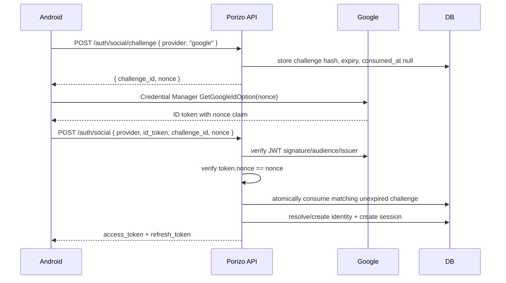
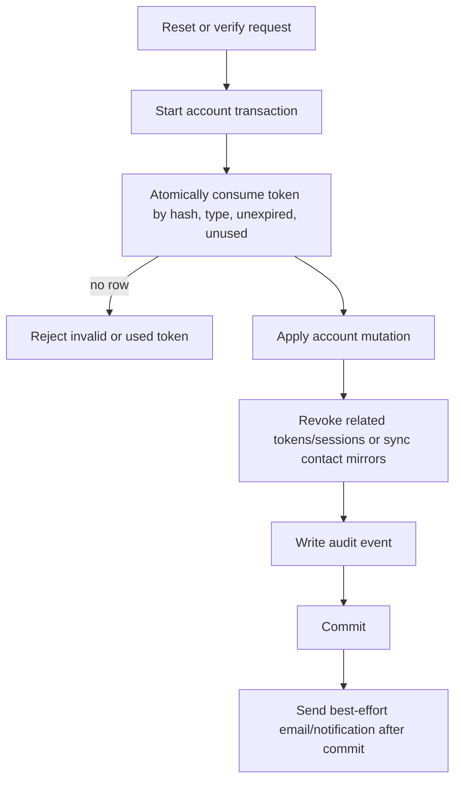
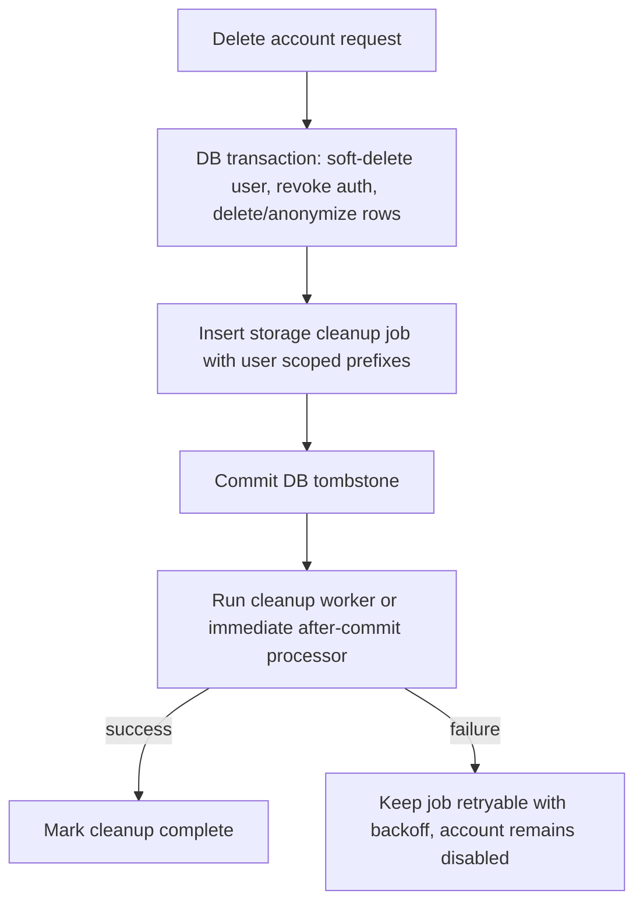

# fix: Auth and account hardening

## Goal Capsule

Harden the consumer auth and user-account system against replay, token races, throttling outages, and account-lifecycle inconsistency while preserving the existing session model, Android sign-in flow, and public API behavior wherever possible.

The work targets the confirmed adversarial review findings:

- Google ID tokens are accepted without nonce binding.
- One-time reset/verification tokens use a select-then-update consume path.
- Password reset and email verification consume tokens before all account mutations succeed.
- Abuse-sensitive auth rate limits fail open outside signup/login.
- Account deletion performs irreversible storage cleanup inside a DB transaction.
- Session listing exposes full IP addresses.
- Google OAuth audience configuration only supports one client ID.

---

## Product Contract

### Requirements

R1. Google ID-token sign-in from Android must bind the provider token to a fresh Porizo auth challenge so replayed ID tokens cannot mint sessions. Google authorization-code login must either keep its existing compatible behavior while enforcement is gated off, or be explicitly upgraded/deprecated in a separate rollout before challenge enforcement applies to it.

R2. Password-reset and email-verification links must be accepted at most once, including under concurrent requests.

R3. Password reset and email verification must not burn the user's token unless the corresponding account mutation succeeds.

R4. Abuse-sensitive auth endpoints must keep throttling effective during rate-limit persistence failures.

R5. Account deletion must leave the database and external storage in an eventually consistent, retryable state instead of coupling irreversible storage deletion to DB commit success.

R6. Session-management responses must preserve useful account-security context without returning raw IP addresses.

R7. Google social auth must support the Android/iOS/web rollout reality where more than one OAuth client ID may be valid.

### Acceptance Examples

AE1. With Google challenge enforcement enabled for Android ID-token login, a Google ID token with a missing, expired, consumed, or mismatched Porizo challenge nonce is rejected with a retryable auth error and does not create a session. With enforcement disabled, legacy no-challenge Google calls are accepted only through the documented compatibility branch and are logged for rollout monitoring.

AE2. Two simultaneous password-reset requests with the same token result in exactly one successful password change.

AE3. If password reset fails after token validation but before password update, the reset token remains retryable.

AE4. If the auth rate-limit repository throws while `/auth/phone/send-code` is called, the endpoint denies the request instead of sending SMS.

AE5. If storage cleanup fails during account deletion, the user account is tombstoned and disabled, cleanup is recorded for retry, and active auth tokens/sessions remain revoked.

AE6. `/auth/sessions` returns masked or coarse IP metadata, not the full raw IP string.

---

## Planning Contract

### Key Technical Decisions

KTD1. Use a DB-backed social auth challenge, not a client-only nonce. Android can generate a nonce, but the server must know which nonce it issued or accepted for this login attempt to make replay checks meaningful and one-use.

KTD2. Add Google nonce support in a backward-compatible shape first, then gate enforcement behind explicit configuration such as `GOOGLE_SOCIAL_CHALLENGE_REQUIRED=true` plus client/version rollout evidence. The same implementation should contain tests for both compatibility mode and final enforcement mode. Production flips only after Android nonce clients are deployed, legacy no-challenge call volume is understood, and rollback is a config change.

KTD3. Move one-time-token consumption to an atomic update-first repository API. The repository should return the consumed row only if the guarded update won.

KTD4. Put account mutations for reset and verification behind service-level transaction helpers. Routes should orchestrate HTTP concerns, while auth/account services own atomic state changes. Password hashing happens before opening the DB transaction; token consumption, credential/contact mutation, refresh-token revocation, session revocation, and auth/security audit events all use repositories bound to the same transaction client.

KTD5. Change auth rate-limit defaults by call site, not globally. Username availability and authenticated export/delete calls have different failure tradeoffs than unauthenticated OTP and password-reset endpoints.

KTD6. Reuse the existing durable jobs/DLQ infrastructure for account-deletion cleanup if it can represent user-scoped cleanup payloads, idempotency, claim/retry status, and observability. Add a new cleanup table/repository only if the existing job schema cannot safely model this workflow, and document that decision in the implementation. The first pass may process immediately after commit, but the durable job must survive crashes and be recoverable by a worker or scheduled scanner.

KTD7. Mask IPs server-side before serialization so every client gets the privacy-preserving contract.

### High-Level Technical Design

### Scope Boundaries

In scope:

- Consumer backend auth routes and services under `src/routes`, `src/services`, and `src/database`.
- Android Google Sign-In nonce wiring under `PorizoAndroid/Android/core/platform`, `core:data`, `core:network`, and `feature:auth`.
- Focused Node tests and Android unit tests for changed contracts.
- Documentation only when configuration behavior changes.

Out of scope:

- Admin auth.
- Billing, Play Integrity, push, and claim-flow parity gaps not directly caused by auth/session changes.
- Reworking the full identity model.
- Production migration execution or deployment.

### Risks & Dependencies

- Google nonce enforcement can break existing clients if old app versions still call `/auth/social` without a challenge. Mitigate with config-gated enforcement, metrics/logging for legacy calls, release notes, explicit minimum-version rollout decision, and a config rollback path.
- Google authorization-code login is a separate contract from Android ID-token login. This plan preserves code-flow compatibility while challenge enforcement is disabled; before enforcing challenges on code flow, add an OIDC nonce-through-authorization-request design or intentionally deprecate the code path.
- Atomic token consume must work across both the local SQL adapter and Postgres. Tests should include repository behavior without assuming SQLite-only semantics.
- Account deletion retryability requires a durable owner, not just a stored row. Reuse existing job durability if possible; otherwise keep the migration small and verify local `migrations/*` plus `migrations/pg/*` parity if a new table is added.
- Fail-closed rate limiting can turn DB trouble into user-visible denials. That is acceptable for unauthenticated OTP/reset/social endpoints; keep lower-risk authenticated endpoints deliberate.

---

## Implementation Units

### U1. Add social auth challenge contract

**Goal:** Add a one-use, expiring challenge for Google social auth and verify Google token nonce claims against it.

**Requirements:** R1, R7, AE1

**Dependencies:** none

**Files:**

- `src/routes/auth.js`
- `src/services/social-token-verifier.js`
- `src/services/auth-service.js`
- `src/database/auth-social-challenge-repository.js`
- `migrations/pg/*`
- `migrations/*`
- `test/social-auth*.test.js`
- `test/social-token-verifier*.test.js`

**Approach:** Add a small repository for social auth challenges storing provider, nonce hash, expiry, and consumed timestamp. Do not store request fingerprint/IP data unless a current validation or audit requirement is added with retention/minimization rules. Add `POST /auth/social/challenge` for Google with fail-closed rate limiting and opportunistic pruning for expired/consumed rows. Extend `/auth/social` schema to accept `challenge_id` and `nonce`. For Android ID-token login, load and validate the unconsumed challenge, verify the Google token signature/audience/issuer and nonce claim, then atomically consume the matching challenge before session creation. Extend Google audience parsing to accept `GOOGLE_CLIENT_IDS` or comma-separated `GOOGLE_CLIENT_ID` while keeping current single-value compatibility. Preserve Google authorization-code compatibility while enforcement is disabled; if enforcement is enabled, reject code-flow requests until a separate nonce-through-code-exchange contract exists.

**Execution note:** Start with failing backend contract tests for missing, mismatched, reused, and expired Google challenges.

**Patterns to follow:** Apple nonce verification in `src/services/social-token-verifier.js`; token hashing in `src/services/auth-service.js`; phone registration token consume pattern in `src/routes/auth.js`.

**Test scenarios:**

- Google auth without a challenge is rejected once enforcement is enabled.
- Google auth without a challenge remains compatible and is logged when enforcement is disabled.
- Google auth with a valid challenge and matching nonce succeeds using mocked social auth mode.
- Reusing the same challenge rejects the second request.
- Expired challenge rejects.
- Google token with mismatched nonce rejects.
- Malformed/provider-failed Google token does not consume an otherwise valid challenge.
- Google authorization-code requests are either explicitly accepted in compatibility mode or rejected in enforcement mode, with no silent session-minting bypass.
- Multiple configured Google client IDs accept tokens for either allowed audience.

**Verification:** Backend tests prove the challenge lifecycle and token verifier behavior; no production session is created on failure cases.

### U2. Wire Android Google Sign-In nonce flow

**Goal:** Have Android request a backend challenge, pass the nonce into Credential Manager, and submit challenge data with the ID token.

**Requirements:** R1, R7, AE1

**Dependencies:** U1

**Files:**

- `PorizoAndroid/Android/core/domain/src/main/kotlin/com/porizo/core/domain/platform/PlatformContracts.kt`
- `PorizoAndroid/Android/core/platform/src/main/kotlin/com/porizo/core/platform/GoogleSignInProvider.kt`
- `PorizoAndroid/Android/core/network/src/main/kotlin/com/porizo/core/network/PorizoApiService.kt`
- `PorizoAndroid/Android/core/network/src/main/kotlin/com/porizo/core/network/NetworkDtos.kt`
- `PorizoAndroid/Android/core/data/src/main/kotlin/com/porizo/core/data/RepositoryImplementations.kt`
- `PorizoAndroid/Android/feature/auth/src/main/kotlin/com/porizo/feature/auth/AuthViewModel.kt`
- `PorizoAndroid/Android/feature/auth/src/test/kotlin/com/porizo/feature/auth/AuthViewModelTest.kt`

**Approach:** Introduce a domain model for `SocialAuthChallenge`, fetch it before launching Credential Manager, pass its nonce into `GetGoogleIdOption`, and include `challenge_id`/`nonce` in the social login DTO. Keep the UI state behavior unchanged except for clearer retry messaging when challenge creation fails.

**Execution note:** Use focused ViewModel tests first; the physical Google UI cannot be fully unit-tested, so unit tests should verify repository/ViewModel request sequencing.

**Patterns to follow:** Existing `GoogleSignInProvider`, `AuthRepository.socialLogin`, and `AuthViewModel.signInWithGoogle`.

**Test scenarios:**

- ViewModel does not launch Credential Manager if challenge creation fails.
- ViewModel submits `id_token`, `challenge_id`, and `nonce` after successful sign-in.
- Google unavailable/config-missing UI remains unchanged.

**Verification:** Android auth unit tests pass and debug build compiles.

### U3. Make one-time token consumption atomic

**Goal:** Ensure password reset and email verification tokens can be consumed by only one concurrent request.

**Requirements:** R2, AE2

**Dependencies:** none

**Files:**

- `src/database/auth-one-time-token-repository.js`
- `src/services/auth-service.js`
- `test/auth-one-time-token-repository.test.js`
- `test/auth-service.test.js`

**Approach:** Replace select-then-update with an update-first consume method that guards on `token_hash`, `used_at IS NULL`, and `expires_at`, then fetches the consumed row or uses `RETURNING` where supported. Check affected row count on every adapter. Preserve returned fields needed by reset and verification.

**Execution note:** Add a regression test that simulates two consume attempts where the second update affects zero rows.

**Patterns to follow:** Optimistic row-count checks in `src/services/auth-service.js` refresh-token rotation.

**Test scenarios:**

- First consume returns token and marks `used_at`.
- Second consume of the same token rejects.
- Simulated concurrent losing update rejects even if an earlier read saw the token unused.
- Expired token rejects without marking used.

**Verification:** Repository and auth service tests pass.

### U4. Transactional reset and email verification

**Goal:** Move token consume plus account mutation into atomic service methods so users are not left with burned tokens after failed mutations.

**Requirements:** R3, AE3

**Dependencies:** U3

**Files:**

- `src/routes/auth.js`
- `src/services/auth-service.js`
- `src/database/auth-credential-repository.js`
- `src/database/auth-one-time-token-repository.js`
- `src/database/auth-refresh-token-repository.js`
- `src/database/auth-security-repository.js`
- `src/database/auth-session-repository.js`
- `test/auth-routes*.test.js`
- `test/auth-service.test.js`

**Approach:** Add service-level methods for completing password reset and email verification inside a DB transaction. Password reset should precompute the password hash outside the transaction, then consume the token, update credential, invalidate outstanding reset tokens, revoke refresh tokens and sessions, and write audit evidence atomically using transaction-scoped repositories. Email verification should consume token, verify contact through a transaction-bound identity/contact path or repository, sync mirrors, and write audit evidence atomically. Send emails after commit only.

**Execution note:** Characterize current route behavior first where tests already exist, then move logic behind service methods.

**Patterns to follow:** Transaction helpers in repository modules and identity service transaction usage.

**Test scenarios:**

- Password reset succeeds and revokes sessions/tokens.
- Password reset failure before password update leaves token retryable.
- Email verification succeeds and syncs contact mirrors.
- Email verification conflict does not consume the token when mutation fails.

**Verification:** Auth route/service tests pass.

### U5. Fail closed on abuse-sensitive auth rate limits

**Goal:** Ensure unauthenticated abuse-sensitive auth endpoints deny requests when persistent rate limiting fails.

**Requirements:** R4, AE4

**Dependencies:** none

**Files:**

- `src/routes/auth.js`
- `src/database/auth-rate-limit-repository.js`
- `test/auth-rate-limit*.test.js`
- `test/auth-routes*.test.js`

**Approach:** Pass `{ failClosed: true }` to unauthenticated abuse-sensitive endpoints: social auth challenge, social auth, forgot password, phone send, phone verify, phone register, and email resend verification. Keep authenticated phone link, Apple link, data export, account deletion, and username availability out of this unit unless a focused acceptance example is added; document their current behavior with existing tests when touched.

**Execution note:** Add route-level tests with a throwing rate-limit repository before touching all call sites.

**Patterns to follow:** Existing signup/login fail-closed call sites.

**Test scenarios:**

- `/auth/phone/send-code` returns rate-limited behavior when the rate-limit DB path throws.
- `/auth/social/challenge` returns rate-limited behavior when the rate-limit DB path throws.
- `/auth/social` returns rate-limited behavior when the rate-limit DB path throws.
- Forgot password, phone verify/register, and email resend verification exercise the same fail-closed helper path or have explicit route-level tests.
- Signup/login behavior remains unchanged.
- Username availability behavior is documented by a test, whether fail-open or fail-closed is chosen.

**Verification:** Focused auth route tests pass.

### U6. Make account deletion storage cleanup retryable

**Goal:** Decouple irreversible storage deletion from the account deletion DB transaction.

**Requirements:** R5, AE5

**Dependencies:** none

**Files:**

- `src/services/auth-service.js`
- `src/database/account-deletion-repository.js`
- `src/jobs/*`
- `migrations/pg/*`
- `migrations/*`
- `test/account-deletion*.test.js`
- `test/auth-service.test.js`

**Approach:** Add a deletion-cleanup durable job inside the deletion transaction, preferably through the existing job durability/DLQ infrastructure and `account-deletion-storage-service`. The payload may retain only immutable internal user IDs and canonical server-derived storage prefixes; avoid raw PII, object URLs, or emails. Jobs must be idempotent, claimable, retried with backoff, visible in logs/admin ops, and purged or compacted after successful or terminal cleanup according to a documented retention rule. After commit, an immediate processor may attempt cleanup, but a startup/scheduled worker must also scan surviving jobs so crashes do not strand cleanup. Ensure failed cleanup can be retried and does not reactivate auth/session state. If a new table/repository is still required, include an implementation note explaining why the current jobs schema is insufficient.

**Execution note:** Prefer a small, reversible schema addition over a broad deletion-service rewrite.

**Patterns to follow:** Existing cleanup jobs under `src/jobs` and account deletion repository transaction structure.

**Test scenarios:**

- Account deletion commits DB tombstone even when storage cleanup fails.
- Cleanup failure leaves a retryable record.
- A committed cleanup job is later processed by the durable worker even if immediate cleanup did not run.
- Successful cleanup marks the record complete.
- Active sessions and refresh tokens remain revoked after cleanup failure.

**Verification:** Account deletion tests pass and migration parity check passes if migrations are added.

### U7. Mask session IPs in account API

**Goal:** Remove raw IP exposure from `/auth/sessions` while preserving useful security metadata.

**Requirements:** R6, AE6

**Dependencies:** none

**Files:**

- `src/routes/auth.js`
- `src/utils/*`
- `test/auth-routes*.test.js`

**Approach:** Add a small utility that masks IPv4 to `/24` or last-octet redaction and IPv6 to a coarse prefix/redaction. Return `ip_address_masked` and omit raw `ip_address` from `/auth/sessions`. Confirm session IP capture uses the existing trusted proxy boundary; do not treat arbitrary client-supplied forwarding headers as trusted account-security metadata.

**Execution note:** Keep the utility pure and unit tested.

**Patterns to follow:** Existing masking helpers for email and phone in `src/routes/auth.js`.

**Test scenarios:**

- IPv4 session IP is masked.
- IPv6 session IP is masked.
- Missing or malformed IP returns null/unknown without throwing.
- `/auth/sessions` does not include raw stored IP.
- Spoofed forwarding headers are ignored unless they pass the app's existing trusted proxy configuration.

**Verification:** Auth route tests pass.

---

## Verification Contract

Run targeted checks after each unit:

- Node auth repository/service/route tests touching changed backend files.
- Android `:feature:auth:testDebugUnitTest` and `:app:assembleDebug` after U2.
- Migration parity verification for local `migrations/*` and Postgres `migrations/pg/*` if U1 or U6 adds migrations.

Final gates:

- `npm test` or a documented narrower Node test set if full-suite failures are unrelated and already known.
- Android auth unit tests and debug build when Android auth files changed.
- Code review with `ce-code-review` against this plan and confirmed fixes applied.

---

## Definition of Done

- Google auth supports config-gated Android ID-token nonce challenges, with compatibility and enforcement modes both tested.
- Google verifier supports multiple allowed audiences.
- One-time tokens are atomic and race-safe.
- Password reset and email verification mutations are transactional.
- Abuse-sensitive rate limits fail closed on persistence failure.
- Account deletion storage cleanup is retryable after DB commit.
- Session APIs no longer return raw IP addresses.
- Targeted tests cover every changed contract.
- `ce-code-review` finds no unresolved actionable auth/account issues from this plan.
