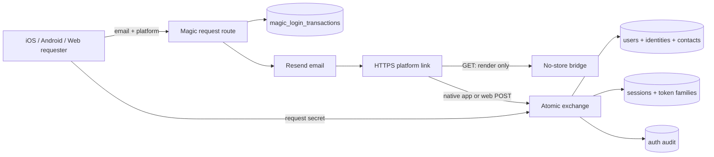
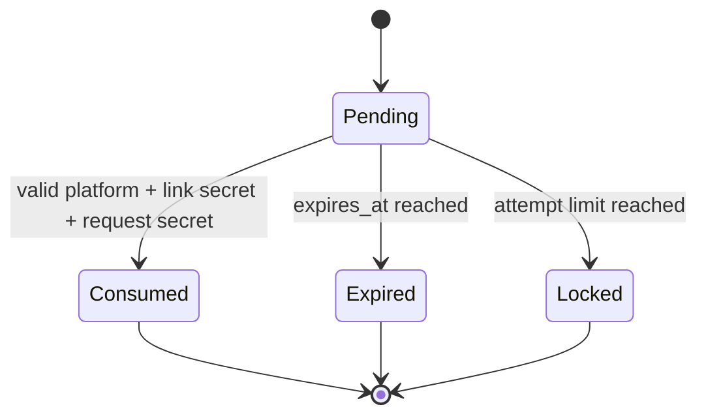
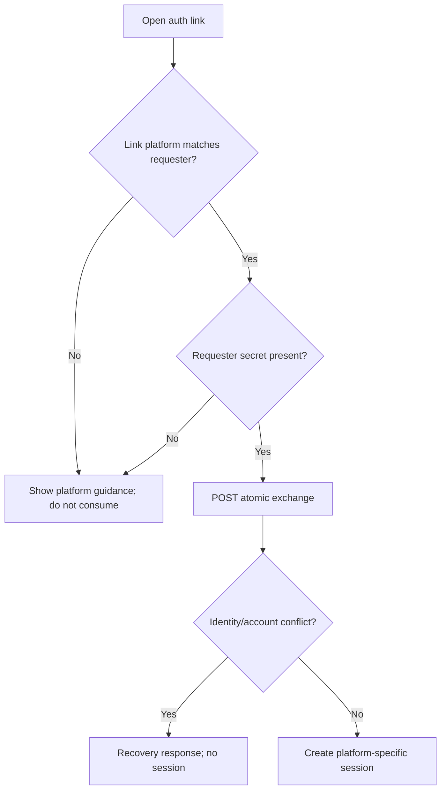

# feat: Add platform-bound magic login and harden account identity

## Implementation Status (2026-07-13)

**Code status: complete.** U1-U8 are implemented across the backend, iOS, and
the native Android `refactor` worktree. The CE code review found four concrete
issues (iOS add-email response decoding, unused delivery suppression, incomplete
request abuse controls, and SQLite delivery-state constraints); all four were
fixed and covered by focused regression tests.

**Verified locally:** backend request/exchange/replay/platform/session contracts,
PostgreSQL and SQLite migrations, durable account cleanup, terminal email
suppression, iOS exact-link parsing and ThisDeviceOnly pending-request storage,
Android exact App Link parsing and Keystore-backed pending-request storage,
lint, focused Node/PostgreSQL tests, signed iOS simulator auth tests, Android
unit/debug/release builds, and an independent adversarial code review.

**Production evidence still required:** deploy migrations and backend with the
feature disabled, publish `auth.porizo.co` AASA and Android `assetlinks.json`
using the final Play App Signing SHA-256 fingerprint, verify TLS/MIME/cache
behavior, provision production environment keys, then run installed-release
iOS/Android link, logout/revocation, bounce-webhook, and cleanup-worker smoke
tests. These are rollout gates, not missing implementation units.

## Goal Capsule

Porizo users can add and verify a real email, then sign in through a magic link
that works only on the platform and device that requested it. Apple, Google,
phone, password, and magic-link credentials continue resolving to one durable
`users.id`, so songs, purchases, entitlements, and libraries never move merely
because a login method changes. The design is ready for future web login without
exposing native refresh tokens to browser JavaScript.

The behavior and invariants are canonical in `docs/identity-contract.md` version 2.

---

## Problem Frame

Apple private relay is correctly configured for Porizo, but relay forwarding can
still be disabled per user and bounced addresses are then suppressed by Resend.
The existing profile-completion policy also treats any phone as a substitute for
a real email, so real-email collection is not reliable. Existing verification
links verify a contact but do not create a session.

The account review additionally found two release-blocking defects: social login
can link a new provider to an existing account using only an unauthenticated
`confirm_link` flag, and account deletion can irreversibly delete storage before
the database commit succeeds. One-time-token consumption and contact conflict
classification also need hardening before magic login can safely issue sessions.

---

## Product Contract

### Actors

- **A1 Account holder:** owns one Porizo account and its content/entitlements.
- **A2 Native client:** iOS or Android app requesting same-device login.
- **A3 Web client:** future browser client using server-backed cookies.
- **A4 Email scanner or attacker:** may visit, forward, replay, or steal a link.

### Requirements

- **R1:** `users.id` remains the sole owner of entitlements, purchases, content, and sessions.
- **R2:** A magic transaction is bound to exactly one of `ios`, `android`, or `web` and cannot authenticate another platform.
- **R3:** Exchange requires independent link and requester secrets, expires within 15 minutes, is single-use, and succeeds at most once under concurrency.
- **R4:** A `GET` never consumes a login credential or creates a session.
- **R5:** An authenticated Apple/Google/phone user can verify and link a real email to the same account after proving the current session and email.
- **R6:** Entering an unknown email creates no account; completing its verified
  two-secret exchange creates exactly one account without merging another user.
- **R7:** Native credentials use short access tokens and rotating session-bound refresh tokens; web uses an opaque Secure/HttpOnly cookie.
- **R8:** Sessions have a 90-day idle limit and 365-day absolute limit; rotation never extends beyond the absolute limit.
- **R9:** Social-provider linking requires an authenticated target account plus fresh provider proof; `confirm_link` alone is rejected.
- **R10:** Relay detection supports legacy and 2026 Apple domains, and terminal email events stop automated sends without changing account ownership.
- **R11:** Account deletion commits its database tombstone before retryable external storage cleanup.
- **R12:** Existing recipient handoff, share/claim, entitlement, account-deletion, and provider-login behavior remains compatible.
- **R13:** Magic-link requests resist enumeration, email flooding, transaction growth, and resend abuse through layered limits and expiry cleanup.
- **R14:** A committed exchange whose HTTP response is lost can be recovered only by the same requester without creating a second session.

### Key Flows

- **F1 Native add-email:** authenticated app requests a platform-bound link, user taps it on the same device, the app exchanges both secrets, and the email identity attaches to the current `users.id`.
- **F2 Native login:** logged-out app requests a link for an existing verified email and receives a new native session after same-device exchange.
- **F3 Wrong platform/device:** link renders instructions and remains unconsumed.
- **F4 Future web login:** browser requests a web transaction, completes through the same browser's pre-auth cookie, and receives a new opaque web session cookie.
- **F5 Conflict:** verified email belongs to another user; exchange creates no session/link and routes to recovery.
- **F6 Deletion:** account database state commits, cleanup work is persisted, and storage deletion retries idempotently after commit.

### Acceptance Examples

- **AE1:** An iOS transaction exchanged from Android or web is rejected without consumption.
- **AE2:** Two concurrent exchanges of one transaction create exactly one session.
- **AE3:** A scanner `GET` leaves the transaction usable by the user.
- **AE4:** An Apple user with a phone and only a relay email is still prompted for a real email.
- **AE5:** `private.icloud.com` is classified as relay and cannot satisfy real-email policy.
- **AE6:** A matching social email plus `confirm_link: true` cannot enter an existing account without proof of that account.
- **AE7:** A database commit failure cannot occur after irreversible storage deletion has begun.

---

## Scope Boundaries

### In scope

- Canonical account/identity contract and drift corrections.
- Backend transaction schema, repositories, service, routes, mail, audit, rate limits, and session expiry.
- iOS same-device request/exchange and strict Universal Link handling.
- Android same-device contract and verified App Link handling on the `refactor` branch, preserving unrelated worktree edits.
- Web-ready backend semantics and no-side-effect fallback pages; a full web product UI is not required.
- Resend terminal-delivery state for user contacts and lifecycle suppression.
- Social-link takeover, one-time-token atomicity, contact-conflict classification, and deletion ordering fixes.

### Deferred to follow-up work

- Cross-device approval or code entry.
- Automatic account merging or entitlement consolidation.
- Full browser account/product UI.
- Passkeys and hardware-backed step-up authentication.

### Non-goals

- Removing Sign in with Apple, Google, phone, or password authentication.
- Treating email delivery state as account ownership or entitlement state.
- Carrying authentication credentials through `porizo://`, attribution redirectors, or App Clips.

---

## Key Technical Decisions

- **KTD1:** Extend the existing three-layer identity model; do not create a parallel account table.
- **KTD2:** Use a dedicated `magic_login_transactions` aggregate rather than overloading seven-day email-verification tokens.
- **KTD3:** Store separate link/request hashes and require both at exchange. Platform headers are not proof.
- **KTD4:** Keep registration explicit. Login lookup failure returns a generic result and creates no account.
- **KTD5:** Make exchange one transaction covering conditional consumption, contact/identity mutation, session/token creation, and audit event.
- **KTD6:** Use HTTPS-only `auth.porizo.co` platform namespaces. Custom schemes remain navigation-only.
- **KTD7:** Model session absolute and idle expiry on `user_sessions`, with refresh expiry capped to the session.
- **KTD8:** Use a durable cleanup job/outbox after account deletion commit; external deletion is never inside the account transaction.
- **KTD9:** Web will use an opaque `__Host-porizo_session` cookie and server-side session record, not native tokens in browser storage.
- **KTD10:** The exchange root owns one database transaction and passes transaction-bound repositories into identity, session, token, and audit operations; nested service transactions are prohibited.
- **KTD11:** Pending native request secrets are keyed by transaction ID, bounded, non-synchronizable, and excluded from device backup/restore.
- **KTD12:** A successful exchange persists a short-lived requester-bound recovery result so response loss can return the same session outcome once without creating another session.

---

## High-Level Technical Design

### Component flow

### Transaction lifecycle

### Platform decision

---

## Implementation Units

### U1. Correct identity and linking invariants

**Goal:** Remove the account-takeover path and align relay/profile/contact behavior with the canonical contract.

**Requirements:** R1, R5, R9, R10; AE4-AE6.

**Dependencies:** None.

**Files:**
- `src/routes/auth.js`
- `src/services/identity-service.js`
- `src/database/identity-repository.js`
- `PorizoApp/PorizoApp/AuthManager.swift`
- `PorizoApp/PorizoApp/ProfileCompletionView.swift`
- `test/auth-identity-model.test.js`
- `test/auth-api.test.js`
- `PorizoApp/PorizoAppTests/IdentityModelContractTests.swift`

**Approach:** Delete unauthenticated social auto-link confirmation. Existing-account linking becomes an authenticated endpoint requiring fresh provider proof. Centralize relay-domain classification and require verified non-relay email independently of phone. Map provider versus contact uniqueness violations to their contract errors.

**Execution note:** Start with regression tests proving the existing `confirm_link` takeover and profile-completeness drift.

**Patterns to follow:** `identityService.linkIdentityToUser`, `requireAuth`, and existing E118/E119 contract tests.

**Test scenarios:**
1. Covers AE6. Matching social email plus `confirm_link` cannot create a session for the existing account.
2. Authenticated user with fresh provider proof can link; replay and another-account provider conflict fail.
3. Covers AE4. Phone plus relay email still reports missing verified real email.
4. Covers AE5. Both Apple relay domains are classified as relay.
5. Concurrent verified-contact conflicts return E119, not E118.

**Verification:** Identity-model and auth API suites prove no entitlement owner changes and no unauthenticated account linking remains.

### U2. Add magic transaction persistence and atomic exchange

**Goal:** Introduce platform-bound, two-secret, single-use login transactions.

**Requirements:** R2-R6; AE1-AE3.

**Dependencies:** U1.

**Files:**
- `migrations/124_magic_login_transactions.sql`
- `migrations/pg/124_magic_login_transactions.sql`
- `src/database/magic-login-repository.js`
- `src/services/magic-login-service.js`
- `src/routes/auth.js`
- `src/utils/email-app-links.js`
- `src/utils/apple-app-site-association.js`
- `test/magic-login.test.js`
- `test/migration-parity.test.js`

**Approach:** Persist platform, purpose, account/email binding, link/request hashes, attempt state, expiry, consumption result, requester-bound recovery result, and session reference. Request responses remain enumeration-safe. Apply per-IP, normalized-email, account, and device limits; cap active transactions; enforce resend cooldown; and clean expired rows. Exchange opens one root transaction and passes transaction-bound repositories to identity, session, refresh-token, and audit operations. GET routes render only no-store guidance. A committed exchange can return its existing result to the same requester after response loss but never creates a second session. A feature flag in app config disables new requests while established sessions remain valid.

**Execution note:** Implement the concurrency test first and require exactly one exchange winner.

**Patterns to follow:** Refresh-token optimistic locking and email-verification target binding.

**Test scenarios:**
1. Covers AE1. Cross-platform exchange fails and leaves the transaction pending.
2. Covers AE2. Concurrent exchange creates exactly one session/token family.
3. Covers AE3. Scanner GET does not consume or authenticate.
4. Expired, replayed, malformed, and attempt-locked transactions fail generically.
5. Unknown email creates no user at request time and exactly one account after a valid exchange.
6. Add-email transaction links only to its bound authenticated user.
7. Layered request limits return generic responses and do not reveal whether an account exists.
8. Repeated requests remain usable when emails arrive out of order because pending secrets are keyed by transaction ID and bounded.
9. Commit-success/response-loss retry returns the original requester-bound result without another session.
10. Feature-flag disablement blocks new requests but not refresh of established sessions.

**Verification:** SQLite and PostgreSQL migration parity passes; API integration tests exercise real repositories and sessions.

### U3. Harden session lifetime and platform credential delivery

**Goal:** Deliver durable one-year sessions without one-year bearer credentials.

**Requirements:** R7-R8.

**Dependencies:** U2.

**Files:**
- `migrations/125_session_lifetimes.sql`
- `migrations/pg/125_session_lifetimes.sql`
- `src/database/auth-session-repository.js`
- `src/database/auth-refresh-token-repository.js`
- `src/services/auth-service.js`
- `src/middleware/require-user.js`
- `src/routes/auth.js`
- `test/auth-service.test.js`
- `test/auth-api.test.js`
- `test/auth-refresh-race.test.js`

**Approach:** Add auth method, platform, authoritative authentication time, idle expiry, absolute expiry, and last rotation. Change access-token lifetime from 60 to 15 minutes. Backfill existing sessions conservatively from creation/last activity, first with nullable mixed-version compatibility and then enforcement; do not mass-extend or silently log out valid sessions. Cap refresh expiry to session absolute expiry. Native exchanges return rotating tokens. Web request sets a short-lived `__Host-porizo_preauth` HttpOnly cookie bound to the transaction; web exchange requires exact allowed Origin plus CSRF proof, rotates the session ID, clears pre-auth state, and sets an opaque `__Host-porizo_session` cookie without serializing native tokens. Recent authentication is 15 minutes and advances only after a qualifying primary credential, never refresh rotation.

**Test scenarios:**
1. Refresh before idle expiry rotates and never exceeds absolute expiry.
2. Idle-expired, absolute-expired, revoked, and deleted-user sessions fail.
3. Native and web exchanges cannot request each other's credential shape.
4. Web cookie attributes are Secure, HttpOnly, SameSite=Lax, Path=/, with no Domain.
5. Sensitive identity/deletion operations reject stale authentication time.
6. Missing, mismatched, or cross-site web Origin/CSRF/pre-auth cookie is rejected without consuming the transaction.
7. Refresh rotation does not advance authentication freshness.
8. A pre-migration session refreshes consistently during mixed-version rollout and remains bounded after backfill.

**Verification:** Session and refresh-race suites pass with clock-controlled boundary cases.

### U4. Separate verification from safe contact delivery

**Goal:** Stop terminally failing lifecycle email while preserving identity ownership.

**Requirements:** R10, R12.

**Dependencies:** U1.

**Files:**
- `migrations/126_user_contact_delivery.sql`
- `migrations/pg/126_user_contact_delivery.sql`
- `src/database/identity-repository.js`
- `src/services/email-service.js`
- `src/services/gift-delivery-ops.js`
- `src/plugins/gift-delivery.js`
- `test/email-delivery-events.test.js`
- `test/auth-identity-model.test.js`

**Approach:** Record deliverability status and terminal event timestamps on email contacts. Generalize the verified Resend webhook so lifecycle events update matching contacts without exposing raw addresses in logs. Sending helpers reject terminally suppressed contacts but authentication resolution remains unchanged.

**Test scenarios:**
1. Bounce/complaint marks contact undeliverable and future lifecycle sends skip it.
2. Delivered event does not verify an unverified contact.
3. Delivery failure does not unlink identity, revoke session, or change entitlement.
4. Signed webhook is required; duplicate events are idempotent.

**Verification:** Webhook integration tests and existing gift-delivery tests pass.

### U5. Make account deletion post-commit and retryable

**Goal:** Prevent irreversible storage loss before database account deletion commits.

**Requirements:** R11-R12; AE7.

**Dependencies:** None.

**Files:**
- `migrations/127_account_cleanup_jobs.sql`
- `migrations/pg/127_account_cleanup_jobs.sql`
- `src/database/account-deletion-repository.js`
- `src/services/auth-service.js`
- `src/services/account-deletion-storage-service.js`
- `src/services/account-cleanup-service.js`
- `src/worker.js`
- `test/account-deletion.test.js`
- `test/account-cleanup-service.test.js`

**Approach:** Commit tombstone, revocations, deletion audit, and durable cleanup job together. Cleanup jobs have pending/running/retry/completed/failed states, idempotency key, attempt count, next-attempt time, lease owner/expiry, and terminal error. PostgreSQL workers claim atomically with skip-locked semantics; SQLite serializes the equivalent test path. Expired leases recover, retries use bounded backoff, and startup/shutdown integrates with the existing worker lifecycle. Storage deletion is idempotent and always post-commit.

**Test scenarios:**
1. Covers AE7. Simulated commit failure performs no storage deletion.
2. Successful commit plus storage failure leaves a retryable job.
3. Duplicate cleanup attempts are idempotent.
4. Deleted account cannot refresh or authenticate while cleanup is pending.
5. Concurrent workers claim one cleanup job once; expired lease recovers and max attempts becomes observable terminal failure.

**Verification:** Account-deletion integration tests prove database-first ordering and retry recovery.

### U6. Implement iOS platform-bound magic login

**Goal:** Add real-email verification/login through same-device Universal Links on iOS.

**Requirements:** R2-R5, R7, R12; F1-F3.

**Dependencies:** U2, U3.

**Files:**
- `PorizoApp/PorizoApp/APIClient+Auth.swift`
- `PorizoApp/PorizoApp/AuthManager.swift`
- `PorizoApp/PorizoApp/ProfileCompletionView.swift`
- `PorizoApp/PorizoApp/RootView.swift`
- `PorizoApp/PorizoApp/PorizoApp.entitlements`
- `PorizoApp/PorizoAppTests/AuthManagerTests.swift`
- `PorizoApp/PorizoAppTests/IdentityModelContractTests.swift`

**Approach:** Store secrets by transaction ID using non-synchronizable device-only Keychain accessibility, send platform `ios`, parse only exact HTTPS auth host/path, POST both secrets, atomically persist returned credentials, then refresh profile and resume pending app intent. Bound pending entries and clear superseded/expired state. Define visible states for idle, submitting, sent, cooldown, opening, exchanging, success, expired, locked, conflict, wrong device/platform, offline, server error, cancelled, and superseded requests. Login entry prioritizes email magic link while retaining Apple; authenticated add-email lives in profile/account settings and remains persistently prompted until verified. Wrong-device/platform pages remain outside the app flow.

**Test scenarios:**
1. Valid same-device link logs in or links email and clears pending secret.
2. Android/web/custom-scheme/spoofed-host links cannot authenticate.
3. Expired/conflicting links preserve existing authenticated account and show recovery.
4. App restart between request and link tap restores the pending secret.
5. Keychain write failure does not leave partially authenticated state.
6. Keychain request secrets are ThisDeviceOnly and non-synchronizable.
7. Request/send/exchange state changes are announced to assistive technology; Dynamic Type does not clip, focus reaches errors, and controls meet 44-point targets.
8. Expired/conflict/wrong-platform screens offer explicit resend, change-email, keep-current-account, sign-out, or support actions as appropriate.

**Verification:** Swift tests and an iOS simulator Universal Link flow pass without logging secrets.

### U7. Implement Android platform-bound magic login

**Goal:** Add parity using verified Android App Links without disturbing in-flight onboarding work.

**Requirements:** R2-R5, R7, R12; F1-F3.

**Dependencies:** U2, U3; Android `refactor` worktree remains the source until merged.

**Files:**
- `PorizoAndroid/Android/app/src/main/AndroidManifest.xml`
- `PorizoAndroid/Android/app/src/main/kotlin/com/porizo/app/MainActivity.kt`
- `PorizoAndroid/Android/core/domain/src/main/kotlin/com/porizo/core/domain/deeplink/DeepLinkParser.kt`
- `PorizoAndroid/Android/core/datastore/src/main/kotlin/com/porizo/core/datastore/AndroidKeystoreStringStore.kt`
- `PorizoAndroid/Android/core/network/src/main/kotlin/com/porizo/core/network/AuthApi.kt`
- `PorizoAndroid/Android/feature/auth/src/main/kotlin/com/porizo/feature/auth/AuthViewModel.kt`
- `PorizoAndroid/Android/core/domain/src/test/kotlin/com/porizo/core/domain/deeplink/DeepLinkParserTest.kt`
- `PorizoAndroid/Android/feature/auth/src/test/kotlin/com/porizo/feature/auth/AuthViewModelTest.kt`
- `public/.well-known/assetlinks.json`

**Approach:** Add exact Android auth path and verified association, store secrets by transaction ID through Keystore-backed storage excluded from backup/restore, remove complete-URL logging, exchange both secrets, and restore pending intent. Match the shared client-state and recovery-action matrix from U6 with Android accessibility semantics and 48dp targets. Work in the refactor worktree and do not stage unrelated Android changes.

**Test scenarios:**
1. Valid same-device Android link exchanges once.
2. iOS/web/custom-scheme/spoofed-host links are rejected.
3. Complete URLs and secrets are absent from logs.
4. Release fingerprint association validates against deployed assetlinks.
5. Existing share/claim deep links remain unchanged.
6. Backup/restore cannot transfer a pending requester secret to another device.
7. TalkBack announces send/exchange/error states and large font sizes do not clip actions.

**Verification:** Android unit tests, release build, and physical/emulator App Link verification pass.

### U8. Reconcile documentation, observability, and end-to-end contracts

**Goal:** Make the system operable and prevent contract drift across clients.

**Requirements:** R1-R12.

**Dependencies:** U1-U7.

**Files:**
- `docs/identity-contract.md`
- `docs/architecture-and-flows.md`
- `docs/pre-testflight-distribution-checklist.md`
- `docs/local-dev.md`
- `test/auth-platform-contract.test.js`
- `PorizoApp/PorizoAppTests/APIContractTests.swift`
- `PorizoAndroid/Android/core/network/src/test/kotlin/com/porizo/core/network/AuthContractTest.kt`

**Approach:** Document exact transaction/session and client-visible states, operational metrics, redaction requirements, rollout flags, recovery actions, and a deployment matrix. Probe DNS/TLS, AASA and assetlinks status/MIME/body, production identifiers/fingerprints, cache propagation, and installed-release routing before enabling either native platform. Add cross-surface fixtures that assert shared fields and platform-specific credential envelopes.

**Test scenarios:**
1. Backend, iOS, and Android agree on request/exchange/error shapes.
2. Logs and audit events contain transaction IDs but no raw secrets or full URLs.
3. Feature flag rollback disables requests without invalidating established sessions.
4. Existing login, refresh, logout, account deletion, and receiver handoff regressions pass.

**Verification:** Documentation references one canonical contract; all contract fixtures and release gates pass.

---

## Verification Contract

1. Focused Node auth, identity, magic-link, delivery, deletion, and migration tests pass.
2. Full `npm test`, `npm run lint`, and migration parity pass; pre-existing failures are fixed rather than waived.
3. iOS Swift tests and a simulator Universal Link smoke flow pass.
4. Android unit tests and release build pass in the `refactor` worktree without staging unrelated edits.
5. Security review confirms no unauthenticated provider linking, cross-platform exchange, GET consumption, raw-secret logging, or session-extension bypass.
6. Account/entitlement ownership remains anchored to the original `users.id` in every login/link flow.

---

## Risks and Mitigations

- **Email scanners consume links:** GET is side-effect free; POST exchange requires requester secret.
- **Forwarded link theft:** link secret alone is insufficient.
- **Platform spoofing:** requester secret and verified platform association are required; headers are metadata only.
- **Account takeover during linking:** target account session plus fresh identity proof is mandatory.
- **Long-session theft:** short access tokens, rotating opaque refresh credentials, server revocation, idle and absolute bounds.
- **Android branch divergence:** isolate U7 in the existing worktree and integrate only after its unrelated edits are reconciled.
- **Email deliverability false coupling:** delivery state never changes identity or entitlement ownership.
- **Deletion partial failure:** durable post-commit cleanup retries idempotently.

---

## Operational Rollout

1. Deploy schema and dormant backend support.
2. Fix social linking and deletion ordering before enabling magic requests.
3. Enable internal iOS traffic, then Android after verified App Links are deployed.
4. Observe request, delivery, exchange, mismatch, expiry, replay, conflict, session, and cleanup metrics without raw secrets.
5. Keep existing provider login available during rollout. Feature-flag rollback stops new magic requests while preserving valid sessions.
6. Enable iOS and Android independently only after their production association-file probes and installed-build link tests pass.

---

## Definition of Done

- All R1-R14 requirements and AE1-AE7 examples are verified.
- Canonical contract and implementation agree on platform binding, identity ownership, session limits, relay policy, and deletion ordering.
- No `confirm_link` account-takeover path remains.
- Magic links authenticate only their requesting platform and device.
- Native sessions persist up to one year within server-enforced idle/absolute bounds; web session semantics are ready without browser-readable credentials.
- Full relevant backend, iOS, and Android validation is green.
- CE code review has no unresolved P0/P1 findings and all applicable P2 findings are fixed.

---

## Sources and Research

- Apple Developer: private relay source-domain registration and SPF/DKIM requirements.
- Apple Developer: Universal Links and dedicated subdomain guidance.
- Existing Porizo identity, session, verification, provider-linking, deletion, iOS Keychain, and Android Keystore implementations.
- Static account-system and adversarial magic-link reviews completed 2026-07-11.
