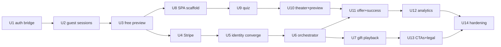

# Implementation Plan: Web Funnel

Builds `specs/web-funnel-spec.md`. All integration claims verified against source 2026-07-14 (scout pass); ⚠ VERIFY items are execution-time checks, listed per unit. Execution posture: server units are **test-first** (the repo has a strong route-test suite pattern; money paths demand it). Frontend units are build-then-verify with screenshot baselines + the impeccable audit/critique gates.

**Sequencing overview:** U1–U3 (identity + free preview) unblock an end-to-end unpaid funnel on staging; U4–U6 (money + delivery) complete the paid path; U7 unblocks the recipient experience; U8–U11 are the frontend riding on top; U12–U14 harden and instrument. U8 can start in parallel with U4+ once U1–U3 are on staging.

---

### U1. One-account bridge: web session → API token

**Goal:** A magic-link web session (existing `__Host-porizo_session` cookie) can call the Bearer-only API — one account across web and app, per the 2026-07-14 decision.
**Requirements:** spec §5.2 (one login, one account).
**Dependencies:** none.
**Files:** `src/routes/auth.js` (new `POST /auth/web/token` near the web-session handlers at :1162), `src/services/auth-service.js` (reuse `issueAccessToken` path), `test/routes/auth-web-token.test.js` (new).
**Approach:** Same-origin endpoint: validate `__Host-porizo_session` cookie via the existing `findActiveWebSession` repo, require matching `Origin` + the CSRF cookie pattern already used by `/auth/magic/exchange`, mint the standard 15-min access JWT bound to the web session's `sessionId`. No refresh token issued (the cookie is the long-lived credential; SPA re-calls on 401). Config: ensure `MAGIC_LOGIN_WEB_ORIGIN` supports `https://porizo.co` (env change; ⚠ VERIFY whether it accepts a list or single origin — extend to list if single).
**Test scenarios:**

- Valid session cookie + correct Origin → 200 with a JWT that passes `requireUserId` on `GET /tracks`.
- Missing/expired/revoked session cookie → 401; wrong Origin → 403; missing CSRF → 403.
- Token's `sub` equals the magic-link user's id (one-account proof: track created with this token appears under the same user as the app).
- Logged-out session (`DELETE /auth/web/session`) → subsequent token mint 401.
  **Verification:** integration test signs in via the existing magic-link web exchange flow (test-mode transaction), mints a token, creates a track, asserts owner id.

---

### U2. Guest sessions + IP rate limiting + Turnstile

**Goal:** Anonymous funnel visitors get a real (guest) user + JWT so every existing endpoint works unchanged; abuse-limited at the door.
**Requirements:** spec §5.2 guests, §8 controls 1–2, 4.
**Dependencies:** none (parallel with U1).
**Files:** `migrations/pg/1XX_users_account_status.sql` + sqlite mirror (⚠ VERIFY existing users columns first — check for an existing status/flags column before adding), new `src/routes/web-funnel.js` (`POST /web/session`), `src/services/turnstile.js` (new, single verify call), `src/database/rate-limit-repository.js` (no change — `ip:` keying exists at :3-21, just unused), `src/middleware/require-user.js` (expose `account_status` on request user), `test/routes/web-session.test.js`.
**Approach:** Endpoint verifies Turnstile token server-side, consumes IP-keyed limits (`ip:<addr>:web_session` ≤5/day, sliding window via existing repo), inserts user (`account_status='guest'`), creates session + JWT pair via existing auth-service issuance. Client IP: use the existing client-IP extraction (hardened June 2026 — reuse, don't reimplement). Feature flag `web_funnel_enabled` gates the route.
**Test scenarios:**

- Happy: valid Turnstile → 200 {access, refresh}; JWT works on `POST /tracks`.
- Invalid/missing Turnstile token → 400; Turnstile API down → 503 with retry-able error (fail closed).
- 6th session same IP same day → 429; different IP unaffected; window rolls over.
- Flag off → 404/503 (route hidden).
- Guest user has zero entitlements (`GET /billing/entitlements` shows 0; no free-grant rows).
  **Verification:** route tests green; manual curl of the full guest → track-create sequence on staging.

---

### U3. Deferred preview spend + caps + budget breaker

**Goal:** Guests render previews without owning a song credit; full render remains the paid spend; provider cost is bounded.
**Requirements:** spec §5.3, §8 controls 3, 5.
**Dependencies:** U2.
**Files:** `src/routes/tracks.js` (`render_preview` spend gate ~:900), `src/services/subscription-manager.js` (no change to `spendSongInTransaction` — verified `render_full` spends fresh when not consumed), new flag rows (`web_funnel_enabled`, `web_funnel_daily_preview_budget`), `src/routes/web-funnel.js` (budget counter), `test/routes/render-preview-guest.test.js`.
**Approach:** In `render_preview`: `if (user.account_status === 'guest' && flag) skip consumeSongEntitlement` — everything else (moderation gate, lyrics-approved gate, rate limits, job enqueue) unchanged. Per-guest caps via existing rate-limit table (`web_preview` action: 2/guest lifetime — use limit with a very long window or a counter column). Global breaker: daily counter (previews or estimated $) checked before enqueue; tripped → 503 `FUNNEL_PAUSED` (client shows hold-your-place email capture) + admin alert email.
**Test scenarios:**

- Guest with 0 entitlements renders preview → 202, `song_entitlement_consumed_at` stays NULL.
- Same guest then `render_full` without wallet token → 402/409 insufficient (spend-fresh path blocks).
- Grant 1 gift-wallet token → `render_full` → 202 and wallet decremented exactly once (idempotent on retry).
- Non-guest user unchanged: preview spends as today (regression guard).
- 3rd preview by same guest → 429 with the cap error code.
- Breaker: set budget to 1, render 2 previews via 2 guests → second gets 503 `FUNNEL_PAUSED`; flag reset restores.
- Flag off → guest preview 402 (today's behavior).
  **Verification:** full unpaid path on staging: guest → track → lyrics → approve → preview → poll job → `preview_url` playable.

---

### U4. Stripe foundation: catalog, checkout, webhook, orders

**Goal:** A guest/user can pay; payment is recorded idempotently and grants exactly one song token.
**Requirements:** spec §5.4.
**Dependencies:** U2 (an authenticated buyer identity exists).
**Files:** `migrations/pg/1XX_web_orders_products.sql` (+sqlite mirror), `migrations/pg/1XX_user_contacts_stripe_source.sql` (CHECK += `'stripe_checkout'` — mirror BOTH engines; the magic-link 23514 incident), new `src/services/stripe-service.js`, `src/routes/web-funnel.js` (`GET /web/products`, `POST /web/checkout`, `GET /web/orders/:sessionId`), new `src/routes/web-webhooks.js` (`POST /web/webhooks/stripe`, raw-body config — Fastify needs `config.rawBody` or a content-type parser for signature verification; follow the Apple/Google webhook precedent in `src/routes/billing.js` ⚠ VERIFY how those get raw payloads), `test/routes/web-checkout.test.js`, `test/routes/web-webhook.test.js` (stripe-mock or constructed events with test signing secret).
**Approach:** `web_products(stripe_price_id UNIQUE, token_count, display_name, active)`; `web_orders(id, checkout_session_id UNIQUE, payment_intent_id, user_id, track_id, track_version_id, price_id, amount_cents, currency, email, status CHECK(pending|paid|rendering|delivered|failed|refunded|abandoned), utm_*, created_at, updated_at)`. Checkout endpoint: block if `PREVIEW_ONLY` app-config is on (never sell what can't render — spec edge #23); reuse open `pending` order per (user, version) to prevent tab-duplication; Stripe session with metadata {order_id,user_id,track_id,version}, Stripe Tax on, consent collection on. Webhook: verify signature; `checkout.session.completed` → transaction {order pending→paid, grant via `applyGiftWalletTransaction(source:'stripe_checkout')`}; `expired` → abandoned; `charge.refunded`/`dispute.created` → mark + revoke share + flag. Orders poll endpoint: owner-scoped; on `pending`, direct `checkout.sessions.retrieve` fallback. 15-min reconciliation sweep (existing cron/scheduler pattern ⚠ VERIFY where crons live — `src/workflows/runner.js` or a scheduler service).
**Test scenarios:**

- Happy: checkout create → simulated completed webhook → order `paid`, wallet +1, second identical webhook → no double grant (idempotency).
- Signature invalid → 400, no state change; unknown event type → 200 ack, no-op.
- Webhook never arrives: poll endpoint with Stripe-retrieve stub returns paid → order flips paid exactly once (race with late webhook → still once).
- Two tabs → one `pending` order reused, single session id.
- `PREVIEW_ONLY` on → checkout 409 `FULL_RENDERS_DISABLED`.
- Refund webhook → order `refunded`, gift share (if any) revoked; dispute → user flagged + admin alert.
- `user_contacts` insert with `source='stripe_checkout'` succeeds on **Postgres** (the constraint test that was missed last time).
  **Verification:** Stripe test-mode end-to-end on staging with real hosted Checkout; `stripe listen` local webhook run.

---

### U5. Identity convergence at purchase

**Goal:** Purchase email lands the order in ONE account — new users become magic-link accounts; existing users get the song in their account.
**Requirements:** spec §5.2 convergence; edge cases #10, #27, #28.
**Dependencies:** U4.
**Files:** `src/services/web-order-identity.js` (new), reuse `src/services/*` contact + magic-link request internals, `src/services/guest-merge.js` (new — the 9-table merge), `test/services/guest-merge.test.js`, `test/services/web-order-identity.test.js`.
**Approach:** On `paid`: (a) buyer already non-guest → nothing; (b) email matches an existing **verified** contact → atomic merge guest→existing in ONE transaction: `tracks.user_id`, `track_library_entries` (move `created` rows; delete stale), `share_tokens.creator_id` (+`bound_user_id` NULL if ever set), `audit_logs.user_id`, gift-wallet balance move; then soft-delete guest user; (c) email new → attach contact (`source='stripe_checkout'`, unverified), `account_status='active'`. Delivery email's manage link = magic-link request for that email (verification event). Never auto-verify from Stripe.
**Test scenarios:**

- (c): new email → contact attached unverified; magic-link login with that email lands in THIS account with the purchased track.
- (b): existing iOS user's email → after merge, `GET /tracks` as existing user includes the purchased track; guest user gone; share token creator = existing user; no orphan `track_library_entries` (the Latifat regression suite).
- (b) with unverified matching contact → treated as (c) attach-to-guest, NOT merge (no account takeover via typo).
- Merge is atomic: inject failure mid-merge → full rollback, order stays `paid` with retry-able convergence state.
- Two rapid webhooks → merge runs once.
  **Verification:** merge test asserts row-level state across all affected tables; manual staging run web-buy with an email that owns an app account.

---

### U6. Post-payment orchestrator: render, share, deliver, refund

**Goal:** After payment, the server finishes the job with zero client involvement: full render → gift share → delivery email; failure → automatic refund.
**Requirements:** spec §5.5; edge cases #4, #11, #19.
**Dependencies:** U4, U5; U3 (spend-fresh path).
**Files:** `src/services/web-order-orchestrator.js` (new state machine over `web_orders.status`), hooks into job completion (⚠ VERIFY the cleanest completion signal: poll orders in the existing runner loop vs job-completion callback in `src/workflows/runner.js`), `migrations/pg/1XX_share_type_gift.sql` (⚠ VERIFY if `share_type` has a CHECK; add value or no-op), `src/services/share-service.js` (accept `share_type:'gift'`, `require_pin:false` default for gift), `src/services/email-service.js` (`sendGiftDeliveryEmail` exists — adapt template: play link + manage magic link + receipt), `test/services/web-order-orchestrator.test.js`.
**Approach:** `paid` → kick `render_full` (server-side, as the buyer user; spends the granted token) → `rendering`; on full-ready → `createOrGetShareToken(share_type:'gift', utm from order)` → delivery email → `delivered`. On render failure: retry ×2 (beyond pipeline-internal retries) → `failed` → Stripe refund API → `refunded` → apology email + admin alert. Every transition idempotent + crash-resumable (a sweep picks up stuck `paid`/`rendering` orders > N min).
**Test scenarios:**

- Happy: paid → delivered; share token exists with `share_type='gift'`, no PIN, UTM stamped; exactly one delivery email.
- Idempotency: re-run orchestrator on `delivered` order → no second share/email/render.
- Render fails 3× → refund called once, order `refunded`, apology email sent, wallet token NOT restored (refund covers it), admin alert fired.
- Refund API itself fails → order `failed` + loud admin alert (never silent — the silent-failure rule).
- Crash mid-`rendering` (kill between render-ready and share-create) → sweep resumes to `delivered` without duplicate email.
- `PREVIEW_ONLY` flipped on after payment → order still completes (flag gates _selling_, not fulfilling) ⚠ VERIFY render_full flag interaction — if hard-blocked, orchestrator must bypass or alert.
  **Verification:** staging E2E: pay (test card) → watch order walk paid→rendering→delivered → email received → link plays.

---

### U7. Gift-share web playback + recipient page upgrade

**Goal:** A gift share plays in ANY plain browser; recipient page becomes the gift-open experience with an app-claim path.
**Requirements:** spec §5.6, §3.3; PRODUCT.md principle 4.
**Dependencies:** U6 (gift shares exist); independently testable with a hand-made gift share.
**Files:** `src/routes/sharing.js` (`rejectBrowserAppOnly` :2190 — pass `share_type==='gift'`; `GET /share/:shareId` `appOnly` logic :1644 — include `web_stream_url` for gift), `web-player/` assets (GiftRevealPlayer treatment: reveal moment, dim scene, karaoke lyrics, post-listen ClaimCard → existing receiver-handoff/OneLink), `test/routes/sharing-gift.test.js`.
**Approach:** Server: minimal, surgical — gift shares behave like demo shares for streaming gates while keeping claim semantics (app claim still available, PIN optional). Client: upgrade the existing `/play` template/player assets with the v3 storefront layer (states: unopened → dim/playing → listened → claim; claimed-elsewhere still plays — lifetime). Reveal withholds lyrics until play (no spoilers). ⚠ VERIFY how `/play` assets are structured (`webPlayerTemplate` + `web-player/` dir) before choosing enhance-vs-rebuild; enhance is the default.
**Test scenarios:**

- Plain browser (no app headers) GET `/share/:id/audio` on gift share → 200 audio bytes with Content-Length > 0 (the byte-flow contract rule); on normal share → 403 APP_REQUIRED (regression guard — app-only behavior intact).
- `/share/:id` JSON for gift in browser → `web_stream_url` present, `app_only:false`.
- Claim from app on a gift share still binds (first-to-claim, 409 on second device).
- Revoked (refunded) gift share → warm unavailable page, no stream.
- OG crawler on gift share → existing OG path unchanged.
- Player states: reveal → play tap (never autoplay) → lyrics sweep → claim CTA only after `ended` fires once; reduced-motion: no dim animation, instant scene.
  **Verification:** manual matrix — Safari iOS, Chrome Android, desktop, TikTok webview: link opens, plays, claim hand-off reaches the App Store page.

---

### U8. Funnel SPA scaffold + storefront design layer

**Goal:** `porizo.co/create` serves the funnel shell: Vite+React+TS app, Warm Canvas v3 storefront tokens, state machine with resume, static-mounted same-origin.
**Requirements:** spec §2.2, §5.1; performance budget §2.3.
**Dependencies:** U1–U3 on staging (API to talk to); parallel with U4–U6.
**Files:** new `web-funnel/` (Vite+React+TS; `src/tokens/storefront.css` importing/extending `public/styles/main.css` variables; `src/state/funnel.ts` machine; `src/api/client.ts`), `src/plugins/http-bootstrap.js` (one more `@fastify/static` mount → `/create`), `Dockerfile` (build step for the SPA ⚠ VERIFY build pipeline — pre-built dist committed vs built in Docker; follow whatever admin-UI does), `web-funnel/vitest` setup.
**Approach:** Steps as a typed state machine (S0–S8), each step persisted (localStorage + server via track row); hash-routed (`/create#memory`) for resume + analytics; guest session created lazily at first submit (S0→S1). Design tokens per spec §2.2 (coral ramp, ink-deep, lamplight, motion tokens, reduced-motion). Bundle budget enforced in CI (size-limit ≤150KB gz).
**Test scenarios:**

- State machine unit tests: forward/back transitions, restore-from-storage lands on furthest step, corrupt storage → clean restart.
- API client: 401 → silent guest re-auth (or token refresh) → retry once; 429/`FUNNEL_PAUSED` → dedicated UI states.
- Static mount serves `/create` and deep links (`/create#offer` refresh) — SPA fallback to index.
- Token contract test: storefront.css defines every token the components consume (no undefined var). Contrast assertions for the new pairs (coral-700 on cream ≥4.5:1, cream text on ink-deep ≥4.5:1).
  **Verification:** `npm run build` in web-funnel; page loads on staging; Lighthouse mobile LCP < 2.0s on the empty shell.

---

### U9. Quiz steps S0–S4

**Goal:** The five warm questions, one per screen, mapping 1:1 to `POST /tracks` Path-A fields.
**Requirements:** spec §3.2 S0–S4, §3.4 states row 1.
**Dependencies:** U8.
**Files:** `web-funnel/src/steps/{Recipient,Relationship,Occasion,Memory,Sound}.tsx`, components `{ChoiceChips,MemoryField,OccasionDate,FunnelShell}.tsx`, `web-funnel/src/api/tracks.ts`.
**Approach:** Field mapping: name→`recipient_name`, relationship→`relationship_type`, occasion chip→`occasion` (+optional date held client-side for copy/urgency; also feeds scheduled-delivery later), memory→`specific_memory`, "what she always says"→`special_phrases`, free message→`message`, genre/mood→`style`, voice→`voice_gender`, `voice_mode:'ai_voice'` always (no voice profile on web). Track created at S4 submit (single POST with all fields — avoids draft-mutation endpoints ⚠ VERIFY no PATCH needed). Occasion chips ordered by verified usage (just-because/I-love-you first). Moderation 403 surfaces field-level with rephrase coaching.
**Test scenarios:**

- Component: chips keyboard-navigable, 44px targets, custom "type your own" path; memory counter warm at 1900+, hard stop 2000; name required, memory soft-min nudge at <20 chars (non-blocking).
- Mapping test: completed quiz → exact `POST /tracks` body (snapshot against the API schema fields, `additionalProperties:false` means drift fails loudly).
- Moderation 403 → memory field error state, no track created, retry works.
- Resume mid-quiz restores all answers.
  **Verification:** staging run-through to a created track; screenshot baselines per step (mobile 390px + desktop).

---

### U10. GenerationTheater, LyricSheet, PreviewPlayer (the dim)

**Goal:** The 60–90s wait converts into investment; the preview moment lands as the emotional peak.
**Requirements:** spec §2.2 components, §3.2 S5–S6, states rows 2–3; edge cases #1, #3, #18, #20.
**Dependencies:** U9 (+U3 live).
**Files:** `web-funnel/src/steps/{Theater,Preview}.tsx`, components `{GenerationTheater,LyricSheet,PreviewPlayer,DimScene}.tsx`, `web-funnel/src/api/{lyrics,jobs}.ts`.
**Approach:** Orchestrate: create version → `lyrics/generate` (lyrics land as one payload; _reveal_ them line-by-line client-side — the writing-stream effect without needing server streaming) → user sees LyricSheet ("Sounds right — hear it" = `lyrics/approve` + `render_preview`) → theater stages until job `preview_ready` → DimScene + audio from the version's `preview_url` (or public `/preview/:versionId.m4a`). Karaoke sweep from `timeupdate` against line timestamps if available, else per-line even-split fallback (⚠ VERIFY lyrics payload for timing data). Edit path: inline edit → `PUT lyrics` → re-approve; regenerate → cap-aware. Refresh mid-render: state machine re-attaches to `GET /jobs/:id`.
**Test scenarios:**

- Job poll: backoff schedule, `failed` → one silent retry then error UI with retry CTA; resumed poll after refresh reaches ready.
- Lyrics 422 quality/fidelity → "one more detail" micro-step appears, feeds regenerate; cap reached → offer nudge instead.
- Player: play/pause/replay keyboard-operable; `ended` fires exact once per listen (Safari quirk guard); no autoplay attempted.
- Dim: reduced-motion renders final dark scene without transition; scroll locked during dim only while playing.
- Preview cap (2) reached → cap state (regenerate hidden, offer emphasized).
  **Verification:** full staging run to an audible preview; screenshot baselines (theater mid-state, lyric sheet, dim playing).

---

### U11. Offer, checkout handoff, success & delivery

**Goal:** The money screen and the post-payment experience: paying feels safe, waiting feels managed, sharing feels immediate.
**Requirements:** spec §3.2 S7–S8, §4; states rows 4–5; edge cases #5, #7, #12, #19, #21.
**Dependencies:** U10, U4–U6 (staging).
**Files:** `web-funnel/src/steps/{Offer,Success}.tsx`, components `{OfferCard,TrustRow,OrderStatus,SharePanel}.tsx`, `web-funnel/src/api/orders.ts`, success route wiring in the SPA router.
**Approach:** OfferCard pulls `GET /web/products` (localized price); CTA → `POST /web/checkout` → redirect to hosted Checkout (same-tab redirect — webview-safe, no popups). Cancel URL returns to `#offer` with state intact + "nothing was charged". Success page: poll `GET /web/orders/:sessionId` → OrderStatus walks paid→rendering→delivered → SharePanel (copy, `sms:`/WhatsApp intents, QR) + "your songs live here" account note (magic-link email sent). >3-min: expectation copy + "we'll email you" (email guaranteed post-pay). Trust content: real numbers only (no invented review counts — TrustRow renders what exists: songs-delivered count from API, payment marks, guarantee line).
**Test scenarios:**

- Offer renders price from products endpoint (no hardcoded price anywhere in the SPA — grep-able invariant).
- Checkout error/cancel → return with full state, retry works, no duplicate `pending` orders.
- Success poll: pending >60s → "confirming payment" + support fallback; webhook-late → resolves on Stripe-retrieve fallback; refunded order → honest failure + refund message.
- SharePanel intents produce correct URLs (encoded share link); copy button announces to screen readers.
- Deep-link into `/create/success?session_id=X` cold (email click, new device) → status renders without funnel state (server is the source of truth).
  **Verification:** two staging E2Es — happy path and render-fail→refund path — both watched to their final email.

---

### U12. Analytics, pixels, CAPI, UTM

**Goal:** Every funnel step measurable; ad platforms receive reliable purchase signals despite webview pixel loss.
**Requirements:** spec §6.
**Dependencies:** U8–U11 (events fire from real steps); U4 (webhook fires CAPI).
**Files:** `web-funnel/src/analytics.ts`, `src/services/meta-capi.js` (new, called from webhook path), UTM stamping in `src/routes/web-funnel.js` (session) + orchestrator (share token), `test/services/meta-capi.test.js`.
**Approach:** Client events → existing `POST /analytics/event` (batch, sendBeacon on unload). Meta Pixel standard events client-side; CAPI `Purchase` server-side from the paid transition with event_id dedup against the pixel. UTM: querystring → guest session row → `web_orders` → `share_tokens` (columns exist, migration 028). TikTok deferred until spend starts (stub interface).
**Test scenarios:**

- Event fires per step with step name + guest id; no PII in event payloads (email never in analytics).
- CAPI purchase: fired once per order (dedup on webhook retry), correct value/currency, hashed email per Meta spec; CAPI failure logged, never blocks the order transition.
- UTM survives the full chain: land with utm → buy → share token row carries it.
  **Verification:** Meta Events Manager test-events view shows paired pixel+CAPI purchase in staging.

---

### U13. Landing & SEO re-point, legal surface

**Goal:** All existing traffic surfaces feed the funnel; commerce legal is in place.
**Requirements:** spec §3.1, §7.
**Dependencies:** funnel live behind flag (U8+).
**Files:** `public/index.html` (hero CTA → `/create`; app download demoted), `public/gifts/*.html` + occasion pages (CTA blocks — programmatic: `scripts/seo/build-programmatic-pages.mjs` template change + rebuild), `public/legal/refund-policy.html` (new), `public/legal/{privacy,terms}.html` (web orders, pixels, guest sessions additions), sitemap regen.
**Approach:** CTA copy per spec ("Make their song — hear a preview free"); occasion pages pass `?occasion=<slug>` to pre-fill S2. Keep download path alive as secondary (smart banner already present). Refund policy = the guarantee + automatic-refund language matching U6 behavior exactly (never promise what the code doesn't do).
**Test scenarios:** (mostly content — `Test expectation: none` for copy) — link-checker over regenerated pages; `?occasion=` prefill lands S2 selected; smart-banner/app-argument untouched (regression).
**Verification:** crawl of production pages post-deploy; manual click-through of 3 SEO pages → funnel.

---

### U14. Hardening: webview matrix, a11y/perf audits, E2E, load

**Goal:** The funnel survives its real environment (ad webviews), meets AA, and can't be broken by the first bot or the first viral day.
**Requirements:** spec §2.3, §8, §9.
**Dependencies:** U1–U13.
**Files:** `test/e2e/web-funnel-user-story.test.js` (extend the existing local E2E user-story pattern), `web-funnel/tests/` (playwright or the browser-harness flow), screenshot baselines dir.
**Approach & checklist:**

- Webview matrix (manual + recorded): TikTok iOS, IG iOS, Safari iOS, Chrome Android, desktop — full buy on Stripe test mode in each.
- impeccable `audit` (a11y/perf/responsive) + `critique` on landing, funnel, /play — findings triaged to fix-or-defer register.
- Abuse drill: scripted 20-guest burst from one IP → caps + breaker behave; Turnstile fail-closed verified.
- Byte-flow contract checks on every audio endpoint touched (Content-Length > 0 assertions in E2E — the monitoring lesson).
- Load sanity: 50 concurrent theater polls (job endpoint is user-scoped + indexed ⚠ VERIFY jobs index on id+user path).
- Kill-switch drill: flip `web_funnel_enabled` off mid-session → in-flight users finish, new entries see holding page.
  **Test scenarios:** the checklist IS the scenarios; each gets a pass/fail entry in the launch-readiness note.
  **Verification:** launch-readiness checklist committed with results; screenshot baselines locked.

---

## Deferred (explicitly not in this build)

- Scheduled delivery (`dispatch_at` exists — v1.1), gift cards, Payment Element in-context checkout, TikTok pixel activation, Android app (separate Skip plan), unifying app-share web playback, display-font brand pass, preview audio watermarking, Etsy fulfillment tooling (manual at first — see execution plan).

## Risks

| Risk                                                   | Mitigation                                                                                                                   |
| ------------------------------------------------------ | ---------------------------------------------------------------------------------------------------------------------------- |
| Guest+free-preview opens provider-cost abuse           | §8 layers; budget breaker is a hard stop; launch flag allows instant off                                                     |
| Stripe webhook/raw-body handling in Fastify is fiddly  | Follow existing Apple/Google webhook precedent; stripe-mock tests; reconciliation covers gaps                                |
| Guest→existing merge corrupts accounts                 | The 9-table checklist is a tested, atomic unit (U5) with the Latifat regression suite; unverified-contact match never merges |
| `render_full` semantics drift (spend-fresh assumption) | U3 regression tests pin today's verified behavior before building on it                                                      |
| Webview payment failures burn ad spend                 | U14 matrix is a launch gate, not a nice-to-have                                                                              |
| Design lands generic (AI-slop)                         | v3 storefront layer + the dim; impeccable critique gate before launch                                                        |
