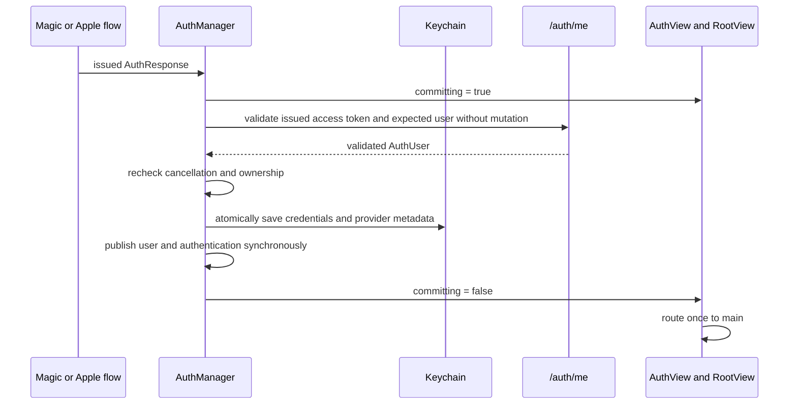

# Atomic authentication session commit without email-screen flash

## Goal Capsule

- **Objective:** Remove the transient email-entry screen shown while a platform-bound magic login completes through legacy Apple-account recovery.
- **Authority:** The observed build 155 production trace and the authentication invariants in `docs/architecture-and-flows.md` override older implementation details in `docs/plans/2026-07-13-003-fix-magic-link-legacy-recovery-plan.md`.
- **Execution profile:** Small, reversible iOS authentication change with focused regression coverage and no backend contract change.
- **Stop conditions:** Do not ship if credentials can become publicly authenticated before `/auth/me` validates the identity, if a failed validation leaves the UI authenticated, or if direct magic login regresses.
- **Tail ownership:** Commit and push the iOS fix, upload the next iOS build to TestFlight for internal testers, and verify processing and assignment. No Railway deployment is required because this correction changes no backend code or contract.

---

## Product Contract

### Summary

Build 155 fixed duplicate-tap login, but an existing Apple-backed account still briefly displays the default email-entry screen after Apple recovery succeeds. Production logs show one magic-link exchange returning `LEGACY_ACCOUNT_RECOVERY_REQUIRED`, followed by a successful `/auth/social` request and `/auth/me` validation. The remaining defect is therefore a client-side state publication gap during the recovery handoff.

### Problem Frame

The UI currently models only direct magic-token completion as a commit phase through `isCommittingMagicLoginSession`. Legacy recovery completes through `handleAppleSignIn`, which saves credentials and sets `isAuthenticated = true` before `/auth/me` completes, without entering that commit phase. `RootView` begins its animated route transition immediately, while `AuthView` can fall through to its default email form when no commit guard or pending presentation is visible.

The required invariant is broader than magic login: any login method that receives credentials must keep the authentication UI in a neutral resolving state until those credentials are durable, the server identity has been validated, and the authenticated state can be published as one completed transition.

### Requirements

- R1. Direct magic login, legacy Apple recovery, confirmed social linking, and legacy phone recovery use the same observable authentication-session commit boundary.
- R2. `isAuthenticated` becomes true only after `/auth/me` validates the issued token and expected user identity.
- R3. While a session is committing, `AuthView` renders only the neutral progress state and `RootView` does not route to main.
- R4. A successful commit publishes the validated user and authenticated state, then routes directly to main without rendering email entry.
- R5. A failed or cancelled `/auth/me` validation leaves the user unauthenticated, exits the commit state, persists no newly issued credentials or provider metadata, and surfaces a recoverable error without losing the legacy-recovery presentation.
- R6. Direct magic-login behavior from build 155 remains one exchange, one validation, and one session publication.
- R7. Confirmed social-account linking uses the same commit semantics so it cannot reintroduce the race.
- R8. Logout, cancellation, and overlapping login attempts cannot allow a stale operation to publish authentication or clear a newer operation's resolving state.
- R9. Email-authenticated users are never presented the obsolete legacy Apple email-upgrade sheet; `needs_profile_completion` remains profile metadata and is not an iOS routing gate.
- R10. Cancelling a phone-owned commit releases its resolving presentation immediately, and confirming a social link clears the durable magic-recovery presentation in the same successful commit.

### Acceptance Examples

- AE1. Given a pending magic login for an Apple-backed legacy account, when the link returns `LEGACY_ACCOUNT_RECOVERY_REQUIRED` and Apple recovery succeeds, then the UI remains in recovery/resolving presentation until `/auth/me` succeeds and transitions once to main.
- AE2. Given valid issued credentials, when `/auth/me` is delayed, then `isCommittingAuthenticationSession` is true and `isAuthenticated` remains false during the delay.
- AE3. Given issued credentials whose `/auth/me` request fails, when the commit ends, then `isAuthenticated` remains false and the resolving state is cleared.
- AE4. Given a normal magic-link account, when the link is opened once, then the session completes once and no email-entry frame is introduced.
- AE5. Given commit A is validating, when logout or commit B supersedes it, then A cannot persist credentials, publish a user, emit completion analytics, or clear B's resolving state.
- AE6. Given an authenticated user whose server profile still reports `needs_profile_completion`, when the app launches or resumes, then the main experience renders without an email-upgrade sheet.

### Scope Boundaries

- In scope: shared iOS credential-commit sequencing, `AuthView`/`RootView` guard naming, removal of the obsolete post-login email-upgrade sheet, deterministic unit tests, release build validation, commit, push, and TestFlight delivery to internal testers.
- Out of scope: changing the backend magic-link or Apple contracts, removing legacy recovery, changing authentication screen design, deploying unchanged backend services, or modifying Android/web authentication.

---

## Planning Contract

### Key Technical Decisions

- KTD1. Replace the provider-specific `isCommittingMagicLoginSession` state with `isCommittingAuthenticationSession`. The user-visible transaction spans magic link and Apple recovery; the state name and ownership must match that boundary.
- KTD2. Validate before persistence. A mutation-free `fetchValidatedUser` uses the issued access token and expected user ID, but does not mutate global auth state, Keychain, OneSignal, notifications, or pending-flow state.
- KTD3. Give each commit an unforgeable operation ID plus the starting session generation. Every continuation after an `await` checks task cancellation, operation ownership, and session generation. Only the owner may publish or clear commit state; logout invalidates ownership.
- KTD4. After validation, persist tokens, provider, and required Apple user identifier in one rollback-capable Keychain batch. A metadata write failure fails the whole commit.
- KTD5. In one non-suspending MainActor segment, perform provider-specific success cleanup, publish the validated user/profile state, and set `isAuthenticated = true`. Completion analytics, OneSignal binding, and notification authorization run only after publication and cannot control commit correctness.
- KTD6. Preserve provider-specific guards before entering the shared helper, but enforce generic ownership inside it. Direct-magic presentation cleanup and `.success` transition occur inside the owned synchronous publication closure before the resolving state ends.
- KTD7. Route direct magic, Apple recovery, confirmed social linking, existing-user phone recovery, and phone registration through the helper. Cold-start restoration remains separate because it validates an already durable session rather than installing newly issued credentials.
- KTD8. Use deterministic URLProtocol-backed tests that can hold and release `/auth/me`, allowing assertions on intermediate, overlap, logout, cancellation, and failure states rather than animation timing.

### High-Level Technical Design

### Sequencing

1. Add characterization tests for delayed, failed, cancelled, superseded, and logged-out authentication commits.
2. Split mutation-free identity validation from current-user side effects and add operation-owned commit state.
3. Introduce the shared commit helper and migrate direct magic, Apple, confirmed-link, and phone credential paths.
4. Rename view/router guards to the generic commit state and expose recovery errors in the recovery branch.
5. Run focused tests, full iOS tests, build, and adversarial review; fix all actionable findings.
6. Commit only scoped plan/code/test/project changes, push, deploy, and verify production health.

---

## Implementation Units

### U1. Shared atomic authentication commit boundary

- **Goal:** Make credential installation and authenticated-state publication one validated transaction.
- **Requirements:** R1, R2, R5, R6, R7, R8, R10
- **Files:** `PorizoApp/PorizoApp/AuthManager.swift`, `PorizoApp/PorizoApp/PhoneAuthView.swift`, `PorizoApp/PorizoApp/PhoneVerificationView.swift`, `PorizoApp/PorizoApp/Services/AnalyticsService.swift`, `PorizoApp/PorizoAppTests/AuthManagerTests.swift`
- **Approach:** Add an operation-owned shared commit helper used by `finishMagicLogin`, `handleAppleSignIn`, `confirmPendingSocialLink`, and both phone credential paths. Validate the issued token through a mutation-free user fetch; recheck cancellation/ownership/generation; atomically persist the complete credential/provider bundle; synchronously run provider cleanup and publish identity/authentication; then schedule post-commit analytics and integrations. Only the owning operation may clear the commit state. Keep the OTP screen awaiting the full commit so it cannot re-enable duplicate submission or swallow validation errors.
- **Test scenarios:** Delayed `/auth/me` keeps committing true and authenticated false; success publishes user and authentication once; 401/500/malformed/mismatched-user responses persist nothing; cancellation and logout during validation persist/publish nothing; phone cancellation immediately releases only its owned commit state; overlapping commits cannot clear or overwrite each other; provider or Apple-ID persistence failure rolls back the full bundle; failure followed by manager reinitialization does not restore the rejected session; direct magic still calls exchange/completion once; confirmed social linking clears the persisted recovery presentation; Apple and phone call sites use the common boundary.
- **Verification:** Focused `AuthManagerTests` pass under the stable Xcode lane.

### U2. Route and presentation guards

- **Goal:** Ensure no authentication UI fallback is rendered while any provider is committing a session.
- **Requirements:** R3, R4, R9
- **Files:** `PorizoApp/PorizoApp/AuthView.swift`, `PorizoApp/PorizoApp/RootView.swift`, `PorizoApp/PorizoApp/ProfileCompletionView.swift`, `PorizoApp/PorizoApp/APIClient+Auth.swift`
- **Approach:** Replace all magic-specific commit references with the generic state. Extract a small pure presentation/routing policy where needed so tests can prove the branch selection. Keep the neutral progress presentation, display actionable Apple-recovery errors inside the recovery branch, and defer the main-route transition until the owning commit ends after authentication is validated. Remove the legacy profile-completion sheet, its seven-day suppression state, and its now-unused client endpoint/view code so email login cannot be interrupted after authentication.
- **Test scenarios:** Commit state selects progress rather than email entry; authenticated-plus-committing remains guarded; authenticated-plus-not-committing resolves to main; recovery failure preserves the recovery controls and displays its error; user-cancelled Apple authorization returns quietly; no profile-completion presentation symbol or trigger remains in the iOS target.
- **Verification:** Compile-time reference sweep finds no old commit-state name; simulator/device behavior remains visually unchanged except removal of the flash.

### U3. Review, release validation, and deployment

- **Goal:** Prove the correction is safe and deliver the reviewed revision.
- **Requirements:** R1-R8
- **Files:** `docs/plans/2026-07-14-004-fix-authentication-session-commit-flash-plan.md`, scoped Xcode project metadata required for the next build number
- **Approach:** Run correctness, security, concurrency, SwiftUI, and regression reviews; apply all verified findings; run focused and full tests plus a release build; commit only scoped files; push `main`; upload the next build to TestFlight; wait for processing; and assign internal testers.
- **Test scenarios:** Static review checks credential leakage, stale-session overwrite, double publication, cancellation, and failure recovery; release build uses stable Xcode; deployment reaches success without new auth errors.
- **Verification:** Clean scoped diff, passing checks, pushed commit SHA, successful TestFlight processing, and internal-group assignment evidence.

---

## Verification Contract

| Gate | Command or method | Done signal |
|---|---|---|
| Reference sweep | `rg "isCommittingMagicLoginSession" PorizoApp --glob '*.swift'` | No matches |
| Focused iOS tests | `xcodebuild test` for `PorizoAppTests/AuthManagerTests` on an available iOS simulator | All focused tests pass |
| Full iOS tests | `xcodebuild test` for the `PorizoApp` scheme | All configured tests pass |
| Stable build | Release or generic iOS device build with the current stable Xcode | Build succeeds |
| Code review | Compound Engineering code review plus auth/security/concurrency/SwiftUI passes | No unresolved P0-P2 findings |
| Repository validation | `npm run lint` and `npm test` | Both pass, including any pre-existing failures fixed per repository policy |
| Deployment | TestFlight upload, processing wait, and internal-group assignment | New build reaches Ready to Test and is assigned to internal testers |

---

## Definition of Done

- The legacy magic-link to Apple-recovery path has one generic commit state from issued credentials through validated identity.
- `isAuthenticated` is never published before `/auth/me` succeeds.
- AuthView cannot select email entry while an authentication session is committing.
- Direct magic login, Apple recovery, and confirmed social linking share the same commit helper.
- Focused and full iOS tests, release build, repository lint, and repository tests pass.
- Review findings are fixed or explicitly proven non-actionable.
- No abandoned helper, duplicate state flag, or temporary instrumentation remains.
- The scoped changes are committed, pushed, deployed, and verified.
