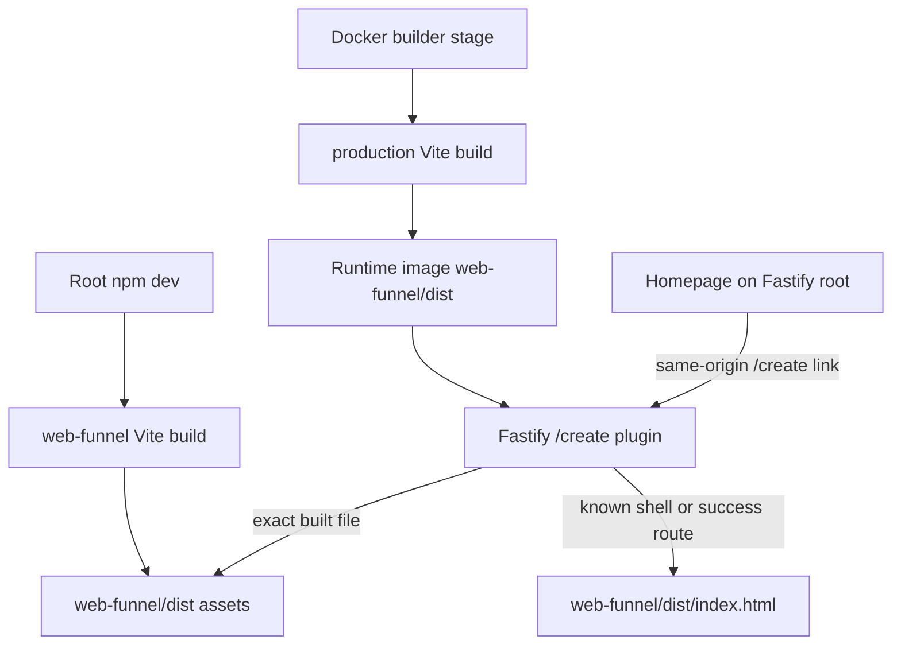

# Integrate the web funnel into porizo.co

This ExecPlan is a living document maintained in accordance with `~/.codex/PLANS.MD`.

## Purpose / Big Picture

After this change, a visitor can enter the song-creation funnel from the live Porizo homepage without leaving the main site or encountering a Fastify JSON 404. The same root service that renders porizo.co will serve the React shell, its real assets, and the checkout-success recovery route at `/create`. The result is observable by starting only `npm run dev`, clicking the homepage CTA, and seeing “Who’s this song for?” at the same origin; the production Docker image will contain the same generated artifact.

## Goal Capsule

- **Objective:** Make the existing homepage entry points and direct `/create` URLs render the built React funnel from the same Fastify origin used by porizo.co, locally and in the Railway Docker image.
- **Authority:** `specs/web-funnel-spec.md` and `web-funnel/design/CODEX-BRIEF.md` define product and integration intent; this plan defines the missing packaging and HTTP wiring.
- **Execution profile:** Proof-first server integration, followed by packaging verification and a real-browser homepage-to-funnel check.
- **Stop conditions:** Stop if production porizo.co is not deployed from the root `Dockerfile`, or if `/create` must live behind a separate edge/static host that is not represented in this repository.
- **Tail ownership:** The implementing session owns tests, local browser evidence, the production-image build contract, consolidated review fixes, and a scoped commit. Deployment is not authorized by this plan.

---

## Product Contract

### Summary

Visitors who select the homepage hero CTA or an occasion pill must stay on porizo.co and arrive in the web funnel. Today those links correctly target `/create`, but the main Fastify server returns a JSON 404 because the built SPA is only available from a separate Vite development server.

### Problem Frame

The web funnel implementation and design are complete enough to run independently, but the shipping boundary is incomplete. The root package does not build the nested Vite app, the Fastify static bootstrap does not mount its output, and the Docker image does not produce or copy the funnel build. Source-level link tests therefore pass while the user-visible path is broken.

### Requirements

- R1. `GET /create` and `GET /create/` on the main Fastify origin return the funnel HTML with a successful status.
- R2. The client-visible success routes `GET /create/success` and `GET /create/success/` return the same SPA shell so checkout recovery works after a refresh or direct link; unrecognized extensionless `/create/*` paths remain 404 until the client supports them.
- R3. Built assets under `/create/assets/`, `/create/fonts/`, and `/create/audio/` are served with their real content types; missing asset-like paths remain 404 rather than receiving HTML.
- R4. Existing API, marketing, player, asset, and well-known routes keep their current behavior.
- R5. `npm run dev` builds the funnel before starting Fastify so the real local site is testable without running a separate funnel server.
- R6. The production Docker image installs the nested package's complete build dependencies, builds the funnel, and contains only its generated `dist` subtree under runtime `web-funnel/`—not funnel source, design mocks, tests, or nested build dependencies—while keeping root runtime dependencies production-only.
- R7. The real `start()` path used by `npm start`, `npm run api`, `npm run dev`, and the Docker command explicitly requires the funnel build and fails startup loudly if it is absent; isolated bootstrap tests may opt out or inject a fixture build.
- R8. Local setup documentation names the nested install step and the single-origin verification path.
- R9. The production funnel build does not publish browser source maps because there is no authenticated source-map upload or error-reporting pipeline in this repository.

### Scope Boundaries

In scope: Fastify static mounting and SPA fallback, deterministic local build wiring, Docker multi-stage build wiring, route and packaging tests, local-development documentation, and browser verification from the homepage.

Out of scope: funnel UI or state changes, backend funnel APIs, checkout, billing, deployment, CDN extraction, production DNS changes, homepage redesign, and unrelated root server refactors.

### Acceptance Examples

- AE1. Given the main local server is running, when a visitor clicks “Make their song — hear a preview free” on `/`, then the browser remains on port 3000, the URL becomes `/create`, and “Who’s this song for?” is visible.
- AE2. Given a direct browser request to `/create/success`, when Fastify handles it, then it returns the SPA HTML rather than a JSON 404.
- AE3. Given the funnel build contains a JavaScript asset, when that exact `/create/assets/...js` URL is requested, then JavaScript bytes and a JavaScript content type are returned; a missing `.js` URL returns 404.
- AE4. Given a clean Docker build context without a checked-in `dist`, when the image is built, then the final image contains `web-funnel/dist/index.html` and can serve `/create`.

---

## Planning Contract

### Key Technical Decisions

- KTD1. Mount the funnel on the root Fastify service under `/create`, not on a separate Vite port or micro-app origin. `(session-settled: user-directed — chosen over a separately hosted funnel: Ambrose requires /create to be part of the main porizo.co website.)`
- KTD2. Keep `web-funnel/dist` generated and ignored. Build it locally before the main dev server starts and in a dedicated Docker builder stage; do not commit generated bundles.
- KTD3. Register the funnel using `@fastify/static` with `wildcard: false`, directory index handling disabled, and explicit shell handlers for `/create`, `/create/`, `/create/success`, and `/create/success/`. Replace the debug public-root static mount with explicit handlers for its four debug files so it neither claims unknown paths nor duplicates landing/legal routes such as `/apple-touch-icon.png`. Do not add a broad `/create/*` fallback: permit only the four GET/HEAD navigation routes, and never return HTML for the `assets/`, `fonts/`, or `audio/` namespaces, file-like paths, unknown routes, or non-GET requests.
- KTD4. Cache the SPA shell bytes at server startup but send `Cache-Control: public, max-age=0, must-revalidate`. Give only Vite content-hashed `/create/assets/*` filenames `public, max-age=31536000, immutable`; stable `/create/fonts/*` and `/create/audio/*` URLs receive `public, max-age=300, must-revalidate`. Tests assert these three policies independently.
- KTD5. Add an explicit `requireWebFunnelBuild` bootstrap option. It defaults false for isolated bootstrap/buildServer tests, while the real `start()` path passes true independently of `NODE_ENV`; this avoids relying on an undocumented Railway environment variable and prevents the shipping service from degrading silently.

### High-Level Technical Design

### Sequencing

First strengthen `test/http-bootstrap.test.js` and add a packaging contract test so the current 404 and missing build wiring fail for the expected reasons. Then add the encapsulated static mount and startup guard. Finally wire local and Docker builds, document setup, and prove the real homepage click path in a browser.

### Risks and Mitigations

- Fastify wildcard precedence could shadow assets or hide broken links, especially when debug static serving is enabled. Mitigation: keep the funnel static registration non-wildcard, expose only the four intended debug files through exact handlers, use an explicit allowlist of shell routes, and test debug mode on and off alongside a landing-owned root asset.
- Long cache headers on `index.html` could strand clients on obsolete hashed filenames. Mitigation: set shell caching separately from immutable asset caching and test both response classes.
- Docker's root production-only install cannot build Vite. Mitigation: use a separate nested builder stage with the web-funnel lockfile and full dependencies, then copy only `dist` to the runtime stage.
- Root tests run without generated artifacts. Mitigation: inject a temporary funnel root into focused bootstrap tests; production-only startup enforcement remains covered separately.

---

## Implementation Units

### U1. Protect the single-origin route contract

- **Goal:** Turn the reproduced homepage-to-404 failure into focused automated coverage before changing production code.
- **Requirements:** R1, R2, R3, R4, R7; AE1, AE2, AE3.
- **Dependencies:** None.
- **Files:** Modify `test/http-bootstrap.test.js`; create the mandatory packaging contract suite `test/web-funnel-deployment.test.js`.
- **Approach:** Build a temporary minimal Vite-like `dist` fixture during the test. Exercise `/create`, `/create/`, both success-path forms, a known asset, missing paths across every asset namespace, an unknown extensionless route, and existing non-funnel static routes with debug mode both disabled and enabled. Add an explicitly required missing-build case with a clear startup error.
- **Execution note:** Add the assertions first and observe them fail against the current bootstrap and package configuration before implementing the mount.
- **Patterns to follow:** Existing cwd-independence and static-asset tests in `test/http-bootstrap.test.js`; source contract tests in `web-funnel/src/contracts/source.test.ts` where packaging behavior cannot be executed directly.
- **Test scenarios:** `GET /create` and `/create/` return fixture HTML while preserving query-driven client state; `GET /create/success?session_id=a.b` and the trailing-slash form return fixture HTML; a known hashed JS path returns its bytes and JavaScript content type; `/create/assets/missing`, `/create/fonts/missing`, `/create/audio/missing`, a missing `.js`, and `/create/unknown` return 404 rather than HTML; `POST /create/success` remains 404; `/web-player/index.html` remains 200; debug mode still serves `/debug-og.html` while allowing the funnel shell; `HEAD` mirrors successful shell and asset `GET` requests; changing `process.cwd()` does not affect the mount; a required missing build throws a message naming `npm run web-funnel:build`.
- **Verification:** The new focused tests fail before the mount and pass after U2 and U3 without depending on the developer's real `web-funnel/dist`.

### U2. Mount the funnel in Fastify

- **Goal:** Serve the built SPA and client routes from the same origin as the homepage.
- **Requirements:** R1, R2, R3, R4, R7; KTD1, KTD3, KTD4, KTD5.
- **Dependencies:** U1.
- **Files:** Modify `src/plugins/http-bootstrap.js`, `src/server.js`, `test/http-bootstrap.test.js`, and `test/debug-upload.test.js`.
- **Approach:** Resolve the default build root from the repository root, validate and read the shell once when the mount is configured, expose enumerated static files with directory index handling disabled, and add explicit shell handlers only for the entry and success routes. Register the debug static plugin with `serve: false` to retain its `sendFile` decorator, then expose exact handlers for `debug.html`, `debug.js`, `debug-og.html`, and `debug-story.html`; this preserves the intended debug surface and `/debug/og-preview` alias without registering unrelated public files twice. Thread `requireWebFunnelBuild` through `buildServer` and have the real `start()` call pass it explicitly. Preserve true 404 responses for every other path and non-GET request. Apply the exact three cache policies from KTD4.
- **Patterns to follow:** Existing cwd-independent roots and repeated `@fastify/static` registrations in `src/plugins/http-bootstrap.js`; the encapsulated `wildcard: false` not-found pattern documented by the installed `@fastify/static` version.
- **Test scenarios:** All U1 route cases; a `POST /create/...` remains 404; the fixture shell works when process cwd changes; static headers distinguish shell, fingerprinted asset, and stable-name font/audio caching.
- **Verification:** Focused bootstrap tests pass and no pre-existing bootstrap assertion changes behavior.

### U3. Make local and production builds deterministic

- **Goal:** Ensure the artifact required by U2 exists in normal local startup and every Railway Docker image.
- **Requirements:** R5, R6, R7, R8; AE4; KTD2, KTD5.
- **Dependencies:** U2.
- **Files:** Modify `package.json`, `Dockerfile`, `.dockerignore`, `docs/local-dev.md`, `web-funnel/vite.config.ts`, `eslint.config.mjs`, and `test/web-funnel-deployment.test.js`.
- **Approach:** Add the exact root script `web-funnel:build` with value `npm --prefix web-funnel run build`, plus `predev` with value `npm run web-funnel:build`. Add a Docker builder stage that installs from `web-funnel/package-lock.json`, copies the funnel sources plus the imported root `public/styles/main.css`, runs the Vite production build, removes the source-copied runtime `web-funnel/` directory, and copies only builder-produced `dist` back into it. Disable public production source maps. Document the one-time `npm --prefix web-funnel ci` install and that `npm run dev` serves both surfaces on port 3000; standalone Vite remains available only for HMR-oriented UI work.
- **Execution note:** This is packaging work; use a real build and container build/static inspection as the primary evidence rather than mocking Docker.
- **Patterns to follow:** The existing root script naming, lockfile-first Docker layer caching, and production-only root dependency install.
- **Test scenarios:** Root build script exits successfully; source contract confirms the Docker builder uses the nested lockfile, includes `public/styles/main.css`, and copies only generated `dist`; the output contains no `.map` files; main dev startup after a build serves `/` and `/create`; `.dockerignore` does not prevent source from reaching the builder.
- **Verification:** `npm run web-funnel:build` produces `web-funnel/dist/index.html`; a Docker build completes; image inspection finds `web-funnel/dist/index.html` but no `web-funnel/src` or `web-funnel/design`; the final running service returns 200 for `/create` without a separate Vite process.

### U4. Prove the customer journey and close review findings

- **Goal:** Validate the integration through the browser path the customer actually uses and resolve every accepted review finding.
- **Requirements:** R1 through R8; AE1 through AE4.
- **Dependencies:** U1, U2, U3.
- **Files:** Update this plan's living sections only if implementation changes a decision or reveals a new constraint; production code changes are limited to files already named by U1 through U3, including the `src/server.js` startup guard.
- **Approach:** Run focused tests, the affected web-funnel checks, root lint and tests, and a production build. Start only the main server, use the homepage CTA and an occasion-prefill link, refresh a nested route, inspect console/network errors, and capture mobile plus desktop evidence. Run one consolidated Compound Engineering code review, fix all valid findings with regression evidence, and rerun only invalidated checks plus the final gate.
- **Test scenarios:** Homepage CTA reaches the recipient step; Birthday pill reaches `/create?occasion=Birthday` with Birthday selected when its step is shown; direct `/create/success` does not 404; CSS, fonts, JavaScript, and demo audio load from port 3000; the acceptance run succeeds without depending on a second funnel server.
- **Verification:** Browser evidence and server logs show successful same-origin requests, the consolidated review has no unresolved actionable findings, and strict scoped preflight passes.

---

## Verification Contract

- **Focused server gate:** `node --test test/http-bootstrap.test.js test/web-funnel-deployment.test.js` passes with the new route and packaging cases.
- **Funnel gate:** from `web-funnel/`, `npm run lint`, `npm test`, and `npm run build` all pass.
- **Affected root gate:** `npm run lint` and `npm test` pass because the static bootstrap and Docker entry service are root production code.
- **Container gate:** `docker build -t porizo-web-funnel-integration .` completes, then image inspection proves `web-funnel/dist/index.html` exists and `web-funnel/src` plus `web-funnel/design` do not.
- **Browser gate:** with only `npm run dev`, the main origin serves `/` and `/create`; homepage CTA, occasion query, nested-route refresh, assets, and console are checked at 390×844 and 1440×900.
- **Review gate:** Compound Engineering plan review runs before implementation; consolidated code review runs after integration; every accepted finding is fixed and backed by a regression test or named browser/build evidence.
- **SCM gate:** strict preflight covers only `.dockerignore`, `Dockerfile`, `package.json`, `eslint.config.mjs`, `src/plugins/http-bootstrap.js`, `src/server.js`, the three touched tests, `web-funnel/vite.config.ts`, `docs/local-dev.md`, and this plan; staged diff check is clean and no unrelated path is staged.

---

## Definition of Done

- The main Fastify server returns the funnel for `/create`, `/create/`, and supported client-side routes.
- Funnel assets load from the main origin with correct content types and missing assets remain 404.
- A clean local setup has a documented nested install and a single `npm run dev` command for the integrated site.
- The production Docker build creates and carries the funnel artifact without committing `dist`.
- Focused, funnel, root, container, browser, and review gates pass as defined above.
- No separate Vite server is required for acceptance, no unrelated worktree changes are staged, and the scoped implementation is committed.

---

## Progress

- [x] (2026-07-15 01:18Z) Reproduced the real homepage CTA reaching Fastify JSON 404 at `/create` while standalone Vite ports succeed.
- [x] (2026-07-15 01:21Z) Mapped the missing Fastify, local build, and Docker integration seams.
- [x] (2026-07-15 01:42Z) Reviewed the plan for coherence and feasibility; resolved the mandatory-test, ExecPlan structure, cache-policy, debug-wildcard, explicit startup, runtime-image, exact-command, and pathname-classification findings.
- [x] (2026-07-15 01:49Z) Added mandatory route/deployment contract tests and recorded seven expected red failures: missing shell/static mount, missing required-build guard, missing root scripts, absent Docker builder, and public source maps.
- [x] (2026-07-15 02:07Z) Completed U2 Fastify integration and focused verification, including the debug-route ownership regression found by the first full-suite run.
- [x] (2026-07-15 02:13Z) Completed U3 local build integration and documentation; nested lint, 46 frontend tests, production build, bundle budget, and no-source-map checks pass. Docker execution remains unavailable because this Mac has no Docker daemon or Docker Desktop application.
- [x] (2026-07-15 02:25Z) Completed main-origin browser QA at 390×844 and 1440×900: homepage CTA, centered site chrome, compact sound rails, Birthday prefill, same-origin assets, and cold success-route refresh pass.
- [x] (2026-07-15 03:02Z) Completed the consolidated code review, fixed every accepted finding, passed the final 3,246-test full-suite gate and strict scoped preflight; the scoped commit follows this plan closeout.

## Surprises & Discoveries

- Observation: The existing U8 implementation plan named the Fastify mount and Docker build as required files, but commit `2d437de2` added only the standalone frontend and homepage links.
  Evidence: the main server returns 404 for both `/create` and `/create/`, while ports 4173 and 4174 return the Vite shell.
- Observation: `@fastify/static` 6.12 documents an encapsulated `wildcard: false` pattern specifically for nested not-found handlers, matching the required SPA fallback without a global catch-all.
  Evidence: the installed package README's “Handling 404s” section.
- Observation: the existing debug public-root mount's default wildcard intercepts extensionless `/create` navigation before a nested handler can respond.
  Evidence: the Compound feasibility probe returned 404 for `/create` and `/create/success` with the wildcard enabled and served both after `wildcard: false`, while preserving `/debug-og.html`.
- Observation: the Docker image does not set `NODE_ENV=production`, so production-only inference cannot safely enforce the funnel artifact without changing unrelated security behavior.
  Evidence: the root Dockerfile has no `ENV NODE_ENV`, while `start()` already gates multiple auth assertions on that variable.
- Observation: changing the debug public static registration to enumerated `wildcard: false` routes duplicated root assets already owned by the landing/legal routes and caused broad server-suite startup failures.
  Evidence: the first full root suite failed with `Method 'GET' already declared for route '/apple-touch-icon.png'`; replacing that mount with a four-file debug allowlist made the focused bootstrap, debug-upload, and representative share suites pass.
- Observation: ignored generated `web-funnel/vite.config.js` and its declaration file overrode the edited TypeScript Vite configuration, so builds continued emitting source maps despite `sourcemap: false` in `vite.config.ts`.
  Evidence: removing the stale ignored files made the production build emit no `.map` files and left the checked-in TypeScript config as the single source of truth.
- Observation: the repository root linter recursively entered installed agent-skill packages and the nested funnel package, which has its own lint configuration.
  Evidence: root lint passed after ignoring agent package roots and `web-funnel/`; `npm --prefix web-funnel run lint` passes independently.
- Observation: the frontend cannot advance past the recipient step on this branch because `POST /web/session` and the production Turnstile configuration are U1–U6 backend dependencies that are not present.
  Evidence: main-origin browser QA reaches the correctly integrated recipient UI, then reports the designed network fallback; `web-funnel/design/CODEX-BRIEF.md` explicitly says those backend units are being built separately and forbids frontend implementation from modifying them.
- Observation: production image execution could not be validated in this environment.
  Evidence: `docker build` failed before reading the Dockerfile because `/var/run/docker.sock` is absent, and `open -a Docker` reports that Docker Desktop is not installed.

## Decision Log

- Decision: Serve the funnel from the existing Fastify/Railway service rather than create another deployment surface.
  Rationale: This is the source-controlled deployment path for porizo.co, keeps homepage navigation same-origin, and directly satisfies Ambrose's integration requirement.
  Date/Author: 2026-07-15 / Codex.
- Decision: Generate `web-funnel/dist` in local startup and a Docker builder stage rather than check it into git.
  Rationale: Hashed bundles are derived artifacts; lockfile-based builds are reproducible and avoid stale committed output.
  Date/Author: 2026-07-15 / Codex.
- Decision: Keep missing build enforcement production-specific and inject fixture roots in focused tests.
  Rationale: The real application startup must fail loudly, while isolated bootstrap/buildServer tests must not depend on a developer's ignored build output. Enforcement is therefore explicit from `start()`, not inferred from `NODE_ENV`.
  Date/Author: 2026-07-15 / Codex.
- Decision: Treat the missing guest-session/Turnstile backend as a named launch dependency rather than expanding this integration fix into backend identity, abuse prevention, entitlements, checkout, and migration work.
  Rationale: The refreshed frontend brief explicitly assigns U1–U6 to another session and makes backend modification a stop condition; the same-origin serving boundary can be completed and verified independently.
  Date/Author: 2026-07-15 / Codex.
- Decision: Pin both Docker stages to `node:20.19-slim` and exclude nested generated Vite/TypeScript config artifacts from the Docker context.
  Rationale: Vite 8 requires Node 20.19 or newer, builder/runtime parity reduces deployment drift, and Docker does not inherit `web-funnel/.gitignore` for ignored local compiler outputs.
  Date/Author: 2026-07-15 / Codex.

## Outcomes & Retrospective

The same-origin integration is complete. Fastify serves the entry and success shells plus exact generated assets, local startup builds the nested frontend first, the real start path fails loudly without the artifact, and the Dockerfile builds the funnel in a dedicated Node 20.19 stage before copying only `dist` into runtime.

Validation completed: focused integration/debug/deployment tests pass (20 tests); the nested frontend lint passes; all 46 frontend tests pass; the production bundle builds at 72,096 bytes gzipped with no source maps; root lint passes; and the full repository suite passes 3,223 tests with 23 intentional skips and zero failures in 536 seconds. Main-origin browser checks at 390×844 and 1440×900 prove the homepage CTA, Porizo chrome, centered column, compact sound rails, Birthday prefill, same-origin fonts/assets, and success-route refresh.

The consolidated Compound review found and fixed debug route duplication, loss of the `sendFile` decorator used by `/debug/og-preview`, incomplete plan/preflight ownership, mutable or too-old Docker Node tags, nested generated-file context drift, and stale local-development instructions. Docker image execution remains the only unavailable evidence because no Docker daemon or Docker Desktop installation exists on this machine; source/lockfile contracts pass, but the image must still be built in CI or a Docker-capable environment. Full customer completion also remains dependent on the separately owned U1–U6 `/web/*` and Turnstile backend work explicitly excluded by the refreshed frontend brief.

## Idempotence and Recovery

The Vite build and Docker build are safe to rerun. The static mount is read-only. If integration fails, stop the main server, remove only generated `web-funnel/dist`, and rebuild; never revert unrelated worktree changes. If the Docker stage fails, retain the builder logs and test the nested `npm ci` plus `npm run build` commands outside Docker before retrying.

## Artifacts and Notes

Current failure evidence is `/private/tmp/porizo-main-create-local-failure.png`. Final evidence should replace this with successful homepage and funnel screenshots from the same main-server browser session.

## Interfaces and Dependencies

The implementation uses the already-installed `@fastify/static` 6.12 plugin, Fastify's encapsulated child plugin and child not-found handler, the existing Vite build with base `/create/`, npm lockfiles for root and `web-funnel`, and the root Railway `Dockerfile`. It introduces no new runtime dependency or public API.
