# Add recipient delivery parity to the web song funnel

This ExecPlan is a living document maintained in accordance with `~/.codex/PLANS.MD`.

## Purpose / Big Picture

After this work, a web buyer who has committed one existing or newly purchased gift credit to a song can decide how the recipient should receive it while the full song renders. “I’ll send it myself” remains the default and preserves the deliberate mobile direct-send gesture. Buyers may instead explicitly ask Porizo to text or email the recipient immediately when the song is ready, or schedule that delivery for a future time.

The result should feel like one product across web and iOS:

- entering a recipient destination never silently sends;
- buyer-controlled Messages/WhatsApp handoff stays deliberate;
- Porizo-hosted delivery requires an explicit destination, channel, and timing confirmation;
- the same share-once recipient link, gift delivery outbox, retry machinery, receipts, and operations surfaces power both clients;
- closing the browser never loses a paid song because the buyer still receives a completion/recovery email.

The high-risk invariant is financial: a gift credit is one fungible wallet unit whether it was purchased through Stripe or StoreKit. Web and iOS must both consume that unit through the existing reservation → gift-funded content → gift finalization lifecycle. Configuring delivery must not create a second debit, and payment origin must not create a second class of credit.

## Goal Capsule

- **Objective:** Add an optional post-credit-commitment delivery choice to `/create`, backed by the existing mobile/backend gift delivery lifecycle without changing its share-once or recipient-playback semantics.
- **User-visible proof:** During `paid` or `rendering`, the buyer can keep manual delivery or configure SMS/email delivery now or later; after completion they see the recipient delivery state and retain manual sharing and recovery controls.
- **Authority:** Current backend implementation and iOS `DirectSendModel` / `GiftSendFlowView` behavior outrank older planning prose. `CLAUDE.md`, `docs/architecture-and-flows.md`, and `specs/personalized-song-platform-spec.md` remain architectural constraints.
- **Risk:** High. This crosses billing, authenticated ownership, recipient PII, share-token lifecycle, scheduling, provider delivery, and two databases.
- **Execution profile:** Backward-compatible migrations first; extract shared gift finalization while preserving mobile responses; add the web bridge and UI behind a feature flag; validate SQLite and PostgreSQL paths; run one consolidated adversarial review before rollout.
- **Tail ownership:** The implementation session owns migrations, backend services/routes/tests, web-funnel UI/tests, operational telemetry, documentation, and a reversible feature-flag rollout. It does not redesign iOS or create a browser contacts permission flow.

## Product Contract

### Requirements

- **R1 — Placement:** The delivery choice appears only after a gift credit is committed, on the success/rendering route. It must not add recipient contact fields before purchase/credit redemption or reduce conversion.
- **R2 — Default:** “I’ll send it myself” is selected by default. If the buyer takes no action or closes the page, the order still renders, becomes recoverable, and emails the buyer the gift link.
- **R3 — Deliberate manual send:** Manual delivery keeps Copy, Web Share, Messages, and WhatsApp actions. The recipient-facing message is always prefilled; it is pre-addressed only when the buyer explicitly entered a still-valid phone number. Otherwise the buyer chooses the recipient in the destination app and remains responsible for pressing Send.
- **R4 — Explicit Porizo send:** Porizo may send only after the buyer chooses SMS and/or email, supplies the required destinations, confirms who the gift is from, chooses timing, and reviews a summary showing recipient, exact destinations, sender identity, timing, and optional note.
- **R5 — No premature dispatch:** While rendering, immediate CTA copy is “Confirm — send when ready”; once ready it is “Confirm and send.” Scheduled CTA copy is “Schedule for {localized date and time}” with “If the song isn’t ready by then, we’ll send it as soon as it is.” A past-due schedule becomes due immediately after readiness; no message may contain an unavailable link.
- **R6 — Mobile parity:** Channel names, destination validation, sender/recipient naming, immediate/scheduled timing, summary language, and retry states should follow `PorizoApp/PorizoApp/Flows/GiftSendFlowView.swift` and `PorizoApp/PorizoApp/Models/GiftModels.swift` unless the browser requires a documented difference.
- **R7 — Shared backend lifecycle:** Automated web delivery uses `gift_orders`, `gift_delivery_outbox`, `dispatchGiftById`, provider receipts, retries, incident reporting, and the scheduled dispatch worker. It must not create a second web-only SMS/email sender.
- **R8 — Fungible credit:** Stripe and StoreKit purchases both grant the same `gift_wallet` balance. A credit bought on web is visible and spendable in the app after identity convergence, and an existing app-bought credit can fund the web flow without another Stripe charge. Buyer-facing copy is source-neutral and never labels balances as web, Stripe, or app credits.
- **R9 — Shared reservation consumption:** A web gift reserves one normal wallet credit, binds the track to that reservation with canonical `funding_source = "gift_wallet"`, skips a second render spend, and passes the reservation transaction into ordinary gift finalization.
- **R10 — Shared cancellation semantics:** Before finalization, full cancellation refunds and deletes the draft. After finalization, a credit may be returned only before provider acceptance and before first recipient share access/claim. After either boundary, full cancellation cannot return credit. Render/content failure refunds once; provider notification failure does not. “Stop automated delivery but keep my gift link” is a separate delivery action and performs no wallet mutation.
- **R11 — Share continuity:** The finalized gift owns one stable share using the common gift claim policy. Manual sharing and Porizo delivery use that same share rather than minting conflicting tokens or branching claim semantics by Stripe versus StoreKit.
- **R12 — Ownership:** Only the authenticated owner of the web order/reservation may read or change its delivery preference. Guest-to-account convergence and cross-device order recovery must preserve order, wallet, reservation, and track ownership together.
- **R13 — PII:** API logs, audit metadata, analytics, and incidents must use the existing contact-redaction helpers. Full phone/email values may exist only in the authenticated preference/order and delivery outbox records required to send.
- **R14 — Honest state:** The UI distinguishes saved preference, waiting for render, ready to share, scheduled, dispatching, delivered, partial delivery, retrying, exhausted failure, and cancelled. Notification failure is not content failure: terminal provider exhaustion leaves the wallet unchanged and the share playable, notifies the buyer, and offers manual sharing rather than revoking/refunding the gift or looping on generic retry copy.
- **R15 — Buyer notifications:** Buyer completion, automated-delivery confirmation, and automated-delivery failure are separate buyer-facing templates. Recipient delivery email remains recipient-facing and is sent only to the recipient destination.
- **R16 — Accessibility and responsive behavior:** The delivery chooser works at 390×844 and 1440×900, with keyboard navigation, labeled fields/errors, reduced motion, no horizontal clipping, and no browser contacts dependency.
- **R17 — Observability:** Every wallet grant/reservation, preference save, finalization, dispatch, cancellation, and fallback records order/gift identifiers and state without raw contact values. Existing gift-ops dashboards must identify the originating web order without changing credit semantics.
- **R18 — Rollout:** Automated delivery is guarded by a server-controlled feature flag. Manual delivery and buyer recovery remain available if the flag or providers are unavailable.

### User journeys

#### Default manual delivery

1. Buyer completes Stripe Checkout and returns to `/create/success`.
2. Rendering begins independently of delivery UI.
3. The page asks “How should {recipient} receive it?” with “I’ll send it myself” selected.
4. The buyer may close the page.
5. When ready, the backend creates the stable gift share, marks the order delivered, and emails the buyer a recovery/completion link.
6. The buyer copies the link or opens Messages/WhatsApp and deliberately sends it.

#### Porizo delivery while rendering

1. Buyer selects Text, Email, or both.
2. The page collects only the selected destination fields, offers Send when ready or Schedule, and displays a final summary.
3. Buyer confirms. The preference is saved against the owned web order; rendering does not wait.
4. When the song is ready, reconciliation finalizes the same wallet-backed gift reservation and creates one ordinary gift order plus one outbox row per channel.
5. Immediate delivery dispatches then. Scheduled delivery waits for its due time.
6. The buyer sees per-channel status and retains the manual link as fallback.

#### Late configuration or recovery

1. A buyer opens the success link on another device and signs in with the receipt email.
2. The receipt’s exact `order_id` restores the paid order and its delivery state; `/web/orders/latest` is used only if the buyer lacks an exact recovery link.
3. If the song is already ready and no automated delivery has started, confirming Text/Email materializes and dispatches the same stable share.
4. If any channel has already been accepted by a provider, destination/timing edits are locked and the UI reports the real status.

### Edge and failure states

- Invalid or missing phone/email blocks only the selected channel and never changes the saved default.
- Duplicate saves with the same idempotency key return the same preference/gift order.
- A preference-save/render-complete race converges through the same reservation-finalization function and unique web-order binding.
- A render/content failure cancels unsent delivery intent and refunds the reserved credit once; provider exhaustion never refunds or revokes playable content.
- A Stripe refund/dispute or Apple consumable refund/reversal reconciles the immutable purchase grant, reservation/gift state, and wallet balance through one cross-source reversal service. If already-spent credits make the net balance negative, spendable balance is clamped to zero while the ledger preserves debt for future grants to settle.
- If one channel succeeds and another fails, the UI reports partial delivery and keeps manual fallback; it does not revoke the link.
- Provider configuration failure leaves the buyer’s link usable and shows honest manual-delivery copy.
- Scheduled delivery may be edited or cancelled only while every outbox row remains unsent.
- Account deletion must remove delivery preference PII and follow existing gift/outbox deletion order.

### User-approved settled decisions

- **KTD1:** Ask for delivery after checkout or existing-credit commitment during rendering, not before commitment. This was selected to preserve conversion and use render wait time productively.
- **KTD2:** Keep manual buyer send as the default and offer explicit Porizo delivery. This was selected over automatic send because a surprise gift and an incorrect destination are costly, irreversible mistakes.
- **KTD3:** Do not build browser contact selection as the primary web flow. Mobile browsers cannot provide a consistent equivalent to iOS Contacts; typed/pasted phone/email plus desktop-to-phone handoff is the reliable contract.
- **KTD4:** Gift credits are fungible across web and app. Stripe and StoreKit are grant sources in the immutable ledger; they do not define different balances, reservation rules, render entitlements, finalization, or refund behavior.

## Planning Contract

### Source precedence

1. Current implementation invariants in `src/routes/web-checkout.js`, `src/services/web-order-orchestrator.js`, `src/routes/gifts.js`, `src/plugins/gift-delivery.js`, and their tests.
2. Current iOS behavior in `DirectSendModel.swift`, `GiftSendFlowView.swift`, `GiftScheduleManagementView.swift`, `APIClient+Gifts.swift`, and `GiftModels.swift`.
3. `CLAUDE.md`, `docs/architecture-and-flows.md`, and `specs/personalized-song-platform-spec.md`.
4. This plan’s user-approved product decisions.

### Current-state discoveries

- Stripe payment grants a token using idempotency key `web_order_{order.id}`.
- `renderFullVersionForOrder` spends that token using `song_spend_{trackVersionId}` and stamps `track_versions.song_entitlement_consumed_at`.
- The web orchestrator currently creates a PIN-free gift share only after render readiness and sends recipient-style email copy to the buyer.
- The mobile direct-send path is deliberate: it mints a PIN-free share and opens Messages/WhatsApp, but does not send automatically.
- The dedicated mobile gift flow already validates channels and destinations, supports immediate/scheduled delivery, and finalizes through the durable gift-order/outbox dispatcher.
- `createGiftOrderFromPayload` is nested inside the HTTP route module and auto-debits a token unless supplied a prior transaction. Reuse therefore requires extracting a shared service and making funding/refund semantics explicit.
- Existing full gift cancellation/refund behavior is the starting point, but must gain provider-acceptance and first-share-access guards. A new delivery-only stop must be named and implemented separately so stopping an SMS/email does not masquerade as cancelling the gift credit/content.

### Scope boundaries

In scope:

- backward-compatible SQLite and PostgreSQL schema/index evolution;
- common Stripe/StoreKit gift-wallet grant reversal, debt, refund, and conservation rules;
- cross-platform wallet-balance visibility and a web “use existing gift credit” path;
- a shared gift-order finalization service;
- web-order delivery preference, reconciliation, status, and cancellation APIs;
- orchestrator and refund/dispute integration;
- web-funnel responsive UI and tests;
- buyer/recipient email separation;
- analytics, audit events, operational visibility, feature flag, and rollout runbook.
- targeted iOS model/API/management compatibility for new common gift states and wallet refresh.

Out of scope:

- redesigning the iOS create or GiftSendFlow UI;
- adding browser contact permissions;
- replacing Twilio, Resend, Stripe, or the gift dispatch worker;
- changing share claim/player semantics;
- creating social delivery channels beyond the existing manual WhatsApp/Messages handoff;
- changing gift-bundle prices or payment providers.

### Architecture

```mermaid
flowchart LR
    A[Stripe or StoreKit purchase] --> B[Fungible gift wallet]
    B --> C[Shared gift reservation]
    C --> D[Web track bound as gift_wallet funded]
    D --> E[Full render skips second spend]
    C --> F[Buyer saves delivery preference]
    E --> G[Finalize shared reservation + stable share]
    F --> G
    G -->|manual/default| H[Ready-to-share gift + buyer controls]
    G -->|SMS/email confirmed| I[Ordinary gift order]
    I --> J[Gift delivery outbox]
    J --> K[Existing scheduled dispatcher]
    K --> L[Twilio / Resend]
    L --> M[Receipts, retries, incidents]
    M --> N[Buyer delivery status + manual fallback]
```

### Data contract

Add a reusable one-to-one `gift_delivery_preferences` table keyed by `gift_reservation_id` rather than scattering mutable recipient PII across `web_orders`:

- `gift_reservation_id` primary key and foreign key;
- `mode`: `manual`, `immediate`, or `scheduled`;
- `channels_json`;
- `recipient_phone`, `recipient_email`;
- `sender_display_name`;
- `sender_timezone`, `send_at`, optional `message`;
- `expires_in_days`, defaulting to the shared 30-day gift policy;
- optimistic `revision`;
- `created_at`, `updated_at`.

Add durable recovery linkage:

- `web_orders.payment_source`: `stripe` or `gift_wallet`, defaulting existing rows to `stripe`;
- `web_orders.funding_model`: existing rows remain `legacy_song_spend`; new flag-on rows use `gift_reservation_v1`;
- nullable `web_orders.purchase_transaction_id` as informational checkout provenance only; it must never select which fungible credit funded content or branch entitlement/cancellation behavior;
- `web_orders.gift_reservation_id`, nullable unique link to the shared reservation;
- optional unique `gift_orders.origin_web_order_id` for traceability only; canonical linkage is `web_orders.gift_reservation_id → gift_reservations.gift_order_id`.

Wallet-funded orders have no Stripe Checkout session. Keep the existing non-null column for SQLite rollback compatibility and store a deterministic opaque internal reference `wallet:{orderId}`; it is never treated as an authentication credential. Add an owner-checked order-ID status route and keep the current session-ID route and Stripe success URL backward-compatible.

Replace the global one-active-reservation-per-user rule with an explicit reservation `purpose`/`scope`:

- add non-null `purpose` with existing rows backfilled/defaulted to `interactive_draft`;
- add nullable `origin_web_order_id` with a unique partial index for `paid_web_order`;
- `interactive_draft` remains the iOS draft returned by `/gifts/reservations/active` and is uniquely active per user;
- `paid_web_order` is unique by `origin_web_order_id`, not globally by user;
- content attachment remains unique so two reservations cannot fund one track/version.

The wallet ledger stores net balance, including internal purchase-reversal debt. Public spendable balance is `max(0, net_balance)` and spending requires net balance greater than zero. Purchase source remains immutable ledger metadata; debt is visible to operations but never presented as a negative consumer balance.

Do not add a web-specific funding source. `gift_reservations.token_transaction_id` and `gift_orders.token_transaction_id` retain their existing meanings. Purchase origin remains immutable transaction metadata (`stripe_checkout` or Apple receipt), while every consumer sees one wallet balance.

### API contract

- `GET /web/orders/:sessionId`, `GET /web/orders/by-id/:orderId`, and `GET /web/orders/latest` expose separate `content_status` and `delivery_status` axes plus wallet/reservation/delivery summaries. Delivery includes mode, revision, `can_edit`, aggregate `can_stop_any`, selected channels with per-channel `can_stop` and masked destinations, timing, finalized gift ID, and aggregate/per-channel status. Responses never return raw destinations or provider payloads.
- `POST /web/orders` with `{ track_id, track_version_id, payment_method: "gift_credit" }` plus `Idempotency-Key` creates an owner-bound wallet-funded order, reserves the credit through the shared service, and returns `{ order_id, status_url }`. It does not require or invent a Stripe session.
- After Stripe reports paid, the backend grants ordinary wallet credit and invokes the same reservation service used by `/gifts/reservations`.
- `PUT /gifts/reservations/:id/delivery` persists an explicit delivery draft using shared validation. Web calls the same reservation contract; iOS may adopt it later without a schema change.
- `POST /gifts/reservations/:id/finalize` accepts either its existing request body or the persisted delivery draft and supports `delivery_mode=manual` as a ready-to-share gift with no provider outbox rows.
- A delivery-only stop endpoint cancels selected still-unsent outbox channels while preserving accepted channels, the finalized gift/share, and wallet state. Destination/timing edits lock after the first provider acceptance, but each remaining unsent channel exposes its own `can_stop`. Existing full gift cancellation applies the common pre-access/pre-provider-acceptance eligibility rule.
- Existing `/gifts` mobile contracts remain backward-compatible.

Destination edits are replace-only: GET returns masks, omitted destination fields preserve existing values, and changing a destination requires the complete value to be re-entered and reconfirmed. Raw values never leave the authenticated write path or provider boundary.

The canonical recovery handle is `order_id`, carried in buyer emails and wallet-funded success URLs. Session-ID polling remains a Stripe compatibility route; `/latest` is fallback discovery only and must not select among multiple orders when a specific order ID is available.

## Implementation Units

### U0 — Define common wallet conservation and purchase reversal

**Goal:** Make Stripe and StoreKit true grant sources for one wallet, including refunds after credits have moved or been spent.

**Requirements:** R8–R10, R17.

**Dependencies:** None.

**Files:**

- `src/services/gift-funding.js`
- new `src/services/gift-purchase-reversal.js`
- gift wallet repositories for SQLite and PostgreSQL
- Stripe refund/dispute handlers
- Apple consumable notification handler
- wallet API serializers and operations views
- focused wallet/reversal tests

**Approach:**

1. Add one `reverseGiftPurchaseGrant()` domain service for Stripe refund/dispute and Apple consumable `REFUND`/`REFUND_REVERSED`. It reverses the exact immutable purchase grant’s `token_count` into common wallet net/debt; it never identifies or revokes “the gift funded by this provider” because subsequent spending is fungible.
2. Preserve immutable source transactions and allow internal net wallet debt when a purchase reversal exceeds unused balance. Public APIs return spendable `max(0, net)`; operations show debt; future grants settle debt before becoming spendable.
3. Guard every spend/reserve on positive net balance and use provider-event idempotency keys for duplicate/out-of-order reversal events.
4. Keep purchase reversal distinct from gift cancellation. A user cancellation or content failure reverses the reservation debit only; a provider-confirmed refund reverses the purchase grant only. Never infer source attribution from `purchase_transaction_id`, and never reverse a grant merely because notification delivery failed.
5. Define the common gift-cancellation boundary: pre-finalization cancel refunds/deletes the reservation; finalized cancel refunds the reservation only before provider acceptance and first share access/claim; render failure refunds the reservation; provider failure preserves content and balance.

**Test scenarios:**

- Mixed app- and web-purchased credits remain one balance and are spent without source preference.
- Provider refund with unused credit, after reservation, after delivered/claimed gift, and at zero balance reverses the exact grant without choosing a source-attributed gift; consumed value becomes debt where required.
- Duplicate and out-of-order refund/reversal events are idempotent.
- Apple consumable refund and Stripe refund execute the same conservation rules.
- Future grants first settle debt; no reversal path creates arbitrary double credit.
- Cancel/access and cancel/provider-acceptance races choose exactly one reservation-refund outcome and never invoke purchase-grant reversal.

**Verification:** Focused SQLite/PostgreSQL wallet, provider-webhook, and conservation tests pass before checkout/reservation integration begins.

### U1 — Extract shared reservation and gift-finalization services

**Goal:** Make web and mobile reserve and finalize the same fungible wallet credit through one tested domain lifecycle without changing existing mobile API responses.

**Requirements:** R6–R12, R17.

**Dependencies:** U0 conservation contract.

**Files:**

- `src/routes/gifts.js`
- new `src/services/gift-reservation-service.js`
- new `src/services/gift-order-service.js`
- `src/services/gift-funding.js`
- `src/database/gift-reservation-repository.js`
- `src/database/gift-order-repository.js`
- `src/database/gift-dispatch-repository.js`
- `src/database/share-token-repository.js`
- `test/gifts.test.js`
- new focused service tests under `test/services/`

**Approach:**

1. Extract reservation creation so both `/gifts/reservations` and the paid web-order path call the same transaction: ensure wallet, debit one `gift_reserve`, create the reservation, and return the same balance/ledger result. Every conditional write checks affected rows.
2. Add an adoption operation for an owned, unconsumed web track/version: attach it to the reservation and atomically set `tracks.gift_reservation_id` plus canonical `funding_source = "gift_wallet"`. Reject content already funded, rendered with a paid entitlement, deleted, or attached elsewhere.
3. Move sender-name resolution, share creation, gift-order insert, outbox seeding, reservation finalization, and integrity checks from the route closure into an injected finalization service.
4. Add common `delivery_mode=manual`: `status=ready_to_share`, `dispatch_status=not_requested`, channels `[]`, zero outbox rows, and ready-time dispatch timestamps. Update shared parsers, enums, repository integrity, job queries, API/admin renderers, and worker selection so manual is never coerced to immediate or dispatched.
5. Change terminal provider exhaustion to `delivery_failed` with no share revocation or wallet mutation. Send the buyer a failure notice and preserve manual fallback.
6. Keep immediate/scheduled mobile behavior and current HTTP response shapes backward-compatible.
7. Make full cancellation evaluate provider acceptance and share first-access/claim atomically before returning credit. After partial acceptance, lock destination/timing edits but expose per-channel `can_stop` for each still-unsent row; stopping one channel never revokes content or mutates the wallet.
8. Use provider idempotency/correlation at crash boundaries: Resend idempotency key is the outbox ID; Twilio callbacks carry an opaque authenticated outbox correlation; stale `sending` rows wait through a receipt grace period before retry. Document residual duplicate-SMS risk.
9. Make reservation and gift idempotency keys enforce one reserve and one finalization under webhook/poll/sweep races.

**Test scenarios:**

- Existing direct `/gifts` creation still debits one token.
- Existing reservation finalization still consumes its reserved transaction and remains idempotent.
- Stripe and StoreKit grants increase the same wallet and produce no source-specific balance.
- An app-purchased credit can reserve a web track; a Stripe-purchased unused credit appears through the app wallet API.
- Web reservation debits exactly one `gift_reserve`; gift-funded full render performs no `song_spend`; finalization performs no second debit.
- Track adoption rejects mismatched ownership, consumed versions, and duplicate reservation binding.
- Manual finalization produces a stable share and no outbox rows.
- Manual rows are never selected by the dispatch worker and remain valid with zero outbox rows.
- Exhausted email/SMS leaves wallet unchanged and the share playable for app- and web-origin gifts.
- Provider accepted → DB mark failure → receipt/recovery, duplicate receipt, and stale-lock recovery do not double-dispatch email; residual SMS risk is surfaced.
- Full cancel racing first share access or provider acceptance never refunds consumed/accepted content.
- Concurrent duplicate finalization returns one gift order and one outbox row per channel.
- SQLite and PostgreSQL adapters both report affected rows correctly.

**Verification:** Focused service and gift route tests pass before any web route calls the service.

### U2 — Add backward-compatible reservation linkage and delivery-draft migrations

**Goal:** Persist the web order’s shared reservation and a reusable delivery draft required for crash-safe cross-device recovery.

**Requirements:** R5, R8–R14, R17.

**Dependencies:** U0–U1 interfaces agreed before runtime use.

**Files:**

- new matching migrations in `migrations/` and `migrations/pg/`
- `src/database/web-orders-repository.js`
- new `src/database/gift-delivery-preference-repository.js`
- `src/database/account-deletion-repository.js`
- `test/database/postgres-core-schema-repair.test.js`
- repository and migration parity tests

**Approach:**

1. Add the generic preference table, `web_orders.funding_model`, informational purchase transaction, reservation linkage, optional gift-order origin trace, plus `gift_reservations.purpose` and `gift_reservations.origin_web_order_id` described in the Data contract. Do not add circular web-order/gift-order foreign keys.
2. Backfill every existing reservation to `purpose=interactive_draft`, then replace `idx_gift_reservations_user_active` with purpose-scoped partial indexes: one active interactive draft per user, one paid reservation per non-null `origin_web_order_id`, and unique content attachment. Preserve `/gifts/reservations/active` as the newest active `interactive_draft`.
3. Keep `checkout_session_id` non-null and use `wallet:{orderId}` for internal wallet-funded references; do not require a SQLite table rebuild merely to model a non-Stripe order.
4. Existing web orders default to `legacy_song_spend`; every eligible new web order uses `gift_reservation_v1` after the migration/code cutover, independent of the automated-delivery feature flag. Backfill `purchase_transaction_id` only when safely derivable and never synthesize reservations for historical orders.
5. Add check/unique indexes where PostgreSQL and SQLite parity permits; enforce remaining enum validation in the service.
6. Add repository compare-and-set/upsert methods with explicit revision, affected-row checks, and reservation-owner joins.
7. Extend account deletion and guest-to-account merge to preference, reservation, gift order, incidents/audit ownership, and linked records in dependency-safe order.

**Test scenarios:**

- Migration parity and repair paths create identical columns/indexes.
- Active app draft + paid web order, two distinct paid web orders, duplicate same order, and concurrent reserve do not collide or cross-attach.
- Legacy paid/rendering/delivered/refunded rows retain `legacy_song_spend` behavior after deploy and rollback.
- Preference upsert increments revision and cannot cross owners.
- Canonical order → reservation → gift linkage passes integrity/repair checks without duplicate pointers.
- Account deletion leaves no destination PII or orphaned linkage.

**Verification:** Migration parity, repository tests, and focused PostgreSQL tests pass.

### U3 — Converge web payment or wallet redemption on the shared gift lifecycle

**Goal:** Make Stripe purchases and existing wallet credits enter the same reservation, gift-funded render, and finalization state machine under every event order.

**Requirements:** R2, R5, R7–R15, R17–R18.

**Dependencies:** U0–U2.

**Files:**

- new `src/services/web-order-delivery.js`
- `src/services/web-order-orchestrator.js`
- `src/routes/web-checkout.js`
- `src/server.js`
- `src/jobs/gift-dispatch.js` only if source classification is required by due-query/metrics
- `src/services/email-service.js` and templates
- `test/services/web-order-orchestrator.test.js`
- `test/routes/web-checkout.test.js`
- `test/email-service.test.js`
- gift dispatch/receipt tests

**Approach:**

1. Resolve and validate an identity-convergence target when one exists. If the Stripe webhook arrives before sign-in and no target account exists, transact the complete paid graph under the current guest owner. If a target exists, merge inside the paid transition transaction. On later receipt-email sign-in, atomically merge the already-paid complete graph before owner-checked recovery.
2. Extend guest merge to move the entire wallet/order/track/reservation/preference/gift ownership graph, lock both wallet rows, collision-check ledger idempotency keys, and remain retry-idempotent when the target already has balance and an active interactive draft. For Stripe, execute merge-if-available + paid CAS + grant + reserve + reservation + track adoption + web-order link in one database transaction. For existing credit, execute paid web-order insert + reserve + reservation + adoption + link in one transaction. Every conditional step checks affected rows; provider calls happen only after commit.
3. Update `renderFullVersionForOrder` to use the ordinary track entitlement function. Because the adopted track is `gift_wallet` funded and has an active reservation, it stamps consumption but performs no second wallet debit.
4. Introduce `reconcileWebOrderDelivery(orderId)` after preference save, render readiness, recovery sweep, and relevant reversal transitions.
5. On readiness, finalize the linked reservation using the saved draft or `manual` default. Manual mode creates the one common-policy gift share and sends only the buyer completion email.
6. For immediate/scheduled mode, ordinary finalization creates the gift and outbox using the reservation’s existing token transaction.
7. Dispatch immediate rows only after transaction commit. Let the existing worker handle scheduled rows and retries.
8. Make payment/poll/reserve/preference/readiness/sweep races harmless through stable idempotency keys plus reread-and-return behavior.
9. Separate templates:
   - buyer: song ready and recoverable, with manual link;
   - buyer: recipient delivery accepted/scheduled/succeeded/failed;
   - recipient: existing gift delivery template.
10. On render failure, apply the common reservation cancellation/refund path once. Route Stripe refunds/disputes and Apple consumable refunds/reversals through U0’s common grant-reversal service; never use provider-delivery failure as a refund trigger.
11. Tag logs, audits, incidents, and emails with `web_order_id`, `gift_reservation_id`, and `gift_order_id`, never raw contacts.
12. Prevent the reservation-expiry sweep from refunding/deleting content while its linked paid web order has an active render. Use a common “active content work” check and a bounded expiry extension so this also hardens slow mobile gift renders.
13. Branch orchestration by `funding_model`: historical `legacy_song_spend` orders preserve their current recovery/refund behavior; only `gift_reservation_v1` orders enter this graph.

**Test scenarios:**

- An existing app-bought credit starts the web order without Stripe and creates the same reservation shape as an iOS gift.
- A zero-credit signed-in buyer selects an explicit server-priced bundle; Stripe grants its `token_count`, one credit is reserved, and the remainder is visible in the app wallet.
- Stripe checkout grants the common wallet, then reserves exactly one credit for the current web gift.
- Manual default finalizes the reservation with a share, no outbox, and exactly one buyer completion email.
- Preference before readiness finalizes only after the full URL exists.
- Preference after readiness finalizes the same reservation and dispatches.
- Payment/reserve/save/readiness/sweep races create one wallet reserve, reservation, share, gift order, and channel row.
- Fault injection after each financial/graph write on SQLite and PostgreSQL leaves either the complete order→ledger→reservation→track graph or no writes and no balance change.
- Browser close requires no preference and buyer recovery still works cross-device.
- Immediate SMS/email and dual-channel partial failure reuse current dispatch behavior.
- Scheduled time before readiness sends once immediately after readiness.
- A render that exceeds the default reservation TTL remains funded and finalizes; a genuinely abandoned reservation still expires and refunds once.
- Render failure sends nothing to recipient and cleans unsent intent.
- Delivery-only stop performs no wallet mutation and keeps the buyer’s share live.
- Full gift cancellation follows the same access/acceptance eligibility regardless of purchase origin.
- Stripe/Apple purchase reversal cannot double-credit a reservation refund, and spent refunds create auditable debt rather than free balance.
- A paid guest with reserved/rendering/finalized gift can merge into a target with wallet balance and an active app draft; the whole graph moves once with no balance duplication.
- A webhook-first guest purchase completes under the guest owner, then receipt-email sign-in moves the complete graph before exact-order recovery.
- Existing legacy web orders continue polling, recovering, delivering, and refunding under the old funding model.
- Recipient email goes to recipient; buyer templates go only to buyer.

**Verification:** Web checkout, orchestrator, gift dispatch, receipt, email, and PostgreSQL transaction tests pass.

### U4 — Add owned delivery APIs and safe response shapes

**Goal:** Let the web client save, recover, observe, and cancel delivery without exposing provider internals or weakening ownership.

**Requirements:** R4–R5, R8–R14, R18.

**Dependencies:** U2–U3.

**Files:**

- `src/routes/web-checkout.js` or new `src/routes/web-order-delivery.js`
- API schema/error documentation
- `test/routes/web-checkout.test.js`
- authentication/CSRF contract tests

**Approach:**

1. Add the wallet-funded order, GET summary, reservation preference, finalize, and delivery-stop endpoints from the API contract.
2. Reuse web session authentication, Origin/CSRF validation, rate limiting, and order ownership checks.
3. Reuse backend phone/email/channel/schedule normalization from the extracted service rather than duplicating regexes.
4. Return stable error codes for invalid destination, invalid schedule, delivery locked, providers unavailable, feature disabled, order not ready, and ownership/not-found.
5. Mask destinations in every polling/status response. A “Change destination” action starts with blank destination fields; the buyer re-enters the complete value and reconfirms the exact summary. Raw destinations are never returned merely to repopulate a browser form.
6. Define one typed mapping from `gift_orders` plus outbox rows to delivery status. Content `delivered` means the song/share is ready, not that the recipient received it.
7. Treat `wallet:{orderId}` as an internal storage reference only. All wallet-order reads require owner authentication and the canonical order ID; no route accepts the opaque storage reference as bearer authority.

**Test scenarios:**

- Owner can save/read/cancel; another user receives indistinguishable not-found.
- Missing CSRF/origin fails without mutation.
- Invalid channels and destinations map to honest errors.
- Feature disabled preserves manual mode.
- Idempotency replay is stable.
- Omitted masked destinations remain unchanged; replacements require full re-entry and are rejected after provider acceptance.
- Raw contact values and provider payloads are absent from logs, incidents, audits, analytics, aggregate responses, and account-deletion residue.
- Two orders owned by one buyer recover by explicit order ID without `/latest` returning the wrong one.

**Verification:** Route contract and security tests pass.

### U5 — Build the post-checkout delivery chooser and status UI

**Goal:** Use render wait time to configure delivery without blocking rendering, losing manual fallback, or introducing visual noise.

**Requirements:** R1–R8, R14–R16, R18.

**Dependencies:** U4 response contract.

**Files:**

- `web-funnel/src/api/funnel.ts`
- `web-funnel/src/App.tsx`
- `web-funnel/src/steps/Success.tsx`
- new focused delivery component/state module under `web-funnel/src/`
- `web-funnel/src/styles.css`
- affected Vitest/Testing Library tests
- web design contract/source tests where required

**Approach:**

1. Extend the typed product contract with `token_count` and never select `products[0]` implicitly. At the offer:
   - signed-in balance > 0: “Use 1 gift credit,” “{X} gift credits available in Porizo,” and “Use your gift credits here or in the Porizo app”;
   - signed-in balance = 0: explicit server-priced bundle choices;
   - guest: server-priced purchase plus “Sign in with your receipt email to use remaining credits anywhere.”
   After reservation show “1 gift credit applied · {X} left.”
2. During paid/rendering, show a compact, non-blocking “How should {recipient} receive it?” card below progress.
3. First choose who sends: “I’ll send it” (default) or “Porizo sends it.” For Porizo, choose Text and/or Email, then “When it’s ready” or “Schedule.” Timing is not a peer of sender ownership.
4. Match mobile E.164/email normalization, one-minute scheduling minimum, sender-name resolution, optional note, timezone, and 30-day share policy. Prefill “From” from the authenticated profile/checkout identity and require it when unavailable. Use browser-native inputs and no Contacts permission.
5. Save only after the buyer confirms exact recipient, destinations, sender identity, timing, and note. Then mask destinations. Use readiness-aware copy from R5; saved copy is “We’ll send it when the song is ready” or “Scheduled for {date/time} in {timezone}.”
6. Keep a dedicated `DeliveryDraft` reducer/hook mounted across paid → rendering → delivered. Separate confirmed server revision from local edits, abort stale saves, refetch on revision conflict, and preserve field focus while order polling updates.
7. Version order recovery to store `{ kind: "session" | "order", value }`. Buyer email and wallet success use explicit order ID; `/latest` remains fallback only.
8. Poll content and recipient delivery on separate axes. Stop continuous polling only when content is terminal and delivery is terminal or stably scheduled; refresh scheduled status on focus, buyer action, and explicit “Check status.”
9. Expose distinct controls:
   - “Change delivery” before the first provider acceptance, with blank re-entry fields;
   - per-channel “Stop {Text|Email}” for each still-unsent row, even if another channel was accepted;
   - stop confirmation: “We’ll stop the unsent {channel}. Any delivery already accepted may still arrive. Your song and gift link stay available. No credit is returned”;
   - full “Cancel gift and return credit” only when the common policy permits it, under a separate destructive confirmation;
   - accepted channels are read-only and manual fallback remains available.
10. On the ready state show:
   - recipient delivery status by channel;
   - manual Copy, Web Share, Messages, and WhatsApp/WhatsApp Web fallback;
   - support path for exhausted provider failure.
11. Do not put the recipient share URL in a desktop QR. A short-lived owner-bound mobile-management handoff is a separate future feature.
12. Recipient SMS/email copy identifies the sender (“{sender} sent you a song through Porizo”) and includes required support/opt-out language.

**Test scenarios:**

- Existing wallet credit bypasses Stripe and reaches the same paid/rendering state.
- One-credit and multi-credit products preserve `token_count`; only one credit is reserved and remaining balance is source-neutral.
- Default mode persists/finalizes `manual` without provider delivery.
- Text/email/sender/schedule validation and exact explicit confirmation.
- State restores by exact order ID after reload/cross-device recovery, including two orders owned by one buyer.
- Render progress and status polls do not erase edits, move focus, or remount the chooser.
- Content ready is never displayed as recipient delivered.
- Partial/retry/failed/cancelled states have distinct copy and manual fallback.
- Delivery change/stop and full gift cancellation remain distinct.
- Partial acceptance locks destination edits but still allows each unsent channel to be stopped independently.
- Fieldset/legend, `aria-describedby` errors, live save status, disabled/read-only semantics, reduced motion, 390×844, and 1440×900.
- Messages with and without a saved phone, Web Share, and WhatsApp contain the canonical recipient message and share link only after readiness.

**Verification:** Focused component tests, full web-funnel tests, lint/build, and browser QA pass.

### U6 — Keep iOS compatible with the common gift contract

**Goal:** Ensure an app client sees and manages the same wallet and gift states after a gift is bought or configured on web, without redesigning the iOS creation flow.

**Requirements:** R6, R8–R11, R14.

**Dependencies:** U0–U5 API/state contracts.

**Files:**

- `PorizoApp/PorizoApp/Models/GiftModels.swift`
- `PorizoApp/PorizoApp/APIClient+Gifts.swift`
- `PorizoApp/PorizoApp/Flows/GiftScheduleManagementView.swift`
- wallet refresh/state ownership surfaces used after sign-in/foreground
- new `PorizoApp/PorizoAppTests/GiftDeliveryParityTests.swift`

**Approach:**

1. Decode and render common `manual` / `ready_to_share` / `not_requested` states without coercing them into immediate/scheduled delivery.
2. Refresh the shared gift-wallet balance after sign-in convergence, app foreground, and relevant gift actions so unused Stripe credits become available without relaunch.
3. Present delivery-only stop and full gift cancellation as separate operations with the same eligibility/copy contract as web.
4. Preserve the existing deliberate `DirectSendModel` gesture and current `GiftSendFlowView` creation hierarchy.
5. Keep unknown future enum values non-fatal where the current API compatibility pattern permits.

**Test scenarios:**

- A Stripe-bought unused credit appears and funds the ordinary iOS gift flow.
- StoreKit- and Stripe-origin credits serialize to the same spendable wallet API shape.
- A web-created manual gift decodes as ready to share and is never shown as delivered to the recipient.
- Scheduled delivery stop preserves the share and balance; eligible full cancel uses the common refund contract.
- Wallet refresh after guest/account convergence does not duplicate credits.

**Verification:** Focused Swift/model/API tests, the affected iOS test target, and a stable-Xcode Release build pass under `porizo-swiftui-release-workflow`.

### U7 — Close operations, rollout, and documentation

**Goal:** Release automated delivery reversibly with support and monitoring able to diagnose it.

**Requirements:** R8, R12–R15, R17–R18.

**Dependencies:** U0–U6.

**Files:**

- feature flag seed/config and tests
- gift ops admin query/route/UI files as needed
- analytics/event definitions
- `docs/architecture-and-flows.md`
- deployment/runbook documentation
- this ExecPlan’s living sections

**Approach:**

1. Add `web_automated_gift_delivery` disabled by default; it gates only recipient SMS/email configuration. New eligible orders still use the common `gift_reservation_v1` funding lifecycle and render manual-only when the flag is disabled.
2. Extend gift ops summaries to show the optional web order reference, purchase-ledger source, net wallet debt, funding model, aggregate channel state, lag, and incidents without branching gift behavior by source.
3. Add funnel events for choice viewed, mode selected, preference confirmed, delivery materialized, provider accepted, recipient delivered, fallback used, and failure. Exclude contact values.
4. Document support actions and the distinction between stopping delivery, eligible full cancellation, purchase-grant reversal, content failure, provider exhaustion, and share access.
5. Roll out internal → small percentage → full, with provider acceptance, bounce/failure, duplicate-send, wallet conservation/debt, and manual-fallback metrics.

**Test scenarios:**

- Flag off produces common-reservation manual behavior; it never reverts new orders to `legacy_song_spend`.
- Ops queries identify the originating web order and purchase ledger without PII or source-specific credit behavior.
- Analytics schema rejects raw phone/email properties.
- Rollback disables new automated choices without breaking already-scheduled outbox work.
- Provider exhaustion is visible as notification failure, never as a refunded/revoked gift.

**Verification:** Admin/analytics tests and runbook review pass.

## Verification Contract

### Focused ladder

During each unit, run only the smallest tests capable of disproving it:

    node --test test/gift-wallet*.test.js test/*refund*.test.js
    node --test test/gift-order-repository.test.js test/gifts.test.js
    node --test test/services/web-order-orchestrator.test.js test/routes/web-checkout.test.js
    node --test test/gift-dispatch-repository.test.js test/gift-webhooks.test.js test/email-service.test.js
    npm --prefix web-funnel test -- --run

When migrations or transaction behavior change, also run:

    npm run verify:migrations
    npm run test:pg -- test/routes/web-checkout.test.js
    npm run test:pg -- test/gifts.test.js

### Affected gates

After integration and accepted review fixes:

    npm run lint
    npm --prefix web-funnel run lint
    npm --prefix web-funnel test
    npm --prefix web-funnel run build
    npm run verify:migrations
    xcodebuild test \
      -project PorizoApp/PorizoApp.xcodeproj \
      -scheme PorizoApp \
      -destination 'platform=iOS Simulator,name=iPhone 16 Pro' \
      -only-testing:PorizoAppTests/GiftDeliveryParityTests

### Final gate

Run once after the last dependency-affecting edit:

    npm run agent:watch -- --estimate-minutes 12 -- npm test
    npm run agent:watch -- --estimate-minutes 15 -- npm run test:pg:all
    xcodebuild -project PorizoApp/PorizoApp.xcodeproj \
      -scheme PorizoApp \
      -configuration Release \
      -destination 'generic/platform=iOS Simulator' \
      build

Before commit or release:

    npm run agent:preflight -- --strict \
      --scope migrations \
      --scope src \
      --scope test \
      --scope web-funnel \
      --scope PorizoApp \
      --scope docs
    git diff --check
    git diff --cached --check

### Browser and operational proof

- Exercise manual, immediate SMS, immediate email, scheduled, partial failure, exhausted failure, and cross-device recovery at 390×844 and 1440×900.
- Use provider fakes locally; do not send real recipient messages during development.
- Before production rollout, send one approved SMS and one approved email in staging/preview and verify provider receipt reconciliation.
- Verify a scheduled gift originating on web survives API restart and is dispatched by the existing worker.
- Verify feature-flag rollback hides new configuration but does not abandon already-persisted delivery rows.
- Verify an unused Stripe credit appears in iOS after identity convergence and an unused StoreKit credit can start the web order.
- Fault-inject each database boundary in paid/order/reservation convergence on SQLite and PostgreSQL.

## Definition of Done

- [ ] The delivery chooser appears after checkout or existing-credit commitment and defaults to manual buyer send.
- [ ] Stripe and StoreKit credits are one wallet balance; an app-bought credit works on web and an unused web-bought credit works in the app.
- [ ] Stripe and Apple purchase refunds/reversals use one idempotent conservation service; spent reversals create auditable debt and never free credit.
- [ ] Manual flow remains functional and no recipient message sends without explicit confirmation.
- [ ] Automated SMS/email now/scheduled uses one stable share and the existing gift outbox/dispatcher.
- [ ] Web checkout/reservation/render/finalize creates exactly one wallet debit for the gift.
- [ ] Delivery-only stop creates no wallet mutation; full gift cancellation follows the same credit-return policy on web and app.
- [ ] Provider exhaustion preserves the playable share and wallet balance and offers manual fallback.
- [ ] Preference/readiness/retry races are idempotent in SQLite and PostgreSQL.
- [ ] Buyer and recipient email templates and recipients are separated.
- [ ] Cross-device recovery includes delivery state and manual fallback.
- [ ] Ownership, CSRF, PII redaction, account deletion, and rate-limit tests pass.
- [ ] Web responsive/accessibility tests and browser evidence pass.
- [ ] Existing direct-send behavior remains deliberate; iOS safely supports manual/ready-to-share and refreshes the common wallet.
- [ ] Ops can trace web-originated deliveries and support delivery stop versus gift cancellation versus payment refund.
- [ ] Feature-flag rollout and rollback are documented and proven.
- [ ] Focused, affected, full Node, full PostgreSQL, web-funnel, focused iOS, and stable-Xcode Release gates pass.

## Progress

- [x] (2026-07-18) Read current web checkout/orchestrator, iOS direct-send/gift flow, gift-order/outbox, schema, tests, and architectural sources.
- [x] (2026-07-18) Identified the double-debit and incorrect-refund risks in naïve gift-order reuse.
- [x] (2026-07-18) Replaced the rejected web-specific funding branch with the shared fungible wallet reservation lifecycle.
- [x] (2026-07-18) Drafted the implementation units and verification ladder.
- [x] (2026-07-18) Ran independent product/UX, backend/security, and frontend/mobile-parity reviews.
- [x] (2026-07-18) Integrated accepted findings: sender identity, owner-first delivery hierarchy, exact-order recovery, separate content/delivery axes, common grant reversal/debt, atomic convergence, scoped reservations, manual state, PII replacement, provider crash policy, and targeted iOS compatibility.
- [x] (2026-07-18) Completed final Compound document review and resolved funding-flag, provider-refund attribution, webhook-first guest, reservation-index, partial-stop, and iOS release-scope findings.
- [x] (2026-07-18) Implemented the shared wallet reservation, purchase-reversal, delivery-preference, finalization, dispatch, and recovery lifecycle across backend, web, and targeted iOS contracts.
- [x] (2026-07-18) Added SQLite/PostgreSQL migration parity, focused regression coverage, buyer/recipient copy separation, provider-receipt reconciliation, and immutable-price purchase reversal.
- [x] (2026-07-18) Completed consolidated adversarial code review; resolved stale-send retry safety, negative provider receipts, delivered-state recovery, and Stripe success-copy findings.

## Surprises & Discoveries

- Observation: the web product is already implemented as a gift-wallet purchase followed by a `song_spend`, while iOS gifting uses `gift_reserve` followed by a gift-funded render.
  Evidence: `applyPaidTransition` grants with `web_order_{id}` and `renderFullVersionForOrder` spends with `song_spend_{trackVersionId}`.

- Observation: current web completion email uses the recipient gift template but sends it to the buyer.
  Evidence: the orchestrator’s `sendDeliveryEmail` passes `order.email` to `sendGiftDeliveryEmail`.

- Observation: `gift_orders` combines funding, share creation, schedule, and delivery state, so “reuse the dispatcher” is not only a UI/API change.
  Evidence: gift creation auto-debits when no reservation transaction is supplied, and cancellation/refund logic assumes that debit is refundable.

- Observation: an already-created web preview can be adopted into a gift reservation, but the current attach route updates only the reservation; the track must also carry `gift_reservation_id` and canonical `funding_source = "gift_wallet"` before full render.
  Evidence: render entitlement bypass checks the track funding source and active reservation linkage.

- Observation: current provider-exhaustion handling refunds the credit and revokes the share, which incorrectly treats notification failure as content failure.
  Evidence: `src/plugins/gift-delivery.js` applies `gift_refund_dispatch_*` after all outbox channels exhaust.

- Observation: the global one-active-reservation-per-user index cannot support an active iOS draft plus a paid web gift.
  Evidence: `idx_gift_reservations_user_active` covers every `reserved`/`content_ready` reservation rather than only interactive drafts.

- Observation: current guest merge does not move reservations, gift orders, or delivery preferences, so convergence after payment can split ownership and duplicate wallet state.
  Evidence: `mergeGuestIntoUser` currently moves wallet/ledger/tracks/shares/web orders only.

## Decision Log

- Decision: Persist delivery intent in a generic one-to-one reservation preference table and finalize the reservation only after the full song/share are ready.
  Rationale: Recipient PII and mutable timing do not belong in the web order state machine, the same draft can serve any client, and creating dispatchable work before the link is ready risks premature delivery.
  Date/Author: 2026-07-18 / Codex.

- Decision: Stripe and StoreKit grants remain fungible `gift_wallet` credits; web adopts the iOS reservation → gift-funded render → finalize lifecycle.
  Rationale: Purchase origin is ledger metadata, not entitlement semantics. This prevents a second-class web credit and lets either client use the same wallet balance.
  Date/Author: 2026-07-18 / Codex.

- Decision: Link the web order, shared reservation, and adopted track in the same transaction.
  Rationale: The reservation’s `gift_reserve` transaction is already the auditable funding proof; a separate web render spend would be both redundant and incorrect.
  Date/Author: 2026-07-18 / Codex.

- Decision: Use one reconciliation function from both preference-save and render-complete paths.
  Rationale: Either event can happen first; duplicate bespoke paths would recreate the race and idempotency problems the gift subsystem already solved.
  Date/Author: 2026-07-18 / Codex.

- Decision: Notification failure never refunds or revokes playable content; purchase/source reversal and content failure are the only automated financial reversal triggers.
  Rationale: Delivery providers are notification infrastructure, not the purchased entitlement.
  Date/Author: 2026-07-18 / Codex after backend/security review.

- Decision: Keep internal wallet debt when a refunded purchase has already been spent, while exposing only non-negative spendable balance.
  Rationale: This conserves value across Stripe and StoreKit without inventing source-specific wallets or granting free replacement credit.
  Date/Author: 2026-07-18 / Codex after backend/security review.

- Decision: Remove recipient-link QR from v1 and make destination edits replace-only.
  Rationale: A persistent QR leaks the recipient capability; masked reads cannot safely repopulate raw PII.
  Date/Author: 2026-07-18 / Codex after product/frontend review.

## Outcomes & Retrospective

Implementation and consolidated adversarial review are complete. The integrated
change preserves a single fungible gift wallet across Stripe and StoreKit,
routes web delivery through the shared reservation/outbox lifecycle, and keeps
manual delivery as the default. Production rollout remains feature-flagged and
requires the staging provider-receipt proof described above.

## Idempotence and Recovery

Schema evolution must remain backward-compatible and have matching SQLite/PostgreSQL migrations. The active-reservation index replacement is reversible and preserves existing interactive-draft behavior; legacy web orders remain explicitly on `legacy_song_spend`. Re-running preference save or reconciliation is safe through the unique web-order binding and stable idempotency key. Provider calls occur only after the gift order and outbox commit.

If a deploy is rolled back after migrations, old code ignores new columns/tables and continues using the replacement index’s preserved interactive-draft invariant. The migration rollback recreates the legacy index only after confirming no conflicting paid-web reservations remain. Disabling the feature flag prevents new automated preferences while the existing worker continues processing already-created gift orders. Do not delete delivery rows to roll back.

If materialization fails after the stable share exists, leave the web order content-ready and the buyer’s manual share usable; record an incident and retry reconciliation. Never put a paid/rendered order back into `rendering`, refund its credit, or revoke its share merely because automated notification failed.

## Artifacts and Notes

Implementation should preserve evidence for:

- wallet balance and transaction ledger before/after web delivery;
- one stable share token across manual and automated modes;
- one gift order per web order;
- per-channel outbox and provider receipt state;
- buyer versus recipient email recipients;
- account deletion and redaction;
- viewport screenshots and accessibility checks.

## Interfaces and Dependencies

- Stripe Checkout remains the source of payment completion and buyer receipt email.
- `gift_wallet_transactions` remains the immutable funding ledger.
- `share_tokens` remains the recipient access boundary.
- `gift_orders` and `gift_delivery_outbox` remain the schedule and dispatch state.
- `dispatchGiftById`, Twilio, Resend, receipt webhooks, incidents, and the gift dispatch worker remain the delivery engine.
- Web session authentication and guest-to-account convergence remain the ownership boundary; exact `order_id` is canonical recovery and `/web/orders/latest` is discovery fallback only.
- The new shared gift-order service must use injected repositories/providers so route and orchestrator tests remain deterministic.
